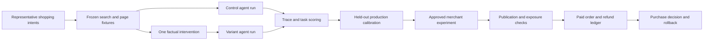

# Controlled AI-shopping harness: capability and competition

Research snapshot: 29 September 2026. This note evaluates the supplied [shared conversation](https://chatgpt.com/s/t_6abb72f6509c8191a0d80d6c1329760d), checks documented products, and specifies a buildable experiment system. It does not report results from a working prototype. No paid API calls, merchant changes or purchases were made.

The controlled search proxy is technically feasible and useful for diagnosis. It is not an unoccupied product category. Native synthetic shoppers, live catalogue experiments, generic agent replay, and optimization/deployment loops all have documented competitors. The unresolved opportunity is to make better merchant decisions by proving that a particular offline signal transfers to a named production channel and then to incremental purchases. A custom combination of familiar parts does not establish uniqueness.

## What each experiment actually establishes

| Layer | Intervention and observation | Supported conclusion |
| --- | --- | --- |
| Controlled replay | Change one recorded result, page or tool response delivered to an agent we operate. | How that agent reacts to that information under the recorded conditions. |
| Live engine sampling | Repeat specified shopping conversations in a named API or permitted consumer interface. | Output frequency for that prompt/context/time sample. |
| Live merchant experiment | Assign merchant-owned product/page/visitor units to edits and control, then verify publication and exposure. | Effect of the assigned deployable change, subject to the design and interference limits. |
| Purchase measurement | Join assigned units to real paid orders and later cancellations/refunds. | Incremental purchase or contribution effect for the defined population, if assignment and analysis support it. |

A live API benchmark is not automatically the consumer ChatGPT product. OpenAI describes consumer shopping as using query/context, provider metadata, other sources and separate merchant ranking considerations. Those inputs exceed a plain search-result list. [Shopping with ChatGPT Search](https://help.openai.com/en/articles/11128490-shopping-with-chatgpt-search).

The first layer can causally isolate a response to a changed tool payload inside our system. It cannot alone establish the causal effect of a merchant edit on search inclusion, production recommendation, human choice or payment.

## Documented competition

**A = available within the scope described. L = limited claim or partial/preview scope. NF = not found in the reviewed public evidence.** These are capability classifications, not efficacy scores. "Available" does not mean independently tested in an account. "Randomized purchase-test capability" asks for assignment plus actual purchase outcomes, not a dashboard labelled "conversions." The offline column includes controlled page simulation and generic replay, which are distinguished in the final column; it does not imply that all these products reproduce search results.

| Product | Offline simulation/replay | Live engine monitoring | Controlled live edits | Randomized purchase-test capability | Optimize/deploy loop | Evidence boundary |
| --- | --- | --- | --- | --- | --- | --- |
| [Profound](https://product.tryprofound.com/changelog) | NF | A | L | NF | A | Randomized research measured bot visits; content agents are real product functionality. |
| [Peec AI](https://docs.peec.ai/intro-to-peec-ai) | L | A | NF | NF | L | Offline vendor research exists; customer frozen replay and randomized-purchase method not established. |
| [Scrunch](https://scrunch.com/how-tos/how-to-serve-ai-optimized-content-directly-to-llms/) | NF | A | NF | NF | A | AXP deploys/versions agent-facing pages; referral revenue is observational. |
| [Burnish](https://useburnish.com/what-it-does/) | NF | A | NF | NF | A | Explicitly calls lift directional rather than a controlled trial. |
| [Geoffy](https://geoffy.ai/) | NF | L | L | NF | L | Holdouts advertised; Monitor/Influence remain early access. |
| [Lily Max](https://www.lily.ai/how-it-works) | NF | NF | L | L | L | Full controlled enrichment loop marketed; randomization and AI-purchase method unclear. |
| [Feedonomics](https://docs.feedonomics.com/product/enrichment/ab-testing) | NF | NF | A | L | A | Stable-hash product split; Google Ads reporting; merchant runs the analysis. |
| [DataFeedWatch](https://www.datafeedwatch.com/blog/ab-testing-product-titles) | NF | NF | A | L | A | Alternating IDs allocate title versions; not random customer allocation. |
| [Kedra](https://apps.shopify.com/kedra-ai-index) | NF | A | NF | NF | A | Monitoring, approved fixes and sales attribution; no allocation protocol found. |
| [SearchPilot](https://www.searchpilot.com/ai) | L | L | A | A | A | Toy conversation research; GEO/merchant tests plus separate randomized-user CRO. |
| [SEOTesting](https://seotesting.com/blog/seo-ab-test-group-configuration-tool/) | NF | NF | A | NF | L | Builds balanced URL groups; deployment is external. |
| [Semrush SplitSignal](https://www.semrush.com/blog/seo-a-b-split-testing-101/) | NF | NF | L | NF | L | Historical product; current URL redirects to Enterprise. |
| [Statsig](https://docs.statsig.com/experiments/types/seo-testing) | NF | NF | A | A | A | Randomized page assignment and merchant-configured outcomes; generic infrastructure. |
| [Shopify SimGym](https://help.shopify.com/en/manual/online-store/simgym) | L | NF | NF | NF | L | Research Preview, synthetic theme comparison and add-to-cart. |
| [Shopify Rollouts](https://help.shopify.com/en/manual/markets/rollouts/rollout-types) | NF | NF | A | L | A | Real order/checkout metrics by split; allocation internals not specified. |
| [Squoosh AI](https://squoosh.ai/) | L | NF | L | L | L | Claims live-winner calibration; protocol/report not public. |
| [BluePill](https://blue-pill.ai/industry/ecommerce) | L | NF | NF | NF | L | Synthetic consumer tests; no actual purchase trial documented. |
| [ShopperProbe](https://shopperprobe.com/) | L | NF | NF | NF | L | Private beta flow QA; explicitly no payment submission. |
| [LangSmith / LangGraph](https://www.langchain.com/langsmith/evaluation) | A | NF | NF | NF | A | Own-agent eval/fork building blocks; downstream tools need fixtures. |
| [Braintrust](https://www.braintrust.dev/docs/evaluate/run-evaluations) | A | NF | NF | NF | A | Own-agent eval datasets and external-state stubbing. |
| [Kitaru](https://github.com/zenml-io/kitaru) | A | NF | NF | NF | L | Recorded tool-response replay for your own agent code. |
| [Amazon Manage Your Experiments](https://sell.amazon.com/tools/manage-your-experiments) | NF | NF | A | A | A | Random real customers; sales/units; eligible Amazon listings only. |

Several distinctions materially change the competitive assessment.

**The native Shopify pair is substantial overlap.** SimGym sends synthetic shoppers through alternative themes in browsers, with a corresponding shopper on the alternate theme. Its public help calls it an AI Research Preview, limits it to eligible Liquid storefronts, and warns that simulated behavior can differ from real buyers. After the monthly allowance it lists USD 0.75 for one theme or USD 1.50 for a comparison. These are synthetic add-to-cart/feedback outcomes. [Shopify engineering](https://shopify.engineering/simgym); [SimGym help](https://help.shopify.com/en/manual/online-store/simgym).

Rollouts supplies a separate live control/treatment workflow on Grow and above, including supported theme, checkout, discount and catalogue-state changes. Catalogue activation is not arbitrary per-SKU content experimentation. Its experiments report real order/checkout conversion, but metrics are fixed and exclude some channels. The reviewed help does not disclose the random-assignment implementation; the table therefore avoids asserting an audited randomization protocol. Neither tool establishes an external AI engine's search-response experiment. [Rollout scope](https://help.shopify.com/en/manual/markets/rollouts/rollout-types); [Rollout metrics](https://help.shopify.com/en/manual/markets/rollouts/analytics).

**Lily Max combines enrichment, testing and deployment.** Lily Max explicitly markets variants, matched-spend A/B tests, holdouts, difference-in-differences, confidence intervals and human-approved winner deployment. Matched spend alone does not balance shoppers, auctions or products, and a holdout need not be randomized. Request the allocation code, unit, purchase endpoint and AI-channel implementation before treating its claims as randomized AI-origin sales evidence. [How Lily Max Works | Agentic Product Intelligence](https://www.lily.ai/how-it-works).

Feedonomics provides a more concrete public procedure: stable-hash random product groups, keep variants in the same arm, label exports, compare Google Ads CVR/ROAS, and expand the winning configuration. Its documented data connections can include BigCommerce orders and revenue. This is an implementable feed experiment with merchant-owned analysis. It still requires a verified purchase conversion definition and does not prove a ChatGPT-shopping sales effect. [Feedonomics test procedure](https://docs.feedonomics.com/product/enrichment/ab-testing); [Data connections](https://docs.feedonomics.com/product/analytics/onboarding); [Channel deployment](https://docs.feedonomics.com/product/enrichment/field-mapping).

DataFeedWatch exposes a title A/B control and winner publication. Its guide assigns successive item IDs alternately to A and B; that is not evidence of random customer allocation or balance between product families. It supports an established feed-testing workflow without establishing the shared conversation's consumer-engine claims. [Title test guide](https://www.datafeedwatch.com/blog/ab-testing-product-titles); [AI feed workflow](https://www.datafeedwatch.com/solutions/datafeedwatch-ai-feed-optimization).

**SearchPilot is direct competition for the live-testing part.** Its current GEO product tests PDP/PLP control and variant groups and follows LLM referrals; Merchant Center testing covers feed and page/schema changes. The platform documents test readiness, recrawl coverage, publishing and result analysis. Its full-funnel method runs a randomized-user CRO test followed by a page-level SEO test and combines the effects. That combined estimate has assumptions; it is not an engine-side randomized experiment on all AI-origin purchases. [GEO product](https://www.searchpilot.com/ai); [Merchant Center product](https://www.searchpilot.com/merchant); [Platform workflow](https://www.searchpilot.com/what-we-do); [Full-funnel method](https://www.searchpilot.com/resources/blog/announcement-weve-improved-how-we-run-full-funnel-tests).

SearchPilot also published a synthetic shopping-conversation experiment on 23 September 2026. It used invented shopper personas, a local model and repeated Gemini API conversations for running-shoe and garden-furniture goals. The author calls it a toy model and disclaims real-world representativeness. This is relevant offline research; it is not documentation of a customer-accessible frozen-search replay product or a purchase experiment. [Buying journeys are conversations, not prompts](https://www.searchpilot.com/resources/blog/conversations).

SEOTesting documents balanced control/test URL construction. Statsig documents stable canonical-URL randomization and warehouse outcomes, including conversion/revenue guardrails. SplitSignal has historical first-party methodology, but its product URL now redirects to Semrush Enterprise. That leaves current availability unresolved; it does not prove discontinuation. [SEOTesting](https://seotesting.com/blog/seo-ab-test-group-configuration-tool/); [Statsig](https://docs.statsig.com/experiments/types/seo-testing); [Historical SplitSignal guide](https://www.semrush.com/blog/seo-a-b-split-testing-101/); [Current product route](https://www.semrush.com/splitsignal/).

**Discovery vendors have moved beyond simple dashboards.** Profound has content agents and publishing workflows, while its randomized 381-page, six-site, three-week Markdown study measured bot visits and found no statistically significant effect. That study is evidence of experimentation, not of purchase-testing software or sales lift. Peec's current pricing lists agent actions, custom skills and a visibility lift predictor, alongside its documented monitoring/MCP workflows. Those product labels do not disclose a customer frozen-replay workflow or causal purchase validation; its campaign example is before/after. [Profound Agents](https://help.tryprofound.com/articles/2212787792-create-a-workflow); [Profound experiment](https://www.tryprofound.com/reports-guides/markdown-html-llm-test); [Peec current features](https://peec.ai/pricing); [Peec MCP](https://peec.ai/mcp); [Peec impact example](https://peec.ai/mcp-use-cases/pr-impact).

Peec has also published controlled lab research: one study isolates brand-name effects with web search disabled, and another compares the same passages across twelve open rerankers. Both are relevant precedents for controlled sensitivity testing. Neither establishes that its customer product exposes those experiments, that the rerankers match a consumer engine, or that the results predict purchases. [Brand-name experiment](https://peec.ai/blog/ai-assistants-judge-your-company-by-its-name-i-measured-how-much); [Reranker experiment](https://peec.ai/blog/rerankers-for-geo-aeo-how-ai-search-chooses-passages-and-sources).

Scrunch AXP documents content previews, agent-facing deployment and version restore. Burnish expressly calls its measured lift directional rather than a controlled trial and publishes no customer case results yet. Geoffy's listing advertises holdouts, but its site calls Monitor/Influence early access. Kedra already advertises buyer-question tracking, approved fixes and sales tracking. Approvals, rollback, sales dashboards and remeasurement cannot serve as standalone novelty claims. [Scrunch deployment](https://scrunch.com/how-tos/how-to-serve-ai-optimized-content-directly-to-llms/); [Scrunch purchase attribution](https://scrunch.com/faqs/does-scrunch-track-ai-referral-traffic-to-my-website); [Burnish method](https://useburnish.com/what-it-does/); [Burnish evidence status](https://useburnish.com/case-studies/); [Geoffy release status](https://geoffy.ai/); [Geoffy holdout listing](https://apps.shopify.com/geoffy); [Kedra](https://apps.shopify.com/kedra-ai-index).

**Several products provide synthetic shoppers or replay.** Squoosh markets a fixed synthetic panel across page variants, analytics/order/session grounding, and handoff to live experiment tools. Its 85% live-winner agreement claim is relevant but lacks a public full report, sample and holdout protocol. BluePill markets synthetic ecommerce concept/offer/page tests. ShopperProbe's private beta tests store missions and failure traces without submitting payments. These are different products, but each overlaps part of the proposed value. [Squoosh](https://squoosh.ai/); [BluePill](https://blue-pill.ai/industry/ecommerce); [ShopperProbe](https://shopperprobe.com/).

LangSmith and Braintrust already offer datasets, experiments, traces, scoring and CI. LangGraph can fork checkpoint state, but later API calls rerun unless explicitly stubbed. Kitaru goes closer to the proposed proxy mechanic: it reruns the application's agent against recorded tool responses and supports forked comparisons. These reduce the need to invent an evaluation backend. None supplies evidence that our shopper model predicts customer demand. [LangSmith](https://www.langchain.com/langsmith/evaluation); [Braintrust](https://www.braintrust.dev/docs/evaluate/run-evaluations); [LangGraph replay semantics](https://docs.langchain.com/oss/python/langgraph/use-time-travel); [Kitaru source](https://github.com/zenml-io/kitaru).

Actual randomized purchase testing is not novel either: Amazon Manage Your Experiments randomly splits real product-page visitors and reports units sold, sales and conversion, with winner publication. Its scope is eligible Amazon listings. It is an adjacent benchmark for proof quality, not proof that ChatGPT interventions transfer. [Test listing content with Manage Your Experiments](https://sell.amazon.com/tools/manage-your-experiments).

Onsite shopping agents are an additional comparison set. The companion [Gorgias study](products/gorgias.md) covers its Playground, campaign split tests and order attribution; the [Constructor study](products/constructor.md) covers randomized test infrastructure and completed-order/return instrumentation. These overlap simulation, testing and purchase reporting, while leaving external consumer-engine transportability unresolved.

## What public APIs let us build

The repository's package and source scan did not find an existing OpenAI agent or `search_products` implementation. The proposal therefore needs a new runner or an integration with existing replay software, not a small switch in the current app.

OpenAI's current function-calling flow lets our application execute retrieval and return `function_call_output`. That is the interception point we own: our code may return a recorded result, a factual variant or an explicit fixture error. The next model step reasons over the supplied data. This supports custom `search_products`, `open_product` and offer-resolution tools without any browser traffic manipulation. [Function calling](https://developers.openai.com/api/docs/guides/function-calling).

Hosted `web_search` exposes controls and execution/source information. `external_web_access: false` uses cached/indexed results; it does not pin a merchant-selected search snapshot or expose an API for replacing internal ranked results. No documented hook in the reviewed API material lets us patch ChatGPT.com's private retrieval while retaining its complete production orchestration. This is a documentation-based boundary, not a reverse-engineering claim. [Web search](https://developers.openai.com/api/docs/guides/tools-web-search).

A permitted consumer-interface observation can be a separate benchmark; it still samples an account, context and time. Peec itself distinguishes its mostly logged-out UI sampling from APIs. A public model/API experiment must name its model and tools rather than being sold as a universal "current ChatGPT recommendation rate." [Welcome to Peec AI](https://docs.peec.ai/intro-to-peec-ai).

Do not start a new dependency on OpenAI's legacy Evals platform: the official deprecation schedule makes existing evals read-only on 31 October 2026 and schedules dashboard/API shutdown for 30 November 2026. Keep experiment data in our own portable store; use current model APIs and a replaceable evaluation runner. [Deprecations](https://developers.openai.com/api/docs/deprecations).

## Practical build specification

This is a research and implementation specification, not authorization to deploy changes or submit orders.

1. **Define the decision and population before generating edits.** Pick one merchant category, channel, market and intervention class. Record the purchase outcome that would justify deployment, the cost of a wrong decision, and the comparator. Suitable comparators include the merchant's current process, a factual audit alone, and the relevant native or feed-testing workflow. The test must show incremental value beyond what the merchant can already use.

2. **Create a factual catalogue snapshot.** Store merchant/product/variant/offer IDs, source field values, exact URLs, locale/currency, stock and price timestamps, and provenance for each factual attribute. Separate merchant assertions from independently verified facts. A supported size or material may be rephrased; an unavailable review score, delivery promise or certification may not be invented.

3. **Capture both retrieval and page boundaries.** Store raw search responses, ordered candidates, tool schemas, exact query arguments, raw page bytes, extracted text, image references and extraction version. Hash all fixtures. If the test runner supplies JSON, that JSON is the actual treatment exposure. If it supplies HTML or screenshots, record those instead. Changing markup cannot influence an agent that never receives or extracts it.

4. **Use strict replay.** Resolve every tool request from the recorded fixture set, with deterministic mappings and fixture IDs in the trace. When an altered trajectory requests an unseen query or page, mark the run unsupported or use a predeclared captured branch. Do not silently fall back to the live web, which changes the experimental environment. Preserve the original and fork; do not overwrite the baseline. Braintrust's guidance to snapshot/stub dependencies and Kitaru's recorded-tool design are existing implementation references. [Dependency isolation](https://www.braintrust.dev/docs/best-practices/agents); [Recorded-tool replay](https://github.com/zenml-io/kitaru).

5. **Separate three experimental questions.** A fixed-candidate test measures comprehension/selection conditional on exposure. A local retrieval test reindexes the same frozen corpus with one edited document to test our retriever. A position-oracle test deliberately varies rank to measure sensitivity or an upper bound. Label each. Moving a result from fourth to second in a fixture does not establish that any merchant action can earn that move.

6. **Apply one intervention at one boundary.** Compare a factual title rewrite with the original while keeping price, inventory, competitors, order and page content constant. Use separate arms for description, variant resolution or delivery facts. Preserve relevant response size/format where feasible and document differences. Test combinations only after individual effects, with a design that can estimate interactions; never add marginal gains as if they were independent.

7. **Version the complete runner.** Record model/provider/resolved model ID when available, prompt, tool schema, reasoning settings, sampling controls, extraction code, fixture hashes and evaluation rubric. Record time when a provider exposes only a moving alias. Collect visible actions, observations and final outputs; do not depend on hidden chain-of-thought. Keep synthetic sessions out of merchant analytics.

8. **Score observable stages.** Use deterministic checks for product/variant identity, hard constraints, opened URL, cited product and completed cart state. Use blinded human review or calibrated judges for suitability and factual understanding. Count abstention, wrong variants, unsupported claims and tool failures. Define denominators: "recommended among all eligible intent cases" and "recommended among exposed cases" answer different questions. In a forced candidate list, discovery is not independently measured.

9. **Hold out meaningful units.** Split at intent family and merchant/category level before prompt tuning or candidate generation. Keep a later-time and alternate-model evaluation set. Synonymous prompts, adjacent variants and repeated draws must not leak between development and holdout. Repeats estimate run-to-run variation within a context; uncertainty over business decisions needs clustering by the independently sampled contexts and, where relevant, merchants. Pair control/variant contexts and randomize execution order. Seeds are useful metadata where supported, not a guarantee of complete reproducibility.

10. **Calibrate to production before forecasting.** For a predeclared set of safe edits, measure which changes actually reach the named live channel and how corresponding live recommendation outcomes move. Include safe low-scoring and neutral interventions, not only offline winners. Freeze predictions before collecting outcomes. Evaluate sign accuracy, false-positive rate, ranking of candidate edits, calibration error and decision value on held-out merchants/times/models. Agreement with one engine's sampled answers does not establish purchase prediction. Recalibrate or suspend forecasts after material engine changes.

11. **Run an authorized live purchase experiment.** For upstream catalogue changes, randomize stable product-family or substitutable-category clusters, balance baseline demand, and hold collateral promotion/pricing work constant where possible. Keep variants together. For post-click changes, use stable visitor assignment; this measures landing/checkout effects conditional on arrival, not discovery. Register the minimum useful purchase effect, power, lag window, exclusions, stopping rule and rollback rules before launch. Check assignment imbalance and interference. Public catalogues are shared: per-visitor page changes usually cannot randomize what an external index knows.

12. **Verify publication and treatment exposure separately.** Record the approved diff, deployment ID, read-back response and timestamp. Feed acceptance, a theme save and a crawler visit are distinct from a channel using the new value. Mark incomplete propagation. Keep an intent-to-treat analysis; exposure-based analysis can explain failure but must not replace assignment-based results by silently excluding hard cases.

13. **Join to a server-side order/refund ledger.** Store pseudonymous assignment IDs, order and line-item IDs, payment status, SKU family, currency, discounts, taxes/shipping policy, cancellation/refund events and attribution provenance. Deduplicate webhooks and reconcile against merchant order exports. Primary counts should require the agreed real paid-purchase state; report retained orders/net contribution after a stated maturity window. Where native tools do not expose assignment IDs or joinable order events, treat that as an integration dependency instead of promising the join exists.

14. **Keep attribution and causal totals distinct.** For discovery tests, report all assigned-unit purchase outcomes plus a prespecified observed-AI-referred subset. An edit can change who arrives and whether the referrer survives; analyzing only arrivals can create selection bias. Report unknown-origin orders separately. Monitor whole-category/store totals to detect displacement from untreated products. For a channel-specific causal statement stronger than these observed subsets, obtain channel-side assignment or another design that actually identifies it.

15. **Make the output a decision with limits.** Show the tested edit, corrected factual failures, simulated effect, live-channel observation, purchase experiment estimate, interval, exposure completeness, unit counts, cost and whether to deploy, continue or reject. An underpowered test remains inconclusive. Until external calibration succeeds, sell diagnostic evidence and experiment preparation, not a percentage increase in ChatGPT recommendations or purchases.

## Audit of the shared numerical examples

The shared conversation's 12%-67% ladder, 18.4%-31.7% comparison and funnel rates are illustrative inventions. They must not be shown as measured performance, a forecast or a merchant benchmark. With exactly 50 binary runs, raw percentages move in two-point increments, so several entries cannot even be unweighted empirical rates from the stated run count. The "all improvements" row also assumes interaction effects it has not measured.

Fifty identical prompt reruns can estimate Monte Carlo variation in the specified system if their draws are suitably independent. They are not fifty independent human shoppers or fifty independent purchase intents. More repeats can narrow simulation noise while leaving retrieval mismatch, persona bias and production mismatch unchanged. A narrow interval around the wrong model does not repair those errors.

Power must be sized at the live randomization unit. As an explicitly hypothetical illustration, detecting a purchase-rate change from 2.0% to 2.4% with equal independent Bernoulli arms, 5% two-sided alpha and 80% power needs about **21,109 observations per arm** by the usual normal approximation:

`n = ceil([1.95996398454 sqrt(2 pbar (1-pbar)) + 0.84162123357 sqrt(p0 (1-p0) + p1 (1-p1))]^2 / (p1-p0)^2)`

Here `p0=0.02`, `p1=0.024`, and `pbar=0.022`. This is not a merchant forecast or an appropriate cluster-trial calculation. Product clustering, sparse AI-origin orders, attrition, delayed purchases, multiple candidates and interference can require substantially more information. A thousand synthetic sessions cannot substitute for those real observations.

The shared "funnel" also mixes conditional and unconditional rates unless each denominator is specified. Recommendation, citation and first rank need not form a strictly nested sequence, and an agent's stated choice is not a completed payment. Track the events as defined outcomes; only draw a funnel for genuinely nested stages.

## What would justify building further

A defensible claim is: "We identify which factual catalogue edits deserve scarce live experiment traffic, preserve the evidence for each edit, and measure retained purchase impact after deployment." That remains a hypothesis to validate against native tools, feed platforms and simple rules.

Proceed beyond a prototype if held-out tests show that replay ranks worthwhile interventions better than those comparators, reduces the cost or number of live tests needed, and produces positive net purchase value after refunds and operating cost. Stop calling it a conversion predictor if live calibration fails, if effects disappear on unseen merchants/models, or if selection gains merely displace existing purchases. A traceable diagnostic product may still be useful, but that is a different evidenced outcome.

The public review found no verified turnkey product with the exact frozen-search-to-independent-AI-origin-purchase chain. That observation cannot establish that none exists, that customers will buy this combination, or that it is defensible. The competitive burden is to prove a better decision and economic outcome, not to name a longer workflow.

Machine-readable capability details and the checked primary-source registry are in [harness-landscape.json](harness-landscape.json).
