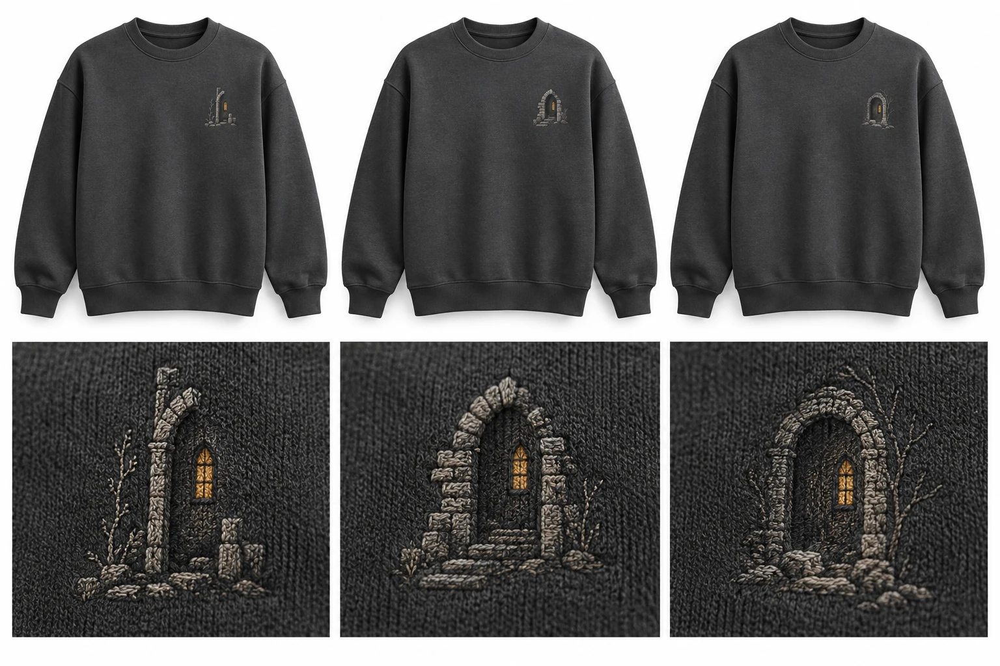

# Small decisions, real profit

Research and decision dossier. 30 September 2026.

120 decisions; 120 individual Astra reviews; 28 mental models; 27 videos reviewed through captions.

## Read this first

Build one paid learning loop at a time. A good result is a retained order or a paid merchant problem solved with enough money left after delivery, acquisition and work.

For a profit-first objective, the critical review favours testing payment for one inspectable merchant catalog problem, provided we can reach qualified buyers. If the objective is to build the clothing brand, take the separate retail route: one original crewneck, a real sample, one feasible public price and a small content batch. Neither route has validated demand.

This report turns creator advice into choices we can inspect and test. The videos help generate hypotheses; platform documentation, research papers, supplier terms and actual customer behaviour decide how much confidence to put in them.

The clothing brand, a functional-product shop and an AEO service are separate commercial bets. They can share a research method and measurement tools. Success in one does not validate demand, pricing or retention in another.

The decision library is deliberately large. It is a reference and a review queue, not a request to run every test at once. Start with a few consequential uncertainties and earn the next spending commitment.

### What the evidence does and does not establish

- No products, ads, creator placements or customer research have been purchased or launched for this dossier.
- Retail prices, refunds, acquisition cost, labour and spending limits are scenarios or chosen operating rules. Demand and customer willingness to pay remain untested.
- Creator revenue, ROAS and conversion claims are self-reported unless explicitly corroborated. They are not audited profit.
- English auto-captions may misrecognise speech. Source timestamps let you inspect the original.
- The example planning ceiling is £500 pending the founder’s budget choice; it is not permission to spend.

## The strategic choice

### Chief strategy review

Reviewed 30 September 2026. Chief portfolio judgment after all 120 source decisions received domain verdicts: fifteen accepted, seventy-six modified, twenty-seven deferred and two retired as duplicate tasks. The roadmap records the final shared priorities, dependencies and chief overrides. No customer contact, purchase, advertising, sales test or software pilot has been performed. The user has not confirmed a budget or chosen which business objective takes precedence. All prices, counts, time limits and gates introduced below are proposed operating choices, not market benchmarks or spending authorization.

## The choice

For a profit-first objective, test a paid, narrowly scoped merchant catalogue job before financing a retail launch or building an AEO subscription app. The first test is whether an independent operator will pay to resolve a recent, consequential product-data discrepancy that their current tools do not efficiently resolve. It requires a reachable buyer, inspectable evidence and authority to make the correction. If those conditions cannot be established cheaply, do not spend months building software to compensate for missing buyer access.

Keep the clothing brand as a separate creative and retail experiment. It can be worthwhile on those terms. Its success does not validate a SaaS, and its failure does not invalidate an external merchant service. Buying an owned store to obtain SaaS evidence is expensive if the store has no traffic, no recurring catalogue complexity and no independent software buyer.

AI commerce is a channel and a set of data-quality questions within these businesses. It is not a fourth business with independent profit merely because an assistant can recommend a product. Count an eligible feed, a correct answer, a referred visit, a paid order and a retained contribution separately.

| Route | Objective it can serve | Decision now | What would earn more effort |
| --- | --- | --- | --- |
| Paid merchant catalogue service | Discover a costly repeatable B2B job and receive payment before substantial development | First commercial test if the founder wants service sales and can reach qualified operators | Independent paid work that beats the current native/manual workflow on a useful task and leaves positive contribution after delivery and sales time |
| Original understated clothing | Build a distinctive creative retail brand | An optional second route, or first if the user explicitly prefers brand building to the B2B objective | Real sample quality, unrelated buyers paying the feasible delivered price, repeatable acquisition and retained contribution |
| Functional physical product | Build a retail business around measurable compatibility or use | Keep one candidate in reserve; do not launch another catalogue | A landed quote, verified fit, an observable customer problem, a reason to choose it over cheap substitutes and paid demand |
| AI discovery and answer verification | Improve accessibility and accuracy of whichever offer is chosen | A small supporting check, using native tools first | A documented useful error corrected; commercial expansion still depends on orders or paid merchant work |
| AEO SaaS | Automate a repeated merchant task at positive account contribution | Defer the public app and subscription promise | The same job paid for by multiple independent merchants, repeat purchase, economical delivery and permissible access/data use |

This ranking is a judgment about the next affordable test, not a finding that the merchant service will earn more money. Its cash advantage can disappear in unsuccessful selling, access setup, bespoke analysis and support. Catalogue mapping, feed diagnosis, approval workflows and factual repairs are already offered by platforms and competitors. A real residual problem has to survive that comparison. [Shopify Catalog Mapping](https://help.shopify.com/en/manual/shopify-catalog/mapping), [competitor assessment](https://silmoon04.github.io/ecommerce-ai-seo-research/deep-dive/assessment.md), [current SaaS research](https://silmoon04.github.io/ecommerce-ai-seo-research/profit-playbook/research/saas-business.md).

The product review's preferred first physical offer is the crew. I accept that choice within the retail route. At portfolio level, I put the merchant payment test first for the provisional profit objective because it can expose buyer access and willingness to pay before retail setup. If the user prefers creating a clothing brand, the route order changes; the evidence and cash gates do not. The functional desk kit remains an alternative on paper until supply and buyer evidence justify replacing the chosen retail test.

## Why the £72 crew has not won yet

The crew has more useful starting evidence than the proposed functional products: a named supplier route, a price input and a specific original-design hypothesis. It also asks a stranger to pay a premium for an unknown label. A small two- or three-colour illustration, heavy fabric and an attractive mockup do not by themselves justify that premium. Licensed competitors can supply recognition the original artwork deliberately lacks. The garment must earn the purchase through appearance, fit, feel and meaning without borrowing unlicensed franchise identity. [Existing clothing assessment](https://silmoon04.github.io/ecommerce-ai-seo-research/quiet-fandom/assessment.md).

Test one original motif on one sampled crew first if clothing is the selected route. Two colour concepts can be compared before ordering, but do not turn both into inventory. The actual sample, measured garment, achievable decoration and honest delivery promise must support the page. Confirm the UK Changer 2.0 SKU and colour composition; a specification for a US garment or a different regional version cannot establish the UK product's fabric. Reconfirm the exact decoration, setup, size and shipping basket before treating the catalogue price as a quote.

Do not add a tee just because a lower entry price sounds commercially sensible. It introduces a second fit, sample and margin problem. Under the illustrative model below, its acquisition allowance is much smaller. A tee earns entry only if buyers prefer it at a viable price or it materially reduces an observed purchase objection without destroying contribution. An extra label, embroidery location, discount or free gift needs the same test.

A functional product can be a better factual test bed. A compact painting rack, edition-specific organiser or measured desk accessory can answer concrete questions about fit, dimensions and setup. That makes failures inspectable; it does not establish a market. Commodity competition, tooling, design rights, compatibility changes, damage and postage can remove the apparent advantage. Choose one narrow candidate only after a delivered quote and direct problem evidence. A broad list of organisers is research, not a second launch plan. [Product-demand research](https://silmoon04.github.io/ecommerce-ai-seo-research/profit-playbook/research/product-demand.md), [owned-store assessment](https://silmoon04.github.io/ecommerce-ai-seo-research/owned-store/assessment.md).

## The first commercial experiment

Prepare a two-page offer and one redacted or synthetic example of a catalogue conflict. The proposed job covers one recent known incident, at most ten variants, one authoritative source and one named destination. Deliver the evidence, an approved correction or an exact implementation instruction, and a recheck. State any propagation delay or inaccessible destination explicitly. Do not guarantee an external platform's ingestion, recommendation or sales.

Use £150 as one proposed fixed-fee test price, conditional on net revenue, taxes, fees and a scope that can be delivered within four hours including access setup, approval and recheck. It is an experiment price chosen to expose the economics, not evidence of willingness to pay. Where the task cannot be scoped to that ceiling, quote a different bounded job before accepting it. Compare the offer with the operator's native tools, feed platform and manual process. A short qualification example may be free; a full unpaid audit is not the test. SAAS-03 owns this scope, replacing PRICE-11's conflicting twenty-product version.

Once separately authorized, use SAAS-01's first screen: up to six incident interviews within three founder hours, looking for at least two consequential, inspectable issues. A qualified operator has a recent inspectable issue, authority to obtain the needed data, an implementation owner and a plausible ability to pay. A general networking conversation or an agency saying the idea is interesting does not count. If that screen passes, give up to five qualified buyers the same scoped paid offer. All screening and selling share an eight-hour limit; the quote stage is not another eight hours.

Continue to one paid pilot if a buyer agrees to an economical scope and payment, even if that happens before the interview screen is complete. Actual payment is stronger evidence than reaching a conversation count. Without that payment, reconsider the segment if fewer than two of the first six interviews expose a qualifying issue. Stop the paid offer after five qualified quotes with no payment, or after the eight-hour acquisition limit, whichever comes first. If the time limit prevents completing the screen, the result is an access failure, not evidence that the market rejects the product. Record the reason, change one access or segment assumption once if there is a concrete basis, and keep the next attempt within the remaining round budget. Do not respond by building a dashboard.

After the first delivery, continue to a maximum of three independent paid pilots only if the diagnosed fault is real, a useful correction is accepted, the destination status is honestly reported, and actual delivery cost is within the agreed scope. A native tool already resolving the job, a buyer refusing to pay, or recurring access problems can each kill this offer even if the software works.

Three independent merchants paying for completed versions of substantially the same job can justify a separately capped internal tool if the observed delivery cost gives it a credible payback. Two independent paid repeats gate subscription or monitoring development; they are not required before improving delivery of an already repeated project. These are chosen pilot gates. They do not establish market size or subscription retention. If customers want one-off cleanup, sell a service or periodic project. A public app comes later, after support, account-level contribution, installation constraints and a genuine recurring task have been measured.

## Profit drivers and failure cases

Retail contribution per initial order is retained receipts less original fulfilment, payment fees, extra replacement cost, acquisition cost and variable labour. Fixed shop costs, samples, content and setup labour sit outside that order contribution and still have to be recovered. Use actual costs once available. Do not deduct a campaign once in fixed costs and again through an allocated CAC.

The following arithmetic assumes a UK seller selling one item domestically, not VAT registered; £72 crew and £45 tee include delivery. The supplier inputs are the dossier's published catalogue observations, not final quotes. Shopify currently lists Basic at £25 per monthly cycle and standard online card processing at 2% plus 25p; tax, payment mix and plan details require the actual account. The 8% full-refund frequency, separate 2% replacement frequency and ten minutes at £15/hour are scenarios. They are not apparel averages or measured workload. This £2.50 order-labour baseline matches PRICE-02 and the report calculator. The model assumes no returned-stock recovery or supplier reimbursement and no extra retailer-funded return postage. [Supplier catalogue inputs](https://silmoon04.github.io/ecommerce-ai-seo-research/quiet-fandom/sourcing.md), [supplier shipping table](https://www.inkthreadable.co.uk/shipping-costs), [Shopify UK pricing](https://www.shopify.com/uk/pricing).

| Illustrative initial order | £72 crew | £45 tee | £45 tee with £1.51 label |
| --- | ---: | ---: | ---: |
| Garment, first decoration and delivery | £35.31 | £22.57 | £24.08 |
| Payment fee | £1.69 | £1.15 | £1.15 |
| Full-refund allowance, 8% of receipts | £5.76 | £3.60 | £3.60 |
| Extra replacement allowance, 2% of fulfilment | £0.71 | £0.45 | £0.48 |
| Contribution before acquisition, labour and fixed costs | £28.53 | £17.23 | £15.69 |
| After ten minutes of order work at £15/hour | £26.03 | £14.73 | £13.19 |
| After that labour and an assumed £12 acquisition cost | £14.03 | £2.73 | £1.19 |
| Sensitivity: £4 order labour and £12 acquisition | £12.53 | £1.23 | -£0.31 |

Formula before acquisition and labour: `0.92 * customer_receipts - 1.02 * fulfilment_cost - (0.02 * customer_receipts + 0.25)`. Different return handling, tax status or payment methods require a different model. The £26.03 crew amount before acquisition is a variable-cost break-even ceiling for acquisition under these assumptions; it leaves nothing for launch costs or profit. PRICE-02 and PRICE-07 instead choose £18/£8 contribution floors and approximately £8/£5 acquisition ceilings for the crew/labelled tee. The £12 column above deliberately stresses those limits; it is not the proposed target. The £4 labour sensitivity corresponds to twelve minutes at £20/hour.

Reducing the crew price by 10% drops its contribution after the £2.50 order labour, before acquisition and fixed costs, from £26.03 to £19.55. Raising both loss assumptions to 15% refunds and 4% replacements leaves £20.29 for the crew and £9.56 for the labelled tee after that labour. To preserve the chosen £18/£8 floors under that stress case, acquisition can consume only £2.29/£1.56. Neither discounting nor return prevention should be discussed only as a conversion lever.

If a standalone clothing trial actually spends the full £245 operating allocation below and uses twenty setup hours valued at £15/hour, the illustrative crew at £12 CAC needs fifteen initial orders to recover fixed cash before order labour, or thirty-nine to recover fixed cash and founder labour after order labour. Raising setup time value to £20/hour and order labour to £4 gives fifty-two initial orders. These are arithmetic break-even cases with expected allowances, not sales forecasts. Five orders justify investigating a repeat; they do not pay back that economic investment. Prior failed experiments add to the portfolio's loss even if they are excluded from the clothing lane's own ledger.

The service model has a different trap. At hypothetical £150 net revenue, £5 collection/credit allowance, £10 direct tooling and four delivery hours at £15/hour, contribution after delivery labour is £75. Eight selling hours plus two offer-preparation hours valued at £15/hour cost £150; two equivalent pilots would cover that time if there were no other fixed costs. At £25/hour, the four-hour job leaves £35 and misses SAAS-06's chosen 30% contribution target. If it takes eight hours at that rate, it loses £65 before selling time. A VAT-inclusive £150 quote is not £150 net revenue. Use the actual tax and fee treatment, rather than importing this example into a contract. Software is justified only if it improves an observed delivery problem or makes a useful repeat job possible.

Zero sales is a credible first-round outcome. With no paid merchant pilot, stop at the chosen time and shared £50 qualification/customer-research cap; unspent cash remains unspent. With no clothing orders, up to £245 of the optional retail operating allocation and the founder's time may be lost; the £250 fulfilment/refund cash remains if it was never needed, with £5 uncommitted. Samples may have personal value but are not sales revenue. With customer orders, unused cash is not automatically profit: reconcile supplier commitments, refunds, fees and payouts first.

## A £500 first-round ceiling, if the user has not chosen one

This is a hypothetical fallback ceiling on combined cash committed across the portfolio. It includes protected working cash, not just expenses, and is not permission to spend. No route receives its own additional £500. Reduce every later allocation by what the portfolio has already spent or committed.

| Allocation | Proposed maximum | Release rule |
| --- | ---: | --- |
| Shared qualification, shopper sessions and content incidentals | £50 | Up to £30 session incentives and £20 production incidentals if retail is chosen; B2B qualification competes for this same pool. Start with existing tools |
| Optional clothing sample, setup and identical reorder | £150 | One shared OPS-03 to OPS-05 envelope. No separate brand sample allowance; actual quote must fit |
| Optional clothing shop for one cycle plus domain allowance | £45 | Only after the actual sample and feasible offer pass; avoid a long subscription commitment |
| Ringfenced retail fulfilment/refund cash | £250 | May fund accepted orders and remedies; cannot fund content, ads, software or unrelated experiments |
| Uncommitted headroom | £5 | Keep available rather than manufacture a reason to exhaust the cap |
| Combined maximum | £500 | All lines share one ledger; service delivery spending also comes from remaining capacity |

If the merchant service progresses, release money for contracted delivery or refund exposure from uncommitted retail lines and defer clothing spending. A commissioned artist's proposed £150 ceiling, further shop months, seed gifts, paid tools and paid traffic have no additional allowance here. Each would require replacing another optional allocation or a later reviewed budget. Do not spend a customer advance on unrelated exploration. New sales do not automatically expand the experiment budget.

OPS-09's chosen contingency of two £72 refunds plus two £35.31 replacements totals £214.62. It leaves only £35.38 of a £250 working-cash allocation for unfunded supplier orders: nominally one crew before any additional fees or return postage. Ten unfunded crew fulfilments plus that contingency need £567.72 before fixed costs. Derive the actual simultaneous-order limit from cash, pending payouts, existing liabilities, fees and due bills. Ten may be a cumulative learning sample; it cannot be the default concurrent intake limit.

Founder time also needs a cap. Use a proposed twenty-hour first-round planning envelope across the chosen route, with no additive per-decision allowances. The merchant access test uses up to eight selling hours plus two offer-preparation hours. The optional retail plan allocates four hours to sample/specification/economics, five to store/checkout/privacy/records, three to shared shopper sessions, five to one shoot/four assets, and three to publishing/replies/logging. Readiness may take longer. Reduce optional activity or re-scope the round instead of skipping checks. Log actual order work separately at the stated hourly assumption and fulfil already accepted obligations even when they exceed the experiment's plan. A switch of route uses the remaining shared time, not a fresh twenty hours.

## Thirty, sixty and ninety days describe order, not promises

Only one commercial experiment and one small supporting data-quality check should be active at a time. The supporting check must use the same offer and should stop at two hours unless it exposes a consequential defect. A large decision library is an option set, not a to-do list. Start the review clock when the chosen route actually begins, with earlier cash and hour gates; the report's publication date does not start a promised launch countdown.

| Review window | Priority and dependency | Continue evidence | Stop or defer condition |
| --- | --- | --- | --- |
| By the first 30-day review | Confirm objective and affordable loss; prepare one merchant offer; establish access and payment before implementation. If clothing is selected instead, qualify the sample and show one fulfilable £72 offer to relevant non-friend buyers. | One scoped paid merchant pilot, or real sample approval plus paid clothing orders at the tested price. Record the actual counts and founder hours. | No qualified access within the time cap; fewer than two inspectable issues in six interviews; five qualified quotes with no payment; failed sample; unviable landed cost; or the round cash/time limit. A traffic shortage remains unresolved demand, not rejection. |
| By the next 60-day review, only after that gate | Deliver and reconcile the first result; repeat the same job or retail proposition with new independent buyers. Diagnose one failure mechanism at a time. | Up to three paid merchants performing substantially the same task, or at least five kept, full-price clothing orders from unrelated buyers meeting the chosen contribution floor before funding another small acquisition cycle. Reconcile the available return/cancellation period and keep later-fault exposure separate. | Bespoke delivery erases margin, native tools suffice, buyers need heavy discounts, or fulfilment/returns destroy contribution. Do not use sunk sample or code costs to justify another cycle. |
| By the 90-day review, only after repeat evidence | Seek repeat payment for the merchant job; automate one repeated step. For clothing, repeat across a second buyer cohort, reconcile costs and decide whether any small inventory commitment is justified. | Three independent completed paid jobs with viable costs may justify a capped internal tool; two independent paid repeats may justify monitoring/subscription development. For clothing, at least twenty kept orders across two acquisition cohorts meeting the chosen floor after variable work and acquisition permit a bounded next cycle. These are operating gates, not a statistical proof or a bulk-order instruction. | No recurrence or second payment defers subscription work. Dependence on one friendly buyer/creator, no viable acquisition route, or continuing losses without a testable correction blocks expansion. Preserve any useful project/service without forcing a subscription. |

There is no promise that merchant access, supplier sampling, delivery, return windows, destination propagation or traffic will fit those dates. Missing a dependency shifts the following work; it does not weaken the gate. A request to scale must state the next specific spend, remaining cash, expected order commitments and evidence supporting it. It does not mean unlimited advertising, more garment types or a public app.

An organic order is neither necessary nor sufficient to justify a paid access diagnostic. The first round allocates zero to ads. If organic access fails, a later explicitly chosen £100 search or social test may replace other optional spending inside remaining unprotected funds. It is a bounded learning loss, not profitable acquisition or a validated growth channel. The five-kept-order gate above concerns repeating a promising offer; it must not be read as a ban on investigating a documented access failure.

For a clothing trial with zero sales, stop additional spend when 30 independently recruited target buyers have had a fair chance to inspect the real, price-visible offer and no one buys, or when the 20-hour/operating-cash limit is reached. Thirty is a chosen diagnostic boundary. It cannot estimate market conversion, and a failure to reach those buyers is an access problem. At most one revision should follow a repeated, concrete objection; changing design, price, audience and channel together would make the result harder to interpret.

## Turn 120 decisions into a small working queue

The 120 source objects contain useful alternatives and later experiments. They are not 120 distinct pieces of work to execute. Preserve their IDs and their individual review outcomes, but let the following owners control the shared artifacts and budgets. A cross-reference should not cause a second sample order, a second shoot, another event schema or another pilot quote.

| Canonical owner | Decisions sharing its work | Final execution rule |
| --- | --- | --- |
| PRICE-12 | OPS-09, MEASURE-04, DIST-01, SAAS-10 and SAAS-12 | One portfolio cash ledger, with separate retail and service contribution and explicit outstanding obligations |
| PROD-02 | BRAND-03 | One audience hypothesis and one shared set of buyer conversations |
| OPS-01 | BRAND-10 | One artwork/name/asset rights file before commercial commitment |
| OPS-05 | OPS-03, OPS-04, BRAND-06 and AI-08 | One physical sample and identical-reorder approval record inside £150 |
| AI-02 | OPS-08, OPS-11 and STORE-03 | One variant-specific fact and source record feeding product copy, measurements and later channel checks |
| STORE-02 | BRAND-07, AI-08 and CREATIVE-02 | One real sample shoot. AI concepts remain labelled and do not become manufacture evidence |
| PROD-08 | BRAND-09 and the initial-price portion of PRICE-01 | One fulfilable £72 delivered offer first; price A/B work is deferred |
| CREATIVE-08 | CREATIVE-04 and DIST-02 | Four assets from one shoot, comparing everyday style with original-world framing twice each. Other creative comparisons wait |
| MEASURE-01 | MEASURE-03, MEASURE-04, MEASURE-05, MEASURE-12 and AI-12 | Native order/refund/cost records and necessary checkout/privacy QA first; one shared two-hour measurement preflight inside readiness time |
| MEASURE-10 | AI-11 | One deferred design for upstream acquisition effects. Retire AI-11 as a separate task; keep its channel-specific caveats |
| AI-04 | DIST-10, with AI-03 and AI-06 as prerequisites | One eligible native/free feed route after a fixed-price offer, payment and checkout exist. Buyer-question writing belongs to AI-07 later |
| SAAS-02 | PRICE-10 | One bounded qualification example, with shared selling time; no standing free tier |
| SAAS-03 | PRICE-11, SAAS-04, SAAS-05, SAAS-06, SAAS-08 and SAAS-10 | One ten-variant, one-incident, one-destination paid scope with four total delivery hours and actual net-revenue costs |

The first active B2B queue is SAAS-12/PRICE-12 governance, then SAAS-01 access and problem qualification, SAAS-06 quote economics and SAAS-09 permissions, then SAAS-03 payment. SAAS-08 approval and recheck rules apply before live work. The software gate follows independent payments and repeated work; it does not precede them. SAAS-12 must therefore lose its original dependence on the later SAAS-11/SAAS-07 results. AI-12 is also retired as a standalone task, into the MEASURE-04 contribution record and its companion ledger checks. Its underlying attribution principle remains useful.

If the user chooses clothing first, the queue is audience/access and rights, one sample/reorder, actual offer economics, minimum sale readiness, then the four-asset comparison and one distribution account. STORE accessibility, accurate variant selection, lawful returns, order reconciliation and funded remedies are release requirements. They do not need a conversion experiment to justify fixing a defect.

Defer persistent experiment assignment, A/A traffic audits, model holdout plumbing and purchase-lift experiments until one feasible causal question earns them. MEASURE-11's later external-transfer study must not block SAAS-01's merchant interviews or SAAS-03's paid service. Likewise, a waitlist page does not meet the purchase requirements for merchant listings. [Google Merchant requirements](https://support.google.com/merchants/answer/12160471?hl=en).

The £72/£78 comparison in PRICE-01 cannot select a reliable profit winner from five orders per arm. Keep £72 as the first feasible public offer; revisit a price comparison only when the measurement design and affordable sample can answer it. Use qualitative objections and paid orders to decide whether another small cycle is justified without dressing them up as a precise uplift.

Five records receive chief policy refinements. PRICE-05's immediate no-discount default no longer depends on a later promotion experiment. OPS-10 uses the shared twenty-hour round rather than an additional six-hour weekly allowance. PROD-08 and PROD-09 carry the same five-order continuation and twenty-order/two-cohort review choices shown above, with floor, cash and unresolved-liability checks. AI-04 requires a genuinely purchasable offer before feed submission. The roadmap also redirects dependencies on all seventeen reviewed aliases to their canonical owners. Its machine-applicable overrides preserve every source ID and leave domain review reasons inspectable.

Acquisition denominators need the same discipline. The order model already deducts expected refunds per initial paid order. PRICE-07 therefore compares all-in acquisition cost with initial paid new-customer orders. A retained-customer CAC is also useful, but it needs contribution expressed per retained customer before comparison. Mixing the two makes the apparent margin wrong.

## Claims and commitments to keep out of the plan

Do not claim AI sales from prompt appearances or a local replay. Do not infer creator profit from revenue, ad spend or a title. Do not use a large catalogue to manufacture a feeling of progress. Do not offer recurring monitoring until recurring paid work exists. Do not treat free scans, installs, waitlist signups, likes or hypothetical purchase answers as paid demand. The research can explain these mechanisms without declaring them tested.

Do not promise a shared merchant-data training moat. Shopify's current Partner Program Agreement, Part C section 9.15, and API Terms, section 3.24, explicitly address anonymous, aggregated and derived data in restrictions on AI/ML development, training and improvement. The exact agreement and purpose must be checked; consent for merchant-specific processing does not automatically authorize pooling across merchants. This is not a claim that every evaluation or ordinary inference use is prohibited. Default to isolated records for the agreed service, with no shared training or published benchmark promise. [Shopify Partner Program Agreement](https://www.shopify.com/partners/terms), [Shopify API Terms](https://www.shopify.com/legal/api-terms), [verified source review](https://silmoon04.github.io/ecommerce-ai-seo-research/profit-playbook/reviews/evidence-source-checks.md).

The final dossier should make the chosen next experiment prominent and place the remaining decisions behind their prerequisites. A reader should be able to act on one commercial question, see the maximum downside, and know what evidence changes the next decision.

## Applying the channel lessons

### Turning channel ideas into small commercial decisions

These examples apply the 28 models in [mental-models.json](https://silmoon04.github.io/ecommerce-ai-seo-research/profit-playbook/research/mental-models.json). Every attributed video was reviewed through its English auto-captions; those captions can misrecognize words and figures. The short `creator_teaching` fields identify the source idea. The proposed products, tests, operating limits and conclusions are our reasoning. They are not recommendations made by either creator for these businesses, and they are not established demand findings. The model-to-decision links cover all 120 decision IDs, but a link means the model helps frame that decision, not that a video proves its recommendation.

The strongest use of these channels is to expose a next decision. Their revenue headlines, client anecdotes and brand audits cannot establish contribution profit or causal effects for a new seller. Popularity explains why a video was selected. It supplies no conversion benchmark. Agency systems also assume traffic, production capacity and historical customers that this project does not have.

## Original understated fantasy clothing

Start with one actual charcoal crew carrying a small original two/three-colour embroidery. Treat the £72 delivered price as a proposition to test. The choice is whether this particular garment gives a relevant wearer something preferable to a plain premium crew or louder fandom apparel. [Seena's brand-building case](https://www.youtube.com/watch?v=5FokzkHTpc0) and [TVG's premium-brand discussion](https://www.youtube.com/watch?v=V77dzdX8uQs) prompt the identity question; they do not establish this buyer's willingness to pay.

Turn “quiet fantasy” into decisions a supplier and wearer can inspect. Compare a tiny recognizable motif with a slightly larger illustration. Specify placement and thread colours, then ask whether the detail survives digitization. Buy and assess the real sample before completing the shop. Record garment measurements, wear comfort, stitch appearance and a repeatable wash check. A failed stitch test should change the artwork or stop that production path. Atmospheric generated images can illustrate a concept, but real product images must support the sale.

Show five relevant people the same sample through two reasons to buy: ordinary everyday styling and original fantasy artistry. Hold the filming format steady. Ask which existing garment each would replace, where they would wear it and what blocks a purchase at the stated delivered price. This is a concept screen, not a statistically conclusive demand test. [TVG's creative-system lesson](https://www.youtube.com/watch?v=B-gcx38_Xiw) supplies the concept/execution distinction.

Only a clear unresolved question should justify the next test. If people like the art but reject the garment or price, more hooks will not settle that. The current scenario leaves £26.03 per crew after valued order labor and before acquisition and fixed costs; that is a break-even ceiling, not a safe advertising target. [Local cost model](https://silmoon04.github.io/ecommerce-ai-seo-research/profit-playbook/research/unit-economics.md). Decide the allowable loss and one revision before spending again.

## A functional physical product

Consider one compact desk-cable organiser for a specific cramped setup. This is a candidate for research, not a selected supplier product. The first job is to discover whether existing ties, clips or drawers leave an expensive enough irritation. Find actual setups and current substitutes. A cluster of viral demonstrations might expose the problem, but repeated clips of the same item remain one source of attention. [TVG's product-selection lesson](https://www.youtube.com/watch?v=mrgPgi048pw) is useful at this discovery stage.

Write the promised improvement as a task: keep two charging cables reachable without consuming the user's scarce desk space. Request exact dimensions and material information, inspect the sample and repeat the task on more than one suitable surface. Record where it slips, traps a connector or fails to fit. If those limitations exclude the proposed buyer, abandon or narrow the offer.

Film the complete task with an unchanged camera position. Show the existing arrangement, the installed object and the remaining inconvenience. [Seena's seven-day case](https://www.youtube.com/watch?v=eF59p8zhbLM) and [TVG's UGC lesson](https://www.youtube.com/watch?v=vTWoMrtz_xM) are prompts to inspect demonstration choices. A satisfying edit must not imply tested strength or compatibility beyond the actual observations.

The two useful creative concepts are easier cable access and less visible clutter. Aesthetic appeal is a third question only if buyers raise it. Screen comprehension before making many variants. Then calculate the full delivered offer, including packaging, fees, replacements and time. A cheap item may have little acquisition room. A multi-pack is worth considering only if the buyer needs several and its retained contribution improves. Stop before inventory if the core function fails, the target setup is too rare or the viable delivered price loses to the current substitute.

## Products discovered through AI assistance

Take a small shelf organiser that fits a shelf narrower than 30 cm. The buyer's request might include available depth, material preference, included dividers, delivery deadline and total budget. The commercial question is whether the offered variant honestly satisfies those constraints. Appearing in an assistant's answer is a separate observation.

Build one authoritative product record from the inspected item and supplier documentation. Publish exact external dimensions, usable internal space, materials, included parts, variant, actual stock and delivery policy. Photograph the object beside a scale reference. Keep those facts consistent across the page, supported markup and any eligible feed. The source-to-claim discipline in [TVG's AI workflow](https://www.youtube.com/watch?v=ig5HZk_rwMQ) is useful here; it gives no evidence about live assistant selection.

Create a short list of realistic shopper questions and exclusions. Can the reader establish whether a 29 cm item fits a 30 cm opening with the required clearance? Can they distinguish an external width from internal storage width? Test those decisions with people before optimizing copy. A local synthetic shopper can reveal inconsistencies in supplied data. Label that result as a local diagnostic.

Official platform documentation separates accessible facts and eligibility from product selection. [Google's AI Search guidance](https://developers.google.com/search/docs/fundamentals/ai-optimization-guide) and [OpenAI's shopping explanation](https://help.openai.com/en/articles/11128490-shopping-with-chatgpt-search) corroborate that boundary; neither validates a guaranteed ranking offer.

Log which factual defects were corrected, when feeds accepted changes and what was later observed. Reconcile any known referral with merchant orders and returns, leaving missing attribution unknown. Do not turn a mention count into an incremental-sales claim. If traffic is sparse, an interpretable outcome may be fewer failed fit decisions or faster correction of stale prices. Paid tooling should wait for a recurring defect that free diagnostics cannot adequately resolve.

## Eventual ecommerce AEO SaaS

Start with a manually delivered reconciliation audit for an operator managing changing catalogue facts. The job is concrete: find disagreements among page, feed and structured data, provide the source evidence, and verify the merchant's selected corrections. This proposed offer follows the bottleneck questions in [TVG's scaling discussion](https://www.youtube.com/watch?v=WeMxfWQ-Uwk); the video does not establish demand for this software.

Use the owned store to learn the workflow, then test transfer on independent, permitted merchant catalogues. One founder's store can reveal bugs but cannot establish a market. Define a paid pilot with a fixed number of products, supported sources, turnaround, exclusions and support allowance. Demonstrate one actual defect and correction rather than a decorative score. The operator should be able to export the evidence and decide which action to approve.

Record audit time, corrections adopted, false positives, access friction and support minutes. Ask for a second paid audit only when catalogue changes create a new useful task. That renewal is stronger evidence of recurring value than enthusiasm about an AI dashboard. [TVG's finance framework](https://www.youtube.com/watch?v=vI_Np8RQikw) prompts cohort discipline; our SaaS test uses actual renewal rather than projected lifetime value.

Automate the repeated checks after the manual service identifies a common input and output. Keep a person responsible for commercial changes. Do not promise assistant recommendations from a local harness or query-monitoring screenshots. A free diagnostic should be bounded so it qualifies the buyer without absorbing the paid service.

Stop development if independent operators lack a recurring problem, if native tools solve it adequately or if support and sales effort consume the paid contribution. A narrow service that earns money and teaches the next decision is preferable to building subscription machinery around an unproved need.

## Keep the models accountable

The channels contain tensions worth preserving: broad creative variation versus controlled comparisons, persuasive identity versus factual proof, and future retention versus first-order affordability. Choose according to the uncertainty and available observations. “Generate more” is rarely a complete decision.

Before each experiment, write the question, evidence needed, cash ceiling, time ceiling and permitted next action. Count inconclusive results separately from failures. Preserve abandoned concepts and their reasons so an AI draft or new creator tactic cannot quietly reopen a settled issue. These are operating choices, not universal empirical thresholds. The next pound should buy a decision that can change.

## Research tools and the AI workflow

### A research workflow we can actually run

Use a tool when it answers a named decision. A longer subscription list does not make the evidence stronger. The first pass can use public sources, a spreadsheet, the existing AI tools and an actual garment sample once that purchase is chosen.

| Question | Tool or source | What to save | What it cannot establish |
|---|---|---|---|
| What do niche creators repeatedly use or recommend? | Public YouTube listings and accessible captions; yt-dlp was used in this dossier | Video ID, date, timestamp, exact product mention, context and sponsorship disclosure if visible | Their viewers' willingness to buy our product; a creator's recommendation is not independent sales evidence |
| Is interest seasonal or changing? | Google Trends | Query or topic, region, window, comparison set and dated screenshot/export | Absolute demand, sales or price acceptance; the index is normalized and sampled |
| What language describes the problem? | Keyword Planner, public marketplace search, original customer conversations | Query, use case, commercial/informational intent, source and uncertainty | Forecast profit from search volume; Planner estimates and account access requirements matter |
| What already solves the job? | Live retailer pages and their published specifications | Delivered price, material, measurements, compatibility, availability and returns | Competitor margin or sales; a listing can be wrong or outdated |
| What repeatedly disappoints buyers? | Public product reviews and permissioned interviews | A short coded observation, purchase context, date, severity and source | Population frequency from a selected review sample; duplicated reviews are one observation |
| What ad concepts are being published? | Meta Ad Library and TikTok Creative Center | Audience promise, first shot, proof, demonstration, offer and landing-page match | The advertiser's profit; a long-running ad is a clue, not an audited result |
| Does someone understand our offer? | A phone, the actual prototype/page and a short observed task | What they tried, where they hesitated, what they expected, exact defect | A conversion lift or the share of all customers with that issue |
| Does the product survive use? | The actual ordered garment, measurements, photographs and a wash log | Exact SKU, size, colour, decoration, before/after measurements and comfort notes | A guarantee from a catalogue GSM number or generated image |
| What did an order really leave? | Shopify order/refund export, supplier invoices and one cost ledger | Initial paid order, retained receipts, delivery, fees, replacements, acquisition and labour | Profit from an advertising dashboard's attributed revenue |
| Where is the page difficult to use? | Direct mobile checks; consent-configured GA4 or Clarity only when justified | A specific failure and reproduction, consent state, affected step and fix | Causation from a replay or heatmap alone |
| Can discovery systems read the correct facts? | Rendered HTML, product structured data, Search Console, Merchant Center and eligible channel diagnostics | Product/variant identity, observed value, source value, timestamp and destination | Guaranteed indexing, recommendation, ranking or AI orders |
| Is the proposed software doing useful work? | A small rights-cleared catalog snapshot, deterministic checks and a reviewed AI extraction | Source span, suggested issue, correct answer, reviewer decision, time and total cost | Real ChatGPT behaviour from a local model replay; generalisation from our one store |

Tool references and limitations are documented in the [Google Trends FAQ](https://support.google.com/trends/answer/4365533?hl=en-GB), [Keyword Planner guidance](https://support.google.com/google-ads/answer/7337243), [Google product structured-data guide](https://developers.google.com/search/docs/appearance/structured-data/product), [Google's AI Search guide](https://developers.google.com/search/docs/fundamentals/ai-optimization-guide), [Clarity consent guidance](https://learn.microsoft.com/en-us/clarity/setup-and-installation/consent-mode), and [Shopify's catalog mapping documentation](https://help.shopify.com/en/manual/shopify-catalog/mapping). Public research interfaces and permitted access can change. Check the actual account and intended purpose before choosing a paid tool.

## How to use AI without replacing the evidence

Start with a small evidence table. Give every observation a source ID, date, excerpt or timestamp, buyer context and confidence. Ask a research model to extract facts into those fields and leave missing values empty. A separate check should be able to open the source and verify every consequential field. Summaries without provenance are hard to correct later.

Next, ask an application model to propose competing explanations. If five people call a crewneck expensive, they may dislike the price or see an ordinary-looking garment. Poor fit photographs, an unclear design or distrust of the store could also explain it. We may simply have asked the wrong audience. Ask for a cheap test that distinguishes two explanations. Generating twenty new designs immediately may not answer the question.

Use a critical model to challenge the proposed action before spending. Ask it to find the strongest contrary observation and check the arithmetic. It should also say what must happen first and when to stop. Its agreement does not count as another customer opinion. Multiple models reading the same review still have one source.

The useful automation sequence is: collect permitted material, preserve sources, extract, deduplicate, code observations, propose alternatives, choose a bounded test, record the outcome, and update the decision. Use deterministic checks for arithmetic, schemas, duplicate IDs and missing provenance. Spend model calls on interpretation that actually changes what we do.

Tavily and Apify can help with public-source discovery or structured retrieval when ordinary access leaves a specific gap. Existing credentials should stay in the local environment, with result and cost limits set before a run. This channel review used public yt-dlp retrieval for the catalogue and captions; no paid Apify run was needed. Private transcripts remain outside the published site.

## A few small decisions that deserve a human check

For clothing, review one production-size motif on the actual garment before buying another colour. A clean digital mockup cannot tell us whether the backing scratches, fine details disappear or the garment twists after washing.

For an organiser or other functional product, verify the dimensions that decide whether it fits. A persuasive demonstration is only useful if the customer's version works too. Avoid expanding to a dozen compatibility variants before identifying the common case.

For AI-assisted buying, compare an answer against current product facts and distinguish a correct answer from a visit or order. Log missing eligibility and tracking separately; neither is a zero-sales result.

For software, inspect whether a proposed issue is already reported by the merchant's native tools. If it is, the valuable job might be resolving ownership or completing the repair. Another score may add no value.

The tool output should end in a smaller, clearer decision: sample this blank; simplify this stitch; show the delivery price earlier; abandon this compatibility claim; quote this bounded merchant job. If it produces only more research to read, tighten the question.

## Channel coverage

| Channel | Long-form catalogue | Caption-reviewed |
|---|---:|---:|
| [Patrick O'Driscoll / The Visionary Group](https://www.youtube.com/@thevisionarygrouptx) | 118 | 24 |
| [Seena Rez](https://www.youtube.com/@seenarez) | 3 | 3 |

The Visionary Group also has 294 catalogued Shorts. Shorts were not transcript-reviewed. No public Streams tab was returned for either channel. The catalogue covers the public listings returned on the research date; removed, private or future uploads are outside it.

[Full catalogue](channel-catalogue.json) | [Coverage receipts](channel-coverage.json)

## The video reading list

### [The Psychology of Premium Ecommerce Brands](https://www.youtube.com/watch?v=V77dzdX8uQs)

The Visionary Group. Published 2026-09-20. 131430 views in the research snapshot.

- Define a premium buyer by the identity, habits, and standards they share, rather than by income alone.
- Use an offer to explain the price, then match proof to the actual promise: evidence that it works and evidence that relevant buyers use it.
- Treat post-purchase delivery and service as part of the value customers paid for and a possible source of referral or repeat behaviour.

**Evidence limit:** The framework comes from an agency's brand examples, not cited consumer research. Examples and reported client outcomes are not independently audited in the video.

- [00:43](https://www.youtube.com/watch?v=V77dzdX8uQs&t=43): Buyer understanding section starts; examples describe customer identity and standards.
- [04:40](https://www.youtube.com/watch?v=V77dzdX8uQs&t=280): Offer and price justification section starts.
- [10:16](https://www.youtube.com/watch?v=V77dzdX8uQs&t=616): Social proof section starts.
- [13:32](https://www.youtube.com/watch?v=V77dzdX8uQs&t=812): Post-purchase experience section starts.

### [How Bloom, Poppi, Grüns and IM8 Built Their Brands (The Four Levers Breakdown)](https://www.youtube.com/watch?v=DdLjsQVgy-E)

The Visionary Group. Published 2026-08-12. 22506 views in the research snapshot.

- The case studies attribute growth to different mechanisms: founder-led audience building, viral demand, borrowed celebrity credibility, and subscription retention.
- Map a brand's current bottleneck before copying another brand's tactic; the video treats these levers as category- and stage-dependent.
- Retention receives less attention in the video's storytelling, yet the Grüns example frames it as ongoing operational work after acquisition.

**Evidence limit:** This is a retrospective agency interpretation of four large brands, not a controlled comparison. Their scale, category, distribution, and financing differ from a pre-revenue small store.

- [00:45](https://www.youtube.com/watch?v=DdLjsQVgy-E&t=45): Poppi demand-generation case begins.
- [01:24](https://www.youtube.com/watch?v=DdLjsQVgy-E&t=84): Bloom founder-led audience case begins.
- [04:26](https://www.youtube.com/watch?v=DdLjsQVgy-E&t=266): IM8 celebrity credibility case begins.
- [06:14](https://www.youtube.com/watch?v=DdLjsQVgy-E&t=374): Grüns retention case begins.

### [The Secret Behind Weirdly Addictive Brands](https://www.youtube.com/watch?v=XtCBHC8cw7k)

The Visionary Group. Published 2026-07-31. 22287 views in the research snapshot.

- The examples connect differentiated brands to the customer identity or desired life surrounding an ordinary product, not only to product features.
- Creative choices such as the messenger and imagery can reinforce the intended audience and lifestyle; test whether target buyers read them that way.
- The video also points to post-sale habit and retention as a source of durable demand, although it supplies no causal measurement.

**Evidence limit:** The 'addictive' framing is a marketing metaphor. Cases such as Dr. Squatch and Grüns illustrate the speaker's interpretation; no evidence establishes that the proposed mechanisms caused their growth.

- [01:07](https://www.youtube.com/watch?v=XtCBHC8cw7k&t=67): Identity branding section begins.
- [02:35](https://www.youtube.com/watch?v=XtCBHC8cw7k&t=155): Storytelling and value section begins.
- [04:30](https://www.youtube.com/watch?v=XtCBHC8cw7k&t=270): Outcome and retention section begins.

### [1000 Hours Studying the Best eCommerce Brands in 34 Minutes](https://www.youtube.com/watch?v=I2gDKOZBJp8)

The Visionary Group. Published 2026-07-01. 1461 views in the research snapshot.

- Give the homepage a clear orientation job, and use focused landing pages or offers when visitors arrive with a specific intent.
- Make proof and education answer a real objection; organize reviews, creator messages, and email around one new reason to believe at a time.
- Choose an offer and business model that fit the product's margin and natural repeat pattern; the speaker favours focus over trying to sell a large catalogue immediately.

**Evidence limit:** The 14 lessons combine different businesses, categories, and funnel stages. Selected tactics (subscriptions, upsells, email) may not suit a low-repeat clothing product or an unvalidated offer.

- [00:33](https://www.youtube.com/watch?v=I2gDKOZBJp8&t=33): Lesson 1 on homepage purpose begins.
- [02:06](https://www.youtube.com/watch?v=I2gDKOZBJp8&t=126): Offer lesson begins.
- [10:24](https://www.youtube.com/watch?v=I2gDKOZBJp8&t=624): Abandoned-cart education and objection handling are discussed.
- [13:04](https://www.youtube.com/watch?v=I2gDKOZBJp8&t=784): Founder-story lesson begins.
- [17:09](https://www.youtube.com/watch?v=I2gDKOZBJp8&t=1029): Business-model fit lesson begins.
- [20:16](https://www.youtube.com/watch?v=I2gDKOZBJp8&t=1216): The speaker compares plain-text and designed email campaigns.

### [How We Actually Use AI To Write Ad Creative](https://www.youtube.com/watch?v=Vz_wxOpYaWw)

The Visionary Group. Published 2026-04-15. 134 views in the research snapshot.

- Start with audience research and a concrete emotional problem before prompting a model; the speaker identifies weak briefs as the upstream failure.
- Apply a 'so what' check to each proposed claim or hook, then use AI to generate alternatives grounded in actual customer language.
- Use failed as well as successful creative as input so that new drafts respond to evidence rather than producing generic variations.

**Evidence limit:** This describes the agency's process and asserted client examples; it is not an experiment comparing AI with human-only writing. The transcript does not verify the claimed performance results.

- [00:00](https://www.youtube.com/watch?v=Vz_wxOpYaWw&t=0): The speaker's concern about generic, recognizably AI-written ads is introduced.
- [02:18](https://www.youtube.com/watch?v=Vz_wxOpYaWw&t=138): The bad-brief section begins.
- [03:23](https://www.youtube.com/watch?v=Vz_wxOpYaWw&t=203): The 'so what' test section begins.
- [04:13](https://www.youtube.com/watch?v=Vz_wxOpYaWw&t=253): Research before brief-writing is described.
- [06:00](https://www.youtube.com/watch?v=Vz_wxOpYaWw&t=360): The transcript describes generating research-grounded hooks with AI.
- [06:15](https://www.youtube.com/watch?v=Vz_wxOpYaWw&t=375): The structured UGC script section begins.

### [The Complete 2026 Creative System (Just Copy This)](https://www.youtube.com/watch?v=B-gcx38_Xiw)

The Visionary Group. Published 2026-03-20. 437 views in the research snapshot.

- Separate concept or angle tests from execution tests so that a weak message is not confused with a weak format or creator.
- Treat hooks, body sections, and calls to action as reusable creative components, while preserving a coherent message and audience fit.
- Feed paid-media findings back into production; the proposed engine links research, briefs, creator supply, testing, and replacement cycles.

**Evidence limit:** The system is pitched for agency clients with ongoing ad spend and production capacity. The stated weekly concept volumes and replacement cadence should not be adopted without matching budget, sample size, and actual ad data.

- [01:31](https://www.youtube.com/watch?v=B-gcx38_Xiw&t=91): Modular content strategy is described.
- [02:51](https://www.youtube.com/watch?v=B-gcx38_Xiw&t=171): Creative angles and execution are distinguished.
- [04:46](https://www.youtube.com/watch?v=B-gcx38_Xiw&t=286): Media-buying insights are connected back to creative production.
- [07:02](https://www.youtube.com/watch?v=B-gcx38_Xiw&t=422): Creative variation is discussed in relation to platform delivery.
- [09:08](https://www.youtube.com/watch?v=B-gcx38_Xiw&t=548): The speaker discusses systematizing high-volume creative production.

### [How to Engineer Profitable Offers (Full Training)](https://www.youtube.com/watch?v=kWB-LrCXq2s)

The Visionary Group. Published 2026-03-18. 100 views in the research snapshot.

- Evaluate a discount, bundle, gift, or subscription as a full delivered offer rather than as a headline price alone.
- Build product, fulfillment, payment, return, and acquisition costs into the offer model before spending; set a maximum affordable CAC from the actual contribution left.
- Use financial guardrails as constraints for a test, not as proof that an offer will convert.

**Evidence limit:** The worked costs, return assumption, and example businesses are not UK estimates and should not be copied. The video is an agency tutorial with a lead-generation offer.

- [00:00](https://www.youtube.com/watch?v=kWB-LrCXq2s&t=0): Offer construction is introduced as more than choosing a discount.
- [02:30](https://www.youtube.com/watch?v=kWB-LrCXq2s&t=150): The example model includes returned orders and delivery costs.
- [04:30](https://www.youtube.com/watch?v=kWB-LrCXq2s&t=270): The speaker connects offer economics to a CAC limit.
- [09:00](https://www.youtube.com/watch?v=kWB-LrCXq2s&t=540): The lesson closes by setting financial guardrails before scaling.

### [The E-Commerce Profit Framework (Used by 7–8 Figure Brands)](https://www.youtube.com/watch?v=vI_Np8RQikw)

The Visionary Group. Published 2026-03-13. 122 views in the research snapshot.

- Keep order-level contribution, new-customer acquisition cost, blended efficiency, lifetime gross profit, and cash needs visible together; no single platform metric answers whether to scale.
- Use realized, cohort-based repeat purchases when evaluating lifetime value; the video mostly addresses established brands with historical customer data.
- Connect marketing reports back to the P&L and cash conversion cycle before increasing acquisition spend.

**Evidence limit:** Metric definitions and attribution windows need to match the store's accounting and customer data. A new store cannot validate future LTV from historical cohorts it does not have.

- [00:47](https://www.youtube.com/watch?v=vI_Np8RQikw&t=47): The framework introduces core financial metrics.
- [02:06](https://www.youtube.com/watch?v=vI_Np8RQikw&t=126): Contribution margin is explained at order level.
- [06:00](https://www.youtube.com/watch?v=vI_Np8RQikw&t=360): Marketing performance is tied to the P&L.
- [08:00](https://www.youtube.com/watch?v=vI_Np8RQikw&t=480): Cash flow and scaling constraints are discussed.
- [10:08](https://www.youtube.com/watch?v=vI_Np8RQikw&t=608): The speaker contrasts ROAS with broader efficiency measures.

### [How Small Brands Can Steal From Big Brands](https://www.youtube.com/watch?v=TJ45V9hfe4A)

The Visionary Group. Published 2026-03-11. 61 views in the research snapshot.

- A small brand can make a category easier to understand by naming a customer problem and a specific alternative, rather than claiming to serve everyone.
- Direct comparisons and an 'us versus them' story can clarify choice, but the comparison must be factual and the challenger must substantiate its superiority claims.
- Carry the same distinct reason to choose from ad through landing page and community work.

**Evidence limit:** The case-study narratives simplify competitive history and do not establish what caused sales growth. The tactic can backfire when a small brand has no verified difference or makes unsupported comparative claims.

- [01:01](https://www.youtube.com/watch?v=TJ45V9hfe4A&t=61): The video explains educating the market about a problem and solution.
- [02:22](https://www.youtube.com/watch?v=TJ45V9hfe4A&t=142): The challenger positioning section begins.
- [04:24](https://www.youtube.com/watch?v=TJ45V9hfe4A&t=264): The Dollar Shave Club / Gillette case study is discussed.
- [07:20](https://www.youtube.com/watch?v=TJ45V9hfe4A&t=440): The video moves to community and scaling the message.

### [Emotion Is Expensive (Here’s Why)](https://www.youtube.com/watch?v=UN4vpR3owOM)

The Visionary Group. Published 2026-03-06. 81 views in the research snapshot.

- Set a recurring finance review that brings marketing, fulfillment, and leadership onto the same contribution and cash assumptions.
- Calculate break-even acquisition cost from real per-order economics before using platform ROAS to justify more spend.
- Investigate the funnel bottleneck and post-purchase data rather than treating a marketing dashboard as a complete account of profit.

**Evidence limit:** This is a short agency viewpoint piece, not independent measurement evidence. The meeting routine is a management suggestion; its value depends on accurate inputs and decisions made from them.

- [00:27](https://www.youtube.com/watch?v=UN4vpR3owOM&t=27): The proposed math-first review is introduced.
- [01:10](https://www.youtube.com/watch?v=UN4vpR3owOM&t=70): The video discusses platform attribution limitations.
- [01:30](https://www.youtube.com/watch?v=UN4vpR3owOM&t=90): Contribution margin and per-unit profitability are explained.
- [02:15](https://www.youtube.com/watch?v=UN4vpR3owOM&t=135): The speaker argues against scaling on ROAS alone.

### [The Funnel That Turns Cold Traffic Into First Time Buyers](https://www.youtube.com/watch?v=-P3I2vUfrAo)

The Visionary Group. Published 2026-02-25. 294 views in the research snapshot.

- For unfamiliar visitors, consider a focused page that establishes context, addresses objections, and explains the offer before asking for a first order.
- Build the offer and page around the product's economics; the speaker explicitly treats a discount as only one possible offer mechanic.
- Measure new-customer acquisition separately from existing-customer orders if the question is whether cold acquisition works.

**Evidence limit:** The funnel is framed around paid social and relatively mature brands; its campaign architecture is not useful before there is enough spend and traffic to measure. No conversion lift is established.

- [00:34](https://www.youtube.com/watch?v=-P3I2vUfrAo&t=34): The first-order funnel is introduced.
- [01:06](https://www.youtube.com/watch?v=-P3I2vUfrAo&t=66): The dedicated ad landing-page rationale is discussed.
- [02:08](https://www.youtube.com/watch?v=-P3I2vUfrAo&t=128): Offer construction beyond a simple percentage discount is covered.
- [03:12](https://www.youtube.com/watch?v=-P3I2vUfrAo&t=192): The cold-traffic page's education and objection-handling role is described.
- [05:32](https://www.youtube.com/watch?v=-P3I2vUfrAo&t=332): New-customer acquisition measurement is covered.

### [The 6 Steps to Scale Your Ecom Brand to 7+ Figures in 2026](https://www.youtube.com/watch?v=1Tp9VBVYPDY)

The Visionary Group. Published 2026-01-07. 139 views in the research snapshot.

- The sequence begins with unit economics and measurement, then moves through brand, a hero product, acquisition, systems, and retention.
- Track ad spend against new customers, not only revenue attributed to returning buyers; make the attribution choice explicit.
- Use founder or team presence and creative variety as hypotheses for building trust and reaching different audiences, then verify them with customer evidence.

**Evidence limit:** A broad roadmap for 7-figure growth is not evidence that all six steps should be executed by a pre-revenue seller. The speaker's client experience and performance assertions are self-reported.

- [01:16](https://www.youtube.com/watch?v=1Tp9VBVYPDY&t=76): The first pillar covers financials and unit economics.
- [03:58](https://www.youtube.com/watch?v=1Tp9VBVYPDY&t=238): The brand-building pillar begins.
- [04:30](https://www.youtube.com/watch?v=1Tp9VBVYPDY&t=270): The speaker discusses founder/team presence as a source of authenticity and trust.
- [06:03](https://www.youtube.com/watch?v=1Tp9VBVYPDY&t=363): Hero product and full-funnel steps are presented.
- [07:51](https://www.youtube.com/watch?v=1Tp9VBVYPDY&t=471): Creative diversity is discussed.
- [08:51](https://www.youtube.com/watch?v=1Tp9VBVYPDY&t=531): Retention and customer-loyalty metrics appear.

### [The Best Facebook Ad Creative Strategy For Ecommerce](https://www.youtube.com/watch?v=y2Kad3L-MCg)

The Visionary Group. Published 2026-09-15. 498 views in the research snapshot.

- The creator frames an ad concept as persona, angle, and offer, with format as the execution. Changing one strategic dimension makes a different hypothesis; changing only the edit or format does not necessarily make a new concept.
- He recommends grouping tests by concept and using multiple formats to express one angle, then reading performance across the group because ads may assist one another before a purchase.
- His suggested five or more ads per concept and large account structure are agency practices for scaled spend. For a new shop, first test one clear problem and offer through interviews or organic demonstrations, and track spend and contribution rather than copying volume targets.

**Evidence limit:** Advice is presented as the agency's operating method, with no controlled evidence in the video. Suggested ad counts and spend-volume rules are not suitable as default budgets for a seller without validated demand.

- [00:02:05](https://www.youtube.com/watch?v=y2Kad3L-MCg&t=125): Defines the concept variables as persona, angle, and offer.
- [00:04:47](https://www.youtube.com/watch?v=y2Kad3L-MCg&t=287): Separates UGC or other formats from the underlying concept.
- [00:05:07](https://www.youtube.com/watch?v=y2Kad3L-MCg&t=307): Recommends organizing an ad set around one concept.
- [00:10:27](https://www.youtube.com/watch?v=y2Kad3L-MCg&t=627): Says to judge the ad set as a sequence rather than treating last-click ad attribution as the full story.
- [00:12:23](https://www.youtube.com/watch?v=y2Kad3L-MCg&t=743): Distinguishes new-customer metrics and creative iteration from platform-level reporting.

### [Claude Officially Just Changed Ecommerce Forever! (Tutorial)](https://www.youtube.com/watch?v=ig5HZk_rwMQ)

The Visionary Group. Published 2026-09-07. 577 views in the research snapshot.

- Demonstrates three AI workflows: analyze a business P&L and Shopify sales export, synthesize market/customer research from brand and product inputs, and draft offers against financial targets.
- The workflow's value depends on clean books and evidence-rich inputs such as product specifications and customer reviews. Outputs are prompts for investigation and review, not verified accounting, demand, or product claims.
- The walkthrough explicitly uses a fictional demo brand for its financial example and promotes downloadable paid-service-adjacent skills. Keep source data traceable, protect customer data, and independently check calculations and claims before acting.

**Evidence limit:** The example uses synthetic brand information, so the financial outputs do not validate the workflow's accuracy on a real business. Skills and agency services are promoted by the creator. No evidence here establishes demand for AI tools or AEO software.

- [00:00:57](https://www.youtube.com/watch?v=ig5HZk_rwMQ&t=57): Describes Claude skills as reusable task recipes and introduces the three workflows.
- [00:03:23](https://www.youtube.com/watch?v=ig5HZk_rwMQ&t=203): Shows the CAC/P&L workflow asking for financial statements and a Shopify sales export.
- [00:04:17](https://www.youtube.com/watch?v=ig5HZk_rwMQ&t=257): States the tutorial's financial example is a fictional demo brand.
- [00:11:27](https://www.youtube.com/watch?v=ig5HZk_rwMQ&t=687): Introduces a market-research workflow and lists product details and customer reviews as inputs.
- [00:17:52](https://www.youtube.com/watch?v=ig5HZk_rwMQ&t=1072): Shows offer tiers, estimated contribution, and a guarantee suggestion as generated planning output.

### [Cold Traffic Conversion The 3 Things You Need in 2026](https://www.youtube.com/watch?v=g8lSZJ-lixw)

The Visionary Group. Published 2026-05-22. 372 views in the research snapshot.

- For first-time visitors, the creator recommends sending a specific ad to a page that continues its promise and language instead of routing every click to a generic homepage.
- He proposes a page that helps a skeptic decide: clear customer outcome, visible genuine proof, customer-language benefits, direct objection answers, a real reason to act, and accessible calls to action. He also stresses checking the mobile experience.
- He argues to expand one proven ad-and-page combination at a time. The video reports a client CAC and LTV result, but the claim is unaudited and not a forecast for another store.

**Evidence limit:** The client outcome and suggested 3:1 or higher unit-economics thresholds are creator-reported guidance without supporting data in the video. Advice assumes meaningful cold-traffic volume.

- [00:01:08](https://www.youtube.com/watch?v=g8lSZJ-lixw&t=68): Frames acquisition around new customers and compares acquisition cost with lifetime gross profit.
- [00:02:36](https://www.youtube.com/watch?v=g8lSZJ-lixw&t=156): Explains message match and the risk of sending cold ad clicks to a generic homepage.
- [00:04:15](https://www.youtube.com/watch?v=g8lSZJ-lixw&t=255): Outlines page content intended to answer cold visitors' doubts.
- [00:06:08](https://www.youtube.com/watch?v=g8lSZJ-lixw&t=368): Recommends matching the page's copy, visuals, tone, and audience to the ad.
- [00:08:20](https://www.youtube.com/watch?v=g8lSZJ-lixw&t=500): Gives an agency client example and reports a result after changing the landing page.

### [ROAS Is Lying To You (Here’s What Actually Matters)](https://www.youtube.com/watch?v=q4cExahXE-0)

The Visionary Group. Published 2026-02-13. 370 views in the research snapshot.

- Defines contribution margin from revenue less variable costs, including goods, payment fees, shipping/fulfillment, discounts, refunds, commissions, and acquisition costs; this reveals the remaining amount available for growth and profit.
- Recommends viewing retention by active subscriber, customer cohort, and time horizon, then comparing lifetime gross profit with the cost of acquiring a new customer before increasing spend.
- Treats platform ROAS as an incomplete attribution view. Its benchmarks and client improvements are the agency's own reported guidance, not universal standards.

**Evidence limit:** The client outcomes, healthy ranges, and category benchmarks are self-reported agency claims. Metrics depend on consistent cost definitions, cohort windows, and accurate treatment of refunds and repeat orders.

- [00:01:18](https://www.youtube.com/watch?v=q4cExahXE-0&t=78): Defines contribution profit and lists variable costs to include.
- [00:02:09](https://www.youtube.com/watch?v=q4cExahXE-0&t=129): Explains why ROAS omits cost and refund differences.
- [00:03:10](https://www.youtube.com/watch?v=q4cExahXE-0&t=190): Discusses retention costs and active-subscriber measures.
- [00:04:49](https://www.youtube.com/watch?v=q4cExahXE-0&t=289): Introduces LTV to new-customer CAC and multiple cohort horizons.
- [00:06:55](https://www.youtube.com/watch?v=q4cExahXE-0&t=415): Defines marketing efficiency ratio and discusses system-level measurement.

### [Why Your Meta Ads Stopped Working And How We Fixed It (Andromeda Update Explained)](https://www.youtube.com/watch?v=hkxEfhGDlkc)

The Visionary Group. Published 2025-10-17. 904 views in the research snapshot.

- The creator argues that near-identical ad variations may cluster together in Meta delivery and that bigger conceptual differences provide more distinct signals; this is his explanation of the platform, not an independently verified rule.
- He lays out a creative matrix across format, angle, persona, and awareness, alongside a weekly cycle of ideation, production, launch, winner review, and recording learnings.
- He recommends simplified campaign structure, clean conversion data, and concepts designed around a specific buyer. The video also cautions against flooding an account with thoughtless AI-generated assets.

**Evidence limit:** The platform mechanics and 71% month-over-month client growth claim are presented by an agency without independent evidence. This is dated platform advice and should be rechecked before any future implementation.

- [00:02:08](https://www.youtube.com/watch?v=hkxEfhGDlkc&t=128): Describes retrieval and grouping of similar ads as the creator understands the platform update.
- [00:03:50](https://www.youtube.com/watch?v=hkxEfhGDlkc&t=230): Contrasts minor hook changes with more distinct concept testing.
- [00:05:28](https://www.youtube.com/watch?v=hkxEfhGDlkc&t=328): Sets out the format, angle, persona, and awareness framework.
- [00:08:30](https://www.youtube.com/watch?v=hkxEfhGDlkc&t=510): Describes the weekly creative testing and learning cycle, with a quality-over-volume caveat.
- [00:09:59](https://www.youtube.com/watch?v=hkxEfhGDlkc&t=599): Lists concept mix, spend distribution, CPM, conversion, and profitability measures.

### [How Magic Spoon Built a $300M+ Cereal Brand (Case Study)](https://www.youtube.com/watch?v=FW3RETboCPQ)

The Visionary Group. Published 2026-06-24. 1741 views in the research snapshot.

- The creator audits a funnel built around nostalgic taste cues, a better-for-you positioning, bundles, subscription savings, clear product options, reviews, and a guarantee.
- The walkthrough follows the customer across product page, cart, checkout, emails, listicle, and ads. The useful question is whether the promise and evidence remain consistent at each step, not whether every brand needs every step.
- He observes repeated creative scripts and varied creators, and notes a listicle can educate colder visitors before a direct product offer. The funnel is an observational case study, not a causal test.

**Evidence limit:** The video documents a snapshot of a large food brand's funnel. Its subscription and bundle economics may not transfer to apparel, durable goods, or a pre-revenue store; claims about funnel performance are not experimentally isolated.

- [00:00:45](https://www.youtube.com/watch?v=FW3RETboCPQ&t=45): Reviews the homepage's nostalgia and product positioning.
- [00:01:49](https://www.youtube.com/watch?v=FW3RETboCPQ&t=109): Discusses bundles as a way to raise average order value for lower-priced products.
- [00:02:41](https://www.youtube.com/watch?v=FW3RETboCPQ&t=161): Walks through one-time, bundle, and subscribe-and-save product options.
- [00:06:58](https://www.youtube.com/watch?v=FW3RETboCPQ&t=418): Explains the listicle page's educational role in the acquisition path.
- [00:10:41](https://www.youtube.com/watch?v=FW3RETboCPQ&t=641): Notes variations of a winning script and the funnel's message consistency.

### [The Most Valuable Ecommerce CRO Training You'll Ever Watch](https://www.youtube.com/watch?v=oNN_iOt_xZE)

The Visionary Group. Published 2026-09-01. 397 views in the research snapshot.

- Recommends matching a landing page to the particular ad, offer, or audience that brought the visitor in, then making the first screen quickly explain the product and who it serves.
- Suggests placing substantiated proof and objection answers throughout the page, reducing unnecessary checkout steps, and checking the experience on mobile.
- Warns that conversion rate alone can reward discounting. Revenue per visitor is presented as conversion rate multiplied by average order value; for business decisions, contribution per visitor is a stronger extension because it includes variable costs.

**Evidence limit:** Examples are visual audits, not controlled experiments. The video reports no sample sizes or statistical uncertainty for its performance claims; revenue per visitor still omits product, fulfilment, refund, and acquisition costs.

- [00:01:32](https://www.youtube.com/watch?v=oNN_iOt_xZE&t=92): Shows the consistency between distinct ads and their associated landing pages.
- [00:05:42](https://www.youtube.com/watch?v=oNN_iOt_xZE&t=342): Explains what the first screen should make clear to a new visitor.
- [00:08:10](https://www.youtube.com/watch?v=oNN_iOt_xZE&t=490): Reviews evidence and objection content placed throughout a page.
- [00:10:28](https://www.youtube.com/watch?v=oNN_iOt_xZE&t=628): Discusses checkout friction and direct paths to purchase.
- [00:12:05](https://www.youtube.com/watch?v=oNN_iOt_xZE&t=725): Explains why revenue per visitor is more informative than conversion rate alone.

### [The Real Reason Your Shopify Brand Isn’t Scaling](https://www.youtube.com/watch?v=WeMxfWQ-Uwk)

The Visionary Group. Published 2025-06-10. 397 views in the research snapshot.

- Frames common growth bottlenecks as a weak offer, absent retention, and disconnected messages or systems across ads, pages, and follow-up.
- Distinguishes a product listing from an offer that communicates customer benefit and a reason to act. It names bundles and incentives as possibilities, but does not establish that they improve contribution for every product.
- The operating implication is to test product quality, offer clarity, fulfilment, and customer follow-up before buying more traffic.

**Evidence limit:** The framework is broad agency advice aimed at brands with existing operations. It does not quantify the value of each bottleneck or validate the creator's reported client experience.

- [00:00:32](https://www.youtube.com/watch?v=WeMxfWQ-Uwk&t=32): Introduces the idea that infrastructure below advertising may constrain growth.
- [00:01:33](https://www.youtube.com/watch?v=WeMxfWQ-Uwk&t=93): Distinguishes an offer from a bare product listing.
- [00:02:16](https://www.youtube.com/watch?v=WeMxfWQ-Uwk&t=136): Describes retention as a post-purchase system rather than acquisition alone.
- [00:03:29](https://www.youtube.com/watch?v=WeMxfWQ-Uwk&t=209): Explains the harm from inconsistent communication across ads, pages, and email.
- [00:04:13](https://www.youtube.com/watch?v=WeMxfWQ-Uwk&t=253): Summarizes offer, retention, and full-funnel coordination as foundations before scaling.

### [Grüns Post-Subscription Email Flow Audit: What They Got Right & What You Should Copy](https://www.youtube.com/watch?v=LcF0ZaYgPJQ)

The Visionary Group. Published 2025-10-01. 2010 views in the research snapshot.

- The creator documents a subscription journey spanning order confirmation, delivery updates, product-use prompts, early habit formation, expectation setting, social proof, review requests, and referral prompts.
- Post-purchase messages can reduce confusion and help a buyer use a product; for clothing, adapt this to accurate care, fit, delivery, and returns information instead of supplement-style daily reminders.
- Treat the reviewed flow as an observed example, not proof that high email volume reduces churn. Avoid unsupported health claims and never condition a review reward on positive sentiment.

**Evidence limit:** The creator's flow inspection is a one-customer observation and the claimed impact on churn or LTV is not verified. The supplement product's efficacy statements need separate evidence and are not transferable to unrelated products.

- [00:00:59](https://www.youtube.com/watch?v=LcF0ZaYgPJQ&t=59): Explains why post-subscription messages shape first use and expectations.
- [00:04:59](https://www.youtube.com/watch?v=LcF0ZaYgPJQ&t=299): Begins the post-purchase sequence with confirmation and delivery communication.
- [00:07:31](https://www.youtube.com/watch?v=LcF0ZaYgPJQ&t=451): Shows early messages intended to help establish product use.
- [00:08:33](https://www.youtube.com/watch?v=LcF0ZaYgPJQ&t=513): Describes expectation setting over longer use horizons.
- [00:10:30](https://www.youtube.com/watch?v=LcF0ZaYgPJQ&t=630): Summarizes delivery ownership, usage guidance, feedback, and referral lessons.

### [How to Choose a Winning E-Commerce Product (Avoid This Mistake!)](https://www.youtube.com/watch?v=mrgPgi048pw)

The Visionary Group. Published 2025-03-03. 761 views in the research snapshot.

- Begins product selection by choosing a business model, distinguishing repeat-purchase products, replenishment systems, high-ticket one-offs, fashion, digital goods, personalization, and hobby niches.
- Suggests checking trend persistence and seasonality, competitor presence, keyword/search interest, product reviews, and public discussions to find demand signals and customer complaints.
- Warns against choosing only from founder enthusiasm or assuming everyone is a customer, and recommends documenting research before inventory investment. These checks generate hypotheses; the video does not demonstrate a willingness-to-pay test.

**Evidence limit:** The methods are secondary indicators, not demand validation. Marketplace visibility and estimated traffic or sales can be incomplete, and a competitor's presence does not show that a new entrant can profitably acquire customers.

- [00:01:09](https://www.youtube.com/watch?v=mrgPgi048pw&t=69): Introduces the business-model choice as an early product decision.
- [00:01:24](https://www.youtube.com/watch?v=mrgPgi048pw&t=84): Compares several product economics such as consumables, fashion, digital, and niche goods.
- [00:04:19](https://www.youtube.com/watch?v=mrgPgi048pw&t=259): Discusses trend persistence and seasonal demand checks.
- [00:08:13](https://www.youtube.com/watch?v=mrgPgi048pw&t=493): Suggests competitor, search, marketplace, and review research.
- [00:11:08](https://www.youtube.com/watch?v=mrgPgi048pw&t=668): Warns against founder bias and broad, undifferentiated targeting.

### [Why Most UGC Ads Fail (And the 5-Step Framework That Actually Works)](https://www.youtube.com/watch?v=vTWoMrtz_xM)

The Visionary Group. Published 2025-11-05. 154 views in the research snapshot.

- The creator's UGC outline moves from a visual or spoken hook to a customer problem, the product as a solution, objection handling, and a direct CTA.
- Demonstrations, multiple useful shots, and a creator who resembles or credibly understands the intended customer can make product details easier to understand than a static talking-head pitch.
- The framework is a script aid, not a license to invent a competitor villain, unsupported superiority, fake customer story, or untrue offer.

**Evidence limit:** Examples and performance claims come from the service provider and are not controlled tests. Aggressive competitor framing and urgency may be inappropriate unless the comparisons and offer conditions are truthful.

- [00:00:41](https://www.youtube.com/watch?v=vTWoMrtz_xM&t=41): Explains why vague creator footage may lack a persuasive idea.
- [00:00:59](https://www.youtube.com/watch?v=vTWoMrtz_xM&t=59): Introduces the five-part ad structure.
- [00:02:47](https://www.youtube.com/watch?v=vTWoMrtz_xM&t=167): Begins examples applying the structure to products.
- [00:05:03](https://www.youtube.com/watch?v=vTWoMrtz_xM&t=303): Shows a product demonstration addressing practical objections.
- [00:10:33](https://www.youtube.com/watch?v=vTWoMrtz_xM&t=633): Recaps the framework, creator fit, and visual coverage.

### [Stop Tracking ROAS. Track This Instead.](https://www.youtube.com/watch?v=uUi4vbijksY)

The Visionary Group. Published 2026-05-14. 99 views in the research snapshot.

- Separates platform CPA, blended CAC, and new-customer CAC. The creator calculates NCAC from period ad spend divided by new customers reported by the store, then compares it with cohort lifetime value or gross profit.
- Warns that returning customers can make platform CPA and ROAS appear efficient even when new-customer acquisition is expensive. Define the time period and customer-count source consistently before using this calculation.
- Recommends considering exclusions, front-end offer, and retention before scaling. Numeric thresholds and before/after examples are not independently supported by underlying data.

**Evidence limit:** The large gap between platform CPA and NCAC, numeric LTV-to-CAC targets, and reported client improvements are agency examples, not population benchmarks. Store-wide spend and new-customer totals may also include other acquisition channels unless reconciled.

- [00:01:29](https://www.youtube.com/watch?v=uUi4vbijksY&t=89): Distinguishes CPA, blended CAC, and new-customer CAC.
- [00:02:34](https://www.youtube.com/watch?v=uUi4vbijksY&t=154): Gives the simple spend divided by store-reported new customers formula.
- [00:04:38](https://www.youtube.com/watch?v=uUi4vbijksY&t=278): Compares acquisition cost with lifetime value across cohort windows.
- [00:05:53](https://www.youtube.com/watch?v=uUi4vbijksY&t=353): Lists exclusions, offer, and retention as steps to investigate before scaling.
- [00:07:31](https://www.youtube.com/watch?v=uUi4vbijksY&t=451): Gives an agency client example and reports subsequent changes.

### [how I built a $2.7M brand using a.i (my actual product, website, ads, viral videos)](https://www.youtube.com/watch?v=5FokzkHTpc0)

Seena Rez. Published 2025-07-03. 625302 views in the research snapshot.

- Combines category growth, niche creator transcripts, search trends and customer language to form a product hypothesis; these clues do not validate purchases.
- Connects Pilates socks to an aspirational identity, then carries it through colours, imagery and store design; test your own visual direction with buyers.
- Covers supplier specs, product imagery, organic video and viewer retargeting. Reported orders, revenue and conversion have no independent verification here.

**Evidence limit:** Title says $2.7M; spoken intro says $3M. Both are unaudited creator claims, and the combined case cannot isolate causes.

- [00:01:02](https://www.youtube.com/watch?v=5FokzkHTpc0&t=62): Starts research with a growing-market check.
- [00:01:57](https://www.youtube.com/watch?v=5FokzkHTpc0&t=117): Uses creator transcripts to find early-adopter products, then checks search trends.
- [00:03:19](https://www.youtube.com/watch?v=5FokzkHTpc0&t=199): Links customer identity cues to brand resonance.
- [00:05:35](https://www.youtube.com/watch?v=5FokzkHTpc0&t=335): Documents product and supplier specifications.
- [00:08:14](https://www.youtube.com/watch?v=5FokzkHTpc0&t=494): Moves from store setup to video creative.
- [00:11:51](https://www.youtube.com/watch?v=5FokzkHTpc0&t=711): Reports conversion rate and retargets viewers.

### [$49,140 tiktok dropshipping in 7 days from scratch (showing you my entire process)](https://www.youtube.com/watch?v=eF59p8zhbLM)

Seena Rez. Published 2024-05-16. 216596 views in the research snapshot.

- Finds a skincare wand through TikTok content, orders it, then builds a demonstration-led sales video; this workflow does not prove product safety or profit.
- Pairs a problem-led ad with a themed store and screens organic creative before paid promotion; measure buying intent, not views alone.
- Reports $2,900 spend, $22,000 revenue and 319 conversions, then discusses CAC versus gross profit. Figures are unaudited and exclude full contribution costs.

**Evidence limit:** The title and campaign numbers are unaudited; spend, revenue and orders do not establish profit after all costs.

- [00:00:28](https://www.youtube.com/watch?v=eF59p8zhbLM&t=28): Finds a product through TikTok content.
- [00:00:58](https://www.youtube.com/watch?v=eF59p8zhbLM&t=58): Says he ordered the product himself.
- [00:03:54](https://www.youtube.com/watch?v=eF59p8zhbLM&t=234): Introduces a problem-to-product sales narrative.
- [00:04:05](https://www.youtube.com/watch?v=eF59p8zhbLM&t=245): Reviews Shopify theme and colour choices.
- [00:06:15](https://www.youtube.com/watch?v=eF59p8zhbLM&t=375): Introduces the paid campaign and spend.
- [00:06:23](https://www.youtube.com/watch?v=eF59p8zhbLM&t=383): Reports 319 conversions and $22,000 revenue.
- [00:08:59](https://www.youtube.com/watch?v=eF59p8zhbLM&t=539): Screens organic creative before paid ads.
- [00:12:40](https://www.youtube.com/watch?v=eF59p8zhbLM&t=760): Compares acquisition cost with gross profit.

### [$1.8m tiktok dropshipping in 30 days (showing you my actual viral videos and how to create them)](https://www.youtube.com/watch?v=cZ-Gsow_ULo)

Seena Rez. Published 2024-04-30. 282446 views in the research snapshot.

- Uses differentiated short-form creative for a red-light mask in an already popular TikTok category; the case does not validate the product for others.
- Structures ads around problem, proposed solution, authority, explanation and product. Substantiate every factual and health-related claim independently.
- Tests several hooks against one core video idea, then considers paid distribution. Most attempts fail to go viral; views are not profit.

**Evidence limit:** The $1.8M and conversion claims are unaudited. Health claims require separate evidence and advertising review.

- [00:00:00](https://www.youtube.com/watch?v=cZ-Gsow_ULo&t=0): Introduces a TikTok product and creative case.
- [00:00:55](https://www.youtube.com/watch?v=cZ-Gsow_ULo&t=55): Presents the mask and intended customer problem.
- [00:04:52](https://www.youtube.com/watch?v=cZ-Gsow_ULo&t=292): Outlines a problem-to-product ad sequence.
- [00:08:49](https://www.youtube.com/watch?v=cZ-Gsow_ULo&t=529): Searches for studies to support a health claim.
- [00:13:44](https://www.youtube.com/watch?v=cZ-Gsow_ULo&t=824): Tests versions with different hooks.
- [00:15:43](https://www.youtube.com/watch?v=cZ-Gsow_ULo&t=943): Says most videos did not go viral.
- [00:16:00](https://www.youtube.com/watch?v=cZ-Gsow_ULo&t=960): Places paid ads after organic videos.

## Mental models to use while making decisions

The adaptations below are our proposed uses of the ideas, not claims that a creator tested our business.

AI-generated concept comparison. These are not manufactured samples. Small details, physical size and embroidery quality need a production proof.

AI-generated planning image. An actual experiment would use the same real sample, consistent artwork and a defined comparison.

### MODEL-01. Triangulate clues before commitment

Use search, actual use and buyer discussion to choose a test. Count reused viral content as one clue, not three.

**Ask:** Which independent observation would kill this idea?

**Try:** Record three independent clues and one plausible contradiction for each of three candidates; buy a sample only after identifying the unresolved purchase question.

**Watch for:** Treating a trend chart, reposts and a creator's video about that chart as independent demand evidence.

**Clothing:** Compare original quiet motifs using wearer interviews, relevant store offers and observed everyday wardrobes.

**Other physical goods:** For a compact desk organiser, compare actual messy setups, existing prices and complaint patterns.

**AI-assisted discovery:** Keep shopper requests, accessible product facts and observed answer inclusion separate.

**AEO software:** Check a merchant's repeated catalogue errors, native tools and paid workarounds before choosing a feature.

Source videos: [Watch](https://www.youtube.com/watch?v=5FokzkHTpc0)

### MODEL-02. Translate identity into observable choices

Specify a buyer's desired use and tradeoffs instead of assuming that wealth or fandom guarantees a premium purchase.

**Ask:** What would this person refuse to wear, use or buy?

**Try:** Show two plainly labelled concepts to five relevant people; ask where each fits, what they dislike and which alternative they currently use.

**Watch for:** Inventing a buyer persona that simply restates the founder's own taste.

**Clothing:** Test whether a charcoal crew feels suitable for ordinary outings to adults who want subtle fantasy references.

**Other physical goods:** Choose between discreet home utility and expressive desk decoration through observed settings.

**AI-assisted discovery:** Describe the product's actual style and use so a buyer can compare it against a request.

**AEO software:** Target the operator who owns repeated data mistakes and needs a clear action list.

Source videos: [Watch](https://www.youtube.com/watch?v=V77dzdX8uQs) | [Watch](https://www.youtube.com/watch?v=XtCBHC8cw7k)

### MODEL-03. Translate a promise into production constraints

Convert the desired impression into supplier-readable constraints and acceptance checks before polishing mockups.

**Ask:** Which production detail could destroy the apparent benefit?

**Try:** Write a one-page specification; have the supplier flag unsuitable details; inspect the sample against the same checklist.

**Watch for:** Mistaking a convincing render or supplier's generic quality assurance for an accepted finished product.

**Clothing:** Specify actual thread colours, design size, placement and readable detail for the two/three-colour embroidery.

**Other physical goods:** Specify dimensions, load, contact surfaces and included components for a small organiser.

**AI-assisted discovery:** Keep the accepted production facts consistent across page, markup and feed.

**AEO software:** Make each diagnostic rule state its input, supported platform, expected output and failure case.

Source videos: [Watch](https://www.youtube.com/watch?v=5FokzkHTpc0)

### MODEL-04. Inspect the object before writing its story

Use the sample to choose truthful demonstrations and expose reasons to abandon the product.

**Ask:** What did the physical or working sample change your mind about?

**Try:** Record three promised uses and attempt each; reject any unsupported central benefit before production or marketing spend.

**Watch for:** Calling an unboxing a quality test.

**Clothing:** Measure, wear and wash the actual crew before claims about fit, softness or durable embroidery.

**Other physical goods:** Try the organiser in a realistic setup; inspect instability, awkward reach and unwanted marks.

**AI-assisted discovery:** Photograph and record only attributes confirmed on the offered variant.

**AEO software:** Run a manual audit on permitted real merchant data before promising automated detection.

Source videos: [Watch](https://www.youtube.com/watch?v=eF59p8zhbLM)

### MODEL-05. Ask whether the benefit can be demonstrated

Choose evidence visible in ordinary conditions and show the limitations along with the successful use.

**Ask:** Which part of the claimed benefit can the buyer independently inspect?

**Try:** Ask five people to explain the benefit after a silent 15-second demonstration; revise if they describe an effect the product does not provide.

**Watch for:** A dramatic edit implying durability, compatibility or outcomes that were never tested.

**Clothing:** Show scale, stitching and a real wearer rather than a fictional garment transformation.

**Other physical goods:** Show the same desk before and after installation with an unchanged camera position.

**AI-assisted discovery:** Add comparison images and exact dimensions that remain meaningful outside the video.

**AEO software:** Show a real price mismatch detected, corrected and checked again in a named environment.

Source videos: [Watch](https://www.youtube.com/watch?v=eF59p8zhbLM) | [Watch](https://www.youtube.com/watch?v=vTWoMrtz_xM)

### MODEL-06. Separate concept from execution

Test buyer reasons first with comparable simple executions, then improve the surviving reason's presentation.

**Ask:** Did the message fail, or did the viewer fail to understand the presentation?

**Try:** Run three distinct concepts with one common format; record comprehension and qualified intent, then make two executions of the strongest concept.

**Watch for:** Twenty hook rewrites of one unconvincing offer counted as twenty independent ideas.

**Clothing:** Compare everyday subtlety with original fantasy artistry using the same real garment shots.

**Other physical goods:** Compare cleaner setup with easier access using the same organiser demonstration.

**AI-assisted discovery:** Test which concrete product facts answer a request before experimenting with prose formats.

**AEO software:** Compare time saved with errors prevented using the same scoped manual report.

Source videos: [Watch](https://www.youtube.com/watch?v=B-gcx38_Xiw) | [Watch](https://www.youtube.com/watch?v=y2Kad3L-MCg) | [Watch](https://www.youtube.com/watch?v=cZ-Gsow_ULo)

### MODEL-07. Match proof to the purchase doubt

Name the exact doubt and provide evidence capable of reducing it; keep sample tests separate from customer reviews.

**Ask:** What precise doubt does this evidence answer?

**Try:** Ask five prospects for their main unanswered objection, then add one matching proof item and ask whether the objection changed.

**Watch for:** Using generic testimonials, follower counts or borrowed celebrity images as universal reassurance.

**Clothing:** Use measured fit and wash evidence for garment uncertainty; real buyer accounts only for actual ownership experience.

**Other physical goods:** Use a load or compatibility test for function and an actual user's experience for usability.

**AI-assisted discovery:** Expose measured facts, test conditions and genuine review provenance.

**AEO software:** Offer a reproducible defect record for detection claims and a paying operator's renewal for ongoing value.

Source videos: [Watch](https://www.youtube.com/watch?v=V77dzdX8uQs)

### MODEL-08. Evidence must support the exact claim

Audit the scope of any factual claim. Delete claims whose evidence stops before the buyer's actual situation.

**Ask:** Does the evidence cover this exact object and promised outcome?

**Try:** Create a claim-to-evidence table for the page; narrow or remove every claim without directly relevant support.

**Watch for:** Treating the presence of a study, authority or benchmark as permission for a stronger sales claim.

**Clothing:** A fabric certificate does not prove every decoration is skin-friendly or that the crew lasts years.

**Other physical goods:** A category study does not prove this device's safety, performance or compatibility.

**AI-assisted discovery:** State the tested model, variant and condition instead of expanding a general claim in AI-written copy.

**AEO software:** A local benchmark supports only that harness; it cannot certify live assistant ranking or sales lift.

Source videos: [Watch](https://www.youtube.com/watch?v=cZ-Gsow_ULo)

### MODEL-09. Attention is an upstream event

Check the next meaningful action before paying to revisit an audience. Consent, platform rules and attribution need separate checks.

**Ask:** Who took a purchase-relevant action after watching?

**Try:** Tag a simple product page and compare price-aware enquiries or kept orders from each concept; record unknown attribution honestly.

**Watch for:** Calling high completion rates a warm buying audience.

**Clothing:** A motif animation may attract artists without attracting buyers of a £72 crew.

**Other physical goods:** A satisfying organiser clip may attract viewers who already solved the problem cheaply.

**AI-assisted discovery:** An answer mention supplies no evidence of a visit, kept order or contribution.

**AEO software:** A popular audit post supplies no evidence that operators will connect data or pay.

Source videos: [Watch](https://www.youtube.com/watch?v=5FokzkHTpc0)

### MODEL-10. Use distribution to extend a useful test

Buy a bounded additional observation only when the offer and measurement can answer it; include production time in the cost.

**Ask:** What uncertainty will the next pound resolve?

**Try:** Write a spend ceiling, target buyer, meaningful event and stop rule before any future ad test; no spend is authorized by this dossier.

**Watch for:** Taking a viral post as permission for unlimited acquisition.

**Clothing:** Try a strong real-sample clip organically, then consider a capped test against the crew's after-labor contribution.

**Other physical goods:** Test one useful demonstration before paying to scale views of a generic product.

**AI-assisted discovery:** Improve factual eligibility first; paid shopping performance does not prove organic AI inclusion.

**AEO software:** Test a scoped audit offer manually before a recurring promotion budget.

Source videos: [Watch](https://www.youtube.com/watch?v=eF59p8zhbLM)

### MODEL-11. Diagnose the current constraint

Find the first broken step in this business before borrowing a founder audience, celebrity endorsement or retention programme.

**Ask:** Which necessary step currently has the weakest evidence?

**Try:** Draw five steps from discovery to retained contribution; attach observations to each and fund only the earliest material uncertainty.

**Watch for:** Copying a case study's visible tactic while ignoring its capital, audience, category and stage.

**Clothing:** First resolve whether the sample and price fit the buyer; loyalty tools cannot repair that uncertainty.

**Other physical goods:** Resolve function and delivered economics before multiplying creator placements.

**AI-assisted discovery:** Fix blocked pages or contradictory variant facts before buying a visibility dashboard.

**AEO software:** Resolve a repeated payable workflow before designing a referral programme.

Source videos: [Watch](https://www.youtube.com/watch?v=DdLjsQVgy-E)

### MODEL-12. Make the alternative explicit

Name the substitute and a verifiable tradeoff without inventing an enemy or unsupported superiority.

**Ask:** What existing solution would the buyer give up?

**Try:** Ask five prospects to show their current substitute, then make one truthful comparison addressing the largest remaining dissatisfaction.

**Watch for:** A challenger identity built from insults or comparisons the product cannot substantiate.

**Clothing:** Compare original restrained art with louder licensed-style graphic apparel through actual product attributes.

**Other physical goods:** Compare one organiser with an improvised cable tie or drawer rather than all desk products.

**AI-assisted discovery:** Explain measured compatibility, total cost and limitations beside the obvious competing option.

**AEO software:** Compare a scoped mismatch report with native diagnostics and manual spreadsheet work.

Source videos: [Watch](https://www.youtube.com/watch?v=TJ45V9hfe4A)

### MODEL-13. Keep the promise intact across the journey

Audit the promise as it moves between creative, page, checkout and fulfillment.

**Ask:** Where does a buyer's expectation first diverge from reality?

**Try:** Have a fresh reviewer follow one journey and write expected versus actual product, cost, timing and result at each step.

**Watch for:** Improving each asset separately while allowing them to promise different things.

**Clothing:** A video about subtle embroidered artwork must land on that real crew and its delivered price.

**Other physical goods:** An ad showing a two-part organiser must lead to the same pack quantity and dimensions.

**AI-assisted discovery:** Ensure the selected variant, price, stock and policy agree across feed and page.

**AEO software:** Keep the audit demo, plan limits and delivered report aligned.

Source videos: [Watch](https://www.youtube.com/watch?v=TJ45V9hfe4A) | [Watch](https://www.youtube.com/watch?v=g8lSZJ-lixw) | [Watch](https://www.youtube.com/watch?v=FW3RETboCPQ)

### MODEL-14. Give each page one decision job

Choose the next useful decision for the visitor before adding sections or tools.

**Ask:** What should this visitor be able to decide after this page?

**Try:** Run a five-person task walkthrough; record whether each can identify product, suitability, total cost and next action without assistance.

**Watch for:** A beautiful homepage asked to answer every campaign, support and checkout question.

**Clothing:** Use the homepage to explain the original quiet-fantasy brand; use the crew page for real fit, price and delivery evidence.

**Other physical goods:** Let a compatibility query land on the relevant model and exclusions.

**AI-assisted discovery:** Expose a stable product URL with complete facts rather than hiding decisions in navigation.

**AEO software:** Let an operator evaluate the specific catalogue audit, scope and sample output.

Source videos: [Watch](https://www.youtube.com/watch?v=I2gDKOZBJp8)

### MODEL-15. Order evidence by unresolved objections

Collect actual confusion before writing FAQs, emails or a long sales page. Resolve the highest-risk doubt first.

**Ask:** What is the visitor still unable to determine?

**Try:** Ask five people to attempt a purchase decision and speak their doubts; rewrite the first three unresolved answers, then repeat.

**Watch for:** Adding an FAQ full of questions that customers never asked.

**Clothing:** Place garment measurements and real embroidery close-ups ahead of vague brand philosophy when fit and quality are the concerns.

**Other physical goods:** Explain exact compatibility before describing the founder's design journey.

**AI-assisted discovery:** Put included parts, material and exclusions in readable product text.

**AEO software:** Explain access needs, supported channels and report limits before a long AI narrative.

Source videos: [Watch](https://www.youtube.com/watch?v=I2gDKOZBJp8)

### MODEL-16. Model the whole delivered offer

Count every cost and define the buyer's actual receipt before testing any offer mechanic.

**Ask:** What contribution remains if the buyer takes every included benefit?

**Try:** Build an offer ledger for two candidates; stress-test refunds and cost overruns; reject any candidate with non-positive contribution before acquisition.

**Watch for:** Judging a free gift or discount by revenue while ignoring its delivery and support burden.

**Clothing:** Compare a £72 delivered crew with a bundle only after costs, fees, return scenarios and labor are included.

**Other physical goods:** Compare one organiser and a multi-pack against true handling, shipping and replacement costs.

**AI-assisted discovery:** Keep displayed prices and shipping policies consistent with the actual charge.

**AEO software:** Compare a £49 scoped plan with included checks, support minutes and retries costed.

Source videos: [Watch](https://www.youtube.com/watch?v=kWB-LrCXq2s)

### MODEL-17. Set acquisition limits from retained contribution

Leave a deliberate allowance for fixed costs and profit; calculate using kept customers and all acquisition inputs.

**Ask:** How much can acquisition cost before this retained order loses money?

**Try:** Calculate break-even and chosen target CAC separately; record gifts, commissions, content rights and spend in the same ledger.

**Watch for:** Using headline ROAS or a rival's CAC as the store's own affordability rule.

**Clothing:** Use the current modeled £26.03 crew after-labor contribution only as a scenario ceiling, then reserve room below it.

**Other physical goods:** A cheaper item may have less acquisition room despite lower purchase friction.

**AI-assisted discovery:** A paid channel sale must meet its own margin test regardless of AI visibility.

**AEO software:** Include sales calls, onboarding and support when estimating the first paid account's contribution.

Source videos: [Watch](https://www.youtube.com/watch?v=kWB-LrCXq2s)

### MODEL-18. Wait for costs that arrive later

Keep provisional and mature contribution separate; choose a maturity window appropriate to the product and policy.

**Ask:** Which costs have not had time to appear?

**Try:** Maintain cohort rows with receipt, fulfillment, fees, refunds, labor and acquisition; mark unfinished windows explicitly.

**Watch for:** Scaling from launch-week revenue while later losses remain unobserved.

**Clothing:** Revisit each order after the applicable cancellation and return period, including replacements.

**Other physical goods:** Separate defect returns from changed-mind returns to identify different fixes.

**AI-assisted discovery:** A channel-reported purchase remains provisional until merchant settlement and return reconciliation.

**AEO software:** Measure renewal and support by join month instead of projecting lifetime value from one payment.

Source videos: [Watch](https://www.youtube.com/watch?v=vI_Np8RQikw) | [Watch](https://www.youtube.com/watch?v=q4cExahXE-0)

### MODEL-19. Profit and available cash use different clocks

Model payment timing and the worst affordable short gap separately from expected margin.

**Ask:** What payment comes due before the corresponding money is usable?

**Try:** Make a dated cash schedule for a small order burst and one refund scenario; cap volume at the reserve actually available.

**Watch for:** Spending gross receipts because the contribution spreadsheet is positive.

**Clothing:** Reserve cash for supplier orders and refunds during payout delays.

**Other physical goods:** Check inventory deposits and replacement shipment timing before accepting a larger batch.

**AI-assisted discovery:** Reconcile channel order exports, fees and settlement timing when checkout occurs elsewhere.

**AEO software:** Annual receipts can hide months of continuing service obligations; earmark the cost to deliver them.

Source videos: [Watch](https://www.youtube.com/watch?v=vI_Np8RQikw)

### MODEL-20. Separate first purchase from repeat purchase

Use customer-level records where permitted and keep uncertain identity matches unknown.

**Ask:** Did this tactic acquire a customer or monetize someone already acquired?

**Try:** Report new kept customers, repeat kept orders and contribution separately for each experiment window.

**Watch for:** Letting existing-customer revenue make an unprofitable new-customer campaign look successful.

**Clothing:** A returning supporter buying the second motif does not establish profitable cold acquisition.

**Other physical goods:** A replacement or extra pack is different from a first customer's initial order.

**AI-assisted discovery:** Track channel-assisted orders without assuming every cited product creates a new customer.

**AEO software:** Separate first paid activation, renewal and expansion in the account ledger.

Source videos: [Watch](https://www.youtube.com/watch?v=-P3I2vUfrAo) | [Watch](https://www.youtube.com/watch?v=uUi4vbijksY)

### MODEL-21. Fit retention to the natural use cycle

Estimate why and when a buyer would need another purchase before building subscriptions, email volume or projected LTV.

**Ask:** What recurring event would make buying again sensible?

**Try:** Map the actual use cycle with five users; test a second paid task or purchase only when that need occurs.

**Watch for:** Borrowing consumable subscription economics for clothing, durable goods or a one-time software report.

**Clothing:** A durable crew needs a new compelling design or a different occasion; assume no replenishment until observed.

**Other physical goods:** A lasting organiser may be a one-off sale; expansion packs need a distinct use.

**AI-assisted discovery:** A helpful discovery channel does not create repeat need for the product it recommends.

**AEO software:** A catalogue changes repeatedly; test whether new defects and time saved justify another paid audit.

Source videos: [Watch](https://www.youtube.com/watch?v=mrgPgi048pw)

### MODEL-22. Repair the research brief before generating more

Require an observed problem, a concrete offer, available proof and a forbidden-claims list in each creative brief.

**Ask:** Which sentence in the brief depends on an unverified assumption?

**Try:** Write one brief by hand, mark uncertain inputs, then use AI for three different buyer reasons; reject any draft that invents facts.

**Watch for:** Asking a model to discover an audience and then treating its invented audience as research.

**Clothing:** Supply actual wearer comments, sample facts and the artwork's intent before asking for hooks.

**Other physical goods:** Supply recorded setup friction and a verified demonstration.

**AI-assisted discovery:** Give the model a controlled product record and original source links.

**AEO software:** Use permitted merchant examples and measured audit effort when drafting an offer.

Source videos: [Watch](https://www.youtube.com/watch?v=Vz_wxOpYaWw)

### MODEL-23. Translate features into a buyer consequence

Connect each true feature to a specific use, then ask the buyer whether that consequence matters enough to affect choice.

**Ask:** What changes for this buyer because this feature exists?

**Try:** For five important features, write one consequence and ask prospects to rank its importance against price and their current alternative.

**Watch for:** Inflating every feature into an emotional transformation the buyer never requested.

**Clothing:** Explain a restrained motif through everyday outfit use; test whether the wearer actually values that freedom.

**Other physical goods:** Connect dimensions to the user's available desk space and reach.

**AI-assisted discovery:** State compatibility, included parts and total delivered cost in decision language.

**AEO software:** Connect mismatch detection to fewer manual checks or preventable price errors.

Source videos: [Watch](https://www.youtube.com/watch?v=Vz_wxOpYaWw)

### MODEL-24. Spend on distinct questions before cosmetic variants

Treat agency production volumes as unsuitable defaults. Buy the smallest set of assets that separates meaningful hypotheses.

**Ask:** How many different uncertainties does this asset set actually test?

**Try:** Give each asset a unique hypothesis and planned observation; remove assets that ask the same question without enough traffic to compare execution.

**Watch for:** Calling slight crop, music or opening-word changes an evidence-backed creative strategy.

**Clothing:** Test subtle daily wear, visible craft and original lore as different reasons before producing twenty similar edits.

**Other physical goods:** Test reduced clutter and easier access separately.

**AI-assisted discovery:** Test dimensions, compatibility and price completeness as distinct information defects.

**AEO software:** Test operator time saved and error recovery as separate paid jobs.

Source videos: [Watch](https://www.youtube.com/watch?v=hkxEfhGDlkc)

### MODEL-25. Use service to help and diagnose

Design a small, useful service sequence and log defects; referral effects remain hypotheses until measured.

**Ask:** What must the buyer know to receive the promised value?

**Try:** Use one confirmation, needed delivery notices and one timed feedback request; record contacts, corrections and resolved problems.

**Watch for:** Copying a supplement brand's repeated email cadence or requesting praise before the customer can judge the item.

**Clothing:** Send accurate care instructions and delivery updates; ask about fit and embroidery after real use.

**Other physical goods:** Explain setup and limits, then ask about wobble, compatibility or damage.

**AI-assisted discovery:** Make fulfillment facts match channel claims and trace stale information complaints.

**AEO software:** Deliver a fix list, verify the merchant's correction and ask what remains hard.

Source videos: [Watch](https://www.youtube.com/watch?v=LcF0ZaYgPJQ)

### MODEL-26. Prefer contribution per visitor to conversion alone

Use revenue per visitor as an intermediate measure, then account for retained contribution and uncertainty.

**Ask:** Did the page change leave more retained contribution for the same opportunity?

**Try:** Compare full-price and proposed offers using costed scenarios first; in a later valid test record visitors, kept orders, contribution and confidence limits.

**Watch for:** Selecting a conversion winner because its acquisition and fulfillment costs are on a different dashboard.

**Clothing:** A discount that raises crew conversion can still reduce kept contribution per visitor.

**Other physical goods:** A bundle can raise basket value while increasing shipping or returns.

**AI-assisted discovery:** A citation or click must eventually be connected to retained merchant value before a commercial claim.

**AEO software:** A higher free-to-paid rate can coexist with costly support and lower contribution per account.

Source videos: [Watch](https://www.youtube.com/watch?v=oNN_iOt_xZE)

### MODEL-27. Keep AI conclusions attached to source facts

Store source-level evidence and check important outputs against it; a model's confidence is not verification.

**Ask:** Can a reviewer reproduce this conclusion from its cited inputs?

**Try:** Manually audit ten generated statements; fail the workflow on any unsupported material claim and repair the source handling before automation.

**Watch for:** A polished AI analysis silently mixing a fake demo, obsolete source and live merchant facts.

**Clothing:** Trace fibre, production and care claims to the selected SKU and sample.

**Other physical goods:** Verify supplier identity, dimensions and safety evidence independently of a generated product shortlist.

**AI-assisted discovery:** Maintain the exact source for every page/feed fact and log corrections.

**AEO software:** Return source URL, observed field, rule, timestamp and suggested action in each diagnostic.

Source videos: [Watch](https://www.youtube.com/watch?v=ig5HZk_rwMQ)

### MODEL-28. Write the next stop decision before spending

This stop rule is our adaptation: specify what success, failure and inconclusive evidence permit, including a maximum cash and time loss.

**Ask:** What result would make further work a bad use of the next pound?

**Try:** Before a test write its decision, cost ceiling, deadline and one allowed revision; log inconclusive separately and spend again only for a named unresolved question.

**Watch for:** Reframing every failure as an invitation to add features, variants, content or traffic.

**Clothing:** Stop a sample path if the stitch test fails or buyers reject both tested prices; diagnose one material issue before repeating.

**Other physical goods:** Stop if useful function or safe economics depend on unsupported attributes.

**AI-assisted discovery:** Stop speculative ranking work when the observable outcome is only eligibility or unstable mentions.

**AEO software:** Stop a pilot if support exceeds its contribution or the merchant declines a second useful paid task.

Source videos: [Watch](https://www.youtube.com/watch?v=WeMxfWQ-Uwk) | [Watch](https://www.youtube.com/watch?v=UN4vpR3owOM) | [Watch](https://www.youtube.com/watch?v=1Tp9VBVYPDY)

## Decision library

Every entry is a choice with alternatives, a way to learn, and a stopping condition. The final reviewed recommendations can change when new evidence arrives. A confidence label describes the recommendation’s support; it is not a measured chance of success. Shared tests retain separate decision records for review, but their work and spending are counted once.

### Product

#### PROD-01: Should the first business sell the original clothing idea or a functional physical product?

**Decision:** Keep the original understated embroidered crew as the preferred creative hypothesis. Give one non-electric desk-organization kit a short, zero-spend paper screen only if a plausible source and buyer route can be identified. Choose one physical sampling path from access, feasibility and contribution; do not run two launches.

Priority: now. Confidence: medium. Reversibility: easy. Astra verdict: modify.

Apparel offers a distinctive creative promise but introduces sizing and exchange costs. The desk kit has a concrete fit problem but faces cheap substitutes. Neither is validated. Preserve the founder's clothing preference while comparing the fastest-profit hypothesis before committing cash to two inventories.

**Alternatives considered:** Commit immediately to the crew because it matches the founder's taste.; Abandon apparel and select a functional category solely for its search volume.

**Clothing:** Compare the £72 delivered crew with a real substitute.

**Other products:** Specify one kit by desk thickness, fitting and capacity.

**AI shopping:** Test answerable constraints; AI referral demand remains unproved.

**SaaS:** Record missing product facts before building a platform.

**Experiment:** Prepare a clothing concept card and, only if source/access facts exist, a desk-kit counterfactual. Compare delivered prices, substitutes, missing facts and buyer routes. Use shared discovery sessions for the chosen route.

**Measure:** Material cost gaps, credible recruitment routes, recent substitute purchases and scenario contribution.

**Guardrail:** Label concepts. Preferences, listings and an attractive AI use case are not paid demand.

**Stop or change:** Defer a route with no credible buyer access or feasible contribution. An unquoted alternative cannot displace a quoted offer on apparent margin.

**Cost and effort:** GBP0 external spending; up to four founder hours for the combined paper screen, counted in the shared time ledger. Samples are a later budgeted step.

**Astra’s reasoning:** Keeping the creative clothing hypothesis is reasonable. A mandatory second category campaign would dilute the budget before the desk kit has a source quote or reachable buyers.

**Change or condition:** Keep the desk kit as a zero-spend paper counterfactual; fund one physical route only.; Compare contribution using exact or explicitly provisional costs.; Treat charcoal/moss as art direction until a supplier colour code is selected.

**Still uncertain:** Founder audience access, actual sample quality, customer price acceptance and complete order costs remain unknown.

**Depends on:** PRICE-02

Evidence: [Product demand research, 30 September 2026](https://silmoon04.github.io/ecommerce-ai-seo-research/profit-playbook/research/product-demand.md) | [Quiet-fandom sourcing audit, 29 September 2026](https://silmoon04.github.io/ecommerce-ai-seo-research/quiet-fandom/sourcing.md)

#### PROD-02: How narrow should the initial audience and product promise be?

**Decision:** Test everyday original dark-fantasy clothing among people who already buy restrained casualwear. Record fashion and fandom interests separately, including overlap, and compare actual purchase occasions and substitutes. Use this audience record for the brand and product experiments.

Priority: now. Confidence: low. Reversibility: easy. Astra verdict: modify.

Seena's identity-led branding sequence motivates a test, not a guaranteed effect. Broad fandom mixes tastes and budgets. Research on subtle luxury signals comes from established brands; this original motif must earn meaning and everyday wearability with the intended audience.

**Alternatives considered:** Target every anime and gaming fan with many references.; Choose a single franchise audience and reproduce its recognizable symbols.

**Clothing:** Test an original illustrated motif in ordinary outfits.

**Other products:** Choose a specific desk problem supported by recent behaviour.

**AI shopping:** Publish use-case and constraint fields for this buyer.

**SaaS:** Later choose one merchant category and observed information failure.

**Experiment:** Reuse one discovery record across PROD-02/04/05 and BRAND-01/03/04. Begin with six event interviews; extend toward twelve total qualified sessions only to resolve named uncertainties. Counts and time are chosen planning limits, not market thresholds or additive budgets. Ask about actual casualwear purchases before showing the same concept, price and substitutes.

**Measure:** Recent substitute purchases, plausible occasions, unprompted interpretations and rejection counts, with cohort overlap.

**Guardrail:** Recruit beyond friends. Do not imply that an original motif has established insider recognition.

**Stop or change:** Reframe a segment when interviews reveal no consistent relevant purchase situation. Recruitment failure remains an access question.

**Cost and effort:** No paid recruitment now. All preparation, sessions and analysis share OPS-10 time rather than separate six-hour allowances.

**Astra’s reasoning:** Purchase situation and style are better segmentation than broad entertainment interest. The sixteen-person study overlaps with BRAND-03, while fandom and fashion interests are not mutually exclusive.

**Change or condition:** Use this as the canonical audience comparison; fold BRAND-03 into its record.; Record overlapping interests and recent purchases.; Use a shared staged discovery pool without population inference.

**Still uncertain:** An original dark-fantasy design may lose recognizable fandom meaning while retaining too little fashion appeal.

**Depends on:** PROD-01

Evidence: [Quiet-fandom validation plan, 29 September 2026](https://silmoon04.github.io/ecommerce-ai-seo-research/quiet-fandom/validation.md) | [Quiet-fandom competitor audit, 29 September 2026](https://silmoon04.github.io/ecommerce-ai-seo-research/quiet-fandom/competitors.md) | [Seena Rez, 5FokzkHTpc0, 3 July 2025, 00:03:19; captions reviewed](https://www.youtube.com/watch?v=5FokzkHTpc0) | [Customer psychology review, 30 September 2026; category limits apply](https://silmoon04.github.io/ecommerce-ai-seo-research/profit-playbook/research/customer-psychology.md)

#### PROD-03: What evidence is enough to advance a product hypothesis?

**Decision:** Triangulate available search language, substitutes and direct buyer behaviour, recording contradictions. Use search as context rather than a mandatory demand gate. Advance a bounded next step when buyer access, supplier feasibility and the delivered-price offer are credible; require paid, fulfilled outcomes before stock expansion.

Priority: now. Confidence: medium. Reversibility: easy. Astra verdict: modify.

Seena combines growth, creator research and search trends to shortlist products. Add direct buyer behaviour before funding one. Trends measures normalized search interest; listings prove availability. Review themes are useful failure clues, and tools sharing search inputs are not independent confirmations.

**Alternatives considered:** Select whichever keyword has the largest estimated volume.; Call a niche validated when a creator, competitor badge and trend chart all look promising.

**Clothing:** Connect substitute purchases and query language to sample orders.

**Other products:** Connect fit complaints to the buyer's existing setup.

**AI shopping:** Separate accurate answers from attributable visits and retained orders.

**SaaS:** Connect complaints to observed defects and paid repair commitments.

**Experiment:** Keep one evidence sheet per surviving candidate: relevant queries where available, substitutes, complaints and the shared event interviews. Record missing data rather than manufacture agreement.

**Measure:** Evidence quality and contradictions about buyer, job, price and failure mode, with source dates.

**Guardrail:** Correlated search tools are one family. Search volume and listings cannot be converted into projected orders.

**Stop or change:** Do not expand stock on search, views, likes or listings alone. Revise a contradicted core promise; low-volume search absence alone does not kill it.

**Cost and effort:** Use public/free sources and stop desk research when it cannot change the next decision. Reuse interviews and review coding.

**Astra’s reasoning:** Requiring three evidence families to agree overweights search data and may wrongly exclude a novel visual product. Direct purchasing and feasible economics should outweigh sparse keyword evidence.

**Change or condition:** Replace mandatory agreement with triangulation.; Allow missing search data when a narrow offer has access and viable economics.; Keep inventory expansion tied to paid, fulfilled outcomes.

**Still uncertain:** Agreement can still arise from a biased small sample; no public search or listing signal establishes seller-specific purchase demand.

**Depends on:** PROD-01

Evidence: [Google Trends FAQ, retrieved 30 September 2026: normalized search sample, low-volume noise and polling limits](https://support.google.com/trends/answer/4365533?hl=en-GB) | [Product demand research, 30 September 2026](https://silmoon04.github.io/ecommerce-ai-seo-research/profit-playbook/research/product-demand.md) | [Seena Rez, 5FokzkHTpc0, 3 July 2025, 00:01:02 and 00:01:57; captions reviewed](https://www.youtube.com/watch?v=5FokzkHTpc0)

#### PROD-04: Which customer job should guide the offer?

**Decision:** Interview around a recent purchase or failed workaround before showing the proposed product. Treat identity, everyday wearability and practical performance as separate jobs until behaviour connects them.

Priority: now. Confidence: medium. Reversibility: easy. Astra verdict: accept.

Showing a concept first invites compliments. Reconstructing a recent purchase reveals the trigger, workaround and tradeoff the offer must beat. Identity expression and damage-free desk routing are possible jobs, not assumed motives. Interviews discover language and objections; paid orders test demand.

**Alternatives considered:** Ask what product people wish existed and build the most requested feature.; Describe the concept enthusiastically and collect would-buy responses.

**Clothing:** Reconstruct the last premium purchase and unworn fandom clothes.

**Other products:** Demonstrate the desk problem with voluntary photos or measurements.

**AI shopping:** Capture the question and fact that resolved the choice.

**SaaS:** Reconstruct the last catalogue error and correction cost.

**Experiment:** Run six 20-minute event interviews, a chosen initial discovery batch. Ask what happened, what they tried, what they paid and why they rejected alternatives; show the concept only at the end.

**Measure:** Repeated triggers, observed substitutes, time or money already spent and unresolved objections tied to a specific event.

**Guardrail:** No requested account details or unnecessary personal data; record consented notes and distinguish observation from recall.

**Stop or change:** Pause feature development if accounts stay hypothetical or each participant describes a different purchase job.

**Cost and effort:** Chosen ceiling: three founder hours and £0. Interviews precede paid-order tests.

**Astra’s reasoning:** Recent purchases and workarounds reveal better context than hypothetical features. The draft distinguishes recalled accounts from observation and does not treat six interviews as validation.

**Change or condition:** 

**Still uncertain:** Participants' recalled choices may omit the real reason; discovery establishes language and possible jobs, not their frequency.

**Depends on:** PROD-02

Evidence: [Product demand research, 30 September 2026](https://silmoon04.github.io/ecommerce-ai-seo-research/profit-playbook/research/product-demand.md) | [Quiet-fandom validation plan, 29 September 2026](https://silmoon04.github.io/ecommerce-ai-seo-research/quiet-fandom/validation.md)

#### PROD-05: How should an unattractive idea fail before it consumes cash?

**Decision:** Use a labelled concept-and-substitute comparison to find reasons to reject or revise the offer, then confirm supplier feasibility. Keep an unfulfillable concept off live payable checkout. Favourable reactions permit consideration of a sample, not inventory.

Priority: now. Confidence: medium. Reversibility: easy. Astra verdict: modify.

A concept can cheaply expose artwork, job or price objections. It cannot prove demand. If supply is unready, collect optional notifications with a clear concept label. Positive reactions earn consideration of a sample and a fulfilable sales test, never a bulk order.

**Alternatives considered:** Take payment through a fake checkout to test buying intent.; Order a batch first so the concept looks more convincing.

**Clothing:** Compare motifs with identical crew, price and image quality.

**Other products:** Compare one kit with a workaround and real competitor.

**AI shopping:** Never present concept dimensions as verified product facts.

**SaaS:** Demonstrate a manual repair on an authorized merchant example.

**Experiment:** After recent-purchase questions in shared sessions, rotate the concept, a real substitute and buy nothing. Check public supplier requirements and prepare any later permitted enquiry with the exact specification.

**Measure:** Specific product-changing objections and feasibility gaps, with raw choice counts.

**Guardrail:** The shared sample is diagnostic. Notification consent is separate from purchase, and this dossier executes no contact or payment.

**Stop or change:** Revise once for fixable core objections. Defer an undeliverable or uneconomic promise while distinguishing image/recruitment failure from product failure.

**Cost and effort:** GBP0 external spend. Reuse sessions and research; no separate twelve-person study or checkout build.

**Astra’s reasoning:** The honest failure test is useful, but its separate twelve-person study should follow existing interviews. The checkout restriction should concern payment for an unfulfillable offer, not harmless prototypes.

**Change or condition:** Reuse PROD-02/04 sessions.; Keep unfulfillable concepts off live payable checkout.; Separate public feasibility checking from later authorized supplier enquiry.

**Still uncertain:** A poor image or weak recruitment can produce rejection; diagnose those before treating a failed concept as a failed category.

**Depends on:** PROD-03; PROD-04

Evidence: [Quiet-fandom validation plan, 29 September 2026](https://silmoon04.github.io/ecommerce-ai-seo-research/quiet-fandom/validation.md) | [Shopify pre-orders, retrieved 30 September 2026: payment options, app and supported-payment requirements](https://help.shopify.com/en/manual/products/purchase-options/pre-orders)

#### PROD-06: Should the first offer depend on a seasonal spike?

**Decision:** Record cold-weather layering and holiday deadlines as crew risks. Seasonal demand can be viable, but do not commit stock or delivery promises before sampling and capacity are ready. Use the later fresh-buyer cycle to examine timing rather than creating a seasonal range.

Priority: next. Confidence: medium. Reversibility: easy. Astra verdict: modify.

An autumn crew test can benefit from warmth-season interest. Travel products have different timing. Search charts flag recurring patterns but cannot estimate purchases. An everyday offer allows sampling and correction without relying on a deadline that the supplier may miss.

**Alternatives considered:** Rush a holiday collection to capture the nearest peak.; Ignore the calendar because evergreen products can always sell.

**Clothing:** Test everyday styling; autumn results may not generalize.

**Other products:** Prefer ongoing desk needs over immediate seasonal travel stock.

**AI shopping:** Answer delivery-by-date questions from confirmed lead times.

**SaaS:** Separate recurring maintenance from one seasonal cleanup request.

**Experiment:** Add a brief calendar check to the existing evidence sheet and ask when the last purchase occurred. Record season and exposure in PROD-09 instead of a separate repeat test.

**Measure:** Recurring or isolated query peaks, recalled purchase timing and later paid outcomes by offer period.

**Guardrail:** UK is unconfirmed and a Trends index is not a count. Seasonal cohorts differ in other ways.

**Stop or change:** Defer commitments whose deadline cannot be supported. Do not reject a product solely because demand may be seasonal.

**Cost and effort:** At most two proposed founder hours in the shared screen; no extra product or asset spending.

**Astra’s reasoning:** A crew can be viable with seasonal demand. Reject rushed deadline commitments, not seasonality itself; a second offer cycle already belongs to PROD-09.

**Change or condition:** Replace warmth-season with cold-weather layering.; Add a short calendar check to the existing screen.; Do not buy a tee just for a seasonality comparison.

**Still uncertain:** No category-specific trend series or observed purchase calendar has yet established seasonality for these exact offers.

**Depends on:** PROD-03

Evidence: [Google Trends FAQ, retrieved 30 September 2026: normalization, sparse-query noise and search-interest limits](https://support.google.com/trends/answer/4365533?hl=en-GB) | [Quiet-fandom sourcing audit, 29 September 2026](https://silmoon04.github.io/ecommerce-ai-seo-research/quiet-fandom/sourcing.md)

#### PROD-07: How many products and variants should launch?

**Decision:** Offer one sampled hero product, one motif, one placement and one exact supplier colour first, with a justified size range. Record buyers excluded by that configuration. Add a variant only for an observed purchase constraint after supply, quality and contribution checks.

Priority: next. Confidence: medium. Reversibility: moderate. Astra verdict: modify.

TVG's hero-product sequence supports testing one lead offer. Extra variants add stock and support work. Choice-overload research is mixed: narrow launch controls cash and makes feedback interpretable. Expand when an excluded buyer constraint justifies another variant, not because fewer options universally sell better.

**Alternatives considered:** Launch crews, hoodies, tees and accessories together to look established.; Offer unlimited made-to-order variants without checking operational burden.

**Clothing:** One sampled crew; at most two verified base colours.

**Other products:** One kit and mounting system before adapters or bundles.

**AI shopping:** Maintain facts and availability for each sellable variant.

**SaaS:** Audit one product family before promising broad catalogue coverage.

**Experiment:** Use existing sessions to log buyer constraints the narrow offer fails. Cost the most credible extra variant and add its configuration to OPS-08.

**Measure:** Documented exclusions, verified costs and extra quality/support work.

**Guardrail:** A colour preference is not an order. Do not imply all colours or sizes were physically tested.

**Stop or change:** Keep the narrow offer if expansion adds workload without a specific viable buyer case. Pause unverified variants.

**Cost and effort:** No new study or sample pool. A second colour competes with the identical reorder in the shared allowance.

**Astra’s reasoning:** A narrow catalogue limits uncertainty. One sampled colour is the sound default; this card must not override OPS-08 or suggest another colour is ready.

**Change or condition:** Start with one exact colour and check any later colour separately.; Share the OPS-08 variant register.; Use existing sessions to record concrete exclusions rather than another preference study.

**Still uncertain:** A narrow range can exclude valuable buyers; expansion should follow observed exclusions rather than a desire for a fuller storefront.

**Depends on:** PROD-05; PROD-11; OPS-08

Evidence: [Quiet-fandom validation plan, 29 September 2026](https://silmoon04.github.io/ecommerce-ai-seo-research/quiet-fandom/validation.md) | [Product demand research, 30 September 2026](https://silmoon04.github.io/ecommerce-ai-seo-research/profit-playbook/research/product-demand.md) | [Customer psychology review, 30 September 2026; category limits apply](https://silmoon04.github.io/ecommerce-ai-seo-research/profit-playbook/research/customer-psychology.md) | [TVG, 1Tp9VBVYPDY, 7 January 2026, 06:03; captions reviewed](https://www.youtube.com/watch?v=1Tp9VBVYPDY)

#### PROD-08: How should the viable price be tested?

**Decision:** After rights, sample, cost, cash and returns gates pass, test one fulfilable crew offer at one public GBP72 price including specified UK delivery. Record paid, fulfilled and retained stranger orders. Keep GBP45 for a tee as a separate unvalidated later hypothesis.

Priority: next. Confidence: medium. Reversibility: moderate. Astra verdict: modify.

GBP72 less inherited GBP35.31 product/outward delivery is GBP36.69 before other costs. Under 8% full refunds, 2% replacements and 2% plus GBP0.25 processing, expected contribution is GBP28.5338 before labour/acquisition, or GBP26.0338 after GBP2.50 scenario handling. Return postage, payment mix and other missing costs can reduce it. None establishes buyer acceptance. A deliverable paid offer provides purchase evidence while interviews explain objections.

**Alternatives considered:** Launch cheaply to gain customers and raise prices after demand appears.; Set a premium price from competitor prices and assume comparable willingness to pay.

**Clothing:** Show actual embroidery, measurements and delivery at £72.

**Other products:** Use its own costed delivered price and real substitutes.

**AI shopping:** Publish consistent price and delivery facts across channels.

**SaaS:** Test a paid repair after discovery, before subscription claims.

**Experiment:** Prepare one sample-backed offer. After execution authority and OPS-12 readiness, run a bounded GBP72 offer period, record observable exposure/source and reconcile delivery and ordinary cancellation outcomes. Track later fault exposure separately.

**Measure:** Paid/retained counts, actual contribution per initial paid order, cohort contribution, founder time and specific objections.

**Guardrail:** No fake checkout, invented discount or hidden visitor-specific price. Confirm jurisdiction/VAT; reconcile ordinary return exposure and keep later-fault liabilities and immature losses in the reserve. Five kept orders are a learning gate, not validation of market demand.

**Stop or change:** Pause for quality, remedy, cash or chosen-floor failure. Stop additional offer spending after 30 independently recruited target buyers can inspect the real price-visible offer with zero sales, or at the shared cash/time limit; these are risk limits, not demand estimates. Five unrelated kept full-price orders meeting the chosen floor may justify one bounded repeat. Insufficient access remains unresolved, and any later paid access diagnostic needs its own replacement allocation.

**Cost and effort:** No paid acquisition allocated initially. Samples, shop and float share one currently unknown user cash limit; this dossier authorizes no sale or spending.

**Astra’s reasoning:** This should own the first paid offer. One public price is appropriate before a low-volume price experiment, and the economics should include expected losses rather than only the gross remainder.

**Change or condition:** Canonical first paid test for PRICE-01 and BRAND-09.; Keep GBP72 hypothetical; delay the tee.; Report contribution per initial paid order and retained counts with open refund exposure.; Require rights, sample, cash and remedies readiness.

**Still uncertain:** No seller-specific willingness to pay, completed order margin or return behaviour has been measured.

**Depends on:** PROD-05; PROD-10; PROD-11; PRICE-02; PRICE-06; PRICE-12; OPS-12

Evidence: [Dossier assumptions and constraints, 30 September 2026](https://silmoon04.github.io/ecommerce-ai-seo-research/profit-playbook/assumptions.md) | [Product demand research, 30 September 2026](https://silmoon04.github.io/ecommerce-ai-seo-research/profit-playbook/research/product-demand.md) | [Customer psychology review, 30 September 2026; category limits apply](https://silmoon04.github.io/ecommerce-ai-seo-research/profit-playbook/research/customer-psychology.md) | [TVG, kWB-LrCXq2s, 18 March 2026, 02:30; captions reviewed](https://www.youtube.com/watch?v=kWB-LrCXq2s)

#### PROD-09: When does one promising test justify another inventory cycle?

**Decision:** Require a second offer cycle with fresh non-friend buyers, the same core product and feasible price, plus fulfilment and retained-contribution evidence before increasing stock.

Priority: next. Confidence: medium. Reversibility: moderate. Astra verdict: accept.

TVG asks whether the business model fits natural buying frequency. Early orders may reflect support or novelty. A fresh cohort tests repeat acquisition, which differs from repeat purchase: buyers may not need another crew or kit soon. Keep those records separate.

**Alternatives considered:** Bulk-order when the first small batch sells out.; Wait for a large statistical trial before learning from another small fulfilment cycle.

**Clothing:** Repeat the hero crew with new buyers and content.

**Other products:** Repeat the same kit with another compatible-desk cohort.

**AI shopping:** Separate prompt replication from identifiable AI-origin purchases.

**SaaS:** Serve a second merchant before claiming repeatable software demand.

**Experiment:** Run two documented offer cycles with fresh unrelated buyers at the same core price/specification. Exclude gifts/test orders and log source, exposure, paid/fulfilled/kept orders, refunds, costs and founder time. At 20 kept orders across the two cohorts, review whether a specific bounded next cycle is justified.

**Measure:** Retained contribution per cycle, acquisition effort per order and repeated buyer objections.

**Guardrail:** Twenty kept orders and two cohorts are chosen operating gates, not statistical proof or automatic stock authorization. Preserve later-fault reserves. Report actual counts; organic cohorts differ, so this is repeat-acquisition evidence rather than a causal estimate.

**Stop or change:** Do not increase inventory when either cohort misses the chosen PRICE-02 floor, depends on discounts or personal contacts, or leaves material quality/delivery/remedy problems. Require a funded cash plan and verified batch economics before any inventory commitment.

**Cost and effort:** Reuse assets and stay within agreed cash exposure. Two cycles are a chosen gate, not product-market-fit proof.

**Astra’s reasoning:** A fresh-buyer second cycle is a reasonable gate before inventory growth. Repeat acquisition is correctly distinguished from repeat purchasing for infrequently bought goods.

**Change or condition:** 

**Still uncertain:** Sparse exposure can make the second test inconclusive. Durability and long-run customer retention need longer observation.

**Depends on:** PROD-08

Evidence: [Quiet-fandom validation plan, 29 September 2026](https://silmoon04.github.io/ecommerce-ai-seo-research/quiet-fandom/validation.md) | [Product demand research, 30 September 2026](https://silmoon04.github.io/ecommerce-ai-seo-research/profit-playbook/research/product-demand.md) | [TVG, I2gDKOZBJp8, 1 July 2026, 17:09; captions reviewed](https://www.youtube.com/watch?v=I2gDKOZBJp8)

#### PROD-10: Can the intended buyers actually be reached cheaply and legitimately?

**Decision:** Identify at least one credible permitted route to people with relevant recent purchases before sampling. Record a fallback where available and count recruitment/content effort. A failed route is an access result, not proof of absent demand.

Priority: now. Confidence: medium. Reversibility: easy. Astra verdict: modify.

Seena screens organic creative before paid promotion. Adapt that mechanism by checking qualified access first. Broad views do not show reachable purchasers at this price. Unpaid posting also consumes founder time. Access failure needs its own diagnosis before rejecting the product.

**Alternatives considered:** Buy broad interest-targeted traffic immediately.; Assume publishing regularly will eventually reach enough qualified buyers.

**Clothing:** Recruit buyers of comparable casualwear in distinct cohorts.

**Other products:** Reach relevant desk owners rather than generic productivity followers.

**AI shopping:** Require identifiable eligible visits before assuming AI acquisition.

**SaaS:** Find merchants with a specific issue and potential paid fix.

**Experiment:** Prepare an eligibility/permission/effort route ledger for shared discovery. Execute contact or posting only when authorized.

**Measure:** Eligible responses and completed sessions per founder hour, with source and permission.

**Guardrail:** One credible route can support a bounded next step. Views and followers are not buyer access.

**Stop or change:** Defer samples if no affordable route can plausibly reach qualified people; diagnose recruitment before product revision.

**Cost and effort:** GBP0 and up to two proposed hours in the shared time ledger, with no separate recruitment or ad allocation.

**Astra’s reasoning:** Access is a real constraint, but requiring two productive routes creates an unnecessary veto. One credible route may justify a bounded sample.

**Change or condition:** Require one evidenced permitted route, plus a fallback where available.; Keep access failure distinct from demand failure.; Reuse discovery recruitment and perform no contact now.

**Still uncertain:** The founder's actual audience, posting permissions, distribution skill and available time have not been established.

**Depends on:** PROD-02; PROD-04

Evidence: [Quiet-fandom validation plan, 29 September 2026](https://silmoon04.github.io/ecommerce-ai-seo-research/quiet-fandom/validation.md) | [Dossier assumptions and constraints, 30 September 2026](https://silmoon04.github.io/ecommerce-ai-seo-research/profit-playbook/assumptions.md) | [Seena Rez, eF59p8zhbLM, 16 May 2024, 00:08:59; captions reviewed](https://www.youtube.com/watch?v=eF59p8zhbLM)

#### PROD-11: Which supply facts must hold before accepting orders?

**Decision:** Qualify the exact provider, UK blank SKU, supplier colour code, size, decoration and art revision before sale. Check configured price, stock, artwork rules, production timing and substitution. Charcoal/moss remain art direction until matched to a variant. Use the shared OPS-02 to OPS-06 sequence.

Priority: next. Confidence: high. Reversibility: moderate. Astra verdict: modify.

Seena documents supplier specifications; add exact-sample verification and an independent reorder. Public specifications do not prove delivered quality. Embroidery can pucker; a kit can fail its fitting promise. Provider changes can invalidate photographed quality and compatibility facts.

**Alternatives considered:** Select the globally cheapest provider and allow automatic substitutions.; Commission custom manufacturing to create differentiation before proving demand.

**Clothing:** Sample exact Changer configuration and provider embroidery limits.

**Other products:** Test declared dimensions and mounting on compatible surfaces.

**AI shopping:** Publish verified variant facts and current availability.

**SaaS:** Track fact provenance and changes before automating repair.

**Experiment:** Complete the configuration record and obtain a current quote when permitted, then inspect/wash the selected sample and identical later reorder through operations.

**Measure:** Specification agreement, actual cost, defects, fit/comfort changes and dispatch/delivery time for that configuration.

**Guardrail:** Two garments do not verify every size/colour or provider reliability. Use actual care labels and provider-specific rules.

**Stop or change:** Block material mismatches or failed core promises; resolve or change configuration if repeat supply cannot match the photographed product.

**Cost and effort:** One proposed GBP150 maximum covers digitisation, the chosen exact sample, an identical later reorder, shipping and any justified control across all product/brand/operations cards. At inherited costs, two identical crews plus one GBP12.60 setup total GBP83.22 before changed quotes. This is not approved spending and cannot be added to another sample pool.

**Astra’s reasoning:** The exact-offer rule is sound but needs one operational record. Illustrative colour names and manufacturer specifications are not a selected provider variant or an inspected product.

**Change or condition:** Record supplier colour names/codes.; Use OPS-02 through OPS-06 for qualification.; Use one sample/reorder envelope and a configured quote.

**Still uncertain:** No samples, configured quotations or independent reorders have been completed; public production estimates are not seller delivery guarantees.

**Depends on:** PROD-05; PROD-10; OPS-02; OPS-03; OPS-04; OPS-05; OPS-06

Evidence: [Quiet-fandom sourcing audit, 29 September 2026](https://silmoon04.github.io/ecommerce-ai-seo-research/quiet-fandom/sourcing.md) | [Quality and operations research, 30 September 2026](https://silmoon04.github.io/ecommerce-ai-seo-research/profit-playbook/research/quality-operations.md) | [Seena Rez, 5FokzkHTpc0, 3 July 2025, 00:05:35; captions reviewed](https://www.youtube.com/watch?v=5FokzkHTpc0)

#### PROD-12: Which product produces useful learning about AI-assisted buying and a possible later SaaS?

**Decision:** Defer a custom chooser and extra product purchases for AI learning. If an independently worthwhile product has verified constraints and real buyer questions, use AI-09 to test a plain qualification table first. Software investment needs independent merchant problems and payment evidence.

Priority: later. Confidence: low. Reversibility: easy. Astra verdict: defer.

Verified desk dimensions offer clear inclusion and exclusion rules. Apparel also contains subjective taste that product facts cannot settle. A useful answer does not prove profitable AI acquisition. Later SaaS investment needs recurring merchant pain and payment evidence beyond one owned store.

**Alternatives considered:** Choose products because a creator says AI shopping is growing.; Build an AEO SaaS before observing a buyer-question or merchant-data failure.

**Clothing:** Answer measurements and sample facts without perfect-fit promises.

**Other products:** Use verified specifications and explain incompatible options.

**AI shopping:** Test ten realistic constraint questions, a chosen diagnostic set.

**SaaS:** Log repeated failures and repair time across a second merchant.

**Experiment:** Reuse AI-09 when a qualified product and real questions exist. Add manual guided selection only if the table leaves a named decision difficult.

**Measure:** Wrong inclusions/exclusions, unresolved questions and useful decisions against the table baseline.

**Guardrail:** Correct answers, AI mentions and prototype preferences do not establish incremental sales.

**Stop or change:** Do not fund a chooser if a table resolves the task or the product is commercially unqualified.

**Cost and effort:** GBP0 new product/software budget; later manual work uses shared time.

**Astra’s reasoning:** Purchasing another product to furnish an AI demonstration reverses the commercial priority. A manual factual comparison can begin without a custom chooser or successful apparel business.

**Change or condition:** Use AI-09 as the qualification-table canonical.; Start from a commercially justified product and observed questions.; Remove the mandatory second-apparel-cycle dependency.

**Still uncertain:** No evidence yet establishes this seller's AI referral volume, buyer benefit from a chooser or merchants' willingness to pay for recurring repairs.

**Shared execution:** AI-09. Do not fund this as another independent test.

**Depends on:** AI-01; AI-02; AI-09; PROD-11

Evidence: [Product demand research, 30 September 2026](https://silmoon04.github.io/ecommerce-ai-seo-research/profit-playbook/research/product-demand.md) | [Quiet-fandom validation plan, 29 September 2026](https://silmoon04.github.io/ecommerce-ai-seo-research/quiet-fandom/validation.md)

### Brand

#### BRAND-01: What makes a restrained garment worth choosing over a plain premium crew?

**Decision:** Shortlist an original repaired travelling-pouch illustration around 55 mm and an abstract route mark around 45 mm, with the plain crew and no purchase as comparisons. Subject, dimensions and two-colour treatment are working hypotheses. Select production art after wearer feedback and supplier feasibility.

Priority: now. Confidence: low. Reversibility: easy. Astra verdict: modify.

A tiny anonymous logo can remove the reason to buy. The object gives fantasy a concrete subject without a recognised character; it may look like camping merchandise. Existing references establish restrained decoration, not demand for this illustration or price.

**Alternatives considered:** Use a tonal geometric route mark as the lead design.; Use an original larger scene printed on a tee, accepting a more visible aesthetic.

**Clothing:** Keep crew, colour, fit, price and placement identical while comparing pouch and route art.

**Other products:** Give a functional accessory one recognisable original object detail only after its utility works.

**AI shopping:** Describe the actual pouch embroidery in searchable product facts; avoid claiming a franchise association.

**SaaS:** Show a concrete corrected product answer as the lead visual rather than an abstract AI emblem.

**Experiment:** In shared PROD-02/05 sessions, rotate clear cards on the same blank, colour, placement and price. Ask for an actual substitute and wearing occasion.

**Measure:** Choices, spontaneous interpretations, objections and later sample-session attendance; purchases remain separate.

**Guardrail:** Changing subject, size and contrast compares whole concepts, not the causal effect of one property.

**Stop or change:** Revise once if neither has a plausible occasion or appeal depends on a franchise explanation. A few votes cannot justify an art system or stock.

**Cost and effort:** Existing sketches and shared sessions; no commission before rights, scope and common cash plan.

**Astra’s reasoning:** A concrete original object is a valid creative hypothesis. The pouch should not become a settled brand device before comparison, and the test fits existing discovery.

**Change or condition:** Keep both drawings provisional.; Use PROD-02/05 sessions with plain garment and no purchase.; Freeze production dimensions through OPS-02 after selection.

**Still uncertain:** Original imagery may lose the recognition benefit that buyers obtain from licensed fandom clothing.

**Depends on:** OPS-01; PROD-02

Evidence: [Goldwin original flower detail, reference checked 29 September 2026](https://usshop.goldwin-global.com/products/gl56532cc?variant=42713984499774) | [Pouch-versus-logo demand is our creative hypothesis](https://www.storymfg.com/collections/story-mfg-1/products/grateful-tee-ss-charcoal-take-a-hike)

#### BRAND-02: How quiet can the decoration be before it becomes indistinct or fails in stitches?

**Decision:** Simplify the selected illustration for the actual decorator. Use 1.5 mm lines as a proposed buffer above Inkthreadable current 1.25 mm guidance, which is not a quality guarantee. Inspect the physical subject, contrast and backing at ordinary distance, then use an identical reorder to check execution.

Priority: next. Confidence: medium. Reversibility: moderate. Astra verdict: modify.

A macro crop can conceal an unreadable garment. These variants compare complete offers, not size alone. Han et al.'s established luxury-brand studies suggest some buyers value insider-readable restraint; an unknown original motif has no insider recognition to inherit.

**Alternatives considered:** Use a higher-contrast 70 mm chest illustration for easier recognition.; Choose a single-colour print if embroidery simplification destroys the subject.

**Clothing:** View samples at one metre, seated distance and mobile thumbnail size, then inspect backing and wash distortion.

**Other products:** Check decorative details at real handling distance and reject details that obscure a functional control.

**AI shopping:** State embroidery dimensions explicitly so assistants cannot infer a large chest graphic from a detail crop.

**SaaS:** Use legible output previews at ordinary laptop scale; hide decorative complexity that impairs reading.

**Experiment:** Run OPS-02 checks, sample the winner through OPS-03/04 and reorder the same configuration through OPS-05. Record appearance and digitisation changes.

**Measure:** Subject descriptions, agreed geometry, defects and differences between identical orders.

**Guardrail:** A route and pouch comparison changes multiple factors. Digital previews and macro photos cannot verify wearability or backing comfort.

**Stop or change:** Reject lost geometry, puckering or irritation. Allow one scoped remedy before reconsidering the route.

**Cost and effort:** One proposed GBP150 maximum covers digitisation, the chosen exact sample, an identical later reorder, shipping and any justified control across all product/brand/operations cards. At inherited costs, two identical crews plus one GBP12.60 setup total GBP83.22 before changed quotes. This is not approved spending and cannot be added to another sample pool.

**Astra’s reasoning:** Its GBP110 pool conflicts with operations. A different second concept must not displace the identical reorder, and an internal line-width buffer must be distinguished from the provider rule.

**Change or condition:** Label 1.5 mm as an internal target above provider guidance.; Sample the winner then reorder identically.; Replace independent GBP110/GBP95.82 examples with one GBP150 cap and the GBP83.22 same-design scenario.

**Still uncertain:** Screen mockups cannot establish actual thread contrast, stitch quality or comfortable backing.

**Depends on:** BRAND-01; OPS-02; OPS-03; OPS-04; OPS-05

Evidence: [Inkthreadable production limits, checked in prior sourcing on 29 September; current re-fetch failed](https://help.inkthreadable.co.uk/en/articles/598083-embroidery-design-guidelines) | [Printful embroidery preparation, provider-specific constraints](https://help.printful.com/hc/en-us/articles/50263985175953-How-should-I-prepare-my-design-for-embroidery) | [Han et al. 2010 studies established luxury prominence; transfer to original fandom is uncertain](https://doi.org/10.1509/jmkg.74.4.15)

#### BRAND-03: Which buying situation should the first product and content serve?

**Decision:** Use PROD-02 as the audience and discovery record. Add wardrobe fit and wearer-meaning questions in those sessions, allowing overlapping interests and no purchase.

Priority: now. Confidence: low. Reversibility: easy. Astra verdict: modify.

Seena's identity-led Pilates example and Visionary's premium-buyer framework suggest asking about shared habits and standards. They supply no evidence for this wearer. Enjoying anime does not establish a need for a £72 crew. An occasion and existing substitute expose wardrobe relevance. Feinberg et al. found some wearer/observer identity agreement, with limits; ask what this item communicates instead of assigning fans one identity.

**Alternatives considered:** Target collectors who prioritise explicit franchise recognition and explore licensed products separately.; Target ordinary minimalist shoppers and remove fandom language entirely.

**Clothing:** Use café, weekend and casual-work outfit examples that reflect observed wearer habits.

**Other products:** Define a concrete task and currently used substitute before choosing an audience interest.

**AI shopping:** Answer occasion, fit and budget questions with verified facts rather than demographic keywords.

**SaaS:** Recruit merchants with a recent wrong-answer incident and responsibility for fixing catalogue facts.

**Experiment:** Add meaning and substitute questions to shared PROD-02/04 sessions.

**Measure:** Recent comparable purchases, occasions and interpretation/objection counts.

**Guardrail:** Compliments and friends are not paid validation. Do not force exclusive audience identities.

**Stop or change:** Reframe a segment without a relevant purchase occasion; low recruitment stays inconclusive.

**Cost and effort:** Shared discovery time only; no separate study or ad allocation.

**Astra’s reasoning:** This substantially duplicates PROD-02. Keep wearer interpretation within one record instead of another twelve-person study.

**Change or condition:** Alias to PROD-02.; Record interests with overlap.; Remove a separate six-hour allowance.

**Still uncertain:** The intended wearer may prefer familiar licensed imagery at substantially lower prices.

**Shared execution:** PROD-02. Do not fund this as another independent test.

**Depends on:** PROD-02

Evidence: [Licensed subtle anime comparator from existing market research](https://www.steady-hands.com/collections/subtle-anime) | [Feinberg et al. 1992 outfit identity studies, reviewed in customer psychology](https://doi.org/10.1177/0887302X9201100103) | [Seena 5FokzkHTpc0, 3 July 2025, identity cues at 00:03:19; case not causal proof](https://www.youtube.com/watch?v=5FokzkHTpc0&t=199s) | [Visionary V77dzdX8uQs, 20 September 2026, buyer identity/standards at 00:43](https://www.youtube.com/watch?v=V77dzdX8uQs&t=43s)

#### BRAND-04: How much explanation should the artwork need?

**Decision:** Make the garment understandable before revealing its story. Use one optional sentence about carrying something repaired through another journey, with a longer sketch note below product facts. Avoid assigning an invented subculture or identity to buyers.

Priority: next. Confidence: low. Reversibility: easy. Astra verdict: accept.

Meaning can make a detail personally relevant, but elaborate lore may merely rescue weak art in an interview. Seo and Lang's customised-apparel survey did not establish self-expression copy as a purchase driver and used hypothetical intentions. Facts establish what arrives; story offers an interpretation buyers can accept or ignore. The proposed recovery/journey meaning has no demonstrated conversion effect.

**Alternatives considered:** Publish a multi-part fictional world with every launch.; Use only descriptive product copy and let wearers supply all meaning.

**Clothing:** Show silhouette and embroidery first, then the brief recovery/journey note.

**Other products:** Explain a design choice after the item's utility and dimensions are clear.

**AI shopping:** Keep fictional meaning separate from composition, origin and performance attributes.

**SaaS:** Tell a specific merchant problem story after showing the actual correction and its limitation.

**Experiment:** Ask sample-session participants for an initial wear-at-price choice, reveal the sentence, then ask whether and why their choice changed.

**Measure:** Initial choices, changed choices, spontaneous retellings and later real product-page revisits.

**Guardrail:** Reveal order creates anchoring; treat the sequence as diagnosis, not proof that story causes purchase.

**Stop or change:** Rewrite once if most participants need the explanation to identify the subject or describe the story as forced; defer lore if choices remain unchanged.

**Cost and effort:** Two hours writing and session analysis within existing interviews; no lore commissions.

**Astra’s reasoning:** Optional meaning beneath clear facts is proportionate. The draft recognizes reveal-order bias and makes no causal purchase claim.

**Change or condition:** 

**Still uncertain:** Personal resonance may produce polite conversation without changing a paid choice.

**Depends on:** BRAND-01; PROD-02

Evidence: [Story mfg. describes art and production on an actual garment; no transferable uplift](https://www.storymfg.com/collections/story-mfg-1/products/grateful-tee-ss-charcoal-take-a-hike) | [Seo and Lang 2019 convenience survey of customised apparel; not original-art sales](https://doi.org/10.1108/JFMM-10-2018-0128)

#### BRAND-05: What should remain recognisable as future designs change?

**Decision:** Use a temporary consistent palette and plain working wordmark for the current concept. Defer a travel-object grammar, future motif family and recall study until the hero earns repeated paid interest. Let observed buyer values inform later designs.

Priority: later. Confidence: low. Reversibility: easy. Astra verdict: defer.

Recognition requires repeated distinctive elements, yet repeating a generic tiny symbol may create no memory at all. A grammar permits variation while containing design work. Screen colours are direction only; actual thread and fabric colours require approval. Recognition is useful only if it accompanies a product people choose.

**Alternatives considered:** Develop three unrelated art directions simultaneously and let buyers choose.; Make the same abstract mark the sole exterior identity on every product.

**Clothing:** Reuse the broken strap/repair detail across two future sketches without adding launch SKUs.

**Other products:** Reuse packaging and art grammar only where it fits the accessory's practical use.

**AI shopping:** Use stable product names and consistent descriptions, avoiding invented synonyms across feeds.

**SaaS:** Keep consistent report labels and verification states; do not copy the clothing's fantasy imagery.

**Experiment:** After PROD-09 supports another motif, adapt one sketch using elements buyers actually recognized.

**Measure:** Remembered details, competitor confusion and later paid interest in deliverable offers.

**Guardrail:** Recognition is not demand; coherence must not force a weak motif into production.

**Stop or change:** Do no further identity-system work while the hero offer, sample or price is the material unresolved issue.

**Cost and effort:** GBP0 identity budget now; future sketch time competes within OPS-10.

**Astra’s reasoning:** The six-concept recall study and fixed repair-object grammar are premature before the lead motif has buyer evidence. Basic consistency costs much less.

**Change or condition:** Keep temporary palette/naming consistency.; Defer recall study and future motif family.; Do not use memory to qualify catalogue expansion.

**Still uncertain:** Repair imagery may be visually coherent yet too familiar to distinguish a new label.

**Depends on:** BRAND-01; PROD-09

Evidence: [Goldwin restraint reference; distinctive grammar is our inference](https://usshop.goldwin-global.com/products/gl56532cc?variant=42713984499774) | [Recognition task is an original diagnostic proposal](https://www.storymfg.com/collections/story-mfg-1/products/grateful-tee-ss-charcoal-take-a-hike) | [Visionary XtCBHC8cw7k, 31 July 2026, identity branding at 01:07; agency case interpretation](https://www.youtube.com/watch?v=XtCBHC8cw7k&t=67s)

#### BRAND-06: What proof can justify premium positioning before customer reviews exist?

**Decision:** Present AI-08 evidence in the brand offer: exact SKU/colour, verified label, measured sample dimensions, embroidery front/back, worn fit and dated checks. Label supplier data for untested sizes separately. Use limited observations instead of broad quality or durability claims.

Priority: next. Confidence: medium. Reversibility: easy. Astra verdict: modify.

The brand starts without customer evidence. A named 350 GSM blank is a specification, not proof of comfort or durability. Zeithaml separates price, perceived quality and value; none guarantees another. Diagnostic sample evidence may resolve ambiguity and makes supplier substitutions detectable. It cannot establish production defect rates. The quality memo's exact-SKU, digitisation and five-wash checks are release gates, not certification.

**Alternatives considered:** Sell mainly through a cinematic mood film and minimal product information.; Commission independent garment testing after demand justifies the expense.

**Clothing:** Publish actual measured fit and labelled wash observations, including any shrinkage or limitations.

**Other products:** Show dimensions and a relevant real-use test, with exact model and limitations.

**AI shopping:** Store each fact with source, variant and verification date for accurate answers.

**SaaS:** Show before/after facts, the source consulted and corrections requiring merchant confirmation.

**Experiment:** Use AI-08 after OPS-04/05. In shared sample sessions ask wearers to find fit, construction and care answers.

**Measure:** Correct task answers, unresolved questions and later mismatch cases with raw counts.

**Guardrail:** No invented reviews or production-wide claim. Five washes and two units are screening evidence.

**Stop or change:** Hold an offer whose facts contradict the sample or whose material fit/finish issue remains unresolved.

**Cost and effort:** One proposed GBP150 maximum covers digitisation, the chosen exact sample, an identical later reorder, shipping and any justified control across all product/brand/operations cards. At inherited costs, two identical crews plus one GBP12.60 setup total GBP83.22 before changed quotes. This is not approved spending and cannot be added to another sample pool. Track hands-on work separately from elapsed washing/drying; five washes are not assumed to fit four elapsed hours.

**Astra’s reasoning:** Sample facts appropriately replace nonexistent reviews. The pack already belongs to AI-08 and physical checks to operations; one measured sample cannot imply measured coverage across every size.

**Change or condition:** Use AI-08 and OPS-04/05 records.; Separate supplier charts from actual measurements.; Replace GBP110 with shared samples and distinguish active work from wash/drying time.

**Still uncertain:** Proof may resolve purchase uncertainty while the design or delivered price still loses against substitutes.

**Shared execution:** AI-08. Do not fund this as another independent test.

**Depends on:** AI-08; OPS-04; OPS-05

Evidence: [Baymard DTC review observations, research not this store's conversion evidence](https://baymard.com/research-articles/user-reviews-dtc) | [Official Changer specification, quality research checked 30 September 2026](https://stanleystella.com/en-gb/changer-2-0-stsu178) | [Zeithaml 1988 synthesis separates price, quality and value](https://doi.org/10.1177/002224298805200302) | [Visionary V77dzdX8uQs, 20 September 2026, proof discussion at 10:16; no customer proof exists here](https://www.youtube.com/watch?v=V77dzdX8uQs&t=616s)

#### BRAND-07: Where can generated visuals save money without misrepresenting the product?

**Decision:** Use clearly labelled AI boards for proposed art direction. Follow STORE-02 for actual approved-sample appearance, fit, colour and stitch evidence. An idealized generated garment must not be mistaken for the supplied item.

Priority: now. Confidence: high. Reversibility: easy. Astra verdict: modify.

Concept images can cheaply compare proportions, but generated fabric, construction and drape are unverified. A prominent concept label does not turn imaginary quality into product evidence. The same distinction matters for physical goods and software: a proposed outcome should not pass as a delivered result.

**Alternatives considered:** Use measured flat vector mockups only until samples arrive.; Photograph every creative test after sampling, accepting higher cost and slower exploration.

**Clothing:** Give concept boards their own labelled section; use phone-shot actual sample views for the sales offer.

**Other products:** Use renders for proposed form factors and real imagery for materials, scale and compatibility.

**AI shopping:** Feed factual actual-product images; describe editorial concept images separately.

**SaaS:** Label simulated reports and keep real customer screenshots permissioned and accurately anonymised.

**Experiment:** Run STORE-02 gallery comprehension once with plausible buyers.

**Measure:** Image misidentification and sample-fact mismatches.

**Guardrail:** Do not alter defects or geometry; preserve permissions for identifiable people and customer material.

**Stop or change:** Remove or relabel images mistaken for factual product evidence or implying unmade features.

**Cost and effort:** Existing concepts, phone photography and common sample only; no extra pool.

**Astra’s reasoning:** The concept/product distinction is sound. The same gallery task belongs to STORE-02, so keep one implementation and budget.

**Change or condition:** Keep labelled concepts and actual-sample sales imagery.; Alias gallery work to STORE-02.; Remove redundant sample allocation.

**Still uncertain:** An honest low-budget photo may communicate fit better than polished imagery but still fail to attract the intended wearer.

**Shared execution:** STORE-02. Do not fund this as another independent test.

**Depends on:** STORE-02

Evidence: [Baymard actual model imagery helps apparel evaluation; generated alternatives are not validated](https://baymard.com/research-articles/apparel-5-best-practices) | [Concept-versus-product comprehension check is our proposal](https://baymard.com/research-articles/apparel-5-best-practices)

#### BRAND-08: What should the founder say publicly when there is no customer success story?

**Decision:** Offer one truthful process hook within CREATIVE-08, showing a real stitch, fit or drawing decision and the founder actual role. Compare with an outfit execution only inside the shared batch and assess useful buyer actions per hour.

Priority: next. Confidence: low. Reversibility: easy. Astra verdict: modify.

Adapt Seena's stable-idea hook tests to sample footage. Authenticity experiments outperformed inauthentic information but not a neutral baseline; process is no guaranteed premium benefit. Do not imply absent hand embroidery or sold-out demand. Maker interest may never become buyer interest.

**Alternatives considered:** Use anonymous editorial outfit content without a founder presence.; Commission creator distribution after an offer earns retained orders.

**Clothing:** Show the rejected sketch beside the real embroidery, and a separate everyday outfit clip.

**Other products:** Demonstrate a real task and one measured design compromise.

**AI shopping:** Publish an observed answer error and the verified fact that fixes it, without claiming ranking control.

**SaaS:** Explain one merchant correction in plain language; separate a prototype from a paid customer result.

**Experiment:** Prepare the selected comparison through CREATIVE-08 with the same sample, price and destination. Publish only with execution authority.

**Measure:** Qualified visits/questions, orders and contribution per content hour where observable.

**Guardrail:** No invented role, history or quote. Uneven organic exposure prevents clean causal interpretation.

**Stop or change:** Revise for repeated irrelevant response after relevant exposure; weak reach stays inconclusive. Another batch requires a named learning question.

**Cost and effort:** Shared creative batch/OPS-10 time only; no separate creator fee, ad or sample pool.

**Astra’s reasoning:** Two executions are not enough to reject a format when exposure is weak. Its four-post comparison belongs inside the shared creative plan.

**Change or condition:** Use CREATIVE-08 rather than another batch.; Keep organic findings descriptive.; Treat low reach as inconclusive and choose assets from buyer questions.

**Still uncertain:** The founder's process may earn attention without enough purchase intent to cover its production time.

**Shared execution:** CREATIVE-08. Do not fund this as another independent test.

**Depends on:** CREATIVE-08; AI-08; STORE-02

Evidence: [UTM and marketing reporting scope; causal interpretation is ours](https://help.shopify.com/en/manual/reports-and-analytics/shopify-reports/report-types/default-reports/marketing-reports) | [Kokkoris and Kamleitner 2026 authenticity experiments; buying effects not established here](https://doi.org/10.1016/j.jretconser.2025.104469) | [Seena cZ-Gsow_ULo, 30 April 2024, hook versions at 00:13:44; unaudited case](https://www.youtube.com/watch?v=cZ-Gsow_ULo&t=824s)

#### BRAND-09: How should the brand explain a higher price than familiar fandom merchandise?

**Decision:** Explain the sampled crew through actual illustration, fit, composition and construction. Compare provisional GBP72 delivered with real substitutes and no purchase. Use PROD-08 for paid evidence; understated style and competitor prices do not automatically earn a premium.

Priority: next. Confidence: low. Reversibility: easy. Astra verdict: modify.

An original label loses the immediate recognition of a franchise while asking customers to trust unfamiliar quality. Premium materials and tasteful imagery are possible reasons to choose it, not an earned price premium. The brief's £35.31 delivered production scenario leaves £36.69 before fees, packaging, returns and acquisition, not profit.

**Alternatives considered:** Simplify the garment/decoration to support a lower viable price.; Defer clothing if buyers prefer recognised licensed substitutes at attainable prices.

**Clothing:** Present specific fit, composition and embroidery facts next to the delivered price.

**Other products:** Explain a measurable utility difference against the buyer's existing substitute.

**AI shopping:** Offer accurate comparison attributes; never encode a subjective premium claim as a factual ranking.

**SaaS:** Price against verified recurring merchant work saved, not the size of the AI market.

**Experiment:** Add substitute and price-objection questions to shared sample sessions and PROD-08.

**Measure:** Paid/retained counts, contribution and substitute reasons with exposure limits.

**Guardrail:** No fake reference price or rescue discount; compare currencies and full delivered costs.

**Stop or change:** Use PROD-08 stops. Investigate repeated objections without treating twenty visits as proof or rejection.

**Cost and effort:** No separate price campaign, packaging or inventory allocation.

**Astra’s reasoning:** An unearned premium is properly challenged, but PROD-08 already owns the sale test. Twenty exposures are not an evidence-based pricing threshold.

**Change or condition:** Keep real delivered-price substitutes.; Alias to PROD-08 and remove twenty-exposure trigger.; Treat premium as positioning, not a property earned by restraint.

**Still uncertain:** Neither competitor prices nor favourable interviews establish willingness to pay this unknown brand.

**Shared execution:** PROD-08. Do not fund this as another independent test.

**Depends on:** PROD-08; AI-08

Evidence: [UNIQLO licensed substitute catalogue, prices require reconfirmation](https://www.uniqlo.com/uk/en/men/tops/ut) | [Specialist licensed Dark Souls alternative](https://www.fangamer.com/collections/dark-souls/products/dark-souls-official-shirt) | [Visionary V77dzdX8uQs, 20 September 2026, offer/price justification at 04:40; price hypothesis remains ours](https://www.youtube.com/watch?v=V77dzdX8uQs&t=280s)

#### BRAND-10: When should original artwork and a brand name become commercial commitments?

**Decision:** Keep names and drawings provisional until OPS-01 records required rights. Add preliminary name/mark checks, font/assets, advertising/feed images and manufacturer reproduction/adaptation permissions to that file. Franchise use remains a separate permission question.

Priority: now. Confidence: high. Reversibility: moderate. Astra verdict: modify.

UK guidance says commissioning art does not automatically transfer copyright. A subtle redraw or inspired-by phrase grants no commercial permission. Protect the selected concept without committing an unvalidated label to large licensing costs.

**Alternatives considered:** Draw original artwork in-house with recorded references and obtain targeted clearance before sale.; Seek a franchise licence after proven demand and a viable licensing budget.

**Clothing:** Save sketches, sources and signed artist terms, including embroidery edits and final approved files.

**Other products:** Check artwork and functional design rights independently before manufacture.

**AI shopping:** Use cleared titles and licensed image assets in feeds and comparison content.

**SaaS:** Document licences for icons/fonts and obtain permission for merchant case-study material.

**Experiment:** Complete OPS-01 name and asset rows before permanent labels, public sale or commission.

**Measure:** Unresolved owners, uses and restrictions with dated evidence.

**Guardrail:** A register search is preliminary and an invoice is not transfer of all rights. Confirm territory for final terms.

**Stop or change:** Hold commercial use of disputed/uncleared material; replace it or obtain scoped advice/permission.

**Cost and effort:** Shares OPS-01. No additive art/licence pool; a GBP150 quote scenario must fit a revised common budget.

**Astra’s reasoning:** The rights principle is supported but duplicates OPS-01. Brand-name and asset checks should join one file and one budget.

**Change or condition:** Alias rights record to OPS-01.; Preserve mark, font/assets and manufacturer adaptation checks.; A GBP150 commission is a possible reallocation, not another funded pool.

**Still uncertain:** No individual drawing or name has been cleared; seller territory and artist terms remain unconfirmed.

**Shared execution:** OPS-01. Do not fund this as another independent test.

**Depends on:** OPS-01

Evidence: [UK IPO commissioned-work ownership, opened 30 September 2026](https://www.gov.uk/guidance/ownership-of-copyright-works) | [UK trade mark search route](https://www.gov.uk/search-for-trademark) | [FromSoftware fan-creation guidance, checked in prior rights research](https://www.fromsoftware.jp/ww/faq-other.html)

#### BRAND-11: Should launch money go into branded packaging or the delivered garment?

**Decision:** Start with qualified supplier protective packaging and accurate care/support information, preserving required labels. Defer decorative inserts, boxes and extra labels until a real instruction or gifting need and verified fulfilment quote justify them.

Priority: later. Confidence: medium. Reversibility: easy. Astra verdict: defer.

An unboxing can express identity, but recurring decoration and fulfilment charges reduce contribution on every order. Useful care information may protect the product experience; novelty extras may simply be waste. Standard supplier fulfilment may not permit a custom insert, so the decision must be checked against the actual route.

**Alternatives considered:** Use entirely standard supplier packaging with a useful digital care note.; Develop a premium gifting package only for a separately validated gift offer.

**Clothing:** Prioritise accurate care and support information, one wordmark and the original detail.

**Other products:** Include installation/compatibility information before decorative merchandise.

**AI shopping:** Keep offline instructions consistent with machine-readable care and support facts.

**SaaS:** Spend onboarding effort on a usable correction and export rather than welcome gifts.

**Experiment:** If buyers miss instructions, compare a supported insert with a useful digital note using the full handling quote.

**Measure:** Instruction failures, complaints and extra cost per initial order.

**Guardrail:** Do not substitute optional digital notes for mandatory fibre information or make unsupported environmental claims.

**Stop or change:** Keep digital information when an insert adds cost/friction without solving a documented need.

**Cost and effort:** No packaging purchase. GBP0.50 is a chosen example ceiling within the common budget, not a quote.

**Astra’s reasoning:** Instructions matter, but inserts should wait until an observed need exists. The relabelling source does not verify insert handling or its cost.

**Change or condition:** Use standard protective packaging and digital care/support first.; Keep required product labels.; Check an insert only for a real instruction/gifting need and exact quote.

**Still uncertain:** Packaging may matter more for gift buyers than everyday wearers, but that segment is unvalidated.

**Depends on:** OPS-07; OPS-12

Evidence: [Supplier one-position pricing and relabelling constraints, prior sourcing checked 29 September](https://help.inkthreadable.co.uk/en/articles/455795-relabelling-your-garments) | [Post-purchase education guidance; insert economics is our inference](https://www.shopify.com/blog/post-purchase-experience-ecommerce) | [Visionary V77dzdX8uQs, 20 September 2026, post-purchase experience at 13:32; no packaging ROI supplied](https://www.youtube.com/watch?v=V77dzdX8uQs&t=812s)

#### BRAND-12: Should clothing, unrelated products and AEO software share a public identity?

**Decision:** Keep clothing and future merchant-facing AEO propositions separate. Share internal measurement and verified-fact practices. Test unrelated physical goods separately; do not make the clothing catalogue a software demonstration.

Priority: next. Confidence: medium. Reversibility: easy. Astra verdict: accept.

Wearers buying embroidery and merchants fixing catalogue answers have different tasks and credibility needs. One umbrella saves setup but may confuse both. Clothing-store learning can inform SaaS; successful store content does not establish merchant demand for paid software.

**Alternatives considered:** Use a neutral holding identity with clearly separate product pages and audiences.; Build one broad creator brand only after observed cross-interest among paying customers.

**Clothing:** Keep the launch page about the garment, intended use and fulfilment.

**Other products:** Test unrelated utilities on a clearly separate offer before granting catalogue space.

**AI shopping:** Apply verified attributes to each business without implying identical buyer preferences.

**SaaS:** Use real catalogue incidents as research cases, then validate merchant workflow and payment separately.

**Experiment:** Give five wearers and five relevant merchants separate one-page propositions; ask each to describe the offer, beneficiary and paid problem. Show the other offer afterwards and log confusion.

**Measure:** Correct offer descriptions, useful next-step requests and merchant willingness to supply a real catalogue issue.

**Guardrail:** Interest in the founder or research is not cross-sell demand; no new public site, domain or product subscription is required.

**Stop or change:** Keep identities separate if combined presentation confuses either group. Defer SaaS branding when merchants cannot name a recurring problem.

**Cost and effort:** Two simple drafts and three hours of sessions; £0 domain, agency or extra platform spend.

**Astra’s reasoning:** Separate wearer and merchant propositions keep the retail offer understandable while allowing internal reuse. This requires no new public identity or domain.

**Change or condition:** 

**Still uncertain:** A future audience may overlap, but there is no paying-customer evidence for a shared brand today.

**Depends on:** PROD-02

Evidence: [Shopify free AI information baseline; separate paid need must be proved](https://help.shopify.com/en/manual/promoting-marketing/knowledge-base) | [Identity separation is an analyst hypothesis, not channel advice](https://baymard.com/research-articles/user-reviews-dtc)

### Pricing

#### PRICE-01: Which first price deserves a real purchase test?

**Decision:** Use PROD-08 for the first sample-backed public GBP72 delivered crew offer. Keep GBP78 as an unvalidated later price candidate and GBP45 as an optional tee hypothesis. Consider a price comparison only after a stable offer, mature costs and enough relevant exposure make it informative.

Priority: next. Confidence: low. Reversibility: easy. Astra verdict: modify.

These are hypotheses, not observed willingness to pay. Raising the crew price by £6 adds approximately £5.40 to scenario contribution when refund probability is 8% and the percentage processing fee is 2%. The higher price wins only if retained contribution per eligible visitor improves. A premium description or a competitor's list price cannot establish demand for our particular garment.

**Alternatives considered:** Keep £72 until enough completed orders permit a useful comparison.; Test a lower-cost garment if the chosen sample cannot justify its price.

**Clothing:** Change only the crew price; retain the same sample-backed page.

**Other products:** Choose two prices after recording the exact landed cost and warranty burden.

**AI shopping:** Publish each current price consistently across the page and product feed.

**SaaS:** Use a scoped paid quote to test payment before choosing subscription tiers.

**Experiment:** Run the single-price PROD-08 baseline first. If price remains a material decision later, use MEASURE-07/08 to choose feasible enrollment, follow-up and loss limits before comparing prices.

**Measure:** Mature contribution per eligible assigned visitor for a valid comparison, alongside paid-order counts and source.

**Guardrail:** Show the actual price clearly and preserve it through checkout. No fabricated reference price or hidden personalized offer.

**Stop or change:** Do not declare a winner from five orders or an arbitrary thirty-day boundary. An under-enrolled comparison is inconclusive; retain a feasible explicit offer.

**Cost and effort:** No additional advertising or price-test implementation budget; shares PROD-08.

**Astra’s reasoning:** The first GBP72 test is justified as a hypothesis; declaring a price winner from five orders per arm is not. A premature visitor-level price split conflicts with the single-price first offer and consumes scarce exposure.

**Change or condition:** Alias the initial offer to PROD-08.; Remove the five-orders-per-arm adoption rule and immediate GBP78 split.; Require the measurement feasibility gate for any later price comparison.

**Still uncertain:** No sales or price acceptance exist yet; sparse traffic may prevent a useful comparison.

**Shared execution:** PROD-08. Do not fund this as another independent test.

**Depends on:** PROD-08; MEASURE-07; MEASURE-08

Evidence: [Supplier catalogue, checked September 2026](https://www.inkthreadable.co.uk/organic-products) | [Price pair and thresholds are analyst choices](https://silmoon04.github.io/ecommerce-ai-seo-research/profit-playbook/assumptions.md)

#### PRICE-02: How much must an order leave after its costs?

**Decision:** Use GBP18 per crew and GBP8 per labelled tee as proposed contribution floors after refunds, fulfilment, processing, variable labour and acquisition. Agree the actual floor from fixed-cost and income goals, and recalculate every price, channel or promotion against it. A knowingly subsidized learning test needs a bounded loss in the same cash ledger.

Priority: now. Confidence: medium. Reversibility: easy. Astra verdict: modify.

At GBP72, cost GBP35.31, 8% full refunds, 2% replacement fulfilments and 2% plus GBP0.25 processing yield GBP28.5338 before labour/acquisition. GBP2.50 scenario handling leaves GBP26.0338. A GBP45 tee including the optional label costs GBP24.08 and leaves GBP15.6884, or GBP13.1884 after the same handling. Those figures exclude unknown extra costs and fixed overhead. GBP18/GBP8 reserve some contribution for those obligations but do not prove either offer viable.

**Alternatives considered:** Require a larger floor and accept fewer eligible products.; Accept a smaller floor for a strictly bounded learning experiment with its subsidy recorded.

**Clothing:** Use the crew and labelled-tee calculations separately.

**Other products:** Include landed duty, packaging, breakage, warranty and handling in each SKU's floor.

**AI shopping:** Judge AI-originated orders on the same retained contribution, including channel fees.

**SaaS:** Include support and review time before calling an account profitable.

**Experiment:** Reconcile each initial order to invoices, fees, refund/replacement events and timed handling, then review the first capped cohort. Carry scenario losses until ordinary returns mature and retain later fault exposure.

**Measure:** Actual and scenario contribution per initial paid order, omitted-cost flags and handling minutes.

**Guardrail:** Treat supplier VAT as cost only under the unregistered scenario. Add actual return postage, extra support, packaging and payment-mix costs; do not double-count handling in acquisition.

**Stop or change:** Pause expansion when the next order is expected to miss the chosen floor. A learning exception must explicitly show the subsidy and remaining cash.

**Cost and effort:** One spreadsheet and shared ledger; no paid tools. Floors and GBP15/hour labour value are recommendations, not user-confirmed financial goals.

**Astra’s reasoning:** The core arithmetic is correct. The GBP18/GBP8 floors are useful proposed choices, but must not be presented as facts about necessary margin or allow missing costs to disappear.

**Change or condition:** Keep the floors provisional and show omitted return/support costs.; Reconcile each initial order, not only after ten.; Pause expansion below the floor while allowing only a deliberately bounded learning exception.

**Still uncertain:** Decoration, payment mix, handling time and return losses need actual invoices and orders.

**Depends on:** PRICE-06

Evidence: [Supplier shipping and billing weights](https://www.inkthreadable.co.uk/shipping-costs) | [Current unit economics, checked 30 September 2026](https://silmoon04.github.io/ecommerce-ai-seo-research/profit-playbook/research/unit-economics.md)

#### PRICE-03: Should delivery be included or charged separately?

**Decision:** Keep the first crew at its clearly stated GBP72 delivered UK hypothesis, with destination eligibility and timing through STORE-04. Defer a split-price presentation test until actual shoppers identify shipping presentation as a material obstacle.

Priority: later. Confidence: medium. Reversibility: easy. Astra verdict: defer.

Holding the total constant isolates presentation. The supplier charges £3.78 for a single crew under its current UK table; delivery is a cost even when the customer-facing charge is zero. A free-shipping threshold can create uneconomic baskets or encourage people to add something they do not need. It deserves a separate margin calculation rather than borrowing a claimed universal conversion lift.

**Alternatives considered:** Show a product price and an explicit delivery charge from the first product view.; Use an honestly stated basket threshold once multi-item costs are verified.

**Clothing:** Show the complete UK delivered total and realistic production time.

**Other products:** Price heavy or fragile products with their actual postcode-dependent delivery costs.

**AI shopping:** Synchronise shipping terms and total-price eligibility across discovery feeds.

**SaaS:** Apply the same clarity to mandatory onboarding or usage charges.

**Experiment:** Observe delivery comprehension in existing tasks. Only later, if justified, compare GBP72 delivered with GBP68.05 plus GBP3.95, showing the same total early and following measurement feasibility checks.

**Measure:** Delivery comprehension now; mature contribution per eligible visitor in a later valid comparison.

**Guardrail:** Same total, service, geography and rights. Feed and page facts must match.

**Stop or change:** Do not run a framing test without a documented question and feasible exposure. Keep transparent inclusive delivery when results are inconclusive.

**Cost and effort:** No separate spend or test tooling now.

**Astra’s reasoning:** Clear delivery totals belong in the initial offer. A same-total shipping-framing experiment is low priority without traffic or evidence that presentation is the obstacle.

**Change or condition:** Retain included delivery initially via STORE-04.; Defer the GBP68.05 plus GBP3.95 comparison.; Remove confusing reference to a different nominal free-shipping offer.

**Still uncertain:** Neither presentation has been tested; traffic mix can overwhelm small comparisons.

**Depends on:** PROD-08; STORE-04; MEASURE-07

Evidence: [Current supplier UK shipping table](https://www.inkthreadable.co.uk/shipping-costs) | [Online selling disclosures](https://www.gov.uk/online-and-distance-selling-for-businesses/online-selling)

#### PRICE-04: When does a two-product offer create useful contribution?

**Decision:** Defer a bundle until each item independently earns continued selling and combined fulfilment is quoted. If there is a real pairing need, compare a GBP110 pair with the genuine GBP117 full-price pair in the same basket and service, preserving itemized refund terms.

Priority: later. Confidence: low. Reversibility: easy. Astra verdict: defer.

At combined fulfilment GBP56.51, whole-basket 8% refunds, 2% replacements and 2% plus GBP0.25 processing, GBP110 leaves GBP41.1098 before labour/CAC. The comparable GBP117 same-basket offer leaves GBP47.4098, so the discount sacrifices GBP6.30. Two separate full-price orders yield GBP44.2222, but involve a different fulfilment/payment structure. These scenarios do not model item-specific partial returns or establish incremental demand.

**Alternatives considered:** Offer both items at full price with combined delivery.; Offer a non-discounted curated pair with genuine convenience.

**Clothing:** Pair compatible garments only after fit and standalone demand are known.

**Other products:** Test consumable refills or necessary accessories using actual combined packing cost.

**AI shopping:** Give bundles clear item identities and price rather than ambiguous accessory inclusion.

**SaaS:** Bundle audit and implementation only if delivery scope and combined cost are bounded.

**Experiment:** After independent product evidence, obtain the actual combined quote and model full and partial returns. Only then test a pair against the comparable full-price same-basket offer with feasible measurement.

**Measure:** Mature contribution per eligible visitor and incremental units, with partial refunds allocated to actual paid item values.

**Guardrail:** Do not compare an identical combined basket with two separate shipping/payment charges as the primary control. No forced add-on or invented saving.

**Stop or change:** Defer if either product lacks a reason to sell or combined costs/return obligations are unknown. Remove the discount if it reduces incremental contribution.

**Cost and effort:** No extra garment launch or acquisition allocation for bundling; all future cost competes within the common cap.

**Astra’s reasoning:** Bundling two unvalidated garments should wait. The arithmetic compares the discount with two separate orders, while the proposed experiment uses a full-price pair in one basket; that control has materially higher contribution.

**Change or condition:** Use GBP47.4098 for the GBP117 same-basket control versus GBP41.1098 at GBP110.; Keep GBP44.2222 only as the separate-two-orders case.; Model partial returns and remove ten-per-item as a validation threshold.

**Still uncertain:** Combined fulfilment, partial-return loss and genuine incremental demand are unmeasured.

**Depends on:** PROD-08; PRICE-02; PRICE-06; MEASURE-07

Evidence: [Shipping bands and assigned item weights](https://www.inkthreadable.co.uk/shipping-costs) | [Bundle calculation is a scenario](https://silmoon04.github.io/ecommerce-ai-seo-research/profit-playbook/assumptions.md)

#### PRICE-05: Should the first store use automatic welcome discounts?

**Decision:** Start at the actual intended price without an automatic welcome code. Consider a capped genuine promotion only after a viable baseline and a specific obstacle justify it. Evaluate the change in contribution after all discounts, losses and acquisition; record promotion subsidy once.

Priority: now. Confidence: medium. Reversibility: easy. Astra verdict: modify.

A 10% reduction at £72 removes about £6.48 of scenario contribution; at £45 it removes about £4.05. It spends most of the tee's available acquisition allowance before acquisition itself. If every buyer would have purchased anyway, the code simply pays them to do so. Neither creator revenue screenshots nor coupon uptake can reveal the incremental profit.

**Alternatives considered:** Use no discounts and improve product proof.; Run one honest fixed-value offer with a total subsidy ceiling.

**Clothing:** Avoid teaching first buyers that an understated premium item always has a code.

**Other products:** Compare a discount with removing a concrete purchase obstacle.

**AI shopping:** Publish valid promotion terms consistently and monitor expired offers.

**SaaS:** Offer a bounded paid pilot rather than indefinite founder discounts.

**Experiment:** Now verify that the initial public offer has no automatic welcome discount. Only later, after a feasible MEASURE-07 design, a viable PROD-08 baseline and execution authorization, compare one genuine capped promotion with full price.

**Measure:** Difference in mature total contribution per eligible assigned visitor, with discounts already deducted.

**Guardrail:** No fabricated sale history, stacked codes or routine breach of PRICE-02. Avoid deducting discount expense a second time from after-discount contribution.

**Stop or change:** Keep a promotion only when the evidence supports greater incremental contribution within the floor and cash controls. A ten-order or GBP40 stop is an exposure cap, not proof of a winner.

**Cost and effort:** GBP40 is only an illustrative maximum forgone margin within the single growth/learning allowance, not an additional approved pool.

**Astra’s reasoning:** No automatic welcome discount is a good default. The test must avoid subtracting subsidy twice: contribution after discount already contains its cost, and ten discounted orders cannot reliably identify incrementality.

**Change or condition:** Keep full price initially.; Use the difference in total after-discount contribution, without deducting subsidy again.; Make the GBP40 margin loss a shared hypothetical limit and require feasible measurement.

**Still uncertain:** The incremental buyers generated by an offer cannot be inferred from redeemed codes.

**Depends on:** PRICE-02; PRICE-07

Evidence: [Supplier costs that discounts must still cover](https://www.inkthreadable.co.uk/organic-products) | [Discount arithmetic and ceiling are choices](https://silmoon04.github.io/ecommerce-ai-seo-research/profit-playbook/assumptions.md)

#### PRICE-06: How should uncertain return losses enter the price?

**Decision:** Model 8% full refunds plus 2% replacement fulfilments as a base scenario and 15% plus 4% as stress. Add actual merchant-paid return postage, handling and other loss events; credit salvage or supplier recoveries only when realized. Keep liquidity separate and retain later-fault exposure after ordinary cancellation periods.

Priority: now. Confidence: medium. Reversibility: moderate. Astra verdict: modify.

At £72, the base reserve is £6.47: 8% of £72 plus 2% of £35.31. At £45 with a labelled tee it is £4.08. Processing fees remain a cost when Shopify refunds the sale. Small samples can produce zero returns by chance, so a clean first week does not justify removing the reserve or promising free returns without costing them.

**Alternatives considered:** Use a larger initial reserve while fit and production repeatability are uncertain.; Replace scenarios with mature product-specific cohorts once sufficient observations exist.

**Clothing:** Separate size, quality, delivery and discretionary-return causes.

**Other products:** Add merchant-paid return labels, breakage and warranty replacements where applicable.

**AI shopping:** Check whether misleading discovery attributes cause avoidable returns.

**SaaS:** Model refunds, credits and disputed pilot scope as distinct losses.

**Experiment:** Log each original order and every refund, return label, replacement, later fault and supplier recovery. Compare base/stress contribution with actual mature outcomes without dropping unobserved future risks.

**Measure:** Lost receipts and extra fulfilment/return/support cost per initial paid order, with event timing and cause.

**Guardrail:** Do not assume standard made-on-demand designs are exempt from cancellation. A replacement followed by a refund incurs both actual costs and must not vanish from the event ledger.

**Stop or change:** Raise the planning reserve when credible losses exceed it; pause acquisition below its floor. Investigate a quality cluster immediately rather than waiting for ten orders.

**Cost and effort:** Expected losses are costs; the separately funded refund/fulfilment float is available cash, not an expense.

**Astra’s reasoning:** The expected-loss reserve is valid as a scenario. It omits some return costs and should not be retired when the ordinary cancellation window ends, because later faults remain possible.

**Change or condition:** Keep base and stress rates explicitly hypothetical.; Add return postage, support and overlapping event costs when relevant.; Track cancellation maturity separately from later fault exposure.

**Still uncertain:** Both loss rates are scenarios; the actual seller jurisdiction and product return policy remain to be confirmed.

Evidence: [Original Shopify processing fees are not returned](https://help.shopify.com/en/manual/payments/shopify-payments/payouts/refunds) | [UK refund rights](https://www.gov.uk/accepting-returns-and-giving-refunds)

#### PRICE-07: What customer acquisition cost can the offer afford?

**Decision:** Treat GBP8 crew and GBP5 labelled-tee acquisition limits as base-case proposals only. The stated stress case permits about GBP2.29 and GBP1.56 if the same floors must hold. Choose the loss case and bounded learning exposure before spending, count all acquisition cash/time, and assume no speculative repeat-order value.

Priority: now. Confidence: medium. Reversibility: easy. Astra verdict: modify.

The crew has about £26.03 after labour; £8 acquisition leaves £18.03. The tee has about £13.19; £5 leaves £8.19. Stress returns reduce both. Include gifted stock, postage, commissions, media, rights and acquisition work. Use initial paid orders as the denominator because contribution already deducts refunds. Organic traffic still consumes time.

**Alternatives considered:** Use only organic distribution while offer economics remain uncertain.; Fund a declared learning subsidy with its own cash ceiling and no claim of profitable acquisition.

**Clothing:** Begin with the crew if it supplies more room for customer discovery.

**Other products:** Calculate allowance per initial paid SKU or actual basket.

**AI shopping:** Include feed or referral charges and avoid claiming unattributed orders as incremental.

**SaaS:** Include qualification and onboarding labour in payback, using observed paid retention.

**Experiment:** Build one acquisition ledger. Before any later authorized channel test, show its base/stress unit economics and remaining common cash allowance; reconcile costs to initial paid new customers.

**Measure:** All-in acquisition cost per initial paid new-customer order and mature contribution after acquisition.

**Guardrail:** Include gifts, rights, commissions and acquisition time; exclude handling already deducted in PRICE-02. Descriptive attribution is not incremental channel proof.

**Stop or change:** Pause at the declared exposure cap or a failed contribution floor. Zero orders after twice the unit allowance means the affordable test ended, not that the channel is disproved.

**Cost and effort:** Unit ceilings are not ad budgets. Every channel and creator test draws from the same unapproved common planning envelope.

**Astra’s reasoning:** GBP8/GBP5 only preserve floors in the base case. The stated stress case leaves far less acquisition room, and a two-allowance zero-order stop is a risk cap rather than proof a channel cannot work.

**Change or condition:** Publish base and stressed acquisition allowances together.; Use initial paid new-customer orders as denominator.; Treat the early stop as a spending control, not a demand verdict.; Avoid counting fulfilment labour twice.

**Still uncertain:** Channel conversion, founder acquisition time and repeat purchases are unknown.

**Depends on:** PRICE-02; PRICE-06

Evidence: [Scenario cost inputs](https://silmoon04.github.io/ecommerce-ai-seo-research/profit-playbook/research/unit-economics.md) | [Acquisition ceilings are operating choices](https://silmoon04.github.io/ecommerce-ai-seo-research/profit-playbook/assumptions.md) | [Seena Rez, eF59p8zhbLM, 12:40: acquisition versus gross profit; researcher-reviewed captions, unaudited case](https://www.youtube.com/watch?v=eF59p8zhbLM&t=760s)

#### PRICE-08: What commission can a creator offer support?

**Decision:** Cost creator terms before making an offer. A proposed 10% commission on retained merchandise receipts, excluding only actual VAT and separately charged delivery, already consumes most base acquisition room. Do not default to gifting plus commission; require the complete cohort and stress economics, agreed usage rights and disclosure terms first.

Priority: next. Confidence: medium. Reversibility: moderate. Astra verdict: modify.

A retained GBP72 order pays GBP7.20 at 10%; with base 8% refunds the average is GBP6.624 per initial paid order. The GBP8 base allowance leaves GBP1.376 for every other acquisition cost, so one GBP35.31 gift needs 26 initial orders before rights, recruitment or content labour. At stress 15% refunds the commission averages GBP6.12, already exceeding the GBP2.2876 allowance. These counts are arithmetic, not creator performance forecasts.

**Alternatives considered:** Offer a lower commission after an honest discussion of available margin.; Fund a fixed-fee creative test as a learning expense with defined reuse rights.

**Clothing:** Model the complete creator cohort and resulting retained orders.

**Other products:** Cost each sampled product at its landed cost rather than its list price.

**AI shopping:** Include creator-driven discovery only when order attribution is defensible.

**SaaS:** Model agency referral fees against measured account contribution and retention.

**Experiment:** Compare no-gift, gifted and fixed-fee scenarios before authorized outreach. Reconcile all costs after execution using the same initial-order denominator and actual refunds.

**Measure:** Cohort contribution per initial paid order after commission, goods, rights and all acquisition time.

**Guardrail:** At GBP72 delivery-inclusive with no separate charge, the commission basis is GBP72 in the unregistered scenario. Do not silently subtract a fictional GBP3.95 delivery allowance.

**Stop or change:** Do not offer terms that require implausible volume or breach the chosen loss-case floor. Under stress, GBP6.12 expected commission alone exceeds the GBP2.2876 crew acquisition allowance.

**Cost and effort:** A gift is a real cost in the shared growth limit; no separate gifting/right-fee budget or outreach is authorized.

**Astra’s reasoning:** The corrected commission arithmetic is right, but the proposed agreement has almost no base-case headroom and fails the stressed floor even without a gift. It should be costed, not offered by default.

**Change or condition:** Keep the full GBP72 receipt commission basis unless the contract genuinely separates delivery.; Show GBP6.624 average commission per initial order at base losses.; Reject gift-plus-commission as a default and show stressed incompatibility.

**Still uncertain:** Attribution, terms and incremental creator sales are unverified; commission rates are proposals.

**Depends on:** PRICE-07

Evidence: [Current shipping charge](https://www.inkthreadable.co.uk/shipping-costs) | [Creator costing example and limits](https://silmoon04.github.io/ecommerce-ai-seo-research/profit-playbook/research/unit-economics.md)

#### PRICE-09: When should cash move from POD into stock or preorders?

**Decision:** Keep the first paid orders on the sampled POD route. Obtain a batch quote only after retained demand supplies an observed size mix. Buy stock only when conservative savings on expected sold units cover setup and unsold-stock exposure. A preorder requires a tested sample, accepted quote, explicit delivery agreement and fully funded cancellation plan.

Priority: next. Confidence: high. Reversibility: hard. Astra verdict: accept.

A lower unit quote does not prove a batch is cheaper once setup, inbound delivery, packing, labour, returns and unsold sizes are included. Customer preorder receipts are liabilities until the manufacturing decision and delivery commitment can be met. Preserving enough cash for full campaign refunds and irrecoverable payment fees prevents a failed minimum quantity from becoming a liquidity crisis.

**Alternatives considered:** Remain on POD despite a lower headline batch price.; Run a genuine minimum-quantity preorder after costs and refund funding are documented.

**Clothing:** Base batch sizes on retained size demand, not followers or waitlist totals.

**Other products:** Include storage, expiry and supplier deposit risk.

**AI shopping:** Keep availability and preorder dates consistent on every discovery feed.

**SaaS:** Treat advance annual payments as future delivery obligations and reserve support capacity.

**Experiment:** Compare a written ten-unit and twenty-five-unit batch quote with POD using observed mix; stress unsold units at 25% and 50%. Prepare a dated cash waterfall before any purchase.

**Measure:** Total cash at risk and realised contribution per sold unit.

**Guardrail:** No inventory purchase or preorder collection is authorised by this research; preserve customer refund liquidity.

**Stop or change:** Defer if supplier commitment, failed-campaign refunds or stress-case losses exceed ring-fenced available cash.

**Cost and effort:** Quotes are evidence gathering; production commitments require separate execution authority.

**Astra’s reasoning:** POD first, then a fully costed batch comparison is appropriate. The draft considers unsold sizes, deposits and refund liquidity instead of equating a lower unit quote with a better business.

**Change or condition:** 

**Still uncertain:** No batch quote, paid size distribution, supplier deposit terms or available business cash are known.

**Depends on:** PROD-08; PRICE-06; PRICE-12

Evidence: [Supplier minimums and bulk quotation route](https://help.inkthreadable.co.uk/en/articles/435582-more-frequently-asked-questions) | [Agreed delivery and online sale duties](https://www.gov.uk/online-and-distance-selling-for-businesses/online-selling)

#### PRICE-10: How much unpaid diagnosis can the eventual software afford?

**Decision:** Use SAAS-02 as the only free-qualification offer: one read-only product example with at most twenty total human minutes and no implementation or monitoring. At GBP15/hour this is GBP5 labour before actual direct costs. Defer a standing free tier until paid demand and cost to serve are known.

Priority: later. Confidence: medium. Reversibility: easy. Astra verdict: modify.

A free account can consume retrieval, inference, support and interpretation without testing payment. Published competitor free tiers do not disclose those costs or prove they convert. Deterministic checks and cached facts should handle routine validation; model calls must earn their cost through measured useful work. A low token invoice does not make a labour-heavy audit inexpensive.

**Alternatives considered:** Offer only a paid scoped audit.; Use an existing redacted example without accessing a prospect's catalogue.

**Clothing:** Cap unpaid bespoke design and fit consultation before fulfilment.

**Other products:** Cost sample packs and pre-sale technical advice as acquisition.

**AI shopping:** Use source-backed checks without promising visibility improvement.

**SaaS:** Meter per-account calls, retries, review and support, with hard free limits.

**Experiment:** Time the complete SAAS-02 example on an authorized fixture, including preparation and interpretation. Later record whether qualified prospects buy the scoped pilot; do not create a second sample-audit campaign.

**Measure:** Total human/direct cost per example and acquisition cost per paid pilot, using actual counts.

**Guardrail:** No unbounded crawl, public writes, unauthorized merchant data reuse or hidden overage. Fixture performance is not paid demand.

**Stop or change:** Reduce scope when total work exceeds the stated cap. Nonpayment prompts qualification/offer diagnosis, not automatic rejection from five tiny examples.

**Cost and effort:** GBP5 is human cost alone, not a complete maximum. No separate API or free-tier allocation; use the single common acquisition limit.

**Astra’s reasoning:** The free-audit scope conflicts with SAAS-02. Twenty minutes at GBP15/hour already costs GBP5 before compute, so the old GBP5 total cannot survive adopting that canonical scope.

**Change or condition:** Alias to SAAS-02: one read-only product example, at most twenty total human minutes.; Show GBP5 human cost plus actual direct costs.; Remove the independent five-sample rejection gate and simulation spend pool.

**Still uncertain:** Actual human delivery cost, API workload and free-to-paid conversion are unknown.

**Shared execution:** SAAS-02. Do not fund this as another independent test.

**Depends on:** SAAS-02

Evidence: [Current free and paid competitor offers](https://apps.shopify.com/kedra-ai-index) | [SaaS cost and qualification findings](https://silmoon04.github.io/ecommerce-ai-seo-research/profit-playbook/research/saas-business.md) | [Measured-support requirement and explicitly illustrative free-account workload](https://silmoon04.github.io/ecommerce-ai-seo-research/profit-playbook/research/unit-economics.md)

#### PRICE-11: What should the first merchant pay for?

**Decision:** Use SAAS-03 for one conditional GBP150 pilot quote: up to ten variants, one store, one agreed incident, one permitted destination, one approved correction and recheck. State whether tax is additional or included, and target at most four total delivery hours. Test payment before subscriptions; use the SaaS recurrence gates for later investment.

Priority: later. Confidence: low. Reversibility: easy. Astra verdict: modify.

A bounded repair lets payment and delivery economics be observed without promising rankings or sales. The GBP150 amount and four-hour limit are hypotheses that must survive actual tax, payment, compute and support costs. One service sale does not establish a software subscription. Use SAAS-07 and SAAS-11 for recurring paid work and external replication rather than creating a separate two-merchant threshold here.

**Alternatives considered:** Sell a smaller audit-only fixed-price job with clear findings.; Offer a higher scoped project fee when complexity requires more delivery hours.

**Clothing:** Specify exactly what the £72 garment price includes.

**Other products:** Scope any installation, compatibility or service add-on before quoting.

**AI shopping:** Sell correction of demonstrable source conflicts and verified publication.

**SaaS:** Test store, destination and active-catalogue complexity before raw prompt-count pricing.

**Experiment:** Prepare the common SAAS-03 scope and cost sheet. After outreach authority, present the scoped quote to qualified buyers and record payment, refusal reasons, all work and requests for another paid job.

**Measure:** Collected fee net of applicable tax, refunds and direct costs, less all preparation/delivery/review/support labour.

**Guardrail:** No ranking or sales guarantee, no price acceptance inferred from competitors, and no merchant write without approval.

**Stop or change:** Re-scope before extra work if four hours cannot meet the agreement. A few refusals warrant diagnosis; recurring billing requires recurring paid work.

**Cost and effort:** GBP150 is an experimental quote, not a forecast. Platform, payment and tax treatment must match the actual service route.

**Astra’s reasoning:** Twenty products conflicts with SAAS-03 ten variants. The fixed fee is a useful conditional quote, but scope and net-of-tax receipt must be consistent before contribution can be assessed.

**Change or condition:** Alias to SAAS-03 and use ten variants, one incident and one destination.; Keep GBP150 a conditional quote, not willingness-to-pay evidence.; Record tax and full preparation/review/support time.; Use SAAS-07/11 for recurrence instead of a competing two-merchant rule.

**Still uncertain:** Merchant payment, scope repeatability and recurring value remain completely unvalidated.

**Shared execution:** SAAS-03. Do not fund this as another independent test.

**Depends on:** SAAS-01; SAAS-03; SAAS-06; SAAS-08

Evidence: [Official app billing economics](https://shopify.dev/docs/apps/launch/distribution/revenue-share) | [External paid-pilot and repeatability gates](https://silmoon04.github.io/ecommerce-ai-seo-research/profit-playbook/research/saas-business.md)

#### PRICE-12: How will the business know whether it paid back the launch?

**Decision:** Use one ledger for cash exposure, actual expenses, founder time and outcome reconciliation. Track cash and economic break-even separately from refundable working cash. The user cash ceiling is unknown; GBP500 is only a strategy illustration. Use GBP15/hour as the common labour scenario and record any alternative as sensitivity.

Priority: now. Confidence: high. Reversibility: easy. Astra verdict: modify.

Using base residuals GBP18.0338 per crew after GBP8 acquisition and GBP8.1884 per labelled tee after GBP5, an illustrative GBP300 fixed expense needs 17 or 37 initial paid orders in expectation. Adding 108 hypothetical fixed hours at GBP15 gives GBP1920 and 107 or 235 orders. These are single-product arithmetic cases, not forecasts. A refund/fulfilment float remains available cash rather than a fixed expense, and zero/negative residual cannot recover fixed costs.

**Alternatives considered:** Use the project solely as a learning lab with a declared loss ceiling.; Require full founder-time recovery before expanding any channel.

**Clothing:** Separate sample and shop expenses from recoverable float and unsold inventory.

**Other products:** Model cash tied up in stock alongside eventual profit.

**AI shopping:** Charge discovery experiments against the same shared budget.

**SaaS:** Calculate paid pilots needed to repay build and support time using observed delivery costs.

**Experiment:** Enter actual invoices and time once, then calculate break-even from mature cohort contribution and the selected acquisition scenario. Record samples, rights, promotions and software against one remaining cash limit when the user sets it.

**Measure:** Expense recovery, time recovery, available cash after commitments/reserves and total maximum learning loss.

**Guardrail:** Do not count float as expense, costs in multiple pools, or refunded orders again by changing denominators. GBP300 expense and 108 hours are examples, not budgets.

**Stop or change:** Pause expansion at the actual cash limit or non-positive residual. Continued subsidized learning requires an explicit affordable objective and loss limit.

**Cost and effort:** No spending is approved. In the example, crew CAC is GBP8 and labelled-tee CAC GBP5; changing either requires new break-even arithmetic.

**Astra’s reasoning:** The break-even arithmetic is correct, but fixed expense, refundable float and a hypothetical global cash ceiling must stay separate. The budget and founder capacity remain unanswered.

**Change or condition:** Keep one ledger and mark the user cash limit unknown.; Distinguish the GBP300 expense example from any GBP500 cash illustration.; Use consistent GBP8 crew/GBP5 tee acquisition in the headline case.; Keep GBP15/hour and 108 hours as scenarios.

**Still uncertain:** The actual cash ceiling, fixed invoices, founder-time value and product mix have not been established.

**Depends on:** PRICE-02; PRICE-06; PRICE-07

Evidence: [Existing cash and economic break-even methods](https://silmoon04.github.io/ecommerce-ai-seo-research/profit-playbook/research/unit-economics.md) | [Shared profit and learning objective](https://silmoon04.github.io/ecommerce-ai-seo-research/profit-playbook/assumptions.md)

### Creative

#### CREATIVE-01: Should the first sentence name a shopping problem or make a broad quality claim?

**Decision:** Name the real garment and one supportable everyday use in the opening. Use that clarity rule inside CREATIVE-04; do not run another hook experiment in the first batch.

Priority: now. Confidence: low. Reversibility: easy. Astra verdict: modify.

A precise use claim may attract fewer viewers but better informed shoppers. That qualification advantage is unproven. The sampled product must support the opening before it becomes a hook.

**Alternatives considered:** Lead with one verified feature, such as measured fabric composition.; Lead with an atmospheric reveal and explain the use later.

**Clothing:** Before: 'The ultimate anime crew.' After: 'A small original fantasy motif you can wear with everyday trousers.' Show the outfit immediately.

**Other products:** Show the real organiser packing a named, measured cable set.

**AI shopping:** Replace vague recommendations with a sourced laptop-fit check.

**SaaS:** Replace visibility promises with one actual missing-delivery-field finding.

**Experiment:** Check the two CREATIVE-04 scripts against the sampled product and use the shared buyer sessions to catch mistaken product expectations.

**Measure:** Count accurate product descriptions and material misunderstandings; record price-visible destination visits later without estimating a hook lift.

**Guardrail:** No unsupported quality, licensing, fit or outcome claim; do not change the offer between the two framing variants.

**Stop or change:** Correct a credible material misunderstanding before publication. Otherwise retain the clear version without declaring a sales winner.

**Cost and effort:** No separate allowance. Charge this work once to the shared GBP 50 growth allocation and 20 total retail founder hours; the GBP 250 working-capital/refund reserve is protected.

**Astra’s reasoning:** The specific, verifiable opening is a sound default. A second opening-line comparison would compete with the more consequential framing question selected in CREATIVE-04.

**Change or condition:** Use a clear product/use sentence in both initial framing variants.; Remove the separate two-cycle opening test; retain it as a later candidate if an observed misunderstanding warrants it.

**Still uncertain:** The intended audience may prefer feature clarity, aesthetic curiosity or an everyday-use promise. No response baseline exists.

Evidence: [TikTok format guidance; platform-owned ad advice](https://ads.tiktok.com/business/en-US/blog/creative-best-practices-top-performing-ads) | [Seena hook comparison, 13:44; dossier caption review; no causal lift](https://www.youtube.com/watch?v=cZ-Gsow_ULo&t=824s)

#### CREATIVE-02: What evidence should replace unsupported quality adjectives?

**Decision:** Build one dated sample evidence pack through STORE-02 and use it consistently in the page and all four assets. Claim only the properties the inspected sample and verified supplier facts establish.

Priority: now. Confidence: medium. Reversibility: easy. Astra verdict: modify.

Inspectable evidence defines what a quality adjective leaves ambiguous. It can reveal a weak product before acquisition amplifies disappointment. One sample establishes neither every unit's quality nor long-term durability.

**Alternatives considered:** Use founder explanation without a measured visual.; Wait for genuine post-delivery customer evidence before making stronger claims.

**Clothing:** Before: 'Built to last.' After: measured garment dimensions before and after the stated wash procedure, alongside embroidery close-ups. Report this sample's result only.

**Other products:** Replace unlimited-capacity language with named items packed and closed.

**AI shopping:** Show a sourced specification beside the recorded assistant answer.

**SaaS:** Show one corrected field without claiming rankings or sales.

**Experiment:** Record dimensions, decoration detail and any completed wash procedure. Ask the same shared participants what the evidence establishes and what it leaves unknown.

**Measure:** Material expectation mismatches, unsupported claims removed and remaining purchase questions.

**Guardrail:** A sample observation is not a batch guarantee, laboratory result or demonstrated premium willingness to pay.

**Stop or change:** Withdraw contradictory claims immediately; do not manufacture a proof-free variant solely to create a test.

**Cost and effort:** STORE-02 owns the shoot and product/operations owns sample procurement. Reuse both without another sample or photography charge.

**Astra’s reasoning:** Inspectable evidence is necessary, but withholding useful proof to test its presence has little learning value at this stage. One wash result cannot establish durability, batch quality or willingness to pay GBP 72.

**Change or condition:** Merge filming and photographs with STORE-02.; Label measurement method, sample identity and conditions.; Replace proof-versus-no-proof posting with a factual claim audit and comprehension check.

**Still uncertain:** The proof may matter more on the product page than in the opening ad; sample evidence has narrow scope.

**Shared execution:** STORE-02. Do not fund this as another independent test.

Evidence: [Baymard useful apparel imagery guidance](https://baymard.com/research-articles/apparel-5-best-practices) | [Visionary proof discussion, 10:16; dossier caption review; no independent performance verification](https://www.youtube.com/watch?v=V77dzdX8uQs&t=616s)

#### CREATIVE-03: Should a functional demonstration preserve the full task or use a polished montage?

**Decision:** Preserve a complete, truthful task recording as source evidence. Defer format comparison until a documented misunderstanding makes it worth testing.

Priority: next. Confidence: low. Reversibility: easy. Astra verdict: defer.

A montage can hide setup, manual assistance or uncomfortable fit. A complete task exposes constraints. The variable is sequence visibility, distinct from CREATIVE-02's proof-presence comparison; its commercial advantage remains unproven.

**Alternatives considered:** Use a montage with a written list of omitted setup steps.; Publish a short summary linking to the complete demonstration.

**Clothing:** Before: three posed detail shots. After: one continuous turn, sleeve movement and seated view showing the real sample's drape.

**Other products:** Load, close and carry the pouch without hidden cuts.

**AI shopping:** Record exact query, answer and sources, including mistakes.

**SaaS:** Record one permissioned import-to-finding task and disclose manual help.

**Experiment:** Later, use the same task and offer to check whether a revised edit resolves the specific omitted-step misunderstanding.

**Measure:** Correct task interpretation and support questions; sales counts remain descriptive unless a feasible assigned test exists.

**Guardrail:** Label speed changes and disclose material setup or manual intervention.

**Stop or change:** Do not produce variants without a named information problem. Correct material deception even if only one participant identifies it.

**Cost and effort:** GBP 0 now; capture source footage inside the one STORE-02 shoot. Any later edit replaces another batch task.

**Astra’s reasoning:** Keep an honest continuous source recording, but a montage-versus-continuous comparison does not address the first uncertainty: whether relevant shoppers want this garment at the proposed offer.

**Change or condition:** Capture a usable continuous movement clip during STORE-02 without a second shoot.; Reopen comparison only if viewers misunderstand an omitted step or a material constraint.; Replace the two-of-five rule with severity-based correction; one credible false capability inference can matter.

**Still uncertain:** Extra realism might reduce retention while improving buyer understanding; sparse sales cannot resolve that tradeoff.

**Depends on:** STORE-02

Evidence: [Apparel imagery supports task clarity; sequence experiment is our inference](https://baymard.com/research-articles/apparel-5-best-practices)

#### CREATIVE-04: Should the same garment be introduced through everyday style or fantasy identity?

**Decision:** Make four assets from the approved crew: everyday-style and original-world framing, each executed twice. Both show the same real garment, factual proof, price and launch status. Choose later wording from comprehension and observed relevant response while keeping demand unresolved.

Priority: now. Confidence: low. Reversibility: easy. Astra verdict: modify.

Fandom interest need not mean garment demand; silhouette appeal need not require reference recognition. This tests motivation, beyond CREATIVE-01's specificity. Original inspiration must not imply a licensed franchise connection.

**Alternatives considered:** Use only the original fantasy narrative and accept a narrower audience.; Sell the garment entirely through silhouette, material and outfit context.

**Clothing:** Before: 'For true anime fans.' After A: understated charcoal outfit, then motif meaning. After B: the original motif's story, then the identical outfit and proposed £72 delivered price.

**Other products:** Compare tidy-desk versus traveller framing with identical capacity proof.

**AI shopping:** Compare specification matching versus style preference without implying endorsement.

**SaaS:** Compare merchant craft versus error reduction over identical correction footage.

**Experiment:** After sample and offer readiness, review both frames in the shared sessions and distribute four assets on one provisional account in two rounds. Rotate which frame appears first.

**Measure:** Counts of understandable use occasions, relevant product-page visits, price-aware opt-ins, paid orders and settled contribution. Report exposure and source uncertainty.

**Guardrail:** No borrowed franchise association or gatekeeping; one fixed offer. Nonrandom organic exposure and repeat viewers prevent causal comparison.

**Stop or change:** Finish one two-week batch or stop at the shared time cap. If reach is sparse, record access unresolved; if comprehension fails, repair it. No automatic paid amplification.

**Cost and effort:** Use CREATIVE-08's one shoot/edit allocation of at most five hours within the entire 20-hour retail round; no separate participant budget.

**Astra’s reasoning:** This is the single creative question worth selecting first: everyday clothing appeal versus interest in the original fantasy world. Two organic repeats can identify useful language, but cannot identify a causal winner or validate demand.

**Change or condition:** Choose this as CREATIVE-08's only comparison.; Use the shared five buyer sessions instead of adding eight interviews.; Keep product, actual displayed price, proof and destination stable; alternate posting order.; Treat repeat direction as a provisional editorial choice, not statistical confirmation.

**Still uncertain:** Neither buyer motivation nor willingness to pay has been validated; interests alone do not establish a market.

**Depends on:** STORE-02

Evidence: [Identity-framing comparison is our hypothesis](https://baymard.com/research-articles/apparel-5-best-practices) | [Seena identity framing, 03:19; dossier caption review; transfer remains hypothetical](https://www.youtube.com/watch?v=5FokzkHTpc0&t=199s)

#### CREATIVE-05: Does a shorter edit preserve enough buying information?

**Decision:** Keep enough footage to understand the garment, proof, price and next step. Defer duration testing until retention diagnostics and buyer questions identify a specific problem.

Priority: later. Confidence: low. Reversibility: easy. Astra verdict: defer.

Shorter duration can inflate completion rate while removing buying evidence. Duration and pacing remain confounded, so this is an editing choice. The proposed lengths are operating options, not platform optima.

**Alternatives considered:** Use one concise edit and provide optional long-form evidence on the product page.; Keep the natural demonstration length and test duration only once traffic grows.

**Clothing:** Before: 40 seconds of walking before embroidery is visible. After: show outfit, close-up, fit cue and £72 scenario price in both trims.

**Other products:** Cut idle motion while preserving loading and closure.

**AI shopping:** Trim pauses; preserve query, answer, source and limits.

**SaaS:** Preserve identical task and manual-work disclosure in both edits.

**Experiment:** Later, recut a demonstrated pacing problem while holding factual content and offer stable; verify comprehension before publication.

**Measure:** Comprehension errors and useful destination actions, with duration and audience differences reported.

**Guardrail:** No claim that a shorter clip is commercially no worse from a few organic posts.

**Stop or change:** Cancel the test if the change removes material information or competes with unresolved offer/access questions.

**Cost and effort:** GBP 0 and no extra edit allocation in the first round.

**Astra’s reasoning:** The proposed 18-versus-30-second test spends scarce exposure on a minor editing variable and encourages a directional noninferiority claim that tiny samples cannot support.

**Change or condition:** Use the shortest natural edit that preserves the actual buying information.; Do not interpret completion-rate differences as commercial performance.; Require an observed pacing problem before producing a duration comparison.

**Still uncertain:** The shorter edit could trade comprehension for clicks; small organic samples may leave the comparison unresolved.

**Depends on:** CREATIVE-03

Evidence: [TikTok guidance establishes no universal duration](https://ads.tiktok.com/business/en-US/blog/creative-best-practices-top-performing-ads)

#### CREATIVE-06: Should a new brand buy customer-style content before it has customers?

**Decision:** Use founder or hands-only footage in the initial batch. Commission no presenter until existing assets have a named unresolved limitation, an all-in quote and a funded role in the single shared ledger.

Priority: later. Confidence: medium. Reversibility: moderate. Astra verdict: defer.

A person can demonstrate fit without supplying customer history. A commission buys execution. Presenter identity and delivery remain confounded, so the comparison cannot prove a universal UGC advantage.

**Alternatives considered:** Use hands-only product footage with founder narration.; Wait for genuine customers and request voluntary post-delivery clips with permission.

**Clothing:** Before: invented 'I bought this and love it' testimonial. After: founder try-on labelled as the brand; later a paid model states height, worn size and actual observations.

**Other products:** Paid presenter demonstrates real packing, without invented ownership history.

**AI shopping:** Named brand operator verifies facts; no independent-shopping endorsement.

**SaaS:** Founder demonstrates; contracted merchant describes only an actual disclosed pilot.

**Experiment:** Later, obtain one scoped quote for the missing demonstration requirement and assess the delivered usable asset against that brief; compare cost with founder production.

**Measure:** Usable, factually accurate asset cost and buyer comprehension. Any attributed purchases are descriptive.

**Guardrail:** No fabricated purchaser history; explicitly agree edits, channels, term, territory, paid use and relevant appearance/music rights.

**Stop or change:** Decline when the missing information can be filmed adequately with the existing sample or the commitment displaces required readiness work.

**Cost and effort:** GBP 0 first round. The former GBP 125 plus sample proposal is unfunded; any future contract must fit remaining unprotected funds.

**Astra’s reasoning:** A founder demonstration is adequate now. The GBP 125 presenter option plus sample and postage has no demonstrated advantage and would consume optional funds needed for first learning.

**Change or condition:** Remove the standalone commission allowance.; Separate asset production from creator audience placement.; Use a written licence and truthful relationship disclosure if commissioning is later funded.

**Still uncertain:** A suitable presenter may improve demonstration without producing enough retained contribution to pay their fee.

**Depends on:** STORE-02

Evidence: [ASA disclosure guidance, updated 6 August 2026](https://www.asa.org.uk/advice-online/recognising-ads-social-media.html)

#### CREATIVE-07: Where can AI save creative labour without inventing product evidence?

**Decision:** Use existing AI tools for scripts, shot lists and captions only where the verified product remains unchanged. Retain the method if the complete reviewed asset is useful within the shared production timebox.

Priority: now. Confidence: medium. Reversibility: easy. Astra verdict: modify.

Assistance earns its cost when it reduces labour for an honest usable asset. Synthetic product demonstrations create verification risk. Platform disclosure does not make false product evidence acceptable.

**Alternatives considered:** Use a reusable manual script and caption template.; Commission editing after a repeatable brief exists.

**Clothing:** Before: generated wearer implies production embroidery. After: AI suggests crop order and captions over the actual charcoal sample; keep colour and stitch appearance faithful.

**Other products:** AI plans shots; film the real capacity test.

**AI shopping:** Draft explanations with sources; operator verifies every specification.

**SaaS:** Caption real screen footage; remove customer data and verify capabilities.

**Experiment:** Log actual prompting, editing and fact-checking minutes for the first asset; compare with a plainly labelled founder estimate or an existing comparable manual edit.

**Measure:** Total reviewed production time, extra cash and material errors; no causal productivity claim from unmatched edits.

**Guardrail:** Preserve real footage and truthful capabilities; check current platform disclosure requirements before release.

**Stop or change:** Return to a manual template when corrections consume the available time or evidence becomes unreliable.

**Cost and effort:** GBP 0 software. Work fits the five-hour shared shoot/edit allocation.

**Astra’s reasoning:** AI assistance is a reversible working method, not a separate experiment worth recruiting users or buying software for. The review burden belongs in production time.

**Change or condition:** Use tools already available.; Record total prompt, edit and correction time on the first real asset.; Drop the extra five-person AI comparison and GBP 20 software trial.

**Still uncertain:** Founder review skill, tool errors and editing complexity determine savings; no time saving has been measured.

**Depends on:** STORE-02

Evidence: [YouTube AI disclosure policy, checked 30 September 2026](https://support.google.com/youtube/answer/14328491) | [Visionary research-grounded AI hooks, 06:15; dossier caption review; no labour comparison](https://www.youtube.com/watch?v=Vz_wxOpYaWw&t=375s)

#### CREATIVE-08: How many assets should be produced before the first useful feedback?

**Decision:** Produce one four-asset batch: CREATIVE-04's two framings, twice each. Reuse STORE-02's real-sample proof and allow no second creative variable until this batch is reviewed.

Priority: now. Confidence: medium. Reversibility: easy. Astra verdict: modify.

A tiny audience cannot evaluate a large matrix reliably. Four assets permit one repeat and conserve production time. This batch size is a resource limit, not an algorithm finding.

**Alternatives considered:** Produce one excellent asset, accepting that execution cannot be separated from the idea.; Produce a larger matrix once the store has traffic, validated margin and a measurement plan.

**Clothing:** Before: twelve motifs, outfits and hooks shot together. After: one sampled crew, one offer, two identity framings with two executions each.

**Other products:** One capacity task; vary only the selected opening.

**AI shopping:** Reuse one verified product-query case with two explanatory frames.

**SaaS:** Reuse one permissioned workflow; compare two explanations, each twice.

**Experiment:** Prepare one shot list, shoot once, log four assets and their source files, then review questions, relevant visits and any settled orders after the two distribution rounds.

**Measure:** Resolved buyer questions, relevant destination visits, order counts and retained contribution alongside total founder hours.

**Guardrail:** The initial retail round totals 20 founder hours across product, store, sessions, creative and distribution; one line item cannot claim another fresh allowance.

**Stop or change:** Stop new asset production at five shoot/edit hours or four assets. If readiness work consumes the round, defer distribution instead of extending the matrix.

**Cost and effort:** At most GBP 20 production incidentals plus GBP 30 shared participant incentives equals GBP 50 growth cash inside the hypothetical GBP 500 total. No ads, presenter, gifted units or software.

**Astra’s reasoning:** The small-batch constraint is correct, but it must govern the other eleven cards. Their individual time and cash maxima cannot all be added together.

**Change or condition:** Exactly four assets, all addressing CREATIVE-04.; One STORE-02 shoot also supplies the product page.; Use five shoot/edit hours, not six plus each card's allowance.; Keep incidentals at GBP 20 within the shared GBP 50 growth allocation.

**Still uncertain:** Four assets may still be more than early reach can support; production efficiency is unknown until logged.

**Depends on:** STORE-02

Evidence: [Batch size and ceilings are operating choices](https://ads.tiktok.com/business/en-US/blog/creative-best-practices-top-performing-ads) | [Visionary angle/execution distinction, 02:51; dossier caption review; agency volumes not adopted](https://www.youtube.com/watch?v=B-gcx38_Xiw&t=171s)

#### CREATIVE-09: Does atmospheric styling help the viewer judge the thing being sold?

**Decision:** Use neutral light, visible colour and construction, and a legible worn view for the initial page and batch. Defer a styling comparison until a real visual communication problem warrants it.

Priority: now. Confidence: medium. Reversibility: easy. Astra verdict: modify.

Atmosphere can signal identity while obscuring product detail. Keep delivered-item understanding intact. This changes visual context; CREATIVE-04 changes verbal motivation. Neither effect is validated for these buyers.

**Alternatives considered:** Use only neutral demonstration footage during validation.; Reserve cinematic imagery for supplementary brand storytelling after clear product views.

**Clothing:** Before: black crew disappears in smoke and crushed shadows. After: daylight charcoal outfit with one moss accent; contextual forest footage retains a clean close-up and model/size cue.

**Other products:** Compare tabletop versus real travel context with dimensions visible.

**AI shopping:** Show real item and sourced specification; avoid misleading renders.

**SaaS:** Replace neon dashboard animation with legible actual finding footage.

**Experiment:** During STORE-02's shared check, compare participants' expectations about colour, scale and decoration with the inspected sample.

**Measure:** Material visual expectation mismatches and missing views.

**Guardrail:** No synthetic or retouched property presented as delivered product evidence.

**Stop or change:** Reshoot a misleading view before publication; accept a clear inexpensive set without requiring a styling winner.

**Cost and effort:** Reuse STORE-02. No separate GBP 15 location/props allowance.

**Astra’s reasoning:** Accurate neutral imagery is a launch default. A contextual-style A/B test adds another confound to the first framing test and provides little extra information before the sample is understood.

**Change or condition:** Use the same clear visual treatment in both initial frames.; Keep atmosphere supplementary and optional.; Fix any credible material appearance mismatch, not only a two-of-five failure.

**Still uncertain:** Clear imagery may solve comprehension without conveying enough identity; that tradeoff requires audience response.

**Shared execution:** STORE-02. Do not fund this as another independent test.

**Depends on:** STORE-02

Evidence: [Apparel imagery guidance; styling comparison is our application](https://baymard.com/research-articles/apparel-5-best-practices)

#### CREATIVE-10: Which buying objection should the storyboard answer first?

**Decision:** After the initial batch, choose one unresolved material buying question. Answer it directly; test ordering only if comprehension remains uncertain and it becomes the next single funded comparison.

Priority: next. Confidence: low. Reversibility: easy. Astra verdict: defer.

A storyboard should resolve an observed buying question rather than invent fear. Both versions preserve the full task; only ordering changes. Interview evidence supplies a reason to test, not objection prevalence.

**Alternatives considered:** Use a direct product demonstration with no narrative introduction.; Keep a short founder design story and link to a separate practical evidence clip.

**Clothing:** Before: logo, scenic shot, slow reveal. After: 'Will the motif overwhelm an everyday outfit?', full outfit and detail, then price/fit-page CTA.

**Other products:** Show observed bag-fit question, dimensions/capacity evidence and specification link.

**AI shopping:** Show exact compatibility question, sourced answer, uncertainty and product link.

**SaaS:** Show missing answer, correction and scoped pilot; no placement promise.

**Experiment:** Use actual question records to select the issue; check one revised explanation in a small moderated task before considering live variants.

**Measure:** Whether the specific question is answered accurately and what uncertainty remains.

**Guardrail:** No invented customer quote or prevalence claim; a single credible material defect is actionable.

**Stop or change:** Do not run an ordering experiment when adding the missing fact solves the problem, or before CREATIVE-04 is reviewed.

**Cost and effort:** GBP 0 now. Any later planning/edit time replaces the next batch, rather than stacking on it.

**Astra’s reasoning:** Objection-led content is useful once an objection exists. The fixed three-conversation requirement can ignore one serious issue while turning three convenience comments into a false prevalence signal.

**Change or condition:** Prioritize severity and independent corroboration rather than treating three comments as a gate.; Resolve factual omissions directly before testing narrative order.; Permit only one next comparison after the initial batch.

**Still uncertain:** Interview objections may differ from live buyers' objections; three conversations establish a reason to test, not prevalence.

**Depends on:** CREATIVE-03; CREATIVE-08

Evidence: [Storyboard and conversation threshold are operating choices](https://ads.tiktok.com/business/en-US/blog/creative-best-practices-top-performing-ads) | [Seena ad sequence, 04:52; dossier caption review; authority claims require verification](https://www.youtube.com/watch?v=cZ-Gsow_ULo&t=292s)

#### CREATIVE-11: Should early content keep acquiring attention or answer questions after interest and delivery?

**Decision:** Put necessary fit and care information into the product page and transactional guidance now. Create an additional video only when an observed support problem needs it.

Priority: next. Confidence: medium. Reversibility: easy. Astra verdict: modify.

Reusable factual guidance can answer comments, page questions and support requests. Reduced disappointment or retention improvement remains unproven. This is a content choice; consent, sending frequency and distribution are separate decisions.

**Alternatives considered:** Keep answering individually until a repeated question appears.; Write a concise FAQ instead of video when the answer is primarily numerical.

**Clothing:** Before: another launch teaser. After: a measured fit demonstration before purchase, then a real embroidery-care clip linked in the delivered-order guidance.

**Other products:** Show compatibility before purchase; cleaning or repacking after delivery.

**AI shopping:** Publish verified compatibility answers; correct observed errors without citation promises.

**SaaS:** Replace feature announcements with setup and finding-verification walkthroughs.

**Experiment:** Check required instructions in the shared store walkthrough; after deliveries, record actual questions and choose a short answer asset only for an unresolved recurring or serious issue.

**Measure:** Instruction errors, support minutes and return reasons with order counts; no lift claim from ten deliveries.

**Guardrail:** Keep support and lawful returns accessible; do not turn service communication into undisclosed marketing.

**Stop or change:** Correct a harmful instruction immediately. Defer extra production when text already answers the question.

**Cost and effort:** Use STORE-11's native messages and STORE-02 footage, with no additional platform or production allocation.

**Astra’s reasoning:** Essential sizing and care information should not wait for three requests. A separate lifecycle content experiment duplicates store readiness and post-purchase operations.

**Change or condition:** Provide verified care and sizing facts before the first order.; Use a short FAQ unless motion is needed to explain the answer.; Merge message delivery with STORE-11; defer any retention-effect study.

**Still uncertain:** No delivered-order or merchant-support baseline exists; early question patterns may change as audiences change.

**Shared execution:** STORE-11. Do not fund this as another independent test.

**Depends on:** STORE-02

Evidence: [Shopify post-purchase guidance; no forecasted retention lift](https://www.shopify.com/blog/post-purchase-experience-ecommerce) | [Visionary post-purchase section, 13:32; dossier caption review; no causal retention estimate](https://www.youtube.com/watch?v=V77dzdX8uQs&t=812s)

#### CREATIVE-12: Should creative reveal the price and a material constraint before asking for a click?

**Decision:** Show the same price, delivery scope and real availability in both CREATIVE-04 variants. Prefer an early readable disclosure and defer timing optimization.

Priority: now. Confidence: low. Reversibility: easy. Astra verdict: modify.

Curiosity clicks can waste money when price or compatibility later disqualifies the visitor. This tests disclosure order, with identical prices. Early disclosure could also interrupt value understanding; inspect qualification and comprehension together.

**Alternatives considered:** Show price only on the linked page, while testing organic content cheaply.; Show the full offer throughout the clip as a persistent caption.

**Clothing:** Before: price appears after a cinematic reveal. After: show the proposed £72 including UK delivery near the first clear sample view; distinguish a notification list from ready stock.

**Other products:** Reveal price and compatibility limit before the packing demonstration.

**AI shopping:** State verified dimensions and actual availability; preserve uncertainty.

**SaaS:** State pilot price and prerequisites before invitation; avoid surprise fees.

**Experiment:** Ask the shared participants what the item costs and whether they can buy it now. Later reconcile page and checkout against the creative.

**Measure:** Price/status misunderstandings and mismatched enquiries; track orders separately from waitlist opt-ins.

**Guardrail:** No invented stock, urgency or fulfilment date. GBP 72 including UK delivery remains a hypothesis until the offer is verified.

**Stop or change:** Correct any material price or availability mismatch before traffic. Do not infer an optimal timing from four posts.

**Cost and effort:** One shared caption template; GBP 0 and no separate editing allowance.

**Astra’s reasoning:** Truthful price and status disclosure is the correct default. Moving the same disclosure between frames is a lower-priority optimization, and sparse directional purchases cannot decide it reliably.

**Change or condition:** Show the offer consistently near the first clear product view.; Keep a proposed-price waitlist distinct from a purchasable offer.; Remove the initial disclosure-timing comparison.

**Still uncertain:** Early disclosure may qualify demand or interrupt value understanding; there are no actual orders or price-acceptance data.

**Depends on:** STORE-02; CREATIVE-08

Evidence: [Cost transparency evidence; video timing transfer is unproven](https://baymard.com/research-articles/current-state-ecommerce-product-page-ux)

### Distribution

#### DIST-01: Which routes receive launch cash and founder time first?

**Decision:** Start with one organic route and one offer under the shared GBP 500 hypothetical ceiling. Allocate at most GBP 50 to growth; fund no ads, creators, gifts, events or new tools in round one. Review actual evidence and all remaining liabilities before proposing a later replacement allocation.

Priority: now. Confidence: medium. Reversibility: easy. Astra verdict: modify.

These ceilings include earlier stages and are operating choices. Define G as contribution before acquisition, after goods, delivery, fees and a labelled returns allowance. Initially cap acquisition cash per retained new customer at 50% of G, leaving room for overhead. Report hours separately and show sensitivity at a chosen £15/hour. Views and gross ROAS cannot settle profitability.

**Alternatives considered:** Spread small daily budgets across several networks immediately.; Use only organic distribution indefinitely regardless of the hours consumed.

**Clothing:** One sampled crew, one buyer hypothesis, proposed £72 delivered price.

**Other products:** One compatible organizer before adding categories.

**AI shopping:** Build factual accessibility; measure actual identified referrals.

**SaaS:** Qualify opted-in merchants for paid scoped pilots.

**Experiment:** Prepare the single ledger with cash committed, cash paid, possible affiliate liabilities, protected float and founder hours. Reconcile it before every stage change.

**Measure:** Whole-cohort retained contribution after acquisition and delivery labour, cash runway and total founder time. CAC is undefined with zero acquired customers.

**Guardrail:** The GBP 250 protected float cannot fund growth. A finance-reviewed CAC ceiling must include overhead/profit headroom and use a denominator consistent with contribution; 50% of G is only a chosen scenario. The twenty-hour figure is a planning cap; accepted customer obligations must still be fulfilled and all actual labour recorded.

**Stop or change:** Stop new commitments at the global cap, when protected cash would be used, or when conservative pre-acquisition contribution is non-positive.

**Cost and effort:** All stated budgets are proposals for later approval, not authority to spend. Planning time split within 20 hours: four sample/economics, five store/checks, three sessions, five shoot/edit and three distribution.

**Astra’s reasoning:** The staged GBP 75/150/250 acquisition ladder leaves room for other cards to add samples, software and content costs. It also offers no precise evidence standard for increasing spend. Replace it with the chief review's one whole-business ledger.

**Change or condition:** Use one hypothetical GBP 500 retail first round: GBP 150 sample/spec work, GBP 45 shop/domain, GBP 50 growth, GBP 250 protected working-capital/refund float and GBP 5 uncommitted.; Growth uses GBP 30 sessions and GBP 20 incidentals; every quoted sub-budget is subordinate.; Keep total founder work within 20 hours and choose only one commercial offer.; Use finance-reviewed contribution and CAC on a consistent customer/order basis; exclude no costs silently.

**Still uncertain:** Contribution, audience access and willingness to pay are unmeasured; caps are chosen limits.

Evidence: [TVG kWB-LrCXq2s, 00:00 to 04:30; reviewed dossier digest](https://www.youtube.com/watch?v=kWB-LrCXq2s)

#### DIST-02: Can founder posts bring relevant buyers without buying reach?

**Decision:** Use one account with a working phone-to-product link for two rounds of the four CREATIVE-08 assets. Treat the batch as audience-access and comprehension learning; organic reach cannot certify or disprove the offer.

Priority: now. Confidence: low. Reversibility: easy. Astra verdict: modify.

Seena proposes organic screening before ads at 08:53 to 09:47; reach and profit are not guaranteed. Cold accounts can yield too few arrivals to test demand. Check mobile links; TikTok website-link eligibility may complicate that alternative. Low reach calls for access diagnosis; many relevant visits without orders call for offer diagnosis. Platform views are not comparable buyer counts.

**Alternatives considered:** Launch identical posts on five accounts and rank platforms by raw views.; Buy cold social traffic before seeing whether the proposition attracts relevant buyers.

**Clothing:** Test fashion-first and dark-fantasy buyers sequentially at one price.

**Other products:** Choose the platform where owners discuss the exact problem.

**AI shopping:** Answer a compatibility question; social reach is separate from assistant retrieval.

**SaaS:** Reach store operators rather than general AI enthusiasts.

**Experiment:** Record the four post URLs, public metric definitions, relevant questions, link arrivals, price-visible opt-ins and any orders over at most two weeks.

**Measure:** Counts and denominators for relevant visits, stated-price opt-ins, paid orders and settled contribution; record unknown-source orders separately.

**Guardrail:** Do not infer buyer relevance from every reached viewer or treat post ordering as random assignment. Founder/friend tests must be labelled.

**Stop or change:** Stop at the three-hour distribution allocation or two weeks. Sparse arrivals leave demand unresolved and motivate one alternative access route; zero orders alone does not kill the product.

**Cost and effort:** GBP 0 paid reach; three hours are part of the entire 20-hour round, not a new allowance.

**Astra’s reasoning:** The source asks for six assets while CREATIVE-08 specifies four. Twelve distribution hours also conflict with the whole-round time ceiling. The thirty-visit cutoff is an access heuristic, not enough purchase evidence.

**Change or condition:** Distribute the four approved assets only.; Keep Instagram as a reversible access choice and verify its actual link path.; Reduce publishing/replies/measurement to three hours inside the shared 20 hours.; Report access and demand separately, without a hard thirty-visit success claim.

**Still uncertain:** Instagram is a fit hypothesis; founder reach and purchase behaviour are unknown.

**Depends on:** DIST-01

Evidence: [Seena eF59p8zhbLM, 08:53 to 09:47; auto-captions reviewed](https://www.youtube.com/watch?v=eF59p8zhbLM&t=533s) | [TikTok website-link guidance cited in research](https://support.tiktok.com/en/getting-started/setting-up-your-profile/linking-another-social-media-account)

#### DIST-03: When is community participation a useful acquisition route?

**Decision:** If the first route fails to reach relevant shoppers, select one community that permits the intended commercial contribution. Use it as the next active access test with explicit founder identity.

Priority: next. Confidence: high. Reversibility: easy. Astra verdict: defer.

Reddit prohibits repeated or unsolicited mass engagement; moderators determine unwanted promotion. Large fandom groups may be commercially inaccessible. Listening can reveal objections even where links are banned, but that is research rather than acquisition. Cap participation hours to avoid an indefinite unpaid obligation.

**Alternatives considered:** Post launch links wherever the broad category has many members.; Build an empty brand Discord immediately and recruit strangers to maintain it.

**Clothing:** Inspect current maker-forum rules; fandom spaces may be listening-only.

**Other products:** Answer verified edition/sleeve-fit or mounting questions with commercial disclosure.

**AI shopping:** Share transparent comparisons without impersonating independent shoppers.

**SaaS:** Offer one bounded diagnostic example and accept voluntary requests.

**Experiment:** Later, record the community's current rules and one permitted contribution addressing a real buyer question; observe voluntary referrals and questions.

**Measure:** Relevant conversations, permitted destination visits, resulting orders and actual founder time.

**Guardrail:** No disguised recommendation, unsolicited message, member harvesting or posting contrary to local AI/content rules.

**Stop or change:** Abandon acquisition use when links are prohibited or a moderator objects. End at the allotted replacement timebox without treating no response as a market verdict.

**Cost and effort:** GBP 0 cash; replace a later distribution block rather than adding six hours to round one.

**Astra’s reasoning:** A permitted community can be the next audience-access route, but running it alongside founder posting would dilute the first comparison and add six unbudgeted hours.

**Change or condition:** Choose one relevant community only after the first access review.; Inspect both platform and current local rules.; Distinguish listening, permitted promotion and direct contact; the current assignment authorizes none of the latter actions.

**Still uncertain:** Community rules and buyer fit require inspection; permission cannot predict orders.

**Depends on:** DIST-01; DIST-02

Evidence: [Reddit spam policy, updated 19 May 2026 and checked 30 September](https://support.reddithelp.com/hc/en-us/articles/360043504051-Spam)

#### DIST-04: Which creator could reach buyers the founder cannot reach cheaply?

**Decision:** Defer creator selection until there is a named audience-access or content gap. Then compare up to three relevant, permissioned collaboration opportunities using all-in cost and verified scope.

Priority: later. Confidence: medium. Reversibility: easy. Astra verdict: defer.

Follower count cannot establish buyer reach. Inspect ten recent ordinary posts for typical engagement and product questions; use medians, not viral peaks. Request relevant market information only when collaboration is invited. Demographics remain creator-supplied. An excellent stylist may produce useful photographs but little UK buying traffic, requiring separate outcomes.

**Alternatives considered:** Choose the largest follower count affordable under the budget.; Use commission-only offers to every small creator without checking audience relevance.

**Clothing:** Choose creators already discussing understated clothing, fit and price.

**Other products:** Choose demonstrators of the exact use case or supported edition.

**AI shopping:** Prefer relevant product evaluators over general AI-news audiences.

**SaaS:** Assess merchant educators by budget-owner access.

**Experiment:** Later, inspect normal recent posts and any legitimately supplied audience data; document geography, product relevance, exact deliverable, licence and quote.

**Measure:** Usable asset cost separately from relevant referred visits, paid customers and mature contribution.

**Guardrail:** No outreach under this assignment and no assumption that follower totals, medians or creator-supplied demographics predict UK purchases.

**Stop or change:** Decline if essential audience information or deliverables remain unknown, or the quote cannot fit unprotected funds after required work.

**Cost and effort:** GBP 0 and no first-round shortlist allocation. Quotes are future options, not commitments.

**Astra’s reasoning:** Inspecting a hundred ordinary posts and building a creator pipeline precedes evidence of an access problem the founder cannot solve more cheaply. Disclosure rules do not validate creator selection criteria.

**Change or condition:** Do not build the ten-creator shortlist now.; Later begin with at most three specific relevant candidates and record unknowns.; Separate an asset commission from a paid placement and price the required rights.

**Still uncertain:** No quotes or analytics exist; audience relevance remains a hypothesis.

**Depends on:** DIST-01; DIST-02

Evidence: [ASA disclosure guidance, 6 August 2026; checked 30 September](https://www.asa.org.uk/advice-online/recognising-ads-social-media.html)

#### DIST-05: Should scarce samples be gifted, loaned or used in a paid placement?

**Decision:** Send no gifted or loaned unit in round one. Reconsider one seed only after a concrete accepted opportunity, complete cost sheet and available replacement allocation make its learning objective credible.

Priority: later. Confidence: medium. Reversibility: moderate. Astra verdict: defer.

The crew costs £31.53 plus £3.78 shipping, or £35.31 before creator delivery and extras. £50 may be infeasible; include every cost. Sizing, wear and return handling can destroy sample reuse value. Record feedback, content and orders separately. Optional gifted promotion requires disclosure.

**Alternatives considered:** Mail five crew gifts and assume they will post.; Commission one guaranteed audience placement with agreed terms, if the quote fits the later budget stage.

**Clothing:** One agreed-size sample; keep the second seed unfunded.

**Other products:** Measure both-way postage and missing-part risk for loans.

**AI shopping:** Loan the real product without demanding favorable recommendations.

**SaaS:** Bound trial access and support hours; free access consumes labor.

**Experiment:** Later, compare the cheapest truthful way to obtain the missing feedback or audience access; record affirmative acceptance and any separately purchased placement before dispatch.

**Measure:** All-in cash and lost sample use, delivered feedback/assets, actual exposure and order outcomes as separate measures.

**Guardrail:** No required praise or guaranteed organic post assumed; secure reuse rights separately and use appropriate disclosure.

**Stop or change:** Decline if the gift/loan displaces sample evidence or refund cash, exceeds the remaining allocation, or cannot answer a named question.

**Cost and effort:** GBP 0 first round. A future unit is charged once at full relevant cost; the old GBP 50 seed cap is not additional money.

**Astra’s reasoning:** An optional gift buys uncertain distribution while consuming the same GBP 50 needed for sessions and production. Loaning the only approved sample can also interrupt proof work or create replacement cost.

**Change or condition:** Remove the opening seed allocation.; Include decoration, both-way postage, loss/damage and replacement needs before comparing gift with loan.; Separate optional feedback from promised placement or licensed content.

**Still uncertain:** Complete sample cost, postage and useful coverage remain unknown.

**Depends on:** DIST-01; DIST-04

Evidence: [ASA disclosure guidance, 6 August 2026; checked 30 September](https://www.asa.org.uk/advice-online/recognising-ads-social-media.html)

#### DIST-06: Can commission-based distribution preserve first-order contribution?

**Decision:** Defer affiliates until a fulfilled offer has usable margin evidence. Then propose one written, bounded agreement with a finance-reviewed payout, attribution window, refund treatment and maximum new liability.

Priority: later. Confidence: medium. Reversibility: moderate. Astra verdict: defer.

Performance payment reduces upfront exposure, but codes can claim existing buyers, leak or miss referrals. Discounts and commissions both reduce contribution. Collabs charges 2.9% of automatic commission payments, plus possible FX, rather than 2.9% of merchandise revenue. Direct agreements still require reconciliation. Do not fund rates from assumed repeat purchases.

**Alternatives considered:** Offer a high commission on gross order totals to recruit quickly.; Use a fixed-fee creator placement and accept the upfront acquisition risk.

**Clothing:** Use conservative garment contribution including delivery and returns.

**Other products:** Set SKU-specific rates for shipping and compatibility risks.

**AI shopping:** Disclose incentives and preserve honest product rankings.

**SaaS:** Start with one-time pilot referral fees; recurring fees need retention evidence.

**Experiment:** Later, reconcile one partner's eligible orders and refunds manually before paying for affiliate software. Track existing customers and code leakage separately.

**Measure:** Settled cohort contribution after all commissions, fees, discounts, returns and administration; report attributed customers without claiming incrementality.

**Guardrail:** Honour valid earned payouts. Set and communicate prospective limits before referrals occur; no private data sharing or hidden tracking.

**Stop or change:** Stop accepting new eligible referrals before the committed ceiling is exceeded; preserve accrued obligations and resolve disputes under agreed terms.

**Cost and effort:** GBP 0 first round. Reserve later contingent payments inside the same remaining unprotected budget; 10% of net sales or 25% of G are possible caps, not validated partner incentives.

**Astra’s reasoning:** Affiliate payments are contingent liabilities rather than costless distribution. A fixed round ceiling is not real unless the agreement also limits new obligations while honouring earned commission.

**Change or condition:** Start with one partner only after direct-order economics and reconciliation work.; Specify a maximum eligible volume or commission commitment and how future eligibility ends.; Do not revoke earned commission when a cap is reached.; Keep attributed sales distinct from incremental demand.

**Still uncertain:** Partners may reject rates; attribution does not establish incremental orders.

**Depends on:** DIST-01; DIST-04

Evidence: [Collabs payment guidance, checked 30 September 2026](https://help.shopify.com/en/manual/promoting-marketing/collabs/merchants/payments)

#### DIST-07: Could one relevant partner outperform repeated founder posting?

**Decision:** Defer partnership execution and speculative proposals until one invited or subsequently authorized opportunity can reach a defined relevant audience at a cost the ledger can support.

Priority: later. Confidence: low. Reversibility: easy. Astra verdict: defer.

Partner access may solve a cold start, but revenue share and administration can erase margin. Consignment adds stock, loss and payout risk. Require a named buyer problem and observable paid demand. Large mailing lists are irrelevant when recipients cannot use the offer or placement is unspecified.

**Alternatives considered:** Give a boutique wholesale terms before knowing direct-sale demand.; Keep all acquisition on the founder's accounts and avoid partner administration.

**Clothing:** Invited styling placement with an original-art retailer.

**Other products:** Approved club demonstration of one verified game edition.

**AI shopping:** Permissioned guide placement linking factual comparisons to offers.

**SaaS:** Agency introduction to opted-in merchants with the same paid diagnostic job.

**Experiment:** Later, write one short scoped proposal for the named opportunity, stating placement, responsibilities, end date, costs, permissions and source evidence.

**Measure:** Observed relevant referrals, retained contribution and administration time.

**Guardrail:** No contact now, shared subscriber lists, implied endorsement, exclusivity or inventory commitments without an explicit agreement.

**Stop or change:** Decline when the placement or full cost remains unspecified, or the economics depend on an unsupported sales forecast.

**Cost and effort:** GBP 0 first round; later proposal and placement replace other optional work inside the shared cap.

**Astra’s reasoning:** The partner idea is plausible but has no named opportunity and currently adds another route and preparation task. A quote or invitation should make the work concrete before a proposal is drafted.

**Change or condition:** Require a specific relevant access opportunity before spending proposal time.; Use one selected retail offer; do not simultaneously create SaaS and physical-product partnership pipelines.; Keep referral, content licence and stock commitments explicit.

**Still uncertain:** No agreement or quote exists; partner advantage is untested access.

**Depends on:** DIST-01; DIST-03

Evidence: [ICO electronic-mail guidance, updated 28 April 2026](https://ico.org.uk/for-organisations/direct-marketing-and-privacy-and-electronic-communications/guidance-on-direct-marketing-using-electronic-mail/)

#### DIST-08: When does an in-person event deserve launch money?

**Decision:** Book no event in round one. Consider one small permitted demonstration later only when its audience, complete incremental cost and realistic break-even requirement are known.

Priority: later. Confidence: medium. Reversibility: moderate. Astra verdict: defer.

Events reveal fit and compatibility objections but incur booking, display, stock and staffing costs. Divide fixed event cost by G less event-specific per-order fees to find required retained orders before founder pay. Decline when that target exceeds plausible relevant access. Footfall is not a purchase forecast.

**Alternatives considered:** Book a large fandom convention table and order stock for footfall.; Use an already planned visit for observation without adding an acquisition commitment.

**Clothing:** Permitted handling/try-on session with separate voluntary opt-ins.

**Other products:** Demonstrate against the exact supported game.

**AI shopping:** Observe willing comparison sessions; simulations are not sales.

**SaaS:** Invited workshop qualifying one paid job, without free full audits.

**Experiment:** For a real later opportunity, compare fully costed attendance with the cheapest way to answer the same handling/fit question before booking.

**Measure:** Actual relevant interactions and settled contribution after event costs; observed access is distinct from a sales forecast.

**Guardrail:** Event attendance alone is not selling permission or email consent. No current booking, outreach or stock order.

**Stop or change:** Decline if the fixed cost and order-specific fees leave an implausible break-even requirement or consume protected cash.

**Cost and effort:** GBP 0 first round. Any future event replaces other optional growth spending and needs its own quote.

**Astra’s reasoning:** Defer the stall as recommended. A GBP 30 event ceiling is not evidence that a suitable event exists, and physical access cannot be funded by adding it to the already allocated growth cash.

**Change or condition:** Keep all event quotes unverified until a named opportunity is priced.; Include travel, display, payment costs, damaged sample risk and founder time.; No extra stock for footfall estimates.

**Still uncertain:** No event quote or attendee fit is verified; break-even is planning arithmetic.

**Depends on:** DIST-01; DIST-07

Evidence: [MCM exhibitor page cited in research; cost unverified](https://www.mcmcomiccon.com/london/en-us/industry/exhibit-with-us.html)

#### DIST-09: How should early interest remain reachable without buying lists or adding busywork?

**Decision:** Use explicit opt-in launch email with product, price and approximate timing stated. Initially send a readiness update and actual launch offer. Keep order messages separate; defer SMS.

Priority: now. Confidence: high. Reversibility: easy. Astra verdict: accept.

There are no subscribers yet. Opt-in contact preserves voluntary interest; payment and refunds determine demand. ICO consent provides a straightforward starting route; customer soft opt-in has conditions. Avoid bought lists and preselected boxes. Open rates do not establish price acceptance; clicks, questions and retained orders are more useful.

**Alternatives considered:** Build a complex automated lifecycle sequence before there are customers.; Depend entirely on followers seeing the eventual launch post.

**Clothing:** Offer notification for the sampled crew at proposed £72.

**Other products:** Let subscribers choose necessary constraints such as edition.

**AI shopping:** Send requested comparison updates without inferring private intentions.

**SaaS:** Separate merchant pilot updates with a concrete paid job.

**Experiment:** Add one price-visible signup and inspect the complete confirmation, unsubscribe and launch-link journey; later send the two promised messages.

**Measure:** Unique price-aware opt-ins, qualified clicks, retained orders and paid-pilot acceptance; report all denominators.

**Guardrail:** Explicit consent, easy unsubscribe, minimal data and no hidden email tracking. A launch list is not a validated demand claim.

**Stop or change:** Pause sending if permission is unclear or delivery complaints surface; stop list-expansion spending if subscribers do not progress toward the paid offer.

**Cost and effort:** Use existing native/free capacity. Cap setup at two hours and avoid new recurring email tools until capacity or a measured need justifies them.

**Astra’s reasoning:** A single price-visible, explicitly requested launch list preserves a contact route without confusing opt-ins with sales. It is proportionate if existing tooling supports the complete consent and unsubscribe journey.

**Change or condition:** Keep the setup in the shared store time allocation.; Preserve the proposed price and launch-status distinction; do not claim confirmed demand.; Send only the described messages when separately authorized to launch.

**Still uncertain:** List growth and purchases are unknown; enthusiasm does not validate demand.

**Depends on:** DIST-01

Evidence: [ICO electronic-mail guidance, updated 28 April 2026](https://ico.org.uk/for-organisations/direct-marketing-and-privacy-and-electronic-communications/guidance-on-direct-marketing-using-electronic-mail/)

#### DIST-10: Which discovery infrastructure is worthwhile before buying search tools or AEO services?

**Decision:** After the offer is genuinely purchasable, let AI-04 configure one supported free listing route from verified product facts. Add a buyer-question page only when a real unmet question justifies it.

Priority: next. Confidence: medium. Reversibility: easy. Astra verdict: modify.

Free listings can show products across surfaces including Gemini without guaranteed exposure. UK shipping settings and accurate stock, price and returns matter. They do not distribute generic SaaS pages. Google says ordinary SEO remains relevant to AI features. Factual accessibility does not prove AI traffic, UK assistant checkout or profitable acquisition.

**Alternatives considered:** Purchase an AEO score/monitoring subscription before observing real search arrivals.; Write many generic category articles hoping their total traffic will fund the store.

**Clothing:** Real variants plus sizing/material answers; motif queries may be sparse.

**Other products:** Verified edition/sleeve-fit or desk-thickness guide with compatible products.

**AI shopping:** Separate identified assistant referrals from ordinary search.

**SaaS:** Precise merchant conflict case page; no physical-product listing assumption.

**Experiment:** Check purchase readiness and actual seller/market eligibility first; submit one accurate product family through the canonical feed task and inspect diagnostics.

**Measure:** Eligible approved products, observed referrals, maintenance effort and settled orders. Preserve unknown/direct sources.

**Guardrail:** No fabricated availability, identifiers, ratings or assistant endorsement; a price-visible waitlist does not meet the purchase prerequisite.

**Stop or change:** Repair material data errors before expanding. Thirty days without exposure leaves viability unresolved and gives no reason to buy AEO tools.

**Cost and effort:** GBP 0 new tools or paid distribution; reuse AI-04 and the existing facts sheet instead of adding four independent hours.

**Astra’s reasoning:** Free listings are sensible after offer readiness, but the submission duplicates AI-04 and the two buyer-answer pages add another writing programme. A waitlist concept is not a purchasable merchant offer.

**Change or condition:** AI-04 owns one feed/eligibility task; AI-02 supplies verified facts.; Use AI-07 for a later genuinely needed comparison answer instead of automatically writing two pages.; Add STORE-04, STORE-05 and STORE-07 readiness dependencies.; Treat Gemini eligibility as possible inclusion, not UK exposure or checkout proof.

**Still uncertain:** Eligibility, narrow-query demand and exposure time are unmeasured.

**Shared execution:** AI-04. Do not fund this as another independent test.

**Depends on:** DIST-01

Evidence: [Google free listings, checked 30 September 2026](https://support.google.com/merchants/answer/13889434?hl=en) | [Google AI search guide, checked 30 September 2026](https://developers.google.com/search/docs/fundamentals/ai-optimization-guide)

#### DIST-11: When should a bootstrap seller buy high-intent search visits?

**Decision:** Defer paid search. Later, select it only for a verified buying query and a ready offer, with an explicitly reallocated maximum GBP 100 exposure in two GBP 50 tranches, instead of paid social.

Priority: later. Confidence: medium. Reversibility: moderate. Astra verdict: defer.

Compatibility needs may suit search better than unknown motifs. Set C=50% of conservative G: required purchase rate at target CAC is CPC/C; break-even is CPC/G. These expose assumptions rather than forecast conversions. Google daily budgets can spend twice their average. Verify available total/account limits, monitor billing and pause before the reserved cap.

**Alternatives considered:** Use broad keywords and automated campaign expansion before gathering buyer intent.; Allocate the same £100 to the qualified paid-social test in DIST-12 instead.

**Clothing:** Defer unless a relevant buying query exists; broad anime terms misqualify.

**Other products:** Narrow verified insert or desk-fit query at actual price.

**AI shopping:** Label search ads as paid search regardless of prior AI use.

**SaaS:** After paid pilots, target catalog-error intent and paid acceptance.

**Experiment:** Before any later launch, predeclare queries/exclusions, geography, one destination, finance-reviewed contribution and affordable CAC, then compare observed CPC with the purchase rate required to meet that CAC.

**Measure:** Relevant paid visits, price-aware progression, orders, mature cohort contribution and uncertainty. CPC divided by allowable CAC gives a required conversion scenario, not a forecast.

**Guardrail:** Use verified billing controls and include applicable charges. No second channel, automatic budget increase or spending from the GBP 250 float.

**Stop or change:** Stop at GBP 50 for irrelevant terms, broken checkout, unsustainable CPC requirements or no predeclared meaningful action. Stop at GBP 100 regardless; wait for returns before assessing expansion.

**Cost and effort:** GBP 0 first round. Later GBP 100 must replace optional allocations within remaining unprotected funds; it is shared with DIST-12.

**Astra’s reasoning:** The CPC/contribution arithmetic is useful, but GBP 100 is a learning-loss cap, not enough evidence to prove CAC or channel profitability. The current round allocates no paid budget.

**Change or condition:** Keep paid search and paid social mutually exclusive.; Use a consistent per-acquired-customer/order basis for CPC, conversion and allowable CAC.; Specify a meaningful price-aware action before the test; clicks alone cannot unlock tranche two.; Verify actual campaign total/billing limits rather than promising a strict cap from a daily budget.

**Still uncertain:** CPC and purchases are unmeasured; campaign-specific budget controls need verification.

**Depends on:** DIST-01; DIST-09; AI-04

Evidence: [Google spending-limit guidance, checked 30 September 2026](https://support.google.com/google-ads/answer/10486637?hl=en)

#### DIST-12: Should early organic interest be amplified or followed with retargeting ads?

**Decision:** Defer all paid social and retargeting now. Later, a ready offer may justify one capped cold-audience access diagnostic, even if organic exposure was insufficient, but only as the alternative to DIST-11 and without a scale claim.

Priority: later. Confidence: medium. Reversibility: moderate. Astra verdict: defer.

Seena organic-to-ad screening identifies candidates, not paid CAC. Auctions reach different buyers. Retargeting revisits interested people, so attributed purchases need not be incremental. Tiny pools risk repeated impressions and misleading returns. Reconcile contribution after returns and include organic screening costs.

**Alternatives considered:** Boost the highest-viewed post and scale on gross ROAS.; Use the shared £100 for narrow paid search or preserve it if neither channel meets its gate.

**Clothing:** Selected buyers see real garment proof and delivered price.

**Other products:** Qualify exact compatibility before inviting purchases.

**AI shopping:** Social orders do not establish assistant visibility.

**SaaS:** Defer until independent merchants pay for the same job.

**Experiment:** Later, predeclare the buyer, one truthful asset/offer, allowable CAC, qualified progression event and spend cap. Reconcile all orders, source uncertainty and refunds after the cohort matures.

**Measure:** New paid-customer counts, acquisition cash, mature retained contribution and observed relevance; source-attributed ROAS is not incremental profit.

**Guardrail:** Use appropriate consent, licensed assets and disclosure. No retargeting pool is assumed, and an organic winner is not a paid forecast.

**Stop or change:** Stop at the first GBP 50 review for poor relevance, faults or no meaningful price-aware action. Never exceed the shared GBP 100 cap; any further test requires a new evidence-based budget decision.

**Cost and effort:** GBP 0 first round. Later paid-search OR paid-social maximum is GBP 100 from reallocated unprotected funds, with no second GBP 100 allowance.

**Astra’s reasoning:** Retargeting should remain off. Organic success is neither necessary nor sufficient for paid viability, and one non-friend order cannot validate demand. Requiring an organic purchase can wrongly block an access test when organic reach itself is the problem.

**Change or condition:** Remove the automatic one-organic-order gate.; Require sample, contribution, fulfilment, checkout and measurement readiness, plus a named uncertainty a paid access test can answer.; Use one coherent cold-audience proposition rather than fragmenting GBP 100 into multiple cells.; Keep platform attribution descriptive and reconcile whole-cohort economics.

**Still uncertain:** One order permits bounded learning only; audiences and retargeting feasibility remain unproved.

**Depends on:** DIST-01; DIST-02; DIST-09

Evidence: [Seena eF59p8zhbLM, 09:25 to 09:47; auto-captions reviewed](https://www.youtube.com/watch?v=eF59p8zhbLM&t=565s) | [TVG uUi4vbijksY, 01:29 to 03:27; reviewed dossier digest](https://www.youtube.com/watch?v=uUi4vbijksY&t=89s)

### Store

#### STORE-01: Which information deserves the first product-page screen?

**Decision:** Make product, price, chosen variant, availability, delivered-cost/timing cue, returns and purchase action clear in the mobile buying area. Put supporting facts in accessible labelled sections and use small sessions to find defects.

Priority: now. Confidence: medium. Reversibility: easy. Astra verdict: modify.

A new brand has little earned trust. Baymard supports visible purchase information; TVG's premium-brand discussion at 10:16 asks for proof matched to the promise. Neither establishes our conversion lift. Our ordering helps buyers check what arrives and its cost. Long narrative has an opportunity cost when it delays those answers.

**Alternatives considered:** Lead with a cinematic brand story and make shoppers scroll for purchase facts.; Use a marketplace-style wall of badges, reviews and upsells from launch.

**Clothing:** Lead with the charcoal or moss crew and its actual embroidery; identify the garment and decoration precisely.

**Other products:** Prioritize dimensions, compatibility and included parts beside the price.

**AI shopping:** Make product facts consistent and readable on the destination page after an assistant referral.

**SaaS:** Show one concrete merchant output, price and limits before a long feature list.

**Experiment:** Observe five plausible buyers completing a short counterbalanced set of fact-finding, variant and checkout tasks; use a few shared comprehension prompts for the four creative assets.

**Measure:** Observed task failures, material misunderstandings and unresolved questions, with participant/task counts.

**Guardrail:** Participants' successful tasks and compliments establish neither demand nor a guaranteed usable flow. Manual technical and accessibility checks remain separate.

**Stop or change:** Fix credible material failures before opening orders; retest the affected task. If recruiting or remediation exceeds the round timebox, pause distribution and re-scope.

**Cost and effort:** One GBP 30 incentive ceiling inside the GBP 50 growth allocation; at most three total session/recruitment/note hours planned within the entire 20-hour retail round.

**Astra’s reasoning:** The purchase facts are the right default, but fitting every item into one mobile screen can make the page crowded. Five people can expose failures; they cannot certify a flow or validate the offer.

**Change or condition:** Keep essentials easy to locate near the buying task without a literal everything-above-the-fold rule.; Use one shared five-person script for STORE-01 through STORE-07 plus the selected creative comprehension checks.; Rotate task order and avoid teaching later tasks through earlier answers.; Do not require success from a representative population the five sessions cannot provide.

**Still uncertain:** The information order suits the current small catalogue; aesthetic preference and willingness to pay remain untested.

Evidence: [Baymard product-page research, retrieved 30 September 2026](https://baymard.com/research-articles/current-state-ecommerce-product-page-ux) | [TVG V77dzdX8uQs, 20 September 2026, proof discussion 10:16](https://www.youtube.com/watch?v=V77dzdX8uQs&t=616s)

#### STORE-02: What imagery is sufficient to sell the first garment honestly?

**Decision:** Use the approved production sample for front, back, worn-fit and embroidery-close-up photographs. Record the model's height and worn size when known. Keep generated art in clearly labelled concept or inspiration areas; it must not stand in for evidence of the garment buyers will receive.

Priority: now. Confidence: high. Reversibility: easy. Astra verdict: accept.

Baymard supports worn imagery for judging appearance and scale. Seena's sample-ordering example at 00:58 supports inspecting what is sold; neither proves photography pays back. Texture, placement and drape matter to the subtle embroidery hypothesis. Start with a phone shoot after the production sample passes its quality gate.

**Alternatives considered:** Launch with supplier mockups and generated models while waiting for a sample.; Commission a full paid fashion shoot before testing the first product.

**Clothing:** Show the actual two or three colour embroidery, seams and body fit under neutral light.

**Other products:** Photograph the real object in use beside an understandable scale reference.

**AI shopping:** Ensure listing images show the same colour and variant described in product data.

**SaaS:** Show a current product screen or clearly labelled prototype with traceable example data.

**Experiment:** Run a no-cost sample shoot; ask five shoppers to describe decoration, fit and material expectations from the images.

**Measure:** Incorrect expectations and remaining image-related questions per participant.

**Guardrail:** No retouching that changes garment shape, embroidery density, colour or finish.

**Stop or change:** Reshoot any image causing a material mismatch; defer paid photography until the cheap set has a documented unresolved limitation.

**Cost and effort:** Existing sample and own phone first; GBP 0 additional photography spend. Sample procurement belongs to the product decision budget.

**Astra’s reasoning:** This is the canonical photo and video acquisition task. A real phone-shot sample can answer the relevant questions without a speculative paid shoot. High confidence concerns evidence integrity, not premium demand.

**Change or condition:** Reuse this shoot for CREATIVE-02, CREATIVE-09, BRAND-07 and AI-08.; Record the exact sample/variant, date, known wearer measurements and measured limits.; Charge sample procurement once to product/operations and capture video during the same shoot.

**Still uncertain:** One model cannot establish fit across bodies, and sample accuracy does not establish batch consistency.

Evidence: [Baymard apparel best practices, updated 25 February 2025](https://baymard.com/research-articles/apparel-5-best-practices) | [Seena eF59p8zhbLM, 16 May 2024, sample ordered 00:58](https://www.youtube.com/watch?v=eF59p8zhbLM&t=58s)

#### STORE-03: How should shoppers choose a size without an expensive recommendation app?

**Decision:** Publish a readable garment chart in centimetres and inches beside size selection, with measurement instructions and the source of each size's values. Verify the sampled size and obtain credible supplier grading for unsampled sizes.

Priority: now. Confidence: high. Reversibility: easy. Astra verdict: modify.

Baymard's sizing research supports product-specific measurements and instructions. An S/M/L label alone leaves the buyer guessing. This chart is a reversible information default; whether it reduces actual returns needs first-party evidence. We have no customer fit dataset and cannot honestly promise a correct size or claim a return reduction. A recommendation app would add cost before its inputs and accuracy could be assessed.

**Alternatives considered:** Show only the blank supplier's generic S/M/L chart without explaining its measurements.; Install a size-recommendation app before collecting any fit feedback.

**Clothing:** Show chest width and body length; explain the intended crew cut only after inspecting it.

**Other products:** Replace apparel sizing with exact dimensions and compatibility checks for the object.

**AI shopping:** Expose measurement units and variant identifiers consistently so assistants can distinguish facts from fit advice.

**SaaS:** Give a clear eligibility checklist, such as supported storefront and accessible product pages, before signup.

**Experiment:** Use the shared sessions to check whether participants measure a known garment and interpret the chart correctly; compare selected-size expectations with the available evidence.

**Measure:** Garment/body confusion, incorrect unit interpretation and unresolved size questions; later log every fit-related return as a case.

**Guardrail:** No blanket guaranteed fit or invented all-size verification. Keep tolerances and sample shrinkage limits visible where relevant.

**Stop or change:** Correct a material measurement error before sale; do not infer a stable return rate from a few orders.

**Cost and effort:** GBP 0 app spend; chart and sessions reuse the same facts, sample and shared store/session allocations.

**Astra’s reasoning:** The garment-specific chart is worthwhile. The cited source also recommends centimetres and inches, and one measured sample must not imply that every size or manufacturing tolerance has been physically checked.

**Change or condition:** Add an accurate inch conversion while retaining centimetres as the source unit.; Distinguish verified sample measurements from supplier-specified grading and tolerances.; Show garment-versus-body measurement instructions and label any unknowns.

**Still uncertain:** Supplier tolerance, shrinkage and grading across unmeasured sizes still require operational checks.

**Depends on:** STORE-02

Evidence: [Baymard product-specific size information, published 6 July 2022](https://baymard.com/research-articles/apparel-size-information)

#### STORE-04: Should shipping information wait until checkout?

**Decision:** State the delivered UK price or the delivery charge beside the buy area, with supported destinations and an honest production, dispatch and delivery window. If testing the GBP 72 crew hypothesis with included UK delivery, say exactly that. Treat price and timing as provisional until fulfilment costs and commitments are verified.

Priority: now. Confidence: high. Reversibility: easy. Astra verdict: accept.

Baymard observed problems when total cost is unavailable near purchase. The recommendation is to remove a surprise, not to assume included delivery improves conversion. Supplier shipping in the brief is an input cost and may not equal the eventual customer delivery charge. Made-to-order production requires an explicit production allowance. Hiding that interval could produce orders that later become refunds or support work.

**Alternatives considered:** Show a lower product price and reveal delivery charges only during checkout.; Promise fast free delivery before the supplier and fulfilment process are verified.

**Clothing:** Explain the crew's production and dispatch window separately from carrier transit.

**Other products:** Show destination restrictions, bulky-item fees and order deadlines before payment.

**AI shopping:** Keep landing-page delivered cost and shipping statements aligned with structured product offers.

**SaaS:** State the full subscription charge, usage limits and expected output availability before checkout.

**Experiment:** Ask five buyers to state their final cost and arrival expectation; compare answers with the actual test checkout.

**Measure:** Material cost or timing surprises per participant and fulfilment complaints per real order.

**Guardrail:** Contribution includes actual shipping, payment fees, returns and acquisition assumptions.

**Stop or change:** Resolve every material mismatch before traffic spend; test alternative price presentations only after landed economics are viable.

**Cost and effort:** GBP 0 tooling or traffic budget; reuse checkout and shared sessions.

**Astra’s reasoning:** Clear delivered cost and honest production/transit timing prevent a specific purchase surprise. The decision correctly treats included delivery as a presentation choice and supplier shipping as an unverified final-cost proxy.

**Change or condition:** Align the displayed offer with the finance-reviewed actual destination and fulfilment model.; Keep the UK-only case and GBP 72 price labelled provisional until verified.; Include this check in the shared session and checkout script.

**Still uncertain:** UK seller and customer geography are modelling assumptions; supplier lead times and customer willingness to pay are not established.

Evidence: [Baymard total order cost near the buy section, retrieved 30 September 2026](https://baymard.com/research-articles/current-state-ecommerce-product-page-ux)

#### STORE-05: What return promise can the store make without creating avoidable loss?

**Decision:** Put a concise return summary beside the purchase decision and link the full process in the footer. Confirm the applicable jurisdiction, cancellation rights, postage allocation and refund handling before launch. For the standard original-design crew, do not assume printing or embroidering after ordering removes cancellation rights. Defer any extra free-return promise until its economics are modelled.

Priority: now. Confidence: high. Reversibility: moderate. Astra verdict: accept.

Baymard supports visible return information; UK guidance describes distance-sale rights and exceptions. Product classification still needs checking: production on demand does not automatically establish personalisation. Clear terms reduce confusion and dispute work. Statutory rights constrain the policy; extra generosity is a commercial choice.

**Alternatives considered:** Hide a strict no-returns statement in the footer because fulfilment happens on demand.; Offer unlimited free returns immediately to imitate larger fashion retailers.

**Clothing:** Explain size exchanges, change-of-mind returns and faulty-item handling in plain language.

**Other products:** Check the actual product's cancellation exceptions and defect obligations individually.

**AI shopping:** Ensure assistants and product pages cannot present an inaccurate return promise.

**SaaS:** Separate subscription cancellation, refunds and service limitations, with a visible support route.

**Experiment:** Observe buyers finding who pays postage and how to start a return; model contribution at explicitly hypothetical 5%, 15% and 25% return rates.

**Measure:** Correct policy comprehension and contribution under each scenario.

**Guardrail:** No policy test below applicable customer rights; scenarios are not predicted rates.

**Stop or change:** Block launch if rights or process remain unclear; reject discretionary promises that make the conservative scenario unaffordable.

**Cost and effort:** GBP 0 for draft comprehension and spreadsheet modelling; obtain a scoped legal quote only if product classification remains unresolved.

**Astra’s reasoning:** The rights-first policy and separation of optional free returns from statutory obligations are correct. Standard designs made after order must not automatically be called personalised to avoid cancellation.

**Change or condition:** Use the confirmed seller/customer jurisdiction and actual product process before final policy wording.; Model return scenarios consistently with the finance review and protect refund liquidity.; Escalate only a concrete unresolved classification rather than presuming every launch needs legal spending.

**Still uncertain:** The final jurisdiction, product classification and supplier return support must be confirmed; promises already made to buyers cannot simply be edited away.

Evidence: [GOV.UK distance-sale returns guidance, retrieved 30 September 2026](https://www.gov.uk/accepting-returns-and-giving-refunds) | [Baymard return policy visibility](https://baymard.com/research-articles/footer-needs-return-shipping-links)

#### STORE-06: How should the first store expose colour, size and availability?

**Decision:** Show labelled size buttons and named colour choices with clear selected and unavailable states. Preserve the shopper's size when switching colour where valid; explain when a combination is unavailable. Require an intentional size selection and keep the cart's variant description explicit. This is a usability default, not a reason to add more variants.

Priority: now. Confidence: high. Reversibility: easy. Astra verdict: accept.

Baymard observed shoppers missing sizes and discovering unavailable choices late when options were hidden in dropdowns. Exposing a small variant set is cheap and fits the proposed single crew. More colours would create new stock and sample obligations that interface design cannot solve. Made-to-order availability must describe a supplier commitment, not an invented quantity or scarcity signal.

**Alternatives considered:** Hide all options in dropdowns and select a default size automatically.; Launch many colour and decoration combinations to make the catalogue look larger.

**Clothing:** Display charcoal and moss only if both are approved; verify the size and decoration reaching the cart.

**Other products:** Expose meaningful dimensions, compatibility or pack-size options with accurate availability.

**AI shopping:** Use stable identifiers for each purchasable combination and reconcile availability with checkout.

**SaaS:** Make plan limits and billing period explicit; preserve the user's chosen configuration through checkout.

**Experiment:** Ask five phone users to select a named colour and size, switch colour and inspect the resulting cart item.

**Measure:** Wrong variants, missed availability and selection-recovery failures.

**Guardrail:** No fabricated stock counters, silent substitutions or additional sample obligations.

**Stop or change:** Correct any wrong-item or silent-selection failure before release; add variants only through a separate demand and margin decision.

**Cost and effort:** GBP 0 variant app budget; platform controls and the shared session set should suffice initially.

**Astra’s reasoning:** Explicit variants and intentional size choice are inexpensive defaults that prevent wrong-item orders. The task can be checked directly without claims about sales uplift or adding more stock.

**Change or condition:** Keep approved variants only and preserve valid selections.; Test a colour change, unavailable combination and cart description in the shared script.; Include keyboard and screen-reader state checks under STORE-08.

**Still uncertain:** Available colour and size combinations depend on supplier operations; interface testing cannot establish supply reliability.

**Depends on:** STORE-03

Evidence: [Baymard visible apparel size controls, updated 25 February 2025](https://baymard.com/research-articles/apparel-5-best-practices)

#### STORE-07: Does the first store need a custom checkout or extra account features?

**Decision:** Use the selected platform's supported guest checkout with accurate totals, explicit variants and recoverable errors. Prove order/payment handling in sandbox before showing the flow to potential buyers.

Priority: now. Confidence: high. Reversibility: moderate. Astra verdict: modify.

Baymard supports visible guest access and clear fields; fewer screens alone do not establish better results. Supported checkout is our engineering-cost default because rebuilding payment adds work before demand is known. Platform choice is separate; this recommendation does not authorize a switch to Shopify or promise conversion lift.

**Alternatives considered:** Require an account to collect customer data before payment.; Build a custom checkout with loyalty, bundle and upsell modules at launch.

**Clothing:** Keep crew size, colour, delivery and total visible through payment and confirmation.

**Other products:** Collect necessary delivery and compatibility information while removing unrelated optional requests.

**AI shopping:** Preserve the referred item and variant; handle an unavailable item before taking payment.

**SaaS:** Collect billing facts during paid signup and postpone optional integrations until useful output is demonstrated.

**Experiment:** First run labelled sandbox transactions and failures, confirming no duplicate order/payment. Then observe the ordinary mobile buyer task in the shared sessions.

**Measure:** Wrong totals or variants, duplicate orders, lost carts, unrecoverable errors and unassisted task completion.

**Guardrail:** No real charges or fulfilment during these checks. Use provider-supported test modes and avoid logging payment data.

**Stop or change:** Block accepting orders while a material total, variant, duplicate-payment or recovery defect remains. A five-person pass is not transaction-system certification.

**Cost and effort:** GBP 0 extensions; QA and configuration fit the shared five-hour store/check allocation, with distribution deferred if unresolved work exceeds it.

**Astra’s reasoning:** Supported checkout and guest access are appropriate. Fault injection should first be deterministic operator QA so the five buyer sessions are not overloaded with technical test cases.

**Change or condition:** Run sandbox success, decline, bad-address, duplicate-submit and cart-recovery checks before moderated sessions.; Use buyer sessions for ordinary task completion and any targeted unresolved recovery question.; Keep checkout platform selection separate and avoid a custom rebuild without a demonstrated blocker.

**Still uncertain:** Payment methods, platform limitations and merchant setup must be checked against the actual deployment.

**Depends on:** STORE-04; STORE-05; STORE-06

Evidence: [Baymard checkout best practices, updated 25 November 2025](https://baymard.com/research-articles/current-state-of-checkout-ux)

#### STORE-08: Which accessibility work belongs before the first sale?

**Decision:** Make the complete product-to-checkout task operable with keyboard, visible focus, named controls and readable errors. Meet WCAG 2.2 AA target-size criteria and use larger primary touch controls where practical. Keep size selection, dialogs, cart updates and error messages understandable to assistive technology. Treat blocking failures as defects, not conversion experiments.

Priority: now. Confidence: high. Reversibility: easy. Astra verdict: accept.

W3C defines a 24 by 24 CSS pixel target-size minimum with specified exceptions. That criterion alone is not accessibility certification. A buyer unable to choose a size or recover an error cannot complete a sale. Early keyboard and screen-reader checks can prevent expensive redesign later, including in merchant tools.

**Alternatives considered:** Delay accessibility until traffic makes an A/B test possible.; Install an overlay and assume it resolves inaccessible custom controls.

**Clothing:** Read selected colour, size and unavailable states aloud; keep the size guide dismissible and focus recoverable.

**Other products:** Make comparison, quantity and compatibility controls usable without dragging or tiny targets.

**AI shopping:** Keep the referred destination understandable and purchasable with assistive technology.

**SaaS:** Label inputs, announce progress and make report findings and repair actions keyboard accessible.

**Experiment:** Audit the critical task manually with keyboard and a screen reader; check touch targets and zoom, then retest every blocker.

**Measure:** Blocking defects and successful completion under each tested input method.

**Guardrail:** Automated scores do not replace manual checks or disabled-user evidence.

**Stop or change:** Resolve blockers before release; record residual issues and seek relevant user testing as access and budget permit.

**Cost and effort:** GBP 0 overlay spend; initial manual checks use existing tooling. Specialist testing needs a separately scoped quote.

**Astra’s reasoning:** Accessibility blockers are defects regardless of traffic. The source correctly distinguishes one target-size criterion from whole-flow conformance and leaves room for testing with relevant users.

**Change or condition:** Cover size guide, variant state, cart updates and error recovery in the critical task.; Record input method, device/tool and residual limitations.; Reuse technical walkthroughs without pretending that five convenience participants represent disabled shoppers.

**Still uncertain:** These checks cover specified tasks and tools; full conformance and all disability experiences require broader evaluation.

**Depends on:** STORE-06; STORE-07

Evidence: [W3C WCAG 2.2 target size understanding, retrieved 30 September 2026](https://www.w3.org/WAI/WCAG22/Understanding/target-size-minimum) | [W3C WCAG 2.2 criteria](https://www.w3.org/TR/WCAG22/)

#### STORE-09: How much visual complexity can the first store afford on a phone?

**Decision:** Use lightweight responsive product media and check loading plus actual purchase interactions under a stated mobile profile. Target good field metrics when data exists without treating a lab score as a revenue or ranking result.

Priority: now. Confidence: high. Reversibility: easy. Astra verdict: modify.

Google distinguishes field experience from lab simulation. Good thresholds are LCP at most 2.5 seconds, INP at most 200 milliseconds and CLS at most 0.1 at the 75th percentile. Sparse field coverage limits judgement. Deliver useful pictures efficiently while preserving the embroidery close-up needed for product assessment.

**Alternatives considered:** Lead with full-resolution galleries, autoplay video and several conversion apps.; Strip product evidence to chase a perfect synthetic performance score.

**Clothing:** Prioritize a clear real-crew image and load optional gallery details afterward.

**Other products:** Deliver dimensions and useful object photographs without a heavy interactive viewer.

**AI shopping:** Make assistant-referred mobile pages usable promptly; measure actual destination experience.

**SaaS:** Keep the first report responsive; delay heavy charts until the user requests them.

**Experiment:** Run the same representative mobile profile before and after a necessary media change; exercise size selection, cart and error handling. Inspect real-user distributions only when sufficient appropriate data exists.

**Measure:** LCP/CLS in stated lab runs, interaction diagnostics and task failures; report field INP and percentiles separately when available.

**Guardrail:** Keep useful detail images. Do not report an initial-load score as measured field INP or a statistical field pass.

**Stop or change:** Fix reproducible task-blocking regressions; stop score chasing when further work would displace sample, offer or purchase readiness.

**Cost and effort:** GBP 0 performance tools. Begin with one hour inside the shared store allocation, not another four-hour project.

**Astra’s reasoning:** The performance defaults are sensible, but a normal initial-load lab report cannot stand in for actual interaction latency or field percentiles. Four standalone optimization hours are excessive within the first-round scope.

**Change or condition:** Start with responsive real images, reserved space and no unneeded media/apps.; Use an initial one-hour diagnostic/configuration pass inside store work; investigate reproducible task blockers before cosmetic score work.; Check interactions explicitly and label absent field data.

**Still uncertain:** Lab improvement may not represent field improvement, and neither establishes a contribution-profit increase.

**Depends on:** STORE-02; STORE-07

Evidence: [Google web.dev Web Vitals definitions](https://web.dev/articles/vitals) | [Google responsive image guidance](https://web.dev/articles/serve-responsive-images)

#### STORE-10: What should a new visitor understand before being asked to buy?

**Decision:** Identify the real product and decoration plainly on one landing page. Keep campaign promises consistent with it and use CREATIVE-04's findings to refine wording without multiplying pages or tests.

Priority: now. Confidence: medium. Reversibility: easy. Astra verdict: modify.

TVG's cold-traffic lesson asks pages to establish context; Seena carries customer identity into imagery. Neither proves a dedicated landing page or theme improves our sales. This concrete wording is our hypothesis. Design-process visitors may need origin evidence; assistant referrals may need delivered cost. Build extra pages only for a demonstrated difference in needs.

**Alternatives considered:** Use abstract luxury copy and a cinematic mood image before identifying the product.; Create separate landing pages for every audience keyword before any visitor evidence exists.

**Clothing:** Compare the concrete embroidery message with an everyday understated-fandom message using the same garment.

**Other products:** Name the job, object and important constraint rather than a broad lifestyle transformation.

**AI shopping:** Match the named product and factual query on the referral destination; do not claim assistant endorsement.

**SaaS:** Describe the specific merchant problem and show one checked issue instead of promising AI visibility growth.

**Experiment:** In the shared sessions, ask what is sold and what someone arriving from each of the two frames expects to receive; check any mismatch against the actual offer.

**Measure:** Correct product/offer understanding and missing facts. Purchase and willingness-to-pay evidence remain separate.

**Guardrail:** No abstract premium claim as a substitute for inspected properties and no implied assistant endorsement.

**Stop or change:** Correct repeated or credible material misdescription; postpone a causal sales A/B test until its baseline, sample requirement and acquisition cost are feasible.

**Cost and effort:** GBP 0 extra pages or ads; use the same five participants and shared store/creative time.

**Astra’s reasoning:** Concrete product wording belongs in the first page, while a separate two-message study duplicates the chosen framing comparison. Five to eight extra sessions are unnecessary.

**Change or condition:** Use factual product identification immediately.; Keep the same garment facts and chosen framing consistent from creative to landing page.; Reuse CREATIVE-04 and the shared sessions; create no extra landing pages.

**Still uncertain:** No channel audience evidence yet establishes that creator-viewers want this style or will buy at the proposed price.

**Shared execution:** CREATIVE-04. Do not fund this as another independent test.

**Depends on:** STORE-01; STORE-02; STORE-04

Evidence: [TVG -P3I2vUfrAo, 25 February 2026, landing-page rationale 01:06](https://www.youtube.com/watch?v=-P3I2vUfrAo&t=66s) | [Seena 5FokzkHTpc0, 3 July 2025, customer identity 03:19](https://www.youtube.com/watch?v=5FokzkHTpc0&t=199s)

#### STORE-11: What should happen immediately after a buyer or merchant commits?

**Decision:** Before opening retail orders, verify confirmation, truthful production/dispatch status, care information and a working support/return route. Leave merchant onboarding experiments to SAAS-05.

Priority: now. Confidence: medium. Reversibility: easy. Astra verdict: modify.

Shopify describes order reassurance; TVG's premium-brand lesson includes post-purchase service at 13:32. Neither establishes our retention lift. Our aim is prompt fulfilment of the original promise. Applying that to a one-URL SaaS output is analyst inference and requires separate merchant observation.

**Alternatives considered:** Show an upsell before order reassurance and automate multiple promotional follow-ups immediately.; Require merchant account linking and a full catalogue import before showing any SaaS value.

**Clothing:** Send accurate production and dispatch updates, care instructions and a straightforward size-issue support path.

**Other products:** Provide assembly or first-use instructions plus order-status and defect support.

**AI shopping:** Ensure order confirmation names the exact item and variant the assistant referral led to.

**SaaS:** Observe a merchant verifying one finding, correcting it and understanding what remains untested.

**Experiment:** Walk through one labelled test order's complete transactional messages and a simulated support/return question. After deliveries, log real status and care problems.

**Measure:** Missing or incorrect transaction information, support-route failures and later contacts/return reasons with counts.

**Guardrail:** No invented dispatch, positive-review condition or promotional message disguised as order service.

**Stop or change:** Correct a material confirmation/status/support defect before accepting live orders; defer marketing automation until real need and permission exist.

**Cost and effort:** Native templates only, GBP 0 new apps. Work is part of the shared store readiness allocation; no five-merchant study is charged to retail.

**Astra’s reasoning:** Order confirmation, accurate status and support must work before the first order. The separate five-merchant SaaS exercise should not be hidden inside a retail checkout card or consume the retail budget.

**Change or condition:** Make transactional readiness now.; Merge CREATIVE-11's necessary care guidance here.; Route any merchant prototype and activation test to SAAS-05 in the separate software branch.; Do not claim a retention effect from vendor advice.

**Still uncertain:** Support savings need actual orders; SaaS first value and merchant eligibility remain unvalidated.

**Depends on:** STORE-07

Evidence: [Shopify post-purchase guidance, published 19 August 2026](https://www.shopify.com/blog/post-purchase-experience-ecommerce) | [TVG V77dzdX8uQs, 20 September 2026, post-purchase discussion 13:32](https://www.youtube.com/watch?v=V77dzdX8uQs&t=812s) | [SaaS transfer from form-friction research; not direct SaaS evidence](https://baymard.com/research-articles/current-state-of-checkout-ux)

#### STORE-12: When does a recovery reminder earn its operational and margin cost?

**Decision:** Keep automated cart/signup promotions off until real eligible abandonment and a measurable operational reason exist. Later consider one permitted factual reminder, without a default discount or causal recovery claim.

Priority: later. Confidence: medium. Reversibility: moderate. Astra verdict: defer.

ICO sets conditions for marketing to individual subscribers. Our single-message timing is provisional. Attributed recovery revenue can include buyers who would have returned anyway. Reminders can also create opt-outs and support work, so assess contribution and permission before adopting the dashboard's sales claim.

**Alternatives considered:** Launch a multistep recovery series with automatic discount escalation for every entered email.; Use only cart persistence and helpful onsite error recovery until volume justifies email work.

**Clothing:** Link the saved crew variant and size guide without inventing scarcity or offering a default discount.

**Other products:** Offer help with compatibility or delivery uncertainty when the message is permitted.

**AI shopping:** A referral does not grant marketing permission; recover only the actual saved item.

**SaaS:** Offer a permitted resume link to the unfinished useful task; avoid pressure about unverified visibility losses.

**Experiment:** After actual eligible baskets exist, verify consent/soft-opt-in, suppression and the saved-cart journey. If a reminder is funded, log all eligible, sent, resumed and ordered cases within one declared window.

**Measure:** Associated settled contribution, workload, complaints and opt-outs; use an adequately designed holdout only if future volume makes it feasible.

**Guardrail:** No email-entry-equals-permission assumption, hidden tracking or misleading scarcity; suppress purchasers and opt-outs promptly.

**Stop or change:** Stop on any permission or suppression failure. Defer extra tooling when plausible benefit cannot cover workload without assuming causal recovery.

**Cost and effort:** GBP 0 first-round setup or subscription spend. Any later configuration replaces other optional work.

**Astra’s reasoning:** The initial off state is right. A 30-day reminder programme with a handful of baskets can generate descriptive follow-up counts but cannot justify claims of recovered incremental revenue.

**Change or condition:** Keep reminders off during first-round validation.; Use cart persistence and clear onsite recovery first.; Later define the eligible population and permission evidence before sending; preserve purchased and unsubscribed suppressions.; Do not condition continuation on platform-attributed recovery revenue alone.

**Still uncertain:** The lawful basis and subscriber type need an actual implementation check; low volume may never support a recovery uplift estimate.

**Depends on:** STORE-04; STORE-05; STORE-07; STORE-11

Evidence: [ICO electronic mail marketing rules, retrieved 30 September 2026](https://ico.org.uk/for-organisations/direct-marketing-and-privacy-and-electronic-communications/guidance-on-direct-marketing-using-electronic-mail/how-do-we-comply-with-the-pecr-electronic-mail-marketing-rules/)

### Measurement

#### MEASURE-01: What is the smallest dataset that makes a commerce experiment auditable?

**Decision:** Use the commerce provider's authoritative order, payment and refund records, joined to actual costs in one versioned ledger. Record order/line IDs, status, timestamps, currency, product/variant and offer version. Add visitor assignment and exposure fields only when a feasible, permitted experiment needs them.

Priority: now. Confidence: high. Reversibility: moderate. Astra verdict: modify.

More scripts do not fix ambiguous outcomes. Capture the offer actually rendered, its price and policy versions, then connect it to server order evidence. Browser checkout completion is useful diagnostic evidence; a paid-order record supplies the purchase numerator. Preserve source events and corrections so a late refund does not erase what the experiment initially observed.

**Alternatives considered:** Use native reports alone while accepting limited experiment joins.; Install a broad analytics suite after proving that extra fields change a decision.

**Clothing:** Link crew size, colour and embroidery version to fit-related refunds.

**Other products:** Record compatibility and delivery promises beside variant IDs.

**AI shopping:** Separate observed referrals, crawl observations and simulated recommendations.

**SaaS:** Export the same minimal schema across merchants before building a dashboard.

**Experiment:** Inspect the available native exports and map one controlled order through payment, refund and costs with MEASURE-12. Exercise failed payment and duplicate delivery only where the selected integration supports them; preserve a list of unavailable paths.

**Measure:** Controlled paid and refunded amounts reconciled exactly; missing cost fields and unjoined orders reported as counts.

**Guardrail:** Do not put addresses, emails or arbitrary query strings in the analytical ledger. Fulfillment records have a separately documented operational purpose.

**Stop or change:** Block order-based performance claims if controlled orders, refunds or currency fail to reconcile. Do not build extra event plumbing until it serves a named decision.

**Cost and effort:** GBP 0 paid tools and a shared two-hour initial measurement preflight, not two hours per ID. Resolve material defects by reprioritising the existing route budget.

**Astra’s reasoning:** The commercial record is necessary now; a custom visitor-event system is premature for an unchosen platform and an offer with no sales. The proposed per-decision implementation allowances would consume the retail learning budget.

**Change or condition:** Start with native order, payment, refund and cost exports plus a small versioned reconciliation sheet.; Add assignment and exposure records only for a later feasible experiment; retain separate test/simulation labels.; Share one two-hour initial measurement preflight across MEASURE-01/03/04/05/12, with GBP 0 new tooling.

**Still uncertain:** Actual event availability depends on the platform and checkout path; no store has been instrumented.

Evidence: [Shopify standard customer events; retrieved 30 September 2026](https://shopify.dev/docs/api/web-pixels-api/standard-events) | [Google ecommerce events, purchases and refunds; updated 19 August 2026](https://developers.google.com/analytics/devguides/collection/ga4/ecommerce)

#### MEASURE-02: Should repeat sessions count as independent experiment participants?

**Decision:** Implement persistent assignment only for an affordable, pre-specified visitor experiment. Assign each eligible, lawfully identifiable observed unit once, retain the original assignment through the purchase window, and disclose cross-device and consent-related coverage limits.

Priority: later. Confidence: high. Reversibility: moderate. Astra verdict: defer.

A returning shopper can inspect both versions when allocation happens on each page load. Counting sessions as independent exaggerates information. Analyze every assigned unit, including nonbuyers, and count all linked merchant orders during the horizon to reveal substitution. Eligibility must use facts available before treatment, never whether the visitor clicked the new module.

**Alternatives considered:** Run a session experiment for a strictly immediate outcome, acknowledging carryover.; Use account assignment when login coverage supports the intended population.

**Clothing:** Keep a sizing-summary assignment consistent through repeated crew visits.

**Other products:** Persist a compatibility explanation across comparison and checkout.

**AI shopping:** Assign after arrival for onsite tests; this measures arrivals rather than acquisition.

**SaaS:** Expose assignment and linkage coverage as first-class experiment diagnostics.

**Experiment:** After feasibility and purpose checks pass, test return visits, storage loss, withdrawal and order linkage for the selected assignment unit. Define the buying horizon from observed delays or label the initial assumption.

**Measure:** Unexplained arm switches; linkage coverage and missing outcomes by arm; contribution per original assigned eligible unit.

**Guardrail:** No fingerprinting or inferred person identity. Zero purchases and unknown purchase linkage are different states.

**Stop or change:** Do not enroll real visitors until deterministic assignment checks pass. Suspend causal reporting for differential missingness or an unexplained arm switch.

**Cost and effort:** No implementation allocation now. Cost the necessary assignment work inside the eventual approved experiment, without adding a separate identity-service subscription.

**Astra’s reasoning:** Persistent assignment is sound for a future visitor experiment but adds tracking, QA and engineering before the project has sufficient traffic or a causal question. It must not delay native commercial reporting.

**Change or condition:** Move implementation to later, after MEASURE-07 passes.; Make consent and assignment population explicit; an effect among permitted, observed visitors cannot silently become a whole-store effect.; Do not classify unidentified orders as zero outcomes or recover refused identifiers through fingerprinting.

**Still uncertain:** A browser key is not a verified person; cross-device duplication and missing purchase linkage remain unknown.

**Depends on:** MEASURE-01; MEASURE-03; MEASURE-07

Evidence: [ICO storage/access guidance; finalized 29 April 2026](https://ico.org.uk/for-organisations/direct-marketing-and-privacy-and-electronic-communications/guidance-on-the-use-of-storage-and-access-technologies/) | [Microsoft Research sample ratio mismatch; 14 September 2020](https://www.microsoft.com/en-us/research/articles/diagnosing-sample-ratio-mismatch-in-a-b-testing/)

#### MEASURE-03: How can measurement stay useful without hidden tracking?

**Decision:** Use a purpose inventory and consent-gated optional browser tracking for the first implementation. Consider the UK statistical-purpose exception only for an exact configuration that meets its conditions, including aggregate service-improvement statistics, clear notice and simple free objection. Keep necessary order administration under a separately documented purpose.

Priority: now. Confidence: high. Reversibility: moderate. Astra verdict: modify.

April 2026 ICO guidance includes exceptions; a blanket rule requiring consent for every analytics technology is too broad. An exception is not automatic permission for advertising or person-level experimental linkage. Record collection purpose and preference state; report what is observed instead of quietly imputing declined tracking as ordinary measured traffic.

**Alternatives considered:** Use a narrowly assessed statistical collection design where all exception conditions are met.; Run aggregate operational reporting while postponing linked visitor experiments.

**Clothing:** Buying a crew must not require optional analytics acceptance.

**Other products:** Collect only fulfillment data needed for the actual order.

**AI shopping:** Do not save private AI conversations or arbitrary referral query contents.

**SaaS:** Ship purpose controls and documented retention before multi-merchant collection.

**Experiment:** Within the shared preflight, inventory the actual storage/access technologies and provider purposes. Test fresh accept, decline, objection where applicable, and withdrawal paths before optional collection.

**Measure:** Unpermitted optional events on controlled declined/objected journeys; documented purpose, retention and provider use for every enabled technology.

**Guardrail:** Do not assume GA4, Clarity or any server-side tag is exempt by product name. Do not retain visitor-level analytical records under an aggregate-statistics justification.

**Stop or change:** Keep a discretionary technology disabled until its actual purpose and permission path are documented and tested. If an exception cannot be demonstrated, retain consent gating or aggregate operational reporting.

**Cost and effort:** GBP 0 new tracking services; share the measurement preflight. Specialist advice, if needed for a chosen exception-dependent design, requires a separately scoped cost.

**Astra’s reasoning:** The consent-first default is defensible, but the exception needs concrete conditions and must not be read as permission for the ledger's person-level experiment linkage. Privacy design should precede optional collection.

**Change or condition:** Cite the ICO exceptions page directly.; State sole statistical service-improvement purpose, aggregate output, notice, free/simple objection, restricted provider use and only transient individual data needed to aggregate.; Keep visitor logs, replay, profiling and advertising measurement outside this exception; assess UK GDPR separately where personal data is processed.

**Still uncertain:** UK selling is a modelling assumption. Exact exemption eligibility and other-market requirements need the implemented design.

Evidence: [ICO storage/access exceptions; final guidance 29 April 2026, checked 30 September 2026](https://ico.org.uk/for-organisations/direct-marketing-and-privacy-and-electronic-communications/guidance-on-the-use-of-storage-and-access-technologies/what-are-the-exceptions/)

#### MEASURE-04: What counts as a profitable order or a winning offer?

**Decision:** Reconcile retained contribution from net receipts, actual product/decoration, fulfillment, payment/billing, returns, replacements and acquisition costs. Show cash contribution and contribution after variable owner work separately. For a later experiment, divide total contribution by every original assigned eligible unit, including nonbuyers; keep unknown linkage visible.

Priority: now. Confidence: high. Reversibility: easy. Astra verdict: modify.

A GBP 72 crew less GBP 31.53 product cost and GBP 3.78 shipping leaves GBP 36.69 before payment fees, decoration if excluded from the quote, returns and acquisition. This does not establish affordable CAC. The GBP 45 tee leaves GBP 22.43 before other costs, or GBP 20.92 with the optional GBP 1.51 label. Refund scenarios must distinguish recoverable goods from lost production and avoid subtracting the same refund twice.

**Alternatives considered:** Optimize paid purchase rate with contribution and refunds as mandatory guardrails.; Use an explicit reserve until refund outcomes mature, then reconcile.

**Clothing:** Track size exchanges, reprints and nonrecoverable embroidery losses.

**Other products:** Include damage replacements and return shipping.

**AI shopping:** Reconcile agentic checkout orders even if browser pixels miss them.

**SaaS:** Charge against incremental merchant contribution after software and review costs.

**Experiment:** Reconcile the controlled payment/refund trace with the cost ledger, then replace assumed costs with invoices as real orders occur. Distinguish supplier recovery, returned-stock recovery, full refunds, partial refunds and replacement costs.

**Measure:** Retained cash contribution and contribution after variable labor per paid order; later contribution per assigned eligible unit, with pending-return exposure.

**Guardrail:** No double subtraction of refunds or stacked alternative payment-provider fees. Tax and decoration scope must match the actual quote and seller status.

**Stop or change:** Do not scale an offer from a product-cost subtotal or revenue. Pause further acquisition when reconciled mature contribution after acquisition and variable work is negative.

**Cost and effort:** Use existing exports within the shared preflight. Refund, return-recovery and labor inputs remain scenarios until observed; fixed setup and administration are additional to contribution.

**Astra’s reasoning:** The contribution outcome is correct, but the first commercial ledger also needs variable founder work and clear fee/tax treatment. The quoted product-minus-shipping subtotal must never become the allowed CAC.

**Change or condition:** Add variable fulfillment/support labor, nonrefunded fees and replacements; show cash contribution and contribution after owner work separately.; Use GBP 15/hour as the shared base labor assumption and GBP 25/hour as a labelled stress case until the founder chooses a rate.; Use per-order reporting before assignment exists; reserve contribution per assigned unit for a defined experiment.

**Still uncertain:** Supplier quote scope, payment costs, recovery value and real refund delays are still unknown.

**Depends on:** MEASURE-01

Evidence: [Google ecommerce events, purchases and refunds; updated 19 August 2026](https://developers.google.com/analytics/devguides/collection/ga4/ecommerce)

#### MEASURE-05: What can an AI referral prove?

**Decision:** Record platform-verified order-route evidence, observed referrers/UTMs, voluntary buyer self-report and unknown as distinct source types in the existing order ledger. Treat AI-attributed revenue as descriptive. Any incremental contribution claim must come from a separately valid pre-exposure experiment.

Priority: now. Confidence: high. Reversibility: easy. Astra verdict: modify.

OpenAI documents chatgpt.com referral tagging. That supports identifying those observed visits, not discovering every AI-influenced shopper. A shopper can learn through AI and later return directly; another can arrive through a tagged link without buying. An attribution increase can reflect relabeling or substitution. Never divide purchases by a made-up count of all AI shopping opportunities.

**Alternatives considered:** Use one simple last-observed source view for operational reporting.; Add a voluntary postpurchase source question while keeping self-report distinct.

**Clothing:** Judge creator campaigns on orders and contribution as well as declared discovery.

**Other products:** Keep coupon, referral and self-report evidence separately.

**AI shopping:** Report known AI sessions, purchases and unknown-source share without gross-up.

**SaaS:** Sell attribution diagnostics only until an experiment supports incremental value.

**Experiment:** Test one tagged landing, an untagged/direct return and the selected checkout route. Verify that source-label changes never alter the authoritative order or refund total.

**Measure:** Source-evidence coverage among paid orders, unknown-source share and counts by evidence type; no estimate of all AI shopping opportunities.

**Guardrail:** Referrers and UTMs are observations, not verified personal history or model identity. Preserve unknown orders and consent-related gaps.

**Stop or change:** Suspend source ROI claims if classification or order totals cannot be reconciled. Reject causal sales language based only on channel labels.

**Cost and effort:** GBP 0 new attribution tools; use the shared measurement preflight and existing provider exports.

**Astra’s reasoning:** The attribution boundary is sound. Its dependency on persistent randomization incorrectly blocks a simple descriptive source ledger, and operational source labels should not be described as authenticated without verified channel evidence.

**Change or condition:** Remove MEASURE-02 as a prerequisite for descriptive reporting.; Keep platform-verified order-route evidence separate from ordinary referrers/UTMs, buyer self-report and unknown.; Use the same reconciliation record as MEASURE-01/04; do not create a second AI attribution system.

**Still uncertain:** Referrer loss, direct returns and upstream conversations make total AI influence unobservable from store logs.

**Depends on:** MEASURE-01; MEASURE-03; MEASURE-04

Evidence: [OpenAI publisher FAQ referral tagging; retrieved 30 September 2026](https://help.openai.com/en/articles/12627856-publishers-and-developers-faq) | [Google ecommerce events, purchases and refunds; updated 19 August 2026](https://developers.google.com/analytics/devguides/collection/ga4/ecommerce)

#### MEASURE-06: What should happen before optimizing conversion?

**Decision:** Observe one real, purchasable, accurately described offer after basic checkout and ledger checks pass. Record source access, actual orders, mature contribution, costs and unresolved objections. Review at two weeks, then choose a capped extension or cheaper diagnostic work according to the outcomes actually available.

Priority: next. Confidence: medium. Reversibility: easy. Astra verdict: modify.

An empty store has no established conversion rate. Interviews, sample inspection and checkout rehearsals answer concrete questions sooner than a purchase trial. Repair verified defects immediately with a change log; do not preserve a broken control to inflate an optimizer's apparent benefit. Separate the demand question from a later presentation comparison.

**Alternatives considered:** Launch one controlled offer while collecting qualitative objections.; Start an immediate test only when sufficient eligible traffic and reliable joins already exist.

**Clothing:** Use a real sampled crew and truthful sizing before measuring interest.

**Other products:** Verify supply, compatibility and shipping before acquiring shoppers.

**AI shopping:** Establish conventional product facts before testing AI-specific edits.

**SaaS:** Compare the method with native tools plus a competent factual audit.

**Experiment:** Use the same first five relevant buyer conversations as AI-01 and observe the launch offer when the product and fulfillment plan are ready. Log verified defects and repairs without preserving a faulty control.

**Measure:** Counts of eligible observed visitors, paid buyers, kept orders and repeated objections; retained contribution with immature cohorts labelled.

**Guardrail:** No invented conversion baseline, WTP estimate or implied power from two weeks of elapsed time. Sparse nonconversion does not prove no demand.

**Stop or change:** At the route's cash/hour cap, continue only for a named unresolved question with a cheaper or attainable source of evidence. Record inadequate buyer access separately from observed rejection.

**Cost and effort:** Share the existing customer-research cash allowance and route hours; no additional GBP 50 bucket and no automatic advertising budget.

**Astra’s reasoning:** A stable, truthful offer is a useful baseline. Two weeks is only a calendar checkpoint, and requiring a full A/A phase before first sales would make the baseline unnecessarily expensive.

**Change or condition:** Use MEASURE-12's basic checkout/privacy QA now, with A/A deferred.; Keep the first two weeks as a review window rather than a minimum sample or proof of demand.; Share buyer conversations and cash with AI-01 and the portfolio's single GBP 50 qualification/customer-research allowance.

**Still uncertain:** Visitor volume, baseline purchase probability and purchase delays remain unmeasured.

**Depends on:** MEASURE-01; MEASURE-03; MEASURE-04; MEASURE-12

Evidence: [Microsoft Research data quality and A/A testing; retrieved 30 September 2026](https://www.microsoft.com/en-us/research/group/experimentation-platform-exp/articles/data-quality-fundamental-building-blocks-for-trustworthy-a-b-testing-analysis) | [Google ecommerce events, purchases and refunds; updated 19 August 2026](https://developers.google.com/analytics/devguides/collection/ga4/ecommerce)

#### MEASURE-07: When is a purchase A/B test affordable?

**Decision:** Defer a live purchase A/B test until measured traffic and contribution variance support an affordable design. Retain the illustrative calculation: moving purchase rate from 2.5% to 5% needs about 1,812 total independent visitors; moving it to 3% needs about 33,584 at the stated 80% power and two-sided 5% significance.

Priority: later. Confidence: high. Reversibility: easy. Astra verdict: defer.

These are scenarios. At hypothetical GBP 0.50 per eligible unique visitor, acquisition alone would cost GBP 906 or GBP 16,792. Clicks can include ineligible or returning users; CPC differs from enrollment cost. The binary calculation powers any purchase, while contribution with variable order size and refunds needs its own variance-based design.

**Alternatives considered:** Use qualitative and mechanical tests when purchase inference is unaffordable.; Accumulate organic eligible users without promising a fixed completion date.

**Clothing:** Do not split a small launch into many design/price arms.

**Other products:** Prioritize large compatibility failures over tiny button effects.

**AI shopping:** Keep simulator runs separate from paid visitor sample size.

**SaaS:** Require merchant-specific traffic and cost inputs before promising a test.

**Experiment:** When a real causal decision warrants it, calculate sample size using the observed baseline, planned assignment unit, worthwhile effect and outcome delay; independently check the result before implementation.

**Measure:** Required independent assigned units, attainable units and full experiment cost against the economic decision's value.

**Guardrail:** Purchase-rate power does not power contribution profit. Include clustering, repeat users, missingness and the cost of obtaining eligible units.

**Stop or change:** Do not launch if the required sample or outcome maturity exceeds the chosen route budget/time. Keep an underfilled study inconclusive.

**Cost and effort:** No traffic purchase or new GBP 150 allocation. The original GBP 150 at GBP 0.50 per eligible unit buys only 300 units, below either illustrative target.

**Astra’s reasoning:** The illustrative power calculation is correct and already shows that a small paid purchase experiment is unaffordable under its own assumptions. It should prevent premature testing, not trigger enrollment tooling now.

**Change or condition:** Keep the verified 1,812 and 33,584 visitor examples as illustrative feasibility evidence.; Move actual purchase-test planning to a merchant/store with observed baseline, attainable independent units and a worthwhile economic effect.; Remove dependency on implemented MEASURE-02; choose the assignment unit during design, implement it only after feasibility.

**Still uncertain:** Baseline, effect size, eligible visitor cost and contribution variance are unknown; sample calculations rely on stated approximations.

**Depends on:** MEASURE-03; MEASURE-04; MEASURE-06

Evidence: [R reference manual power.prop.test; primary method reference](https://stat.ethz.ch/CRAN/doc/manuals/r-release/fullrefman.pdf) | [CONSORT cluster trial methods; BMJ 2004, effective sample size explanation](https://pmc.ncbi.nlm.nih.gov/articles/PMC381234/)

#### MEASURE-08: How do we inspect results frequently without selecting noise?

**Decision:** For a feasible live comparison, freeze assignment, primary outcome, economically worthwhile effect, enrollment/cash limits and complete follow-up before exposure. Monitor implementation failures continuously; make efficacy decisions at the planned analysis or use a validated sequential method.

Priority: later. Confidence: high. Reversibility: easy. Astra verdict: defer.

Repeated significance-based stopping invalidates ordinary fixed-horizon p-values. Budget exhaustion is a valid operational reason to stop enrollment, but may leave an inconclusive test. A shipping decision also needs economic relevance: a purchase gain that increases refunds or discount cost can lose money. Safety rollback does not establish benefit.

**Alternatives considered:** Use an always-valid confidence-sequence procedure with checked assumptions.; Run a small exploratory test and explicitly reserve confirmation for fresh traffic.

**Clothing:** Rollback inaccurate sizing or delivery claims immediately.

**Other products:** Stop compatibility changes that lead shoppers to unsuitable variants.

**AI shopping:** Do not stop a prompt experiment at the first favorable stochastic run.

**SaaS:** Expose the frozen protocol and all early operational stops.

**Experiment:** Write one dated protocol after MEASURE-07 passes. State the population, minimum worthwhile net value, missingness handling, stop conditions and rollback; follow all assigned units through the declared outcome horizon.

**Measure:** Treatment-control contribution difference and interval at the planned analysis, plus paid-buyer rate and return/accuracy guardrails.

**Guardrail:** No post hoc exclusions, endpoint swaps or repeated fixed-horizon significance decisions. Operational rollback is not evidence of benefit.

**Stop or change:** Repair factual or checkout failures immediately. At readout, adopt only when the evidence and expected net value justify the predeclared cost; classify unresolved intervals or incomplete outcomes as inconclusive.

**Cost and effort:** Use the eventual experiment's single approved cash/time envelope. Do not inherit an additional GBP 150 allowance from this record.

**Astra’s reasoning:** The anti-peeking rule is correct, but a full analysis protocol is only useful after feasibility. A fixed seven-day purchase horizon and a generic 'positive' interval cannot substitute for observed buying delays and a declared economic threshold.

**Change or condition:** Choose purchase and refund follow-up for the actual buying/settlement process.; Define the worthwhile contribution threshold and rollout cost before analysis.; Allow reversible operational improvements without an uplift claim; reserve causal winner language for an adequately designed experiment.

**Still uncertain:** Return delay and contribution uncertainty may outlast enrollment; no universal significance threshold guarantees commercial value.

**Depends on:** MEASURE-02; MEASURE-04; MEASURE-07; MEASURE-12

Evidence: [Johari et al., Always Valid Inference; published online 10 August 2021](https://pubsonline.informs.org/doi/10.1287/opre.2021.2135)

#### MEASURE-09: How can every small idea be tested without multiplying false wins?

**Decision:** Record every attempted candidate and its selection reason. Build a development/holdout split only for a funded, defined evaluation; preserve independent intent or merchant units and use untouched cases for the frozen finalist. Synthetic outcomes remain diagnostic.

Priority: later. Confidence: high. Reversibility: easy. Astra verdict: defer.

Fifty independent null tests at 5% have a 92.3% chance of at least one false positive. Correlation changes that probability; repeated selection still exaggerates winners. Five stochastic draws per intent improve conditional precision; they do not turn twenty independent contexts into one hundred shoppers. Confirm the selected winner on fresh cases.

**Alternatives considered:** Apply a declared multiple-comparison adjustment to a planned family.; Test a coherent bundle when individual mechanisms cannot be separated affordably.

**Clothing:** Explore motif reactions qualitatively, then confirm one purchasable offer.

**Other products:** Reserve unfamiliar compatibility scenarios for final checking.

**AI shopping:** Hold out intent families, competitors and later engine observations.

**SaaS:** Keep merchants entirely outside development for transfer validation.

**Experiment:** For an admitted evaluation, define its target population and rubric before generating candidates; reserve unseen units, record all variants and confirm a frozen finalist once.

**Measure:** Factual failures and suitable decisions by independent held-out unit; any purchase claim requires separate live evidence.

**Guardrail:** Repeated draws are not new shoppers. Forty development and twenty holdout families are an example, not a powered requirement or a proven optimum.

**Stop or change:** Reject invented product facts. After a holdout influences revision, treat it as development data and require fresh confirmation before a performance claim.

**Cost and effort:** No extra GBP 25 model allowance now. Reuse the eventual QA or experiment budget and stop at its recorded cap.

**Astra’s reasoning:** Logging attempted ideas is cheap and useful now; a forty/twenty synthetic holdout program is premature. It risks giving a formal appearance to model tests that have no demonstrated relationship to shoppers.

**Change or condition:** Keep a simple candidate/result register inside normal work now.; Defer synthetic holdout construction until AI-10 has an observed QA job and permitted data.; Treat distinct intent families as units, retain failed variants and retire any holdout used to revise a candidate.

**Still uncertain:** The forty/twenty split is an operating example, not a powered design; actual distinct intents and API costs need measurement.

**Depends on:** MEASURE-01

Evidence: [NIST Bonferroni method; retrieved 30 September 2026](https://www.itl.nist.gov/div898/handbook/prc/section4/prc463.htm) | [Johari et al., Always Valid Inference; published online 10 August 2021](https://pubsonline.informs.org/doi/10.1287/opre.2021.2135)

#### MEASURE-10: Can a before/after catalogue edit establish discovery lift?

**Decision:** Defer causal acquisition claims until a named channel and enough independently assignable product families or merchants permit a powered pre-exposure design. Record propagation, competing products and concurrent changes; use descriptive evidence when interference or channel access prevents identification.

Priority: later. Confidence: high. Reversibility: moderate. Astra verdict: defer.

A catalogue edit may alter who arrives, so comparing purchase rate only among arrivals can select different shoppers. Crawling and caching mean visitor allocation cannot isolate the catalogue an external engine saw. Related variants compete; a treated product can steal a control sale with no store gain. Check portfolio contribution; AI-specific causal claims need channel-side identification.

**Alternatives considered:** Use a platform experiment assigning shopping opportunities before exposure.; Collect dated propagation observations and make a bounded descriptive claim.

**Clothing:** Do not compare charcoal launch week with a promoted moss release.

**Other products:** Group interchangeable sizes or capacities together.

**AI shopping:** Verify deployed facts and retrieval before interpreting a discovery null.

**SaaS:** Record concurrent merchant changes and distinguish total effect from AI attribution.

**Experiment:** After measured baseline and feasibility work, map substitution and shared stock, select the actual assignment level and pre-register one truthful intervention. Verify delivery to the intended surface before interpreting a null.

**Measure:** All-channel mature contribution at the original assignment level, portfolio totals, contamination and uncertainty; AI-attributed orders reported separately.

**Guardrail:** Do not select analysis units because they received traffic, drop stockouts after exposure or treat portfolio totals as a cure for uncontrolled interference.

**Stop or change:** Do not launch with too few independent units, unresolved treatment delivery or unbounded carryover. Label a simple before/after result observational even if sales rise.

**Cost and effort:** GBP 0 acquisition spend now. Use at most a brief feasibility review inside the active route's existing hours; cost any full trial separately.

**Astra’s reasoning:** This is the canonical acquisition-design record. The new one-product store cannot supply independent clusters, and a portfolio total alone does not remove substitution or interference bias.

**Change or condition:** Merge AI-11 into this record instead of funding a second discovery experiment.; Require a credible interference map and enough independent assignment units; sizes/colors of the same garment do not become independent families.; Keep before/after and propagation observations descriptive when randomization or exposure identification is unavailable.

**Still uncertain:** The new store may lack enough independent families and baseline demand for credible randomized acquisition inference.

**Depends on:** MEASURE-03; MEASURE-04; MEASURE-05; MEASURE-06; MEASURE-07; MEASURE-12

Evidence: [CONSORT cluster trial methods; BMJ 2004, effective sample size explanation](https://pmc.ncbi.nlm.nih.gov/articles/PMC381234/) | [Microsoft Research sample ratio mismatch; 14 September 2020](https://www.microsoft.com/en-us/research/articles/diagnosing-sample-ratio-mismatch-in-a-b-testing/)

#### MEASURE-11: When may a result transfer to another product or support SaaS?

**Decision:** Validate a performance mechanism on independent products or merchants before generalizing it. Preserve setting, implementation cost and uncertainty, and compare with the merchant's existing workflow. Run separate problem/payment discovery without waiting for a causal sales experiment.

Priority: later. Confidence: medium. Reversibility: moderate. Astra verdict: defer.

A successful fit explanation on a crew may not help a desk accessory with electrical compatibility. Products on one domain share reputation, promotions and customers. Pool evidence only for a declared population and preserve heterogeneity. Do not sum individual estimated lifts when ideas fix the same lost order. Compare additional features with the existing workflow to measure marginal value.

**Alternatives considered:** Keep product-specific decisions until repeated evidence supports pooling.; Run a bundle comparison across suitably independent merchants.

**Clothing:** Transfer sizing evidence cautiously between crew and tee cuts.

**Other products:** Choose one category with repeated, verified compatibility needs.

**AI shopping:** Check whether simulator direction predicts live outcomes on untouched products.

**SaaS:** Test against a factual audit and native tools, then ask for paid adoption.

**Experiment:** When completed evidence exists, freeze predictions for genuinely independent validation cases and compare with native tools plus a competent manual audit. Record related stores and owned-store cases separately.

**Measure:** Effect estimates and uncertainty for the declared population; merchant value after review/tool costs. Payment and renewal remain separate commercial outcomes.

**Guardrail:** Do not count ambiguous live estimates as ground truth, add overlapping lifts, or present three pilots as market validation.

**Stop or change:** Keep claims local if transfer cases are missing or heterogeneous. Stop funding a prediction feature that repeatedly fails a fair comparator or costs more to deliver than it saves.

**Cost and effort:** No additional GBP 50/six-hour external discovery budget. Problem interviews share the portfolio qualification allowance; any later causal validation gets its own explicit design.

**Astra’s reasoning:** Generalizing measured performance requires replication, but external problem interviews and paid operational pilots can proceed without first proving live acquisition lift. The current dependencies blur those two paths.

**Change or condition:** Limit this record to transfer of performance claims, leaving SAAS-01/03 payment discovery independent.; Predefine the population and comparator and report heterogeneity; one noisy sign of lift is not a successful prediction.; Do not expand the retail assortment merely to manufacture a test sample.

**Still uncertain:** Transferability, external adoption and review/support burden are unmeasured; pooling cannot manufacture local evidence.

**Depends on:** MEASURE-04; MEASURE-10

Evidence: [CONSORT cluster trial methods; BMJ 2004, effective sample size explanation](https://pmc.ncbi.nlm.nih.gov/articles/PMC381234/) | [NIST Bonferroni method; retrieved 30 September 2026](https://www.itl.nist.gov/div898/handbook/prc/section4/prc463.htm)

#### MEASURE-12: What must pass before any experiment outcome is trusted?

**Decision:** Before taking ordinary orders, verify the selected checkout, payment/refund reconciliation, product/variant identity and privacy choices with controlled traces. Before a later randomized comparison, add arm-persistence, allocation-ratio and linkage checks. Passing sparse A/A data never certifies unbiased measurement.

Priority: now. Confidence: high. Reversibility: easy. Astra verdict: modify.

Microsoft documents sample ratio mismatch as a warning of assignment, execution or processing faults. Allocation checks must consider count size. Sparse A/A purchases cannot certify unbiased measurement; combine statistical checks with deterministic traces. Understand experiment joins and missingness even when browser analytics omit legitimate orders.

**Alternatives considered:** Use native experimentation after verifying its actual checkout coverage.; Limit the first launch to operational reporting until assignment joins are reliable.

**Clothing:** Test size changes, sold-out variants and an exchanged crew.

**Other products:** Exercise address, currency and partial-refund paths.

**AI shopping:** Test ordinary referrals and any headless checkout path separately.

**SaaS:** Make validity status block the winner badge and causal export.

**Experiment:** Within the shared preflight, trace the relevant normal payment, failed payment, variant, refund and declined-tracking paths. Add duplicate and partial-refund cases where the real integration can produce them; document remaining gaps.

**Measure:** Exact controlled order/refund reconciliation, duplicate count, wrong-variant count and unpermitted events; later assignment balance and linkage coverage by arm.

**Guardrail:** Never require refused analytics to fire, and never turn missing linkage into zero purchases. Keep test traffic labelled outside commercial results.

**Stop or change:** Block the affected launch path for an unexplained duplicated payment, wrong variant, unjoined controlled order or privacy failure. Later investigate the chosen SRM threshold and suspend efficacy claims while a cause is unresolved.

**Cost and effort:** Share MEASURE-01/03/04/05's two-hour initial preflight and GBP 0 tools. A real payment/fulfillment test needs a costed route; do not buy A/A traffic.

**Astra’s reasoning:** Basic checkout, order/refund and privacy checks belong before launch. Persistent-assignment A/A checks belong before a live experiment; combining them creates an unnecessary launch dependency and double-counts work.

**Change or condition:** Split deterministic commercial/privacy QA now from A/A and assignment diagnostics later.; Remove MEASURE-02 as a prerequisite for the current launch check.; Keep p<0.001 explicitly a local diagnostic trigger; Microsoft's cited example uses p<0.0005, so neither threshold is a universal validity certificate.

**Still uncertain:** Native APIs, consent and checkout paths may create legitimate missingness; actual join quality has not been tested.

**Depends on:** MEASURE-01; MEASURE-03; MEASURE-04

Evidence: [Microsoft Research data quality and A/A testing; retrieved 30 September 2026](https://www.microsoft.com/en-us/research/group/experimentation-platform-exp/articles/data-quality-fundamental-building-blocks-for-trustworthy-a-b-testing-analysis) | [Microsoft Research sample ratio mismatch; 14 September 2020](https://www.microsoft.com/en-us/research/articles/diagnosing-sample-ratio-mismatch-in-a-b-testing/) | [Google ecommerce events, purchases and refunds; updated 19 August 2026](https://developers.google.com/analytics/devguides/collection/ga4/ecommerce)

### Operations

#### OPS-01: What must be settled before commissioning or selling the first motif?

**Decision:** Use an original genre-level brief and one rights record covering creator/assets, names/marks, merchandise, advertising/feeds, manufacturer reproduction, adaptations, territory and duration. Secure the necessary written licence or signed assignment before commercial production. Pay for ownership only if the required scope warrants it.

Priority: now. Confidence: high. Reversibility: moderate. Astra verdict: modify.

UK IPO guidance says commissioned artists normally own copyright unless agreed otherwise in writing. Our application resolves reuse before production depends on it. Review recognisable franchise assets and the proposed brand name; genre references alone do not establish clearance.

**Alternatives considered:** Negotiate a narrow merchandise licence for one motif and expand only after demand.; Create the motif internally and retain dated source files and reference provenance.

**Clothing:** Commission an original dark-fantasy symbol without copied characters, insignia or franchise names; agree stitch simplification and product photography rights.

**Other products:** Check artwork, packaging, licensed components and supplier permission for commercial resale.

**AI shopping:** Preserve the same rights records for product images distributed through feeds and AI discovery.

**SaaS:** Resolve contributor code licences and rights to merchant content; garment-art rights are N/A.

**Experiment:** Review the selected concept, candidate names and every reused asset against the planned uses. Draft a scoped commission/licence checklist before permitted contact or payment.

**Measure:** Unresolved owners, permissions and restrictions with dated evidence for each necessary use.

**Guardrail:** Original genre wording and preliminary register searches are not clearance. Paying an invoice does not grant every right; adaptation and third-party manufacturing must be covered.

**Stop or change:** Hold uncleared uses. Choose a cleared original replacement or obtain proportionate permission/advice if the route cannot meet its budget and rights needs.

**Cost and effort:** No separate GBP150 artwork pool is funded. An itemized quote up to that illustrative amount would require reallocation within the common user-set cap while preserving sample/remedy capacity.

**Astra’s reasoning:** Written rights are a necessary control, not demand evidence. Merge the brand rights card here and avoid making the proposed commission an additional cash pool.

**Change or condition:** Canonical rights record for BRAND-10.; Include names, fonts/assets and permission for contracted manufacturers and adaptations.; Keep licence versus assignment a scoped commercial choice.; Any GBP150 art quote competes with the single cash cap.

**Still uncertain:** The artist, name and contract are unchosen. This checklist cannot guarantee third-party clearance.

Evidence: [UK IPO commissioned-work ownership; checked 2026-09-30](https://www.gov.uk/guidance/ownership-of-copyright-works) | [UK IPO copyright permissions and assignment; checked 2026-09-30](https://www.gov.uk/using-somebody-elses-intellectual-property/copyright)

#### OPS-02: What should the first commission deliver so the artwork can actually be manufactured?

**Decision:** Prepare one production brief for the chosen motif, exact millimetre dimensions, two or three available thread colours and one confirmed placement. Require editable source, actual-size preview, provider thread mapping and revision log. Check the selected-position template and provider limits; keep unknown stitch count pending digitisation.

Priority: now. Confidence: medium. Reversibility: easy. Astra verdict: modify.

Inkthreadable publishes provider-specific constraints. Put feasibility in the artist brief before payment. Our motif size is a hypothesis; its essential silhouette must survive. Editable artwork and adaptation permission allow simplification without repeating the commission.

**Alternatives considered:** Use one colour and a simpler filled silhouette to lower revision risk.; Choose a printed illustration if the essential detail cannot survive embroidery.

**Clothing:** Specify charcoal or moss crew, actual motif size, minimum line thickness and position measured from fixed garment landmarks.

**Other products:** Replace stitch constraints with supplier dielines, resolution, material, assembly and packaging files.

**AI shopping:** Keep approved factual product assets separate from labelled concept images.

**SaaS:** Define versioned input and output schemas, sample merchant records and acceptance examples instead of an embroidery brief.

**Experiment:** Render the chosen drawing at actual size, check identified rules, record essential geometry and send it for provider review only under the agreed next-step authority.

**Measure:** Known rule violations, lost essential shapes and unresolved provider questions; actual stitch count remains pending until supplied.

**Guardrail:** Use the current route rules. A 1.5 mm design buffer is our choice above 1.25 mm guidance. Do not borrow Printful minima or infer fit from a nominal square area.

**Stop or change:** After two chosen simplification rounds, change motif or method if essential geometry still depends on unsupported detail.

**Cost and effort:** Shares the one art/time allocation; no second commission or revision pool.

**Astra’s reasoning:** The production brief is useful, but stitch count cannot be certified before digitisation and the actual selected-position template matters more than borrowed provider rules.

**Change or condition:** Freeze the winner exact dimensions after BRAND-01.; Use actual Inkthreadable thread names and selected-position template.; Treat 1.5 mm as a chosen buffer and 1.25 mm as checked provider guidance.; Leave unknown stitch count explicit until supplier review.

**Still uncertain:** A passing file does not establish thread appearance or production quality. Physical approval remains necessary.

**Depends on:** OPS-01; BRAND-01

Evidence: [Inkthreadable embroidery file and detail requirements, 2026-02-20; checked 2026-09-30](https://help.inkthreadable.co.uk/en/articles/598083-embroidery-design-guidelines)

#### OPS-03: Who approves the conversion from original artwork to the machine's stitch instructions?

**Decision:** Keep a recorded approval between digitisation and sale. Compare any preview the supplier actually provides with the frozen art, then approve the physical stitch-out before product photography. If no preview is offered, the first exact sample is the approval stage.

Priority: next. Confidence: high. Reversibility: moderate. Astra verdict: modify.

Digitisation encodes stitch instructions. Inkthreadable says resizing requires redigitisation and physical colours vary. Freeze essential geometry first. If no preview is offered, approve through the sample; do not assume an unconfirmed approval-sheet service.

**Alternatives considered:** Approve a simpler one-colour motif with fewer opportunities for colour or detail mismatch.; Use a local decorator offering a paid physical sew-out before garments are produced.

**Clothing:** Check silhouette, orientation, stated size, thread sequence, placement, puckering and reverse-side comfort on the exact crew.

**Other products:** Approve a pre-production unit, tooling output or print proof for transformations that alter the design.

**AI shopping:** Treat the approved physical result as the product fact source for image and feed review.

**SaaS:** Preview a generated merchant update and require approval before writing public pages or feeds.

**Experiment:** Create one art/provider-output/physical-sample approval record, listing accepted deviations and actual quote charges.

**Measure:** Unapproved material changes and recorded acceptance of every visible deviation.

**Guardrail:** A digital image cannot establish thread colour, garment geometry or physical quality.

**Stop or change:** Reject lost geometry, broken stitches, body puckering or irritating backing; allow one scoped funded correction before reconsidering the configuration.

**Cost and effort:** One proposed GBP150 maximum covers digitisation, the chosen exact sample, an identical later reorder, shipping and any justified control across all product/brand/operations cards. At inherited costs, two identical crews plus one GBP12.60 setup total GBP83.22 before changed quotes. This is not approved spending and cannot be added to another sample pool.

**Astra’s reasoning:** The recorded physical approval step is sound, including the fallback when a preview service is unavailable. Its action belongs after design, funding and quote readiness rather than as an immediate purchase.

**Change or condition:** Keep preview availability unconfirmed until the chosen supplier says so.; Require physical approval before factual sales photography.; Use one sample allowance across brand and operations.

**Still uncertain:** Preview, revision and export services need confirmation. Tax treatment and correction charges remain quotation-dependent.

**Depends on:** OPS-02; PRICE-12

Evidence: [Inkthreadable digitisation, size changes and physical thread variation; checked 2026-09-30](https://help.inkthreadable.co.uk/en/articles/598083-embroidery-design-guidelines)

#### OPS-04: What makes the named blank suitable for this brand's promised wearing experience?

**Decision:** Inspect one exact decorated UK STSU178 sample, recording supplier colour code, size, composition label, construction and measured dimensions. Ask two intended wearers for unprompted fit/feel feedback. Publish sample observations separately from supplier information for untested sizes.

Priority: next. Confidence: medium. Reversibility: easy. Astra verdict: modify.

The UK manufacturer specifies 350 GSM and relaxed medium fit, with different Heather Haze composition. Specifications identify the blank, not its value to wearers. Inspect the decorated garment. Two wearers can expose obvious problems but cannot validate every size.

**Alternatives considered:** Compare one Freestyler tee only if the crew fails or a distinct seasonal use emerges.; Test another exact crew blank through the same decoration method if construction or fit fails.

**Clothing:** Measure chest, length and sleeves; photograph seams, label and backing; retain SKU-specific fit notes.

**Other products:** Define the relevant fit, compatibility, finish and normal-use checks for the exact product version.

**AI shopping:** Publish exact dimensions and colour-dependent composition so discovery systems receive defensible facts.

**SaaS:** Textile fit is N/A; inspect representative merchant outputs and ask users to complete the intended task.

**Experiment:** Run the acceptance checklist before price/premium anchoring. Photograph label, seams, backing and fit, and compare sample dimensions with the correct supplier chart.

**Measure:** Sale-critical defects, material/label agreement, measurement differences and wearer-described discomfort or fit uncertainty.

**Guardrail:** Two bodies do not validate every size. Do not substitute US SASU004 data, imply supplier-wide testing or remove required labels for branding.

**Stop or change:** Pause for material construction, comfort, composition or fit mismatch; resolve before the item becomes sales evidence.

**Cost and effort:** One proposed GBP150 maximum covers digitisation, the chosen exact sample, an identical later reorder, shipping and any justified control across all product/brand/operations cards. At inherited costs, two identical crews plus one GBP12.60 setup total GBP83.22 before changed quotes. This is not approved spending and cannot be added to another sample pool.

**Astra’s reasoning:** Exact sample inspection is needed, but two wearers cannot establish a full size chart. Supplier colour names and mandatory composition information must be verified without treating the UK reference as a physical test.

**Change or condition:** Record the actual supplier colour code instead of treating charcoal/moss as stock names.; Separate measured sample size from supplier chart values.; Keep label responsibility in the check.; Move physical purchase to next after funded qualification.

**Still uncertain:** No sample exists. Size range, customer bodies and willingness to pay remain untested.

**Depends on:** OPS-03

Evidence: [Stanley/Stella UK Changer STSU178 specifications and care; checked 2026-09-30](https://stanleystella.com/en-gb/changer-2-0-stsu178)

#### OPS-05: How much physical evidence is enough to permit a small launch?

**Decision:** Screen the approved decorated sample after one and five care-compliant washes and reorder the identical configuration later. Freeze percentage and fit-critical dimensional limits first; even changes below a proposed 5% ceiling can fail if fit becomes unacceptable. Report only observed conditions, including after any ten-wash extension.

Priority: next. Confidence: medium. Reversibility: easy. Astra verdict: modify.

The manufacturer supplies blank care instructions. Our checks cover the additional decoration process. A reorder can reveal inconsistency; two units cannot estimate a defect rate. The dimensional limit is our rule, not a standard or lifetime proof.

**Alternatives considered:** Use a paid independent textile test if a strong durability claim becomes commercially necessary.; Delay launch while comparing a different decorator if repeated execution varies.

**Clothing:** Measure the same points after full drying; photograph seam twist, pilling, collar recovery, thread breaks, distortion and backing.

**Other products:** Test normal-use cycles, such as opening, assembly or loaded fit; check category-specific safety separately.

**AI shopping:** Report conditions and limits; a screening pass does not support 'built to last'.

**SaaS:** Wash tests are N/A; rerun frozen questions across releases and changed inputs.

**Experiment:** Measure the same points after full drying, photograph changes and compare the later identical order with the frozen acceptance sheet. Track hands-on and elapsed time separately.

**Measure:** Decoration damage, discomfort, fit-critical centimetre changes and percentage changes by dimension; list every mismatch.

**Guardrail:** Follow the actual supplied care label. Five washes/two units are screening evidence and ten washes do not certify long life.

**Stop or change:** Any material failure blocks the configuration. Allow one specified remedy and retest; a second material failure ends that configuration.

**Cost and effort:** One proposed GBP150 maximum covers digitisation, the chosen exact sample, an identical later reorder, shipping and any justified control across all product/brand/operations cards. At inherited costs, two identical crews plus one GBP12.60 setup total GBP83.22 before changed quotes. This is not approved spending and cannot be added to another sample pool. A second colour, extra size or control competes with the identical reorder, not an additional pool.

**Astra’s reasoning:** The staged wash/reorder screen is proportionate. A maximum 5% dimensional change must not become an automatic pass when a smaller change ruins fit, and ten washes still cannot establish lifetime durability.

**Change or condition:** Choose dimension-specific fit tolerances before inspection.; Retain 5% only as a proposed upper stop, not proof of acceptable fit.; Use an identical reorder, not another concept.; Keep all durability statements limited to conditions observed.

**Still uncertain:** Five washes and two orders are screens only; longer use, sizes and dye lots remain uncertain.

**Depends on:** OPS-04

Evidence: [Stanley/Stella UK STSU178 care instructions; checked 2026-09-30](https://stanleystella.com/en-gb/changer-2-0-stsu178)

#### OPS-06: How should fulfilment respond when the sampled supplier or blank is unavailable?

**Decision:** Tie fulfilment to the sampled provider, blank, colour and artwork revision. Inspect the actual platform controls and supplier terms; do not permit an untested material/provider substitution. Use Printify routing restrictions only if Printify is selected. Offer a clear remedy for unavailable items and qualify any backup separately.

Priority: next. Confidence: high. Reversibility: easy. Astra verdict: modify.

Printify allows exact or similar routing and cannot exclude individual routed providers. Exact blanks do not prove equal decoration. Disable uncontrolled routing for the pilot, inspect settings and qualify a backup only when interruption risk justifies its cost.

**Alternatives considered:** Pause the affected variant and offer customers a clear delay or cancellation choice.; Qualify a second provider with the same blank, decoration specification and separate sample approval.

**Clothing:** Log provider, blank, colour, size, dispatch date and defect cause for every pilot order.

**Other products:** Require substitution controls for components, materials and packaging affecting the promise.

**AI shopping:** Synchronise unavailable stock and revised delivery facts across owned pages and feeds.

**SaaS:** Version the model/API supplier; test fallback output quality and cost before automatic failover.

**Experiment:** Run an out-of-stock drill on the intended route and log every pilot provider/configuration and delivery exception. Check actual settings before automatic fulfilment.

**Measure:** Unapproved substitutions, late cases and defects as counts with denominators.

**Guardrail:** A matching blank is not matching decoration quality. Backups must pass the relevant sample checks.

**Stop or change:** Pause the route after an unauthorized material substitution. Resolve every affected customer case; two promised-window misses in ten is only a chosen investigation/expansion trigger.

**Cost and effort:** Settings review is time only. Any backup sample competes within the common sample/cash limit.

**Astra’s reasoning:** The substitution risk is real, but Printify routing behaviour cannot be presented as Inkthreadable configuration. Controls must fit the actual route and each late customer case needs action before a cohort threshold.

**Change or condition:** Apply Printify settings only if that route is chosen.; Confirm actual Inkthreadable stock/cancellation/substitution terms.; Keep exact provider/artwork traceability.; Treat two late cases as a chosen expansion checkpoint, not a reliability estimate.

**Still uncertain:** Platform settings are unchosen. Ten orders are an early warning, not a stable reliability estimate.

**Depends on:** OPS-05

Evidence: [Printify routing preferences and substitute handling; checked 2026-09-30](https://help.printify.com/hc/en-us/articles/19444162821777-How-can-I-enable-Order-Routing) | [Printify inability to exclude individual routed providers; checked 2026-09-30](https://help.printify.com/hc/en-us/articles/4483625090321-What-is-Order-Routing-and-how-does-it-work)

#### OPS-07: Can the founder resolve an ordinary customer problem without losing control of cash or obligations?

**Decision:** Before orders, document delivery, a seller-controlled return route and remedies for cancellation, size, wrong item, delay, transit damage and decoration faults. Keep customer refunds, return postage and supplier recovery separate. Confirm jurisdiction and any genuine personalization exception for the actual offer.

Priority: now. Confidence: high. Reversibility: moderate. Astra verdict: modify.

UK GOV guidance preserves distance cancellation and fault remedies. Inkthreadable excludes non-faulty returns and assigns them to the store. Fund seller obligations independently. Standard on-demand clothing should not automatically count as personalised; confirm any exception for the actual configuration.

**Alternatives considered:** Use a small stock of approved units for direct inspection and faster exchanges when demand supports it.; Retain POD with a simpler voluntary exchange policy alongside applicable statutory rights.

**Clothing:** Record reason, size, photos where useful, replacement/refund cash, supplier recovery and elapsed resolution time.

**Other products:** Add damaged packaging, missing components and category-specific remedies to the same record.

**AI shopping:** Keep shipping and return facts consistent across pages and product feeds.

**SaaS:** Physical return rights are N/A; define cancellation, billing correction, incident response and customer data exit for the chosen customer type.

**Experiment:** Walk the six cases through owner, remedy, deadline, cash and records. Note that the retrieved supplier policy requests delivered faults within seven days and permits replacement-only recovery beyond twenty-eight days after dispatch; verify terms at launch.

**Measure:** Every case has a funded lawful response, actual customer deadline and separate supplier claim/recovery record.

**Guardrail:** Those supplier deadlines are not customer deadlines. Standard catalogue art made after order is not automatically exempt from cancellation, and later fault remedies remain relevant.

**Stop or change:** Pause intake if remedies cannot be provided or funded. Do not delay a customer remedy while awaiting a supplier credit.

**Cost and effort:** Uses OPS-09 liquidity and PRICE-06 losses, including actual return postage/support; no separate reserve or returns software.

**Astra’s reasoning:** Customer remedies must remain independent of supplier compensation. The current supplier policy also has claim timing limits worth recording, without importing them into consumer terms.

**Change or condition:** Retain the six-scenario tabletop process.; Record supplier reporting deadlines separately from customer rights.; Cost applicable return postage and later faults.; Use one returns record with STORE-05 and PRICE-06.

**Still uncertain:** UK status is assumed. Confirm actual jurisdictions, configuration and return address before trading.

**Depends on:** OPS-09

Evidence: [GOV.UK distance returns and fault remedies; checked 2026-09-30](https://www.gov.uk/accepting-returns-and-giving-refunds) | [Inkthreadable fault compensation and store responsibility; checked 2026-09-30](https://help.inkthreadable.co.uk/en/articles/15452529-how-to-report-a-faulty-item-and-request-a-reprint)

#### OPS-08: How can a small offer stay traceable without creating unnecessary stock commitments?

**Decision:** Start with one motif, one crew colour and a justified POD size range. Give each variant a unique SKU linked to blank, provider, art revision and cost.

Priority: next. Confidence: high. Reversibility: easy. Astra verdict: accept.

Shopify says unique SKUs support inventory, reporting and integrations. Our register supports exchanges and provider changes. More variants require more untested configurations. POD reduces finished-stock exposure; supplier availability and cash still constrain sales.

**Alternatives considered:** Use a tiny inspected batch only after observed size demand and a verified landed-cost comparison.; Offer an optional tee later if its distinct demand and quality evidence justify extra variants.

**Clothing:** Map each size to the same approved motif and colour; new blanks or decorations reopen relevant sample gates.

**Other products:** Track supplier product version, compatibility, lot and location where meaningful.

**AI shopping:** Keep SKU/variant facts aligned across stock, price, dimensions and discovery feeds.

**SaaS:** Physical inventory is N/A; maintain plan/version identifiers and capacity limits rather than artificial product SKUs.

**Experiment:** Reconcile ten mock orders, including an exchange, refund and unavailable size.

**Measure:** Zero duplicate variant identifiers, unmapped order lines or unexplained stock changes.

**Guardrail:** Never show sellable availability from a catalogue listing alone; verify fulfilment availability and route.

**Stop or change:** A mapping error blocks automatic fulfilment; defer catalogue expansion until corrected.

**Cost and effort:** Use a spreadsheet. Future batch inventory needs a separate commitment.

**Astra’s reasoning:** Unique variant identifiers and a minimal register make the chosen offer traceable without demanding inventory. The one-colour recommendation matches the revised product scope.

**Change or condition:** 

**Still uncertain:** Size demand is unknown. Simpler operations do not prove demand for this configuration.

**Depends on:** OPS-05; OPS-06

Evidence: [Shopify unique variant SKUs and integration cautions; checked 2026-09-30](https://help.shopify.com/en/manual/products/details/sku)

#### OPS-09: How many orders can available cash fund before payouts?

**Decision:** Build a rolling cash forecast using actual bank funds, supplier charges, payout terms and refund obligations. Set the concurrent unfunded-order cap from cash left after commitments and protected reserves. Keep the two-refund/two-replacement GBP214.62 case as a provisional stress example and test a wider quality failure; no available budget is established.

Priority: now. Confidence: medium. Reversibility: easy. Astra verdict: modify.

GOV cashflow guidance and Stripe's pending/available balances establish timing matters. Our reserve covers supplier charges before payout and later remedies. It is separate from profit. Refund rates and settlement schedules are unknown; stress scenarios are choices.

**Alternatives considered:** Start with a smaller order cap while accumulating cash and actual payout evidence.; Use a transparent preorder model only if timing, fulfilment and refund obligations are fully funded.

**Clothing:** Brief inputs GBP72 price and GBP35.31 delivered cost imply GBP214.62 contingency, before fees or changed quotes.

**Other products:** Recalculate with actual refund value, landed replacement cost and supplier-payment timing.

**AI shopping:** Use the same cash cap for AI referrals; pending receipts remain unavailable.

**SaaS:** Reserve for billing refunds, recurring API commitments and support; garment replacement costs are N/A.

**Experiment:** For each candidate cap, calculate max(0, floor((B-K-R)/C)): B is available bank cash, K unpaid commitments and due fixed costs, R the chosen reserve, and C fully quoted next-order fulfilment. Model delayed payouts and concentrated refunds before accepting the cap.

**Measure:** Lowest available cash and maximum affordable open orders under each declared scenario.

**Guardrail:** Do not count pending processor funds or supplier credits as bank cash. Do not treat seven-day delay, two failures or GBP500 as facts. Add return postage, fees and confirmed taxes.

**Stop or change:** Stop new intake before it would consume protected cash. A correlated defect can require a larger reserve or smaller pilot even when the expected-loss model is positive.

**Cost and effort:** An illustrative GBP250 working-cash allocation leaves GBP35.38 after GBP214.62, barely one GBP35.31 crew before other costs. It does not fund ten open orders; no such budget is approved.

**Astra’s reasoning:** The liquidity arithmetic is correct but does not justify ten simultaneous orders or an assumed available budget. A small common float can support fewer orders than the pilot review count.

**Change or condition:** Derive concurrent intake from actual cash after commitments and reserves.; Keep GBP214.62 as a provisional case, not adequate protection against every failure.; Distinguish ten cumulative review orders from simultaneous unfunded orders.; State GBP500 as illustration only.

**Still uncertain:** Budget, timing and losses are unknown. This reserve may be inadequate.

**Depends on:** PRICE-12

Evidence: [GOV.UK company cashflow guidance; checked 2026-09-30](https://www.gov.uk/guidance/director-information-hub-cashflow) | [Stripe payout funding and available/pending balances; checked 2026-09-30](https://docs.stripe.com/api/payouts/create)

#### OPS-10: How should limited founder time be allocated without turning research into permanent preparation?

**Decision:** Choose one active commercial uncertainty and at most one supporting operational check. Use one proposed 20-hour first-round time envelope across the selected route, pending actual founder capacity. Count shared work once, keep a short weekly review inside the envelope, and fulfil existing customer obligations.

Priority: now. Confidence: medium. Reversibility: easy. Astra verdict: modify.

Microsoft recommends forming a testable hypothesis before experiments. Our cadence exposes opportunity cost and forces choices between sourcing, demand and SaaS work. Six hours is a starting rule, not evidence of sufficient capacity.

**Alternatives considered:** Use a short, explicitly time-boxed intensive sprint when an approved launch dependency is urgent.; Assign a bounded specialist deliverable after its expected value and budget are clear.

**Clothing:** Finish rights, sample and wash gates before cycling through more garments or motifs.

**Other products:** Prioritise the product failure most likely to create refunds or eliminate contribution.

**AI shopping:** Investigate one verified discovery-to-order path before expanding query-monitoring chores.

**SaaS:** Separate learning from the own store from a software-build commitment; log manual merchant work first.

**Experiment:** Record one active commercial question, remaining cash, the next evidence and actual hours. Use a proposed 20-hour first-round envelope across the chosen route, with a 30-minute weekly review inside it; external waiting time is recorded separately.

**Measure:** Time per useful decision, unresolved reasons and support minutes per order, with waiting time separate.

**Guardrail:** The 20 hours are a planning choice pending founder availability, not a second allowance on top of per-card hours. Reuse sessions, sample evidence and content; accepted customer obligations still require completion and all actual order work is logged.

**Stop or change:** Review at the shared cash/hour gate or when a material fact changes. Reduce optional work or re-scope rather than skipping readiness. Waiting for sampling, recruitment, delivery or returns is not evidence of absent demand.

**Cost and effort:** No separate six-hour weekly budget. All route work competes for the single proposed 20-hour round and actual user-set cash limit; accepted-order labour remains a cost even if it exceeds the plan.

**Astra’s reasoning:** One active commercial question is sensible. Six hours is an unconfirmed capacity proposal, and two elapsed weeks should trigger review rather than kill a test waiting on recruitment or wash/delivery outcomes.

**Change or condition:** Keep one commercial uncertainty plus one independent operational task.; Mark six hours as proposed, not user capacity.; Review incomplete evidence after two weeks without declaring failure.; Count all shared experiments once.

**Still uncertain:** Actual capacity and alternative uses of time may justify another ceiling or business route.

Evidence: [Microsoft Research hypothesis and experiment preparation, 2020-07-31; checked 2026-09-30](https://www.microsoft.com/en-us/research/?p=680556)

#### OPS-11: What checks prevent research automation from quietly publishing costly false product facts?

**Decision:** Use one AI-02 claim record with URL, date, exact SKU/region, evidence class and unresolved conflicts. Review every decision-critical fact and factual product image before publication. AI can draft or compare; unsupported facts stay unknown or unpublished.

Priority: now. Confidence: high. Reversibility: easy. Astra verdict: modify.

NIST identifies generative confabulation and verification risks. UK STSU178 and US SASU004 illustrate why regional product facts cannot be merged. Check facts affecting purchase, obligations or spend. Polished writing does not strengthen evidence.

**Alternatives considered:** Draft critical facts manually from a small set of merchant-controlled records.; Automate extraction with validation rules and keep unsupported or conflicting fields unpublished.

**Clothing:** Trace fibre percentages, thread dimensions and delivery promises to the exact route; factual gallery images come from the sample.

**Other products:** Review compatibility, materials, safety claims and included parts against the actual unit and primary documentation.

**AI shopping:** Test whether feeds and generated answers preserve variants, units and unknown values without invented benefits.

**SaaS:** Use a frozen evaluation set with missing fields, conflicting sources and regional variants; record corrections before public writes.

**Experiment:** Audit all critical claims and up to twenty secondary claims, or the whole record if smaller. Rerun affected checks after supplier, source or generated-copy changes.

**Measure:** Critical supported/unsupported counts with complete denominator, secondary sample coverage and correction minutes.

**Guardrail:** Do not call a sampled audit complete. Preserve transcript versus metadata labels and do not infer performance, timestamps or profit from titles.

**Stop or change:** One unsupported critical claim blocks its affected publication/automation until corrected and related cases checked.

**Cost and effort:** Manual review in OPS-10 using the shared facts record; no extra scraping/model subscription.

**Astra’s reasoning:** The claim ledger is necessary, but sampling twenty claims cannot establish that all critical claims are supported. Reuse the AI-02 facts record and audit all decision-critical fields.

**Change or condition:** Use AI-02 rather than another fact store.; Check every rights, cost, composition, availability, delivery, returns and product-image claim.; Sample secondary claims separately and disclose coverage.

**Still uncertain:** Audits do not prove complete correctness; discovery engines may use stale third-party information.

**Depends on:** OPS-10; AI-02

Evidence: [NIST Generative AI Profile, July 2024; checked 2026-09-30](https://nvlpubs.nist.gov/nistpubs/ai/NIST.AI.600-1.pdf) | [Stanley/Stella UK SKU and colour-specific composition; checked 2026-09-30](https://stanleystella.com/en-gb/changer-2-0-stsu178)

#### OPS-12: When should orders, inventory or automation expand?

**Decision:** After rights, sample, cash and remedy readiness, use up to ten cumulative paid/fulfilled orders as a proposed first operational review, or fewer if the funded limit is lower. Derive open-order capacity from OPS-09. Continue only a bounded next cohort after cost, remedies, cash and time review; use PROD-09 before inventory expansion.

Priority: next. Confidence: medium. Reversibility: easy. Astra verdict: modify.

Microsoft supports predeclared hypotheses and trustworthy measurement. Ten orders cap risk; they cannot establish conversion, lifetime value or stable returns. A positive cohort earns another bounded step.

**Alternatives considered:** Stop the offer and redesign when defects or losses identify a fixable cause.; Retain the same order cap for another cohort when evidence is mixed or too immature.

**Clothing:** Require repeat demand, size mix, quality and a written quote before batches; include unsold-stock risk.

**Other products:** Scale one configuration after category-specific quality and remedy checks.

**AI shopping:** Expand exposure only when identifiable referred orders can be fulfilled profitably.

**SaaS:** Cap manual merchant pilots; automate after accuracy, support time and paid renewal evidence justify it.

**Experiment:** Freeze the cumulative review count, simultaneous intake cap, shared cash limit and evidence needed. Reconcile each order and review ordinary return maturity plus outstanding later-fault exposure before expansion.

**Measure:** Actual contribution after variable labour and acquisition, floor compliance, minimum cash, defects, open remedies and minutes per order.

**Guardrail:** Positive contribution alone need not meet PRICE-02. A small clean cohort cannot prove stable demand, defect rates or lifetime value.

**Stop or change:** Pause for material rights/quality failures, unfundable remedies or cash breach. Defer expansion for unresolved material cases or a failed chosen floor; any learning exception must be explicitly costed.

**Cost and effort:** One proposed GBP150 sample/reorder ceiling covers all matching cards. Art, growth, shop and software costs compete within the same user-set cash cap, which remains unknown; no allocation is permission to spend.

**Astra’s reasoning:** A capped pilot is appropriate, but ten is a cumulative review checkpoint, not automatically affordable concurrency or sufficient statistical evidence. Expansion also has to meet the chosen economic floor, not merely be above zero.

**Change or condition:** Derive concurrency from OPS-09.; Use ten cumulative orders or a smaller funded checkpoint.; Include all variable founder time and mature/open return exposure.; Remove additive art/sample envelopes and reconcile with one cap.

**Still uncertain:** No paid cohort exists. Refund maturity and fixed costs need judgement; this checkpoint cannot establish viability.

**Depends on:** OPS-01; OPS-05; OPS-06; OPS-07; OPS-08; OPS-09; OPS-10; OPS-11; PRICE-02; PRICE-07; PRICE-12

Evidence: [Microsoft Research predeclared hypotheses and trustworthy test preparation; checked 2026-09-30](https://www.microsoft.com/en-us/research/?p=680556) | [GOV.UK cashflow obligations during growth; checked 2026-09-30](https://www.gov.uk/guidance/director-information-hub-cashflow)

### Ai commerce

#### AI-01: Which shopping questions should the store answer first?

**Decision:** Identify up to three purchase questions from relevant buyers, record their wording and context, and answer them using verified product facts. Keep these observations separate from analyst-created prompts and untested assumptions about demand.

Priority: now. Confidence: low. Reversibility: easy. Astra verdict: modify.

A broad anime clothing query hides different budgets, occasions and fit needs. A question such as finding subtle original embroidery for everyday wear gives a product page something checkable to answer. OpenAI documents intent and context as selection inputs; it does not supply query demand for this brand. Interviews and actual store questions must establish the starting jobs. This work should improve a purchase decision even when the buyer arrives through another channel.

**Alternatives considered:** Generate hundreds of synthetic prompts immediately; Use only broad category keywords

**Clothing:** Test subtle fandom expression, garment fit and gift suitability as separate possible jobs.

**Other products:** Ask what task, device, dimensions and deadline determine a usable purchase.

**AI shopping:** Keep observed questions separate from analyst-written test prompts.

**SaaS:** Import merchant questions only with permission and show their provenance.

**Experiment:** Use the shared first five buyer conversations to elicit recent buying decisions and unresolved questions without leading. Show a single accurate product page and test understanding of the proposed answers; counterbalance task order where possible.

**Measure:** Specific independently raised questions, incorrect product/variant choices and unresolved objections as counts with notes.

**Guardrail:** Five people provide qualitative evidence, not search volume, prevalence, conversion or willingness to pay. Necessary disclosures remain even if no participant asks for them.

**Stop or change:** After the existing research time cap, postpone content for unsupported jobs unless a verified product constraint makes it necessary. Revise an answer that causes a wrong choice.

**Cost and effort:** GBP 0 software; share MEASURE-06's sessions, preparation and the portfolio qualification/customer-research allowance.

**Astra’s reasoning:** A few buyer questions can guide useful content, but five interviews cannot establish demand or rule out a material need that nobody happens to mention. The same sessions should serve the launch's other content checks.

**Change or condition:** Use up to three observed jobs instead of requiring three.; Set confidence to low for the commercial premise until real buyer evidence exists.; Do not remove essential fit, cost, safety or delivery information because it was absent from five conversations.

**Still uncertain:** The three jobs and their commercial importance remain hypotheses; channel popularity cannot establish these customers' needs.

Evidence: [OpenAI shopping selection documentation, checked 30 September 2026](https://help.openai.com/en/articles/11128490-shopping-with-chatgpt-search)

#### AI-02: What information deserves a single authoritative product record?

**Decision:** Create one sourced, dated record for the first sellable product's material, actual sample measurements, decoration, fit, care, price, delivery and exclusions. Distinguish supplier specifications, finished-sample observations and unknowns, then reuse that record across every destination.

Priority: now. Confidence: high. Reversibility: easy. Astra verdict: modify.

A consistent record can supply the page, variant selector, customer answers and feed without four conflicting descriptions. Separate supplier specifications from measurements of the finished decorated sample. Material, actual dimensions, fit, care, decoration and delivery limits can change whether a buyer keeps an order. A richer description has no assumed recommendation advantage. The store should first prove that the facts reduce expensive mistakes, then offer the same checking workflow to merchants.

**Alternatives considered:** Write fresh AI copy independently for every destination; Publish the supplier description without sample verification

**Clothing:** Record measured crew dimensions and actual embroidery, distinguishing blank specifications from sample findings.

**Other products:** Record exact compatibility, pack quantity, required parts and exclusions.

**AI shopping:** Supply supported facts and explicit unknowns to public pages and eligible catalogs.

**SaaS:** Sell traceable corrections only after finding merchant-specific factual defects.

**Experiment:** Check the first SKU against supplier documents and the finished sample. During the shared buyer sessions, observe whether people can find and correctly use the material facts; correct verified errors everywhere.

**Measure:** Unsupported or conflicting material claims, wrong choices and unresolved factual questions; later support/return incidents tied to those facts.

**Guardrail:** Do not infer missing measurements or preserve a false claim as an experimental control. A correct product fact does not need a conversion-lift result to be disclosed.

**Stop or change:** Block an unsupported material claim until verified or removed. Stop additional copy work when the current fact record answers the observed questions accurately.

**Cost and effort:** GBP 0 new software; use the existing sample and product-preparation budget. Do not add a separate three-hour research session to AI-01/08/09.

**Astra’s reasoning:** A sourced product record is a useful default before any interviews. Its essential claims should remain accurate and accessible regardless of whether a tiny test demonstrates a sales effect.

**Change or condition:** Remove AI-01 as a prerequisite for establishing basic facts.; Use the same record across the product page, variant data, schema, feed and support.; Retain necessary facts even if a presentation test is inconclusive; test presentation only when the question justifies it.

**Still uncertain:** No customers or return outcomes yet show which missing facts matter most.

Evidence: [Google guidance on useful original product information](https://developers.google.com/search/docs/fundamentals/ai-optimization-guide)

#### AI-03: Should the store add special markup to win AI recommendations?

**Decision:** Validate ordinary product, offer and variant structured data against the actual visible sellable items. Use native output where correct, and omit unsupported ratings, identifiers or special 'AI' markup. Record parser acceptance separately from discovery and sales.

Priority: now. Confidence: high. Reversibility: easy. Astra verdict: modify.

Google documents product markup as an eligibility input and says its AI features require no special schema. A size selected on the page must correspond to the same sellable item in the structured offer. Successful validation establishes that a parser accepts the record. It does not establish placement, recommendation or additional orders. This is cheap hygiene for the first store and a possible paid QA task only when native platform markup leaves a demonstrated gap.

**Alternatives considered:** Buy an AEO markup plugin before checking native output; Leave conflicting variant offers unchecked

**Clothing:** Check currency, current price, size/color URL and genuine availability; omit ratings before real reviews exist.

**Other products:** Keep identifiers and model variants attached to the correct item.

**AI shopping:** Record schema acceptance separately from actual discovery observations.

**SaaS:** Compare with native markup and report specific contradictions rather than a proprietary rank score.

**Experiment:** Check launch variants for price, currency, availability, selected URL and visible/schema agreement using official validators and native diagnostics. Repair concrete mismatches.

**Measure:** Critical errors and wrong-variant/offer mismatches; later documented crawl or display observations kept separate from sales.

**Guardrail:** Do not invent reviews, identifiers or stock. Valid markup supplies eligibility and comprehension, not a guaranteed recommendation.

**Stop or change:** Resolve critical factual contradictions before launch. Finish the bounded validation and defer a markup-specific sales trial unless MEASURE-10 becomes feasible.

**Cost and effort:** GBP 0 validators/plugins; share AI-06's single two-hour technical discovery audit, within the selected route's existing hours.

**Astra’s reasoning:** Ordinary truthful markup is a low-cost default. Randomizing valid markup across a one-product launch cannot produce a useful sales answer and duplicates the later acquisition experiment.

**Change or condition:** Keep launch work to ordinary Product/Offer/variant accuracy and official validation.; Remove the markup-only randomized-rollout experiment from the initial task; refer any later causal question to MEASURE-10.; Share the crawl/schema audit's two-hour supporting-check cap with AI-06.

**Still uncertain:** Rich-result eligibility may produce no incremental demand; a single launch product cannot support a credible family experiment.

**Depends on:** AI-02; AI-06

Evidence: [Google merchant listing markup](https://developers.google.com/search/docs/appearance/structured-data/merchant-listing) | [Google AI eligibility guidance](https://developers.google.com/search/docs/appearance/ai-features)

#### AI-04: Which product feeds should a UK pilot integrate first?

**Decision:** Check actual seller/customer markets, product restrictions and storefront route. Submit through one supported native/free catalog route only after a genuine purchasable fixed-price offer, supported payment, checkout and policies exist. Defer custom OpenAI feed or checkout engineering until approved access and a specific unmet need exist.

Priority: next. Confidence: medium. Reversibility: moderate. Astra verdict: modify.

OpenAI documents application-based direct feeds and existing Shopify catalog integration. A custom storefront cannot assume it has either route. Eligibility is a prerequisite, not an outcome promise. The current UK-only customer assumption must be checked against each channel's market rules before engineering begins. A feed adds value when it delivers correct purchasable offers to a supported surface and ultimately profitable orders; accepted records alone do not justify recurring software fees.

**Alternatives considered:** Build custom integrations for every assistant now; Assume Shopify's channel access applies to a custom storefront

**Clothing:** Confirm POD delivery market, variant eligibility and policies before exporting the crew.

**Other products:** Check product restrictions and actual delivery countries for each category.

**AI shopping:** Record accepted, rejected and unavailable routes separately.

**SaaS:** Offer integration only where native options fail a verified merchant need.

**Experiment:** First check the chosen channel market/product eligibility. Before submission, verify a real fixed-price purchasable offer with supported payment, secure checkout and clear delivery/return terms; a waitlist-only page is insufficient. If ready and eligible, submit one verified product family through an existing route and log acceptance separately from display and orders.

**Measure:** Eligible and accepted purchasable records, observed display/route evidence and settled order contribution, each with its own denominator.

**Guardrail:** Catalog acceptance does not promise display or ranking. A feed flag does not activate checkout; do not assume the proposed UK market is supported.

**Stop or change:** Stop integration work if access is unavailable, or if more than four hours are needed without a concrete buyer or operational need. Keep initial order observations non-causal.

**Cost and effort:** GBP 0 paid tools. Eligibility shares the existing supporting-check time; any implementation is a reprioritised route task, not a new four-hour allowance.

**Astra’s reasoning:** The eligibility gate is right. It should be a brief channel check before integration, and it must recognize that a custom storefront has different routes from an eligible Shopify catalog.

**Change or condition:** Perform the eligibility check without waiting for a completed sales ledger.; Record discovery-feed access and checkout access separately, with actual seller/customer markets.; Replace AI-12 dependencies with canonical measurement references only when orders are observed; avoid a custom integration until native routes and demand justify it.

**Still uncertain:** Seller geography, supported route and buyer demand are unconfirmed; platform access can change.

**Depends on:** AI-02; AI-03; AI-06; STORE-04; STORE-05; STORE-07

Evidence: [OpenAI merchant onboarding](https://developers.openai.com/commerce/guides/get-started) | [OpenAI catalog integration](https://help.openai.com/en/articles/11128490-shopping-with-chatgpt-search)

#### AI-05: When is price and availability monitoring worth automating?

**Decision:** Check page, schema and any eligible feed after real offer changes using one small log. Automate only a repeated, observable mismatch or costly manual check that existing platform tools do not already handle.

Priority: next. Confidence: medium. Reversibility: easy. Astra verdict: modify.

OpenAI warns that displayed merchant changes can lag. Accurate storefront data therefore does not prove an external listing is current. Record the authoritative change, export confirmation and subsequent observation independently. For POD, availability must reflect the actual sellable variant and fulfillment promise. A tiny stable catalog needs little monitoring; an hourly model crawl could cost more than the defect it finds. The SaaS opportunity is timely repair of costly inconsistencies, with native refresh as the comparator.

**Alternatives considered:** Refresh every SKU through paid model calls hourly; Treat one successful export as permanently current

**Clothing:** Check size availability and dispatch estimates after supplier or offer changes.

**Other products:** Monitor fast-changing stock and price for affected items.

**AI shopping:** Timestamp source facts, feed acknowledgements and observed listings separately.

**SaaS:** Prioritize incidents by affected demand and repair cost, not raw alert count.

**Experiment:** For the first month with genuine catalog changes, log the changed facts, native refresh behavior, any externally observable mismatch, resolution and operator time. If there are no changes, record that lack of opportunity explicitly.

**Measure:** Mismatches per checked real change, time to verified repair, avoidable support/cancellation cost and review time.

**Guardrail:** Never create stale offers. A lack of observed incidents in an unexposed or unchanged catalog does not establish zero risk.

**Stop or change:** Keep the manual workflow while its cost is small. Stop an alerting trial if false alarms or investigation cost exceed demonstrated avoidable work.

**Cost and effort:** GBP 0 subscriptions; log changes within routine product operations. Automation requires an agreed incremental cost cap from the existing route budget.

**Astra’s reasoning:** Manual reconciliation fits a tiny stable catalog, but four quiet weeks with no changes or exposure cannot demonstrate that monitoring has no value. The automation decision should use real incidents or observed recurring work.

**Change or condition:** Count actual changes, destinations checked and exposure as well as elapsed weeks.; Separate a truthful source change, feed acknowledgement and external display observation.; Do not add monitoring subscriptions or API crawls without measured avoidable work or a consequential mismatch.

**Still uncertain:** The pilot may have neither volatile offers nor enough external exposure for monitoring to pay.

**Depends on:** AI-02; AI-04

Evidence: [OpenAI pricing-update caveat](https://help.openai.com/en/articles/11128490-shopping-with-chatgpt-search)

#### AI-06: What technical discovery work should happen before content expansion?

**Decision:** Check the intended public product pages, images, canonical URLs and essential text for accidental access barriers; make separate documented choices for search and training crawlers.

Priority: now. Confidence: high. Reversibility: easy. Astra verdict: accept.

Google requires indexed, snippet-eligible pages for AI-feature links and does not guarantee crawling or serving. Anthropic documents different robots for training, user retrieval and search. Opening every bot is therefore an ill-defined discovery strategy. A launch audit should repair accidental blocks and broken variant links while respecting the site's intended access policy. A fetched page is a technical observation; additional profitable customer visits remain a different question.

**Alternatives considered:** Buy special AI files before checking ordinary access; Allow all crawlers without considering purpose or cost

**Clothing:** Confirm buyers and crawlers can reach the correct crew variant and real sample images.

**Other products:** Expose usable dimensions and compatibility as text on stable URLs.

**AI shopping:** Log fetch, index eligibility and live citations as distinct states.

**SaaS:** Offer a bounded technical audit with reproducible URLs and failures.

**Experiment:** Audit all launch URLs with normal fetches and official inspection tools; fix accidental barriers, then log recrawl and actual search-origin orders over six weeks.

**Measure:** Accessible facts and correct variant landings; real endpoint is paid/retained orders and contribution from observed referrals, without a causal lift claim.

**Guardrail:** Do not deliberately block buyers as a control or treat training access as shopping inclusion.

**Stop or change:** Finish the initial audit in two hours; after six weeks without exposure, return to demand work rather than repeatedly requesting crawls.

**Cost and effort:** GBP 0 official tools and two hours initially; no crawler-monitor subscription.

**Astra’s reasoning:** A bounded audit of intended public access is a defensible launch default. It keeps search and training access distinct and already avoids treating fetches as customer demand.

**Change or condition:** 

**Still uncertain:** Repairing access removes a barrier but may generate no demand; observed orders alone cannot isolate its causal effect.

**Depends on:** AI-02

Evidence: [Google AI technical eligibility](https://developers.google.com/search/docs/appearance/ai-features) | [Anthropic crawler purposes](https://support.anthropic.com/en/articles/8896518-does-anthropic-crawl-data-from-the-web-and-how-can-site-owners-block-the-crawler)

#### AI-07: Which comparison content deserves scarce writing time?

**Decision:** Defer a standalone comparison page until buyers repeatedly face a specific tradeoff the current product page does not resolve. Then publish one bounded, honest comparison using supported facts and explicit limits.

Priority: later. Confidence: low. Reversibility: easy. Astra verdict: defer.

A comparison page should help someone choose, including choosing a cheaper alternative or buying nothing. For clothing, embroidery versus print and garment measurements may matter more than a generic best-anime-brand article. For functional goods, compatibility can determine whether the purchase works at all. Original evidence and transparent limitations make the page useful without assuming models reward comparison templates. Broad competitor content carries research and maintenance cost before the store has a validated offer.

**Alternatives considered:** Generate a hundred best-product pages; Keep every tradeoff hidden inside separate descriptions

**Clothing:** Compare actual decorated samples or clearly sourced construction differences; disclose incomplete testing.

**Other products:** Show exact compatible uses, required parts and excluded cases.

**AI shopping:** Make comparison facts accessible without claiming an AI ranking effect.

**SaaS:** Generate draft tables from verified facts for merchant review, tracking errors and maintenance.

**Experiment:** First add the smallest accurate comparison needed for an observed buyer task, within the current page. During an existing usability session, check whether it prevents the identified wrong choice; create a separate page only if that task needs one.

**Measure:** Correct choices and remaining confusion on the named tradeoff; any later paid effect measured under an independently feasible protocol.

**Guardrail:** No invented competitor tests, concealed affiliate interest or generalized 'best' rankings. Buying nothing may be the correct outcome.

**Stop or change:** Defer expansion if no material unresolved question appears. Remove or correct a misleading comparison immediately.

**Cost and effort:** GBP 0 new tools or samples; reuse the content and research budget rather than allocating another three hours.

**Astra’s reasoning:** The first product page can answer a tradeoff without funding another content destination. A standalone comparison page is justified only by an observed unresolved decision and adequate first-hand or sourced evidence.

**Change or condition:** Use a short comparison inside the existing product information first.; Set confidence to low for commercial benefit.; Reuse the buyer sessions; do not commission competitor samples or a purchase A/B test merely to populate this decision.

**Still uncertain:** The relevant tradeoff, content demand and effect on profitable orders are unmeasured.

**Depends on:** AI-01; AI-02; AI-08

Evidence: [Google people-first original content guidance](https://developers.google.com/search/docs/fundamentals/ai-optimization-guide)

#### AI-08: What proof should replace generic premium claims before reviews exist?

**Decision:** Prepare a compact evidence pack from the real finished sample: identifiable photographs, measurements and any recorded wear/wash observations with their conditions. Label founder testing and sample limits, and publish only the claims those observations support.

Priority: now. Confidence: high. Reversibility: easy. Astra verdict: modify.

A texture close-up, garment measurement and wash observation can substantiate narrower claims than premium quality. Founder testing is first-hand evidence with a possible seller incentive, not independent customer approval. It can reduce buyer uncertainty while preserving honesty. AI-generated mood artwork cannot establish the actual product's construction. The useful SaaS transfer is claim-to-evidence checking and missing-proof detection, rather than automatic testimonial production.

**Alternatives considered:** Use synthetic lifestyle images as product proof; Wait for reviews while repeating unsupported quality claims

**Clothing:** Show the decorated crew, stitch close-up, measured dimensions and recorded wash conditions.

**Other products:** Show the real item operating with identified compatible equipment.

**AI shopping:** Expose evidence descriptions and dates alongside product claims.

**SaaS:** Offer traceable factual QA using merchant-provided proof; abstain when proof is absent.

**Experiment:** Reuse the sample-quality checks to document three decision-relevant proof elements. In the shared buyer sessions, test whether their captions and placement lead to correct understanding.

**Measure:** Misunderstood or unsupported claims and unresolved material questions; later fact-related support or return incidents.

**Guardrail:** AI-generated illustrations and mood images cannot prove the item's construction. One wash or sample does not establish long-term durability or production consistency.

**Stop or change:** Correct any evidence presentation that buyers overinterpret. Commission further proof only for a material unresolved question or a necessary product claim.

**Cost and effort:** No incremental software or second sample by default. Use the chosen retail sample and founder-hour budget; do not add a separate three-hour content allowance.

**Astra’s reasoning:** Real sample evidence is necessary for product claims, while its effect on purchases is unmeasured. The experiment should reuse sample-quality work and the same buyer sessions rather than becoming a new content project.

**Change or condition:** Keep dated real-product photographs and measurement/wash methods linked to the exact sample.; Separate evidence validity from the choice of presentation; an inconclusive sales result does not license generic unsupported claims.; Share existing sample checks, documentation and sessions with AI-02 and the product/operations work.

**Still uncertain:** The finished sample and customer response are unverified; one wash cannot establish long-term durability.

**Depends on:** AI-02

Evidence: [Google original evidence/content guidance](https://developers.google.com/search/docs/fundamentals/ai-optimization-guide)

#### AI-09: Can the product honestly satisfy a buyer's stated purchase constraints?

**Decision:** Express the product's supported uses, exclusions, total delivered cost and fulfillment limits in a small qualification table. Use supported, unsupported and unknown explicitly, and keep necessary exclusions regardless of observed conversion.

Priority: next. Confidence: medium. Reversibility: easy. Astra verdict: modify.

A recommendation that violates size, budget, compatibility or delivery constraints can produce a purchase followed by a refund. Helping a buyer identify a suitable item is the commercial mechanism to test. OpenAI's intent-based selection documentation does not identify an exploitable phrase or weight. The brand's original design still needs to fit a real job and an acceptable price; clear exclusions may reduce gross orders and improve retained contribution.

**Alternatives considered:** Repeat popular intent keywords without product support; Recommend the same item for every buyer job

**Clothing:** Separate subtle everyday design from licensed character merchandise and confirm fit/lead-time constraints.

**Other products:** Qualify exact device/model and required component combinations.

**AI shopping:** Return supported, unsupported or unknown for each buyer constraint.

**SaaS:** Test deterministic qualification before building a general AI recommender.

**Experiment:** Use up to ten documented cases from real questions and necessary product constraints, including unsuitable uses. Verify each answer against the same fact record, then observe understanding in the existing buyer sessions.

**Measure:** False suitability decisions and unresolved constraints by case; later constraint-related returns and contribution per assigned eligible visitor, including nonbuyers.

**Guardrail:** Cases are diagnostics, not shoppers. Do not relax a constraint or remove an exclusion to raise a local-model score.

**Stop or change:** Fix any false positive before release. Stop expanding optional qualification content when it answers no material unresolved question; preserve necessary product limits.

**Cost and effort:** GBP 0 recommendation tooling; share AI-01/02/08 preparation and study time.

**Astra’s reasoning:** Truthful suitability checks are useful independent of a sales experiment. The current 'per assigned buyer' wording can accidentally exclude nonbuyers, and a quiet month is not a reason to delete necessary exclusions.

**Change or condition:** Use all assigned eligible visitors as a future commercial denominator.; Keep necessary exclusions even when nobody asks about them during the first month.; Reuse observed buyer questions and fact fixtures; no new recommendation service or separate study.

**Still uncertain:** Exclusion clarity may improve trust yet reduce contribution; neither effect has been measured.

**Depends on:** AI-01; AI-02; AI-08

Evidence: [OpenAI shopper-intent selection](https://help.openai.com/en/articles/11128490-shopping-with-chatgpt-search)

#### AI-10: What should a local synthetic shopper test be allowed to prove?

**Decision:** Defer a custom synthetic-shopper system. If repeated factual QA justifies a small local test, use it only to find source and constraint failures. Do not use its recommendation scores to allocate merchant spend until a pre-specified comparison beats a manual checklist on independent, informative real outcomes.

Priority: later. Confidence: low. Reversibility: easy. Astra verdict: defer.

A fixed prompt and catalog can expose a model's handling of known facts, but they do not reproduce a production assistant's retrieval, personalization, candidates or shopping rules. Repeated draws estimate variability under that configuration. The GEO paper studies visibility, including a dated live Perplexity test, without establishing purchases or contribution. This project has no calibration showing that local-model priorities transfer to real customers.

**Alternatives considered:** Sell simulated recommendation gains as production uplift; Skip repeatable QA and inspect only pleasing screenshots

**Clothing:** Test factual representation and unsuitable fit/budget cases from the sample record.

**Other products:** Include near-match compatibility failures and unknown facts.

**AI shopping:** Record local model, prompt, tool fixtures, date and catalog version.

**SaaS:** Compare fix-selection policies at equal cost using held-out merchant experiment outcomes.

**Experiment:** When a repeated QA task exists, compare a minimal versioned model check with deterministic rules/manual review on permissioned unseen cases. Preserve model, prompt, supplied candidates, tools, date and all failures.

**Measure:** Missed factual errors, false alarms, review time and total cost per checked case; predictive sales performance requires separate held-out live evidence.

**Guardrail:** No supplied ranking, privileged catalog inclusion or synthetic success may be described as attainable production ranking. No merchant-data reuse without SAAS-09 rights checks.

**Stop or change:** Stop after the scoped QA cap if there is no advantage over the manual comparator. Keep shopper, ranking and sales predictions unvalidated when real calibration outcomes are absent or inconclusive.

**Cost and effort:** No model spend now. Any later four-hour QA prototype must use an explicitly released build allowance; optional API charges share that cap and use actual billing.

**Astra’s reasoning:** A local model can test its supplied facts and constraints; it cannot stand in for live ChatGPT retrieval or actual buyers. The cited GEO study includes visibility benchmarks and a dated live-engine study, neither measuring merchant profit.

**Change or condition:** Set confidence to low for predictive/commercial transfer.; Remove live discovery trial completion as a prerequisite for simple factual QA; require an observed repeatable QA need before building.; Label the GEO source accurately and keep all scores local to the actual prompt/model/catalog configuration.

**Still uncertain:** No calibration establishes transfer from this local model to actual shoppers or production assistants.

**Depends on:** AI-02; AI-09; SAAS-09

Evidence: [GEO benchmark and dated live-engine visibility study; no merchant purchase/profit endpoint](https://arxiv.org/html/2311.09735v3)

#### AI-11: When can a catalog change support an incremental sales claim?

**Decision:** Consolidate live discovery causal design into MEASURE-10. The present one-product launch supplies descriptive operational observations; it does not justify a separate AI acquisition trial.

Priority: reject. Confidence: high. Reversibility: moderate. Astra verdict: reject.

Public page/feed changes are crawled and cached before a buyer arrives. Visitor randomization on the merchant site therefore cannot establish increased upstream discovery. Product substitution can also move sales between treated and control items without adding merchant profit. The one-product clothing pilot is suitable for operational learning, not a powered discovery trial. A later larger merchant pilot should randomize before exposure and analyze at that assignment unit.

**Alternatives considered:** Compare last month's sales with this month's optimized pages; Treat landing-page A/B conversion as proof of increased AI discovery

**Clothing:** Keep present launch observations descriptive until independent product families exist.

**Other products:** Group substitutes and shared stock carefully before assigning clusters.

**AI shopping:** Verify channel ingestion and exposure separately from outcome assignment.

**SaaS:** Recruit a permitted pilot only after power, access and ledger quality pass the feasibility gate.

**Experiment:** No separate experiment. If discovery testing becomes feasible, follow MEASURE-10 with the actual channel, assignment unit, contamination checks and economic endpoint.

**Measure:** Use MEASURE-10's all-channel contribution and uncertainty; keep AI-attributed orders descriptive.

**Guardrail:** Arrival-level randomization cannot identify increased upstream acquisition. Never withhold known factual corrections.

**Stop or change:** Keep causal discovery claims deferred until the canonical design passes feasibility and identification checks.

**Cost and effort:** GBP 0 additional budget or hours for this duplicate.

**Astra’s reasoning:** Reject this as a separately funded decision, not its causal principle. It duplicates MEASURE-10 and would create a second acquisition-design workstream for the same unavailable experiment.

**Change or condition:** Use MEASURE-10 as the canonical pre-exposure acquisition design.; Retain the AI-specific ingestion and caching caveats there.; Do not imply that three merchant payments or an onsite A/B test prove acquisition lift.

**Still uncertain:** Required traffic, cluster count, contamination and outcome variance are unknown; no live trial has been run.

**Shared execution:** MEASURE-10. Do not fund this as another independent test.

**Depends on:** MEASURE-10

Evidence: [Cluster-randomized trial design](https://www.bmj.com/content/345/bmj.e5661)

#### AI-12: What evidence should connect the owned store to an eventual AEO SaaS claim?

**Decision:** Use MEASURE-01/03/04/05/12 as the single commercial measurement workflow, including any permitted in-assistant checkout route. Do not create a separate AI order/ROI ledger.

Priority: reject. Confidence: high. Reversibility: moderate. Astra verdict: reject.

A citation, click or checkout start is not a retained purchase. GA4's recognized AI referrals cannot cover every exposure or purchase route, and in-assistant checkout may bypass storefront sessions. The owned store should establish its actual ledger and evidence quality before claiming that AEO creates profit. Later merchant trials must beat their own baseline and implementation costs. A physical-store case can prove a measured local result, while transfer to other merchants remains an additional test.

**Alternatives considered:** Force every unknown order into an AI-assisted bucket; Price SaaS from synthetic visibility improvements

**Clothing:** Reconcile each settled crew order with discounts, production, shipping, payment costs and returns.

**Other products:** Include compatibility refunds and fulfillment loss consistently.

**AI shopping:** Distinguish recognized referrals, platform order evidence and optional buyer self-report.

**SaaS:** Report merchant net value after software, setup and review costs; validate paid renewal separately.

**Experiment:** Add any supported assistant checkout route to the canonical controlled order/refund trace; otherwise mark it unavailable.

**Measure:** Use the same authoritative order totals, contribution, return maturity and source-coverage definitions as the measurement records.

**Guardrail:** A citation, browser event, payment authorization or source tag is not a settled retained order or causal sales effect.

**Stop or change:** Suppress ROI reporting when authoritative orders, costs or refunds cannot be reconciled; retain unknown source and linkage states.

**Cost and effort:** GBP 0 additional tools and no separate three-hour setup allowance.

**Astra’s reasoning:** Reject this standalone implementation because it repeats the order, cost, privacy, attribution and QA work in MEASURE-01/03/04/05/12. Keeping two ledgers would cost time and invite inconsistent definitions.

**Change or condition:** Move the in-assistant/headless checkout and unknown-source cases into the canonical measurement checklist.; Preserve the separation between attributable orders, incremental contribution and paid SaaS renewal.; Remove this ID from active integration dependencies.

**Still uncertain:** The store has no real sales; AI volume, contribution, return losses and SaaS willingness to pay are unmeasured.

**Shared execution:** MEASURE-04. Do not fund this as another independent test.

**Depends on:** MEASURE-01; MEASURE-03; MEASURE-04; MEASURE-05; MEASURE-12

Evidence: [GA4 channel definitions](https://support.google.com/analytics/answer/9756891) | [OpenAI shopping purchase routes](https://help.openai.com/en/articles/11128490-shopping-with-chatgpt-search)

### Saas

#### SAAS-01: Who has a specific problem worth testing with a paid offer?

**Decision:** Test an apparel catalog operator with a recent consequential source/variant/destination conflict, purchase authority and permission to inspect it. Treat that segment as a hypothesis and qualify the incident before offering software; the owned store is optional preparation, not a prerequisite.

Priority: now. Confidence: low. Reversibility: easy. Astra verdict: modify.

The clothing lab offers access to garment facts and variant workflows. That suggests a useful starting segment, but does not establish external demand. Native mapping and feed tools already solve many errors. A buyer must show a recent discrepancy, its consequence and the current workaround; enthusiasm for AI discovery is insufficient.

**Alternatives considered:** Sell generic AI visibility monitoring to any merchant.; Target an agency feed specialist handling repeated client incidents.

**Clothing:** Inspect size/color mapping and supplier measurement conflicts.

**Other products:** Use the same qualification for dimensions or compatibility errors.

**AI shopping:** Ask which eligible destination misrepresented which fact.

**SaaS:** Record budget owner, trigger, incumbent and purchase authority.

**Experiment:** After outreach is authorized, use at most six opt-in conversations within three hours to seek two inspectable unresolved incidents. Offer a specific paid scope to qualified owners, with at most five quotes and eight selling hours in the first screen.

**Measure:** Inspectable non-native problems, authorized owners, concrete quotes and collected payments counted separately.

**Guardrail:** Do not invent lost sales or treat interest in AI as budget. Record incumbents, relationships, discounts and refusal reasons. One qualified, viable paid job can proceed before the six-conversation/two-incident screen is complete.

**Stop or change:** At the bounded screen, reassess the hypothesis if fewer than two consequential incidents appear and no viable paid job has emerged. Stronger payment evidence can justify first delivery earlier. Report insufficient access separately from qualified price/scope refusal.

**Cost and effort:** Use existing tools first and the shared GBP 50 qualification/customer-research allowance. Selling hours count in acquisition economics; this record authorizes no contact or spending.

**Astra’s reasoning:** This is a plausible, narrow starting segment, but the owned clothing project provides expertise rather than external demand evidence. It should be tested without first funding a retail launch or an AI sales experiment.

**Change or condition:** Set confidence to low for the segment/pain hypothesis.; Use the shared first screen of six conversations in three hours, followed by at most five concrete quotes within eight total selling hours.; Separate lack of access from inspected incidents that buyers decline to pay to fix.; A qualified buyer paying an economical bounded fee can justify the first job before the interview/review counts are filled.

**Still uncertain:** No interviewed buyers, paying customers or established frequency of the chosen problem.

**Depends on:** SAAS-12

Evidence: [Shopify Catalog supports source mapping and controls final channel limitations; checked 30 September 2026.](https://help.shopify.com/en/manual/shopify-catalog) | [Narrow apparel buyer is our provisional transfer hypothesis.](https://silmoon04.github.io/ecommerce-ai-seo-research/profit-playbook/research/saas-business.md)

#### SAAS-02: What free work can qualify a buyer without consuming the business?

**Decision:** Offer a paid scoped job first. If a qualified owner needs evidence of the method, use an existing labelled demonstration or at most one read-only product example within twenty minutes of total work. Defer a permanent free tier.

Priority: next. Confidence: low. Reversibility: easy. Astra verdict: modify.

Free catalog scores and fixes already appear in the competitor research, which makes another free scan a weak differentiator. A small example can show evidence quality, but free use tests interest rather than payment. Count qualification time, failed access and report explanation as acquisition costs.

**Alternatives considered:** Provide a complete free catalog audit before discussing payment.; Require payment immediately and show a fictional, clearly labelled demonstration.

**Clothing:** Show one size/variant discrepancy with its verified source.

**Other products:** Sample one dimension or channel-link conflict.

**AI shopping:** Explain an observed representation without calling it shopper reach.

**SaaS:** Use a sample to qualify access, owner and budget.

**Experiment:** For at most three qualified opt-in prospects, log whether a bounded example resolves the stated obstacle and leads to payment. Count all preparation, permissions, explanation and follow-up.

**Measure:** Collected payment per concrete offer and total qualification cost per payer, with zero-payment cases shown explicitly.

**Guardrail:** No unsupported claims from a tiny comparison. Do not scan unrelated stores, start a subscription or perform a full free audit.

**Stop or change:** Stop the free path after three examples with no payer. Continue only if measured acquisition cost fits the agreed first-job economics; the proposed 20% contribution ceiling is a local operating choice.

**Cost and effort:** Maximum one hour of total free delivery, included inside the eight-hour selling screen; GBP 0 incremental tools and no separate research allowance.

**Astra’s reasoning:** Bounded proof may resolve a credibility objection, but tiny free-versus-paid groups cannot choose an acquisition policy causally. The twenty-minute cap must include preparation and access, not just the call.

**Change or condition:** Try the paid scoped offer first; use a free example only for a concrete credibility/access obstacle.; Make twenty minutes the all-in free-work cap per prospect, with three examples maximum.; Set confidence to low and share the same selling-hour budget as SAAS-01.

**Still uncertain:** A free example may help trust, attract unpaid curiosity or disclose no actionable defect.

**Depends on:** SAAS-01

Evidence: [Free scan competition and paid acquisition hypothesis; snapshot 30 September 2026.](https://silmoon04.github.io/ecommerce-ai-seo-research/profit-playbook/research/saas-business.md)

#### SAAS-03: What exact job should the first merchant buy?

**Decision:** Quote one paid project for a single agreed conflict across at most ten variants, one storefront and one permitted destination. Include source-backed diagnosis, an approved correction and a recheck within a quoted four-hour total delivery allowance; accept the work only when the scoped fee supports its costs.

Priority: next. Confidence: low. Reversibility: moderate. Astra verdict: modify.

This scope connects payment to an operational task with a deliverable the buyer can inspect. It also exposes identity matching, permissions and operator effort before coding. Diagnose a real customer-nominated incident during scoping; do not guarantee a correction if the authoritative fact or channel access remains unavailable.

**Alternatives considered:** Build a self-serve dashboard and seek installs first.; Sell a broader seasonal fashion-data cleanup as a separate project.

**Clothing:** Trace an approved garment attribute through variant and page output.

**Other products:** Trace one fit/dimension value through supplier and destination.

**AI shopping:** Choose a permitted observable channel rather than arbitrary prompts.

**SaaS:** Deliver a source table, preview, approval and recheck receipt.

**Experiment:** Obtain an agreed scope, viable fee and payment before full analysis. Specify the authoritative source, inspectable target, exclusions, refund/credit treatment and acceptance of infeasible or delayed work before accessing the merchant's data.

**Measure:** Collected fee, all delivery hours, confirmed fault, approved correction, completed receipt and actual contribution.

**Guardrail:** Use only authorized access and approved exact writes with rollback. Do not promise a downstream ranking, repair or publication that the channel cannot support.

**Stop or change:** Pause and rescope when source truth, access or four-hour delivery feasibility fails. Do not incur extra charges or quietly donate additional work.

**Cost and effort:** Four hours includes setup, review, support and rechecks. A GBP 25 API ceiling is a maximum within the contracted job's budget, not expected spend or a new portfolio allowance; quote via SAAS-06.

**Astra’s reasoning:** The inspectable concierge job is the right commercial test, but its scope and labor cap must match the portfolio quote and include intake, approval, repair, rechecks and support.

**Change or condition:** Use one incident, at most ten variants, one storefront and one permitted destination as the canonical scope.; Reduce the proposed delivery ceiling from six to four total operator hours; rescope if a viable quote cannot cover the job.; Require SAAS-08/09 before data access/writes and set commercial confidence to low.

**Still uncertain:** No evidence yet that this bounded job commands a viable fee.

**Depends on:** SAAS-01; SAAS-06; SAAS-08; SAAS-09

Evidence: [Reviewed cross-system repair recommendation; current feature overlap matters.](https://silmoon04.github.io/ecommerce-ai-seo-research/deep-dive/opportunity-design.md) | [Google already updates price, availability and condition; checked 30 September 2026.](https://support.google.com/merchants/answer/15623993?hl=en)

#### SAAS-04: What constitutes a successful paid pilot?

**Decision:** Accept success only when the merchant confirms the fault, approves the repair and the named target publishes the intended value. Report operational success, time saved and financial evidence separately.

Priority: next. Confidence: high. Reversibility: easy. Astra verdict: accept.

Shopify says catalog inclusion and mapping cannot guarantee AI placement, ranking or wording. A synthetic answer changing is therefore a weak sales promise. Verified correctness is narrower and inspectable. Even a successful repair may have no measurable purchase effect; saved time must be compared with the merchant's own previous workflow.

**Alternatives considered:** Declare success when an AI readiness score increases.; Contract a merchant-specific performance experiment when traffic and measurement permit it.

**Clothing:** Verify the correct size lands on the correct measured garment.

**Other products:** Verify compatibility values and the selected destination link.

**AI shopping:** Keep answer snapshots, referrals and orders as separate observations.

**SaaS:** Have the buyer sign off on a repair receipt and remaining unknowns.

**Experiment:** Freeze source and target evidence before the approved edit; re-fetch after publishing and again within seven days. Compare operator minutes against an equivalent merchant task.

**Measure:** Confirmed faults repaired, publication passes, review minutes and merchant acceptance.

**Guardrail:** Do not seed faults in live catalogs or claim attributable incremental profit from before/after screenshots.

**Stop or change:** Mark inaccessible or delayed destination verification as pending; close unresolved at thirty days under the agreed scope. No paid subscription gate can count pending as success.

**Cost and effort:** Use the same pilot allowance; rechecks are included, not an undisclosed extra service.

**Astra’s reasoning:** A merchant-confirmed fault, approved change and verified publication receipt form an inspectable paid deliverable. The decision correctly keeps operational acceptance separate from time savings and incremental profit.

**Change or condition:** 

**Still uncertain:** A repair receipt validates delivery; purchase lift and economic value remain merchant-specific unknowns.

**Depends on:** SAAS-03; SAAS-08

Evidence: [Catalog inclusion and mapping provide no placement or wording guarantee; checked 30 September 2026.](https://help.shopify.com/en/manual/shopify-catalog) | [Replay, discovery and customer outcomes require separate evidence.](https://silmoon04.github.io/ecommerce-ai-seo-research/owned-store/assessment.md)

#### SAAS-05: Which activation milestone earns continued product work?

**Decision:** Use one intake checklist for the pilot's incident, source owner, variant identity, permitted destination and approval path. Record merchant and operator time from authorized access to the same verified-repair receipt used in SAAS-04.

Priority: next. Confidence: medium. Reversibility: easy. Astra verdict: modify.

Installation, connection and first scan are easy to count while delivering no purchased outcome. The consequential onboarding work may be finding the source owner, matching variant identities or securing channel access. Software is justified only when the workflow becomes easier across independent stores rather than relying on hidden founder interpretation.

**Alternatives considered:** Optimize installs and scans as the primary activation measure.; Keep onboarding as a separately priced assisted service.

**Clothing:** Require the actual measurement source and garment identity.

**Other products:** Map supplier IDs to product and compatibility versions.

**AI shopping:** Confirm destination eligibility and permitted observation before onboarding.

**SaaS:** Ask for incident, owner, source evidence and approval path first.

**Experiment:** Apply the checklist during the first three paid jobs and record blocked permissions, identity conflicts, merchant minutes, operator minutes and calendar delay as they happen.

**Measure:** Access-to-receipt elapsed time, setup/operator hours, merchant effort and blocked cases; no separate install/scan success metric.

**Guardrail:** Use minimal authorized catalog access or exports. Waiting time and unpaid founder interpretation must remain visible.

**Stop or change:** Defer self-serve onboarding if two of three jobs require over two setup hours or bespoke interpretation. Reprice/rescope sooner if the four-hour whole-job allowance becomes unviable.

**Cost and effort:** All setup and review are inside SAAS-03's four-hour priced allowance. No separate onboarding build or free implementation budget.

**Astra’s reasoning:** Intake and activation costs must be recorded from the beginning of a pilot. Requiring a completed repair before setting up that measurement reverses the dependency and creates a second version of the same acceptance receipt.

**Change or condition:** Prepare intake before pilot delivery and reuse SAAS-04's verified-repair receipt as the activation endpoint.; Remove completed SAAS-04 as a prerequisite; retain privacy/rights and owner qualification requirements.; Count setup inside the canonical four-hour job and report elapsed waiting separately from operator time.

**Still uncertain:** Three pilots can reveal setup failures but cannot establish a stable activation distribution.

**Depends on:** SAAS-01; SAAS-08; SAAS-09

Evidence: [Minimum necessary access and authentication guidance; checked 30 September 2026.](https://shopify.dev/docs/apps/build/security/following-security-best-practices) | [Useful-fix activation proposal.](https://silmoon04.github.io/ecommerce-ai-seo-research/profit-playbook/research/saas-business.md)

#### SAAS-06: How should an unvalidated service be quoted?

**Decision:** Quote a fixed fee for the actual incident, variants, destination and included repair/rechecks. Estimate the first job transparently, then replace assumptions with actual hours and fees. Accept only a scope that can meet the chosen contribution target without omitting owner work.

Priority: now. Confidence: low. Reversibility: easy. Astra verdict: modify.

A fixed project exposes whether a buyer will pay for a specific operational job and whether that payment covers delivery. Variant count alone misses source ambiguity, destination access and human review. Competitor prices are asking prices. The first quote uses labelled workload assumptions, net-of-tax receipts and the actual billing route; neither an accepted fee nor positive delivery contribution establishes full business profit.

**Alternatives considered:** Charge per prompt or scan regardless of the purchased job.; After recurring demand, test a store/destination subscription with explicit limits.

**Clothing:** Scope by variants and approved evidence normalization.

**Other products:** Price extra compatibility sources as additional scoped work.

**AI shopping:** Separate optional prompt observation from repair delivery.

**SaaS:** Quote store, destination, variant allowance and included review.

**Experiment:** Define R as collected service receipts after VAT or other pass-through tax and refunds/credits; F as actual unrecovered billing/payment/platform fees; X as other direct costs; and h*r as all delivery labor. Test a quote only if C = R - F - X - h*r is at least 0.30*R for R>0 under the scoped base case, and record its stress result.

**Measure:** Quote acceptance, collected net revenue, contribution after delivery work and the result at the stated higher-time/higher-rate stress case.

**Guardrail:** GBP 15/hour base, GBP 25/hour stress and any GBP 150 candidate fee are planning choices, not WTP evidence. Payment fees may apply to gross receipts and must not be approximated as a percentage of net-of-VAT revenue without checking.

**Stop or change:** Rescope, reprice or decline a quote that cannot cover the complete job at the chosen target. Payment by one buyer supports that transaction only; it does not validate market price or recurring margins.

**Cost and effort:** Include the selected billing product's extra fees, not only card processing. Acquisition, fixed development and administration remain additional to delivery contribution and must be considered before investment.

**Astra’s reasoning:** The fixed-scope quote is appropriate, but the formula is ambiguous about VAT and fees and the labor assumption conflicts with the shared model. A candidate fee cannot establish willingness to pay or a profitable business.

**Change or condition:** Set confidence to low for price acceptance.; Use net-of-tax, net-of-credit receipts and actual route-specific fees; include all delivery hours.; Use GBP 15/hour base and GBP 25/hour stress, explicitly assumptions, and treat the 30% target as a local contribution gate rather than a market benchmark.

**Still uncertain:** Price acceptance, actual hours, opportunity cost and chosen billing route are all unvalidated.

**Depends on:** SAAS-12

Evidence: [Shopify publishes processing and revenue-share rules; checked 30 September 2026.](https://shopify.dev/docs/apps/launch/distribution/revenue-share) | [Competitor plan observations establish offers, not realized margins or our WTP.](https://silmoon04.github.io/ecommerce-ai-seo-research/profit-playbook/research/saas-business.md)

#### SAAS-07: What recurring event would justify a subscription?

**Decision:** Defer subscription development until independent paid-pilot merchants face recurring catalog changes and will pay again for a defined monitoring job their existing tools do not cover. Use a manual, capped second cycle before building recurring software.

Priority: later. Confidence: low. Reversibility: easy. Astra verdict: defer.

A one-time migration fix can support a service business without creating monthly demand. Google already automates common price, availability and condition changes. Monitor a documented remaining failure, such as variant grouping or approved attributes disappearing, and measure whether the owner acts; silence alone does not demonstrate preventive value.

**Alternatives considered:** Sell periodic launch or migration audits when the job is episodic.; Bundle monthly visibility reports without proving an operational need.

**Clothing:** Check seasonal supplier refreshes and size mapping.

**Other products:** Check changed compatibility versions or supplier imports.

**AI shopping:** Observe a permitted destination after genuine catalog events.

**SaaS:** Offer event-based monitoring with capped checks and cancellation.

**Experiment:** With permission, inspect recent real catalog changes and quote a bounded thirty-day monitoring period with check frequency, review/support limits and cancellation terms. Compare alerts with native and incumbent tools.

**Measure:** Useful incremental alerts, false alarms, merchant action, all review/support minutes, contribution and actual second-period payments.

**Guardrail:** An absence of incidents does not prove prevention. Explain what the fee buys even during a quiet period and never auto-renew an unagreed trial.

**Stop or change:** Do not fund subscription build without at least two independent second-cycle payments tied to genuine recurring jobs and viable measured economics. Treat that count as a screen, not retention proof.

**Cost and effort:** Quote monitoring separately from the completed project and cost every included check/support task. No open-ended free shadow work, model allowance or automatic renewal.

**Astra’s reasoning:** A repaired incident can justify a project without recurring demand. Two second-cycle purchases would support a bounded monitoring test, not a general retention or LTV claim.

**Change or condition:** Keep recurring-product confidence low and require a real recurring event beyond native diagnostics.; Price the monitoring scope explicitly, including checks that may find no incident; do not manufacture alerts or imply preventive savings from silence.; Keep second-cycle payments, useful alerts and renewal economics separate.

**Still uncertain:** Recurring incidents, meaningful alert value and renewal budgets have not been observed.

**Depends on:** SAAS-04; SAAS-10; SAAS-11

Evidence: [Google automates common product updates; checked 30 September 2026.](https://support.google.com/merchants/answer/15623993?hl=en) | [Recurring non-native regression monitoring remains a gap hypothesis.](https://silmoon04.github.io/ecommerce-ai-seo-research/deep-dive/opportunity-design.md)

#### SAAS-08: Which catalog decisions must stay with a person?

**Decision:** Require a named merchant to approve every pilot write, with source evidence, exact field/variant, preview and rollback. Use deterministic checks first; models may propose source-backed extraction for review.

Priority: now. Confidence: high. Reversibility: moderate. Astra verdict: accept.

The merchant owns the factual decision, particularly garment measurements, composition and compatibility. A confident model answer cannot resolve missing evidence. Reviewed repair is a workflow to validate, not a promise that human judgment removes every error. Measure review burden because it may consume the time the product claims to save.

**Alternatives considered:** Remain read-only and let merchants implement all corrections.; Automate a narrow previously approved rule after separate validation.

**Clothing:** Never infer measurements, fabric percentages or wash claims.

**Other products:** Leave unknown load limits and compatibility blank.

**AI shopping:** Reject edits whose appeal relies on unsupported product suitability.

**SaaS:** Store approval, source version, change preview and rollback result.

**Experiment:** In a labelled development fixture, include correct, conflicting and missing-source cases. Have the operator prepare recommendations and merchant review them; then test one approved reversible live correction under the paid scope.

**Measure:** Unsupported proposals, approval errors, reviewed minutes and successful rollback.

**Guardrail:** Fixture defects stay in development; no silent live bulk edits or generative factual completion.

**Stop or change:** Any unsupported live factual claim or wrong-variant write pauses writes until corrected and revalidated. Defer automation if review eliminates the observed time saving.

**Cost and effort:** Review, backup and remediation consume the same pilot hours; quote them rather than treating them as overhead without a cost.

**Astra’s reasoning:** Exact source-backed merchant approval, preview and rollback are proportionate defaults for an unvalidated repair service. The draft also correctly costs review and admits that human approval does not eliminate errors.

**Change or condition:** 

**Still uncertain:** Review accuracy, source completeness and rollback feasibility vary by merchant and integration.

Evidence: [Accurate source data and native mapping are documented; checked 30 September 2026.](https://help.shopify.com/en/manual/shopify-catalog) | [Source-backed repair with review is a provisional differentiator.](https://silmoon04.github.io/ecommerce-ai-seo-research/deep-dive/opportunity-design.md)

#### SAAS-09: Which evidence can legally and commercially become reusable?

**Decision:** Default to tenant-scoped processing for the contracted job, documented retention/deletion and no pooled model development. Before any reuse, verify merchant, supplier and applicable platform rights for that exact purpose. Anonymisation does not by itself remove Shopify's contractual restrictions.

Priority: now. Confidence: high. Reversibility: hard. Astra verdict: modify.

Merchant data possession, aggregation and privacy-law anonymisation do not establish contractual reuse rights. Shopify's current PPA and API Terms restrict specified AI/ML development, training, fine-tuning and improvement uses, expressly covering derived or aggregate material. The merchant exception is scoped to that merchant's data/store; this review conservatively refuses to infer a cross-merchant training permission. Whether a specific evaluation falls within those activities depends on its purpose and applicable terms.

**Alternatives considered:** Build a rules library from independently authored synthetic fixtures.; Keep every merchant's corrections private and sell workflow reliability.

**Clothing:** Separate owned garment measurements from supplier-licensed documents.

**Other products:** Record source license and version for compatibility evidence.

**AI shopping:** Do not pool shopper journeys or private queries by default.

**SaaS:** Track purpose, rights, retention, tenant and permitted reuse per artifact.

**Experiment:** Use a rights and purpose checklist before pilot access, including source, tenant, authorized processing, provider terms, retention and deletion. Test deletion/export with a fixture. Assess a proposed shared evaluation or training use separately before creating its dataset.

**Measure:** Artifacts with documented permitted purpose and source, tenant-boundary/deletion checks and unresolved rights gaps.

**Guardrail:** PPA/API restrictions expressly include anonymous, aggregate and derived data for listed AI/ML development activities. A merchant-scoped exception is not assumed to authorize cross-merchant pooling; do not claim every ordinary evaluation or inference use is expressly prohibited.

**Stop or change:** Block a proposed reuse when any required permission is absent or ambiguous. Continue a tenant-only service or use independently authored fixtures without treating a pooled corpus as the business's moat.

**Cost and effort:** Include the checklist in service preflight and the job's cost record. No data purchase, shared training build or legal commission is authorized here.

**Astra’s reasoning:** Tenant-scoped delivery is defensible; a pooled data asset is presently unsupported. The primary contracts should replace a FAQ-only summary, and their AI-development scope should not become an invented blanket ban on every evaluation.

**Change or condition:** Cite PPA Part C section 9.15 and API Terms section 3.24, checked 30 September 2026, both updated 27 February 2026.; Distinguish the PPA's prior written merchant consent wording from the API Terms' merchant-consent wording.; Remove a broad optional research-consent offer until the exact purpose and all required rights are identified; several merchant consents must not be assumed to authorize a shared training asset.

**Still uncertain:** The corpus has no records or validated advantage; permissible pooled uses require separate review.

Evidence: [Shopify PPA Part C section 9.15; updated 27 February 2026, checked 30 September 2026](https://www.shopify.com/partners/terms) | [Shopify API Terms section 3.24; updated 27 February 2026, checked 30 September 2026](https://www.shopify.com/legal/api-terms) | [Shopify compliance deletion webhooks](https://shopify.dev/docs/apps/build/compliance/privacy-law-compliance)

#### SAAS-10: What unit economics should stop further development?

**Decision:** Start a per-prospect and per-job cost ledger before quoting. Reconcile collected fees, taxes, refunds/credits, actual billing charges, compute/retrieval, every delivery/support hour and acquisition effort. Use measured economics to reprice or reduce scope before further selling.

Priority: now. Confidence: high. Reversibility: easy. Astra verdict: modify.

Cheap tokens do not imply cheap delivery. Permissions, broken integrations and identifying the authoritative source can dominate costs. A low monthly competitor price provides no evidence that bespoke onboarding fits our economics. Positive contribution is necessary, while fixed development, acquisition and administration still affect business profit.

**Alternatives considered:** Price a premium assisted service with explicit support allowances.; Reduce scope to a read-only internal tool before selling subscriptions.

**Clothing:** Cost measurement normalization and fit-source clarification.

**Other products:** Count supplier evidence matching and compatibility review.

**AI shopping:** Log retries and channel-access failures separately from useful checks.

**SaaS:** Track time and spend by merchant, task and support cause.

**Experiment:** Record work and actual charges from first qualification through final recheck, including refused quotes and failed/infeasible jobs. At each pilot close, calculate base contribution and a stress case with twice observed support time; also show the higher labor-rate sensitivity.

**Measure:** Net collected receipts, delivery contribution, acquisition cost per payer, owner hours, refunds/credits and stressed contribution; fixed development/admin shown separately.

**Guardrail:** Use the account's actual billing records. Do not price Work/Codex usage at an API token rate, omit Stripe Billing where used, stack alternative payment routes, or call contribution net profit.

**Stop or change:** Reprice or rescope the next offer when the actual/stressed current scope is unviable. Repeated misses of the chosen 30% target block recurring build; any intentionally loss-making learning job requires its own capped rationale.

**Cost and effort:** GBP 25 API spend per contracted pilot is a ceiling inside its costed budget, not expected spend or permission. No automatic three-pilot GBP 75 allocation; founder build, selling, administration and security costs remain additional.

**Astra’s reasoning:** The cost ledger is essential, but it should begin before the first quote and count selling, failed jobs and every billed support task. Three positive delivery margins still do not establish net business profit.

**Change or condition:** Track all operator work, including onboarding, retries, merchant review, support, repair, rechecks, failed jobs and acquisition.; Use the canonical four-hour job scope and shared GBP 15/hour base/GBP 25/hour stress assumptions until actual opportunity cost is chosen.; Keep delivery contribution, acquisition payback and full operating result separate; do not allocate GBP 75 of API spend automatically.

**Still uncertain:** Actual support distribution, refunds, acquisition cost and fixed development expense are unknown.

**Depends on:** SAAS-06; SAAS-12

Evidence: [Published platform fees affect future app economics; checked 30 September 2026.](https://shopify.dev/docs/apps/launch/distribution/revenue-share) | [Vendor public disclosures do not establish support cost or profitability.](https://silmoon04.github.io/ecommerce-ai-seo-research/deep-dive/profitability-mechanisms.md)

#### SAAS-11: When does a useful store tool become a credible product candidate?

**Decision:** Require three independent merchants to pay for and complete substantially the same conflict-and-recheck job, with a useful gap beyond native tools and viable recorded costs, before funding a reusable internal tool. Exclude owned/related stores and keep broad demand and subscription claims unvalidated.

Priority: next. Confidence: low. Reversibility: easy. Astra verdict: modify.

The lab can prove a method works with our catalog and permissions. It cannot establish another business's budget, source quality, support needs or renewal. Three customers is a chosen early screen, not statistical market validation. Look for repeated rules and reduced bespoke work while comparing every finding with native and incumbent tools.

**Alternatives considered:** Build only an internal tool for the clothing operation.; Remain a scoped consultancy when unrelated merchants need unique work.

**Clothing:** Use the owned catalog as a development fixture only.

**Other products:** Replicate with another catalog only if the same paid job applies.

**AI shopping:** Require external eligibility/access evidence, not lab prompt success.

**SaaS:** Separate each merchant's payment, job, receipt and cost record.

**Experiment:** Within the bounded qualification/quote program, retain each merchant's payment, relationship, discounts, source/target, incumbent comparator, receipt and hours. Continue recruitment only through a named, capped next screen after the preceding gate is met.

**Measure:** Independent collected payments and accepted receipts, comparable workflow share, bespoke hours and actual/stressed contribution.

**Guardrail:** Three cases are a feasibility screen. Do not count native duplicate findings, subsidized friendly jobs, refunded failures or a pending target recheck as ordinary successful adoption.

**Stop or change:** Defer a reusable build when payments/receipts are missing, the job is already solved economically by incumbents, or bespoke work prevents the chosen contribution target. Treat the proposed 20% bespoke-hours rule as a local screening choice.

**Cost and effort:** Each job shares the ten-variant/four-hour canonical scope and its quoted costs. Any later internal-tool build uses a separate capped allocation; no software budget is released merely by reaching a count.

**Astra’s reasoning:** Three independent payments for the same job are a useful admission gate for a small internal tool. They do not prove market size, cheap acquisition, recurring retention or general merchant performance.

**Change or condition:** Set confidence to low for demand/transfer while retaining the chosen three-case screen.; Require paid completed receipts and comparable costs, not subsidized friendly use or pending repairs.; Permit only a separately capped internal tool after repetition; subscription build still needs SAAS-07.

**Still uncertain:** Three paid cases reveal feasibility, not total demand, acquisition scalability or cohort retention.

**Depends on:** SAAS-03; SAAS-04; SAAS-05; SAAS-10

Evidence: [Independent payment is needed to transfer from the owned-store lab.](https://silmoon04.github.io/ecommerce-ai-seo-research/owned-store/assessment.md) | [Native catalog mapping reduces simple readiness differentiation; checked 30 September 2026.](https://help.shopify.com/en/manual/shopify-catalog)

#### SAAS-12: When should the shop continue, pause or stop subsidizing SaaS learning?

**Decision:** Before execution, choose the active commercial question and record its cash/hour limit, obligations and next stop gate. Keep retail and merchant-service economics separate. Review an active route at thirty, sixty and ninety days or sooner at its cap; require independent paid evidence before software investment.

Priority: now. Confidence: medium. Reversibility: moderate. Astra verdict: modify.

A small shop can teach product accuracy and recordkeeping but may never supply enough traffic for sales-lift inference. Merchant payment tests can happen independently of that shop. Calendar review dates do not release budgets or satisfy dependencies. The earlier GBP 750 lab envelope was only a proposal, and all route spending competes within one explicit portfolio ledger.

**Alternatives considered:** Continue retail on its own merits while deferring SaaS.; Pause the live shop and retain a development catalog for factual repair tests.

**Clothing:** Reconcile paid orders, mature refunds, fulfillment and founder hours.

**Other products:** Add a product only when it answers a distinct scoped uncertainty.

**AI shopping:** Keep synthetic suitability, live discovery and real orders separate.

**SaaS:** Require SAAS-11 replication and SAAS-07 recurring payment before subscription build.

**Experiment:** Create one portfolio decision ledger before outreach, orders or building. At each gate record actual spend/commitments, retained contribution, unresolved obligations, completed learning and the exact next question; choose continue, rescope, service-only or pause.

**Measure:** Combined cash at risk, route-specific contribution and owner hours, unresolved customer liabilities and independently paid completed jobs.

**Guardrail:** The proposed portfolio budget is not approved spending. The owned shop may be a separate brand experiment; it is never required to interview merchants or proof of SaaS demand.

**Stop or change:** Stop at the chosen cash/hour gate when the next question has no affordable discriminating test. At ninety days, pause further loss-making retail lab investment without a named capped learning job; defer software if external gates fail.

**Cost and effort:** Use the single hypothetical portfolio envelope, deducting commitments and protected refund/fulfillment float. A later internal-tool ceiling is a proposal after paid repetition, not an allocation now.

**Astra’s reasoning:** The route and stop-ledger decision belongs before customer work. Depending on completed merchant replication and renewal prevents the present governance choice from being made and implies that retail is required for SaaS discovery.

**Change or condition:** Clear the dependencies on SAAS-11/07.; Start thirty/sixty/ninety-day reviews from an actual chosen route's launch, with earlier cash/hour stop gates.; Keep retail, service and software outcomes separate while sharing one portfolio cash/exposure ledger; no automatic GBP 750 lab or per-decision budget.

**Still uncertain:** There is no live shop, retail contribution, agreed spend envelope or external SaaS customer yet.

Evidence: [Owned shop, learning and SaaS demand require separate judgments.](https://silmoon04.github.io/ecommerce-ai-seo-research/owned-store/assessment.md) | [Paid repetition and delivery economics precede product build.](https://silmoon04.github.io/ecommerce-ai-seo-research/profit-playbook/research/saas-business.md)

## Economic assumptions and calculations

[Download the complete scenario inputs, formulas and results](profit-model.json). These are arithmetic scenarios, not demand forecasts.

| Per initial paid order | Crewneck | Tee |
|---|---:|---:|
| Proposed price, delivered | £72.00 | £45.00 |
| Fulfilment including supplier VAT | £35.31 | £24.08 |
| Card fee | £1.69 | £1.15 |
| Assumed refund and replacement allowance | £6.47 | £4.08 |
| Contribution before labour, acquisition and overhead | £28.53 | £15.69 |
| After £10 acquisition and £2.50 variable work | £16.03 | £3.19 |

Formula: contribution = (1 − refund rate) × receipts − (1 + replacement rate) × fulfilment − payment fee − variable work − acquisition. The base case assumes full refunds on 8% of initial orders, replacement fulfilment on another 2%, zero returned-stock recovery and Shopify standard card processing of 2% + £0.25. Refund and replacement rates are chosen scenarios. Supplier charges need a configured basket check. Business taxes, setup work and other overhead are outside these per-order results.

A price increase can increase contribution per order and reduce the number of orders. Evaluate contribution across the complete eligible audience, returns and acquisition costs. A profitable-looking unit does not guarantee demand or a profitable business.

## Review notes

The crew remains a credible creative experiment, not a validated business. I reviewed every PROD, BRAND, PRICE and OPS decision: 48 IDs, with 6 accepted, 37 modified and 5 deferred. None needed rejection in its entirety, but several proposed experiments should not run in their current form. The accompanying JSON contains an individual verdict, specific changes, evidence check and complete replacement records where needed. Confidence in a sensible control must not be read as confidence that an unknown brand will sell.

For the clothing route, the most useful first commercial test is one deliverable crew at one public GBP72 price including the specified UK delivery. The tee, bundle, shipping-framing comparison, welcome discount and GBP78 comparison all compete for scarce attention before the basic offer has earned it. Five orders per price arm cannot establish a dependable winner. Likewise, twenty visits, two posts and ten sales are review or exposure limits, not universal success thresholds. The first offer can expose objections and operating losses without sizing demand. A second fresh-buyer cycle can justify another bounded step, while still leaving long-run acquisition and returns uncertain.

The base margin calculations are correct. They model an initial paid order, including expected refunded orders; using retained orders as the acquisition denominator as well would mix incompatible measures. The following amounts exclude unknown extra costs and fixed overhead. Handling is the common ten-minute, GBP15/hour scenario.

| Per initial paid order | GBP72 crew | GBP45 labelled tee |
| --- | ---: | ---: |
| Base contribution before handling/acquisition | 28.5338 | 15.6884 |
| After GBP2.50 handling | 26.0338 | 13.1884 |
| Proposed contribution floor after acquisition | 18.00 | 8.00 |
| Proposed base acquisition limit | 8.00 | 5.00 |
| Stress contribution after handling | 20.2876 | 9.5568 |
| Stress acquisition room at the same floor | 2.2876 | 1.5568 |

Base losses are 8% full refunds plus 2% replacement fulfilments; stress is 15% plus 4%. These rates are assumptions. Shopify retaining original payment fees on refunded orders supports the fee treatment, not the assumed return rates. Add actual return postage, extra support, payment mix and other missing costs before committing to a channel. [Shopify refund mechanics](https://help.shopify.com/en/manual/payments/shopify-payments/payouts/refunds).

Two corrections materially change later marketing decisions. At 10% of a retained GBP72 receipt, creator commission averages GBP6.624 per initial order in the base case. One GBP35.31 gifted crew then needs 26 initial orders to fit the GBP8 allowance before other acquisition work. Under stress, that commission alone exceeds the available allowance. For bundles, GBP110 produces GBP41.1098 before handling/acquisition under the stated whole-basket scenario. Its relevant GBP117 full-price, same-basket control produces GBP47.4098, a GBP6.30 difference. The GBP44.2222 separate-two-orders case is arithmetically correct but has different shipping and payment costs. Partial returns remain unmodelled.

Cash is a separate limit. Two crew refunds and two replacements require GBP214.62 before extra costs. Ten additional fulfilments would bring the example to GBP567.72 before setup, fees or overhead. The ten-order checkpoint must therefore be cumulative, with concurrent intake derived from actual cash. In the strategy's illustrative GBP250 working-cash allocation, only GBP35.38 remains after that reserve. Even one GBP35.31 order leaves almost nothing for omitted costs. The user has not set a budget; GBP500 is an illustration, not spending permission or established available funds.

The sample plan should use one proposed GBP150 maximum across every matching card. At inherited costs, one exact sample and an identical later reorder, with one GBP12.60 digitisation charge, total GBP83.22 before changed quotes. A second motif does not test repeat supply. Any paid artist commission competes within the same total cash plan. Inkthreadable's provider-specific guidance supports a 1.25 mm minimum line width; 1.5 mm is our design buffer. Neither guarantees the resulting stitch. [Embroidery guidelines](https://help.inkthreadable.co.uk/en/articles/598083-embroidery-design-guidelines).

Charcoal and moss remain art-direction words until matched to actual supplier colour codes. Preserve the UK STSU178 identity and check the supplied composition label. The direct UK manufacturer re-fetch failed during this review; prior UK research and the manufacturer's same-SKU Dutch-market page corroborate specifications, not a chosen provider variant or sample quality. Five washes and two garments screen obvious failures; a dimensional change below 5% can still fail if fit becomes unacceptable. [Manufacturer STSU178 reference](https://stanleystella.com/en-nl/changer-2-0-stsu178).

Rights and customer remedies deserve firm gates. A scoped written artist licence can be sufficient; paying for a commission does not itself transfer every right. Include adaptations, contracted manufacturing and advertising/feed use. Supplier fault-claim timing must stay separate from the retailer's consumer obligations, including later faults. [UK IPO ownership guidance](https://www.gov.uk/guidance/ownership-of-copyright-works), [consumer refunds](https://www.gov.uk/accepting-returns-and-giving-refunds), [supplier fault policy](https://help.inkthreadable.co.uk/en/articles/15452529-how-to-report-a-faulty-item-and-request-a-reprint).

The immediate sequence is one cash/time ledger, one credible buyer route, shared recent-purchase interviews, a concept comparison and exact supplier feasibility. Positive search data is useful context, not a prerequisite for an original design. Then settle rights, sample, reorder, factual offer and funded remedies before a live purchase test. Keep the desk kit as a paper counterfactual and validate any merchant service independently.

The source check also found a bibliographic error, now corrected in the demand memo. Its willingness-to-pay field experiment is by Blumenschein and colleagues (2001). The institutional record confirms an asthma-service experiment, whose numerical gap must not become an apparel forecast. [University of Kentucky publication record](https://scholars.uky.edu/en/publications/hypothetical-versus-real-willingness-to-pay-in-the-health-care-se/).

The JSON preserves aliases rather than deleting overlapping IDs: BRAND-03 to PROD-02; PRICE-01 and BRAND-09 to PROD-08; BRAND-06 to AI-08; BRAND-07 to STORE-02; BRAND-08 to CREATIVE-08; BRAND-10 to OPS-01; PROD-12 to AI-09; PRICE-10 to SAAS-02; PRICE-11 to SAAS-03. These are shared experiments and records, not additional budget lines. The SaaS scope is ten variants for one incident and destination; its conditional GBP150 quote remains untested. No supplier contact, purchase, sale or publication was performed by this review.

### Growth review

Reviewed 30 September 2026. This review covers all 36 CREATIVE, DIST and STORE decisions: six accepted, seventeen modified and thirteen deferred. The detailed verdicts and replacement experiments are in [growth-review.json](https://silmoon04.github.io/ecommerce-ai-seo-research/profit-playbook/reviews/growth-review.json). Keep the factual product and purchase-flow defaults. Run one framing comparison after readiness. The main risk is turning a library of reasonable ideas into dozens of simultaneous experiments that the audience, cash and founder time cannot support.

Use the chief review's hypothetical GBP 500 first-round ledger. These are proposed limits, not spending authorization or supplier quotes.

| Allocation | Maximum |
|---|---:|
| Sample and specification work | GBP 150 |
| Shop and domain | GBP 45 |
| Shared growth work | GBP 50 |
| Protected retail working capital and refunds | GBP 250 |
| Uncommitted | GBP 5 |
| Total | GBP 500 |

The growth allowance contains GBP 30 for one shared participant set and GBP 20 for production incidentals. The former creative, seed, event, presenter and acquisition allowances cannot be added to it. First-round ads, gifted units, presenter commissions and new tools receive zero. The whole retail round has twenty founder hours, including product and economics work. A planning split is four hours for sample/specification/economics, five for store and checks, three for sessions, five for one shoot and four assets, and three for distribution. If required work exceeds the timebox, reduce scope or defer distribution. Do not skip readiness checks to protect a posting date. The planning cap never excuses accepted customer obligations; fulfil them and record all actual labour.

STORE-02 owns the single real-sample shoot. CREATIVE-02 and CREATIVE-09 reuse it, as do BRAND-07 and AI-08. CREATIVE-08 owns the four-asset batch; CREATIVE-04 supplies its only comparison, everyday-style versus original-world framing, executed twice each. Specific wording, accurate colour, visible proof and price disclosure become defaults within those assets. Duration, montage, atmospheric styling and storyboard-order tests wait. STORE-10 reuses the same comprehension work. CREATIVE-11's necessary care guidance belongs with STORE-11's transactional readiness. DIST-10's feed work belongs to AI-04; merchant onboarding belongs to SAAS-05.

The source cases do not justify a viral formula. I checked the relevant auto-caption passages in Seena's [organic-to-ad discussion at 08:53 to 09:47](https://www.youtube.com/watch?v=eF59p8zhbLM&t=533s). They describe a selected strategy without a controlled organic-to-paid prediction. Revenue anecdotes cannot isolate creative effects or establish retained profit. [TikTok's Creative Codes](https://ads.tiktok.com/business/en/creative-codes) provides platform ad guidance, which is useful for generating candidate executions. Neither source establishes this garment's paid conversion rate.

The metric definitions also matter. The current [YouTube content-performance guidance](https://support.google.com/youtube/answer/12220281?co=GENIE.Platform%3DDesktop&hl=en) says views count from playback start across formats from 24 August 2026, while engaged and qualified measures remain distinct. Do not rank channel opportunities by treating all public views as equivalent purchase exposure. Keep the observation date, metric name and relevant destination actions.

The store recommendations have a narrower, stronger foundation. [Baymard's apparel observations](https://baymard.com/research-articles/apparel-5-best-practices) support useful worn imagery and sizing information. They do not prove that a sample is premium, that GBP 72 will sell, or that a benchmark improvement produces a particular lift. [Google's Core Web Vitals](https://web.dev/articles/vitals) are experience targets, and [W3C's target-size criterion](https://www.w3.org/WAI/WCAG22/Understanding/target-size-minimum.html) is one accessibility requirement. Neither is a conversion promise.

Five shared buyer sessions are for finding confusion, not market validation or certification. Rotate task order and separate operator sandbox fault checks from ordinary buyer tasks. Correct a credible material false impression even if only one participant reveals it. Repetition across two organic rounds may justify a reversible wording choice, but it does not remove audience and timing confounding. For scale, at a purely hypothetical 2% purchase probability, thirty independent comparable visits still have a 54.5% chance of producing no orders, calculated as 0.98 to the power 30. Real organic observations may be less comparable. A thirty-visit rule therefore cannot settle demand.

After the sample, economics and factual offer pass, verify variants, totals, cancellation/support information, accessibility, confirmation and measurement. Then use the shared sessions and organic batch. If arrivals are sparse, the unresolved question is access; if relevant visitors understand the offer but do not act, investigate product, price and delivery without declaring which caused the result.

Keep paid search and cold paid social as mutually exclusive later diagnostics, with at most GBP 100 in two tranches only after an explicit replacement allocation fits unprotected funds. An organic order is neither a sufficient demand gate nor a necessary condition when organic reach is inadequate. Any tiny paid pilot is an affordable learning loss, not proof of scalable CAC. [Google's measurement guidance](https://support.google.com/google-ads/answer/14102450?hl=en) distinguishes attributed conversions from incremental effects. Preserve unknown origins and settled cohort costs rather than forcing every order into a successful channel story. Retargeting, recovery automation, affiliates and event spending remain deferred.

### Final evidence review

Reviewed 30 September 2026. [The decision-level review](https://silmoon04.github.io/ecommerce-ai-seo-research/profit-playbook/reviews/evidence-review.json) covers all 36 MEASURE, AI and SAAS IDs: 22 modified, nine deferred, three accepted and two rejected as duplicate work items. Rejection retires a separate task, not the sound principle it repeated. The recommendations retain accurate product facts, basic commercial records, purposeful collection and merchant-approved corrections. They defer claims about demand, AI recommendation gains and subscription viability. High confidence in a procedural default does not imply high confidence in a business. The segment, pricing, simulator-transfer and independent-demand propositions remain low confidence until relevant evidence exists.

The first correction is scope. The original measurement tasks allocated four hours for a ledger, two for identity, three for privacy and four for QA before other work. That is too much infrastructure for an unchosen platform and no sales. MEASURE-01/03/04/05/12 now share a two-hour initial preflight using native order/refund exports, actual costs and essential checkout/privacy traces. Unresolved material defects block the affected launch path; they do not release extra budgets automatically. Persistent assignment, A/A analysis and extensive event schemas come later. AI-12 is retired into that same ledger, including any supported assistant checkout route.

The power arithmetic is correct: under the stated independent-proportion approximation, moving purchase rate from 2.5% to 5% needs about 1,812 total visitors; moving it to 3% needs about 33,584. At the hypothetical GBP 0.50 per eligible visitor, acquisition alone costs GBP 906 or GBP 16,792. These are scenarios, and purchase power does not supply contribution-profit power. The [R method documentation](https://www.stat.ethz.ch/R-manual/R-devel/library/stats/html/power.prop.test.html) supports the calculation's parameterization. MEASURE-07/08/09/10 move to later. Daily fault monitoring can continue, but repeated efficacy-based stopping needs appropriate inference; [Johari and colleagues](https://pubsonline.informs.org/doi/10.1287/opre.2021.2135) explain the distinction. Fifty independent null tests at 5% produce a 92.3% chance of at least one false positive. Repeated model draws do not create independent shoppers.

Privacy is a real design constraint, not a blanket prohibition on analytics. The ICO's statistical-purpose exception requires a qualifying service-improvement purpose, aggregate output, clear information and simple free objection, with restricted handling before aggregation. It does not justify routine visitor-level logs, replay, profiling or advertising measurement. MEASURE-03 therefore retains consent gating for the proposed optional tracking until the actual configuration is assessed. Seller/customer jurisdictions remain assumptions. [ICO exceptions guidance](https://ico.org.uk/for-organisations/direct-marketing-and-privacy-and-electronic-communications/guidance-on-the-use-of-storage-and-access-technologies/what-are-the-exceptions/).

AI eligibility is useful technical evidence with a narrow meaning. Google requires no special AI schema; OpenAI direct feed onboarding currently requires approved access; Shopify leaves final channel selection outside the merchant's control. AI-03/04/06 therefore check facts and access cheaply, without ranking promises. AI-11 duplicates MEASURE-10 and is retired. An onsite visitor experiment cannot identify increased upstream acquisition, while a product-family experiment still needs sufficient independent units and controlled interference. [Google AI guidance](https://developers.google.com/search/docs/appearance/ai-features), [OpenAI feed access](https://developers.openai.com/commerce/guides/get-started), [Shopify Catalog](https://help.shopify.com/en/manual/shopify-catalog).

AI-10 remains a deferred factual-QA hypothesis. The GEO paper includes benchmark visibility results and dated live Perplexity observations; it does not measure this shop's orders or profit. A local model receiving a supplied catalog, candidate set and prompt cannot be presented as the live ChatGPT shopping pipeline. Prediction requires independent calibration against a fair manual comparator and informative real outcomes. [GEO paper](https://arxiv.org/html/2311.09735v3).

The commercial test is one merchant-nominated incident, up to ten variants, one destination and four total delivery hours, priced from complete costs. Six conversations, two inspectable incidents and five quotes are bounded review rules, not market statistics or reasons to refuse stronger early payment evidence. A qualified buyer paying a viable fee can justify first delivery sooner. SAAS-05 records intake during the job and shares SAAS-04's repair receipt. SAAS-12's governance happens before pilots. Three independent paid completed jobs may admit a capped internal tool; two independent paid repeat cycles may admit a monitoring test. Neither establishes market size, scalable acquisition, retention or SaaS profit.

The pooled-data proposition also stays unbuilt. Shopify's current PPA and API Terms expressly address anonymous, aggregate and derived data in their AI-development restrictions. Privacy-law anonymisation does not erase those contract terms. The PPA specifies prior written merchant consent; the API clause uses merchant consent. This review conservatively declines to infer cross-merchant training rights from several merchant signatures. It does not invent a ban on every evaluation or ordinary inference use. [PPA, Part C section 9.15](https://www.shopify.com/partners/terms), [API Terms, section 3.24](https://www.shopify.com/legal/api-terms).

The cost model's arithmetic and billing omissions were corrected during review. The current illustration includes Stripe Billing, shows about GBP 31.97 paid-account contribution and a GBP 135.65 partial monthly surplus at ten paid/100 free accounts, with six payers needed if 100 free accounts stay fixed versus three at a constant ten-to-one ratio. These remain selected scenarios. Official [GPT-5.6 Luna API prices](https://developers.openai.com/api/docs/models/gpt-5.6-luna) were verified; they do not price Work/Codex usage. Actual billing, review, support, failed jobs and selling time must enter the ledger. Founder development, administration, other overhead and unmeasured retention still prevent any net-profit claim. [Stripe Billing pricing](https://stripe.com/gb/billing/pricing). All proposed spend remains within one shared portfolio envelope, with no spending or outreach authorized by this review.

## Source index

Primary documentation establishes current product rules and source costs. Academic work gives mechanisms with study limits. Creator examples supply hypotheses, not transferable profit guarantees.

- [Product demand research, 30 September 2026](https://silmoon04.github.io/ecommerce-ai-seo-research/profit-playbook/research/product-demand.md) (analyst inference)
- [Quiet-fandom sourcing audit, 29 September 2026](https://silmoon04.github.io/ecommerce-ai-seo-research/quiet-fandom/sourcing.md) (primary-source synthesis)
- [Quiet-fandom validation plan, 29 September 2026](https://silmoon04.github.io/ecommerce-ai-seo-research/quiet-fandom/validation.md) (experiment hypothesis)
- [Quiet-fandom competitor audit, 29 September 2026](https://silmoon04.github.io/ecommerce-ai-seo-research/quiet-fandom/competitors.md) (primary-source synthesis)
- [Seena Rez, 5FokzkHTpc0, 3 July 2025, 00:03:19; captions reviewed](https://www.youtube.com/watch?v=5FokzkHTpc0) (transcript-reviewed channel mechanism)
- [Customer psychology review, 30 September 2026; category limits apply](https://silmoon04.github.io/ecommerce-ai-seo-research/profit-playbook/research/customer-psychology.md) (primary-source synthesis)
- [Google Trends FAQ, retrieved 30 September 2026: normalized search sample, low-volume noise and polling limits](https://support.google.com/trends/answer/4365533?hl=en-GB) (primary corroboration)
- [Shopify pre-orders, retrieved 30 September 2026: payment options, app and supported-payment requirements](https://help.shopify.com/en/manual/products/purchase-options/pre-orders) (primary corroboration)
- [TVG, 1Tp9VBVYPDY, 7 January 2026, 06:03; captions reviewed](https://www.youtube.com/watch?v=1Tp9VBVYPDY) (transcript-reviewed channel mechanism)
- [Dossier assumptions and constraints, 30 September 2026](https://silmoon04.github.io/ecommerce-ai-seo-research/profit-playbook/assumptions.md) (provided modelling assumption)
- [TVG, kWB-LrCXq2s, 18 March 2026, 02:30; captions reviewed](https://www.youtube.com/watch?v=kWB-LrCXq2s) (transcript-reviewed channel mechanism)
- [TVG, I2gDKOZBJp8, 1 July 2026, 17:09; captions reviewed](https://www.youtube.com/watch?v=I2gDKOZBJp8) (transcript-reviewed channel mechanism)
- [Seena Rez, eF59p8zhbLM, 16 May 2024, 00:08:59; captions reviewed](https://www.youtube.com/watch?v=eF59p8zhbLM) (transcript-reviewed channel mechanism)
- [Quality and operations research, 30 September 2026](https://silmoon04.github.io/ecommerce-ai-seo-research/profit-playbook/research/quality-operations.md) (primary-source synthesis)
- [Goldwin original flower detail, reference checked 29 September 2026](https://usshop.goldwin-global.com/products/gl56532cc?variant=42713984499774) (primary corroboration)
- [Pouch-versus-logo demand is our creative hypothesis](https://www.storymfg.com/collections/story-mfg-1/products/grateful-tee-ss-charcoal-take-a-hike) (experiment hypothesis)
- [Inkthreadable production limits, checked in prior sourcing on 29 September; current re-fetch failed](https://help.inkthreadable.co.uk/en/articles/598083-embroidery-design-guidelines) (primary corroboration)
- [Printful embroidery preparation, provider-specific constraints](https://help.printful.com/hc/en-us/articles/50263985175953-How-should-I-prepare-my-design-for-embroidery) (primary corroboration)
- [Han et al. 2010 studies established luxury prominence; transfer to original fandom is uncertain](https://doi.org/10.1509/jmkg.74.4.15) (primary corroboration)
- [Licensed subtle anime comparator from existing market research](https://www.steady-hands.com/collections/subtle-anime) (primary corroboration)
- [Feinberg et al. 1992 outfit identity studies, reviewed in customer psychology](https://doi.org/10.1177/0887302X9201100103) (primary corroboration)
- [Seena 5FokzkHTpc0, 3 July 2025, identity cues at 00:03:19; case not causal proof](https://www.youtube.com/watch?v=5FokzkHTpc0&t=199s) (transcript-reviewed)
- [Visionary V77dzdX8uQs, 20 September 2026, buyer identity/standards at 00:43](https://www.youtube.com/watch?v=V77dzdX8uQs&t=43s) (transcript-reviewed)
- [Seo and Lang 2019 convenience survey of customised apparel; not original-art sales](https://doi.org/10.1108/JFMM-10-2018-0128) (primary corroboration)
- [Visionary XtCBHC8cw7k, 31 July 2026, identity branding at 01:07; agency case interpretation](https://www.youtube.com/watch?v=XtCBHC8cw7k&t=67s) (transcript-reviewed)
- [Baymard DTC review observations, research not this store's conversion evidence](https://baymard.com/research-articles/user-reviews-dtc) (primary corroboration)
- [Official Changer specification, quality research checked 30 September 2026](https://stanleystella.com/en-gb/changer-2-0-stsu178) (primary corroboration)
- [Zeithaml 1988 synthesis separates price, quality and value](https://doi.org/10.1177/002224298805200302) (primary corroboration)
- [Visionary V77dzdX8uQs, 20 September 2026, proof discussion at 10:16; no customer proof exists here](https://www.youtube.com/watch?v=V77dzdX8uQs&t=616s) (transcript-reviewed)
- [Baymard actual model imagery helps apparel evaluation; generated alternatives are not validated](https://baymard.com/research-articles/apparel-5-best-practices) (primary corroboration)
- [UTM and marketing reporting scope; causal interpretation is ours](https://help.shopify.com/en/manual/reports-and-analytics/shopify-reports/report-types/default-reports/marketing-reports) (primary corroboration)
- [Kokkoris and Kamleitner 2026 authenticity experiments; buying effects not established here](https://doi.org/10.1016/j.jretconser.2025.104469) (primary corroboration)
- [Seena cZ-Gsow_ULo, 30 April 2024, hook versions at 00:13:44; unaudited case](https://www.youtube.com/watch?v=cZ-Gsow_ULo&t=824s) (transcript-reviewed)
- [UNIQLO licensed substitute catalogue, prices require reconfirmation](https://www.uniqlo.com/uk/en/men/tops/ut) (primary corroboration)
- [Specialist licensed Dark Souls alternative](https://www.fangamer.com/collections/dark-souls/products/dark-souls-official-shirt) (primary corroboration)
- [Visionary V77dzdX8uQs, 20 September 2026, offer/price justification at 04:40; price hypothesis remains ours](https://www.youtube.com/watch?v=V77dzdX8uQs&t=280s) (transcript-reviewed)
- [UK IPO commissioned-work ownership, opened 30 September 2026](https://www.gov.uk/guidance/ownership-of-copyright-works) (primary corroboration)
- [UK trade mark search route](https://www.gov.uk/search-for-trademark) (primary corroboration)
- [FromSoftware fan-creation guidance, checked in prior rights research](https://www.fromsoftware.jp/ww/faq-other.html) (primary corroboration)
- [Supplier one-position pricing and relabelling constraints, prior sourcing checked 29 September](https://help.inkthreadable.co.uk/en/articles/455795-relabelling-your-garments) (primary corroboration)
- [Post-purchase education guidance; insert economics is our inference](https://www.shopify.com/blog/post-purchase-experience-ecommerce) (analyst inference)
- [Visionary V77dzdX8uQs, 20 September 2026, post-purchase experience at 13:32; no packaging ROI supplied](https://www.youtube.com/watch?v=V77dzdX8uQs&t=812s) (transcript-reviewed)
- [Shopify free AI information baseline; separate paid need must be proved](https://help.shopify.com/en/manual/promoting-marketing/knowledge-base) (primary corroboration)
- [Supplier catalogue, checked September 2026](https://www.inkthreadable.co.uk/organic-products) (primary corroboration)
- [Supplier shipping and billing weights](https://www.inkthreadable.co.uk/shipping-costs) (primary corroboration)
- [Current unit economics, checked 30 September 2026](https://silmoon04.github.io/ecommerce-ai-seo-research/profit-playbook/research/unit-economics.md) (analyst inference)
- [Online selling disclosures](https://www.gov.uk/online-and-distance-selling-for-businesses/online-selling) (primary corroboration)
- [Original Shopify processing fees are not returned](https://help.shopify.com/en/manual/payments/shopify-payments/payouts/refunds) (primary corroboration)
- [UK refund rights](https://www.gov.uk/accepting-returns-and-giving-refunds) (primary corroboration)
- [Seena Rez, eF59p8zhbLM, 12:40: acquisition versus gross profit; researcher-reviewed captions, unaudited case](https://www.youtube.com/watch?v=eF59p8zhbLM&t=760s) (transcript-reviewed)
- [Supplier minimums and bulk quotation route](https://help.inkthreadable.co.uk/en/articles/435582-more-frequently-asked-questions) (primary corroboration)
- [Current free and paid competitor offers](https://apps.shopify.com/kedra-ai-index) (primary corroboration)
- [SaaS cost and qualification findings](https://silmoon04.github.io/ecommerce-ai-seo-research/profit-playbook/research/saas-business.md) (analyst inference)
- [Official app billing economics](https://shopify.dev/docs/apps/launch/distribution/revenue-share) (primary corroboration)
- [TikTok format guidance; platform-owned ad advice](https://ads.tiktok.com/business/en-US/blog/creative-best-practices-top-performing-ads) (primary corroboration)
- [ASA disclosure guidance, updated 6 August 2026](https://www.asa.org.uk/advice-online/recognising-ads-social-media.html) (primary corroboration)
- [YouTube AI disclosure policy, checked 30 September 2026](https://support.google.com/youtube/answer/14328491) (primary corroboration)
- [Visionary research-grounded AI hooks, 06:15; dossier caption review; no labour comparison](https://www.youtube.com/watch?v=Vz_wxOpYaWw&t=375s) (transcript-reviewed)
- [Visionary angle/execution distinction, 02:51; dossier caption review; agency volumes not adopted](https://www.youtube.com/watch?v=B-gcx38_Xiw&t=171s) (transcript-reviewed)
- [Seena ad sequence, 04:52; dossier caption review; authority claims require verification](https://www.youtube.com/watch?v=cZ-Gsow_ULo&t=292s) (transcript-reviewed)
- [Cost transparency evidence; video timing transfer is unproven](https://baymard.com/research-articles/current-state-ecommerce-product-page-ux) (analyst inference)
- [Seena eF59p8zhbLM, 08:53 to 09:47; auto-captions reviewed](https://www.youtube.com/watch?v=eF59p8zhbLM&t=533s) (transcript-reviewed)
- [TikTok website-link guidance cited in research](https://support.tiktok.com/en/getting-started/setting-up-your-profile/linking-another-social-media-account) (primary corroboration)
- [Reddit spam policy, updated 19 May 2026 and checked 30 September](https://support.reddithelp.com/hc/en-us/articles/360043504051-Spam) (primary corroboration)
- [Collabs payment guidance, checked 30 September 2026](https://help.shopify.com/en/manual/promoting-marketing/collabs/merchants/payments) (primary corroboration)
- [ICO electronic-mail guidance, updated 28 April 2026](https://ico.org.uk/for-organisations/direct-marketing-and-privacy-and-electronic-communications/guidance-on-direct-marketing-using-electronic-mail/) (primary corroboration)
- [MCM exhibitor page cited in research; cost unverified](https://www.mcmcomiccon.com/london/en-us/industry/exhibit-with-us.html) (primary corroboration)
- [Google free listings, checked 30 September 2026](https://support.google.com/merchants/answer/13889434?hl=en) (primary corroboration)
- [Google AI search guide, checked 30 September 2026](https://developers.google.com/search/docs/fundamentals/ai-optimization-guide) (primary corroboration)
- [Google spending-limit guidance, checked 30 September 2026](https://support.google.com/google-ads/answer/10486637?hl=en) (primary corroboration)
- [Seena eF59p8zhbLM, 09:25 to 09:47; auto-captions reviewed](https://www.youtube.com/watch?v=eF59p8zhbLM&t=565s) (transcript-reviewed)
- [TVG uUi4vbijksY, 01:29 to 03:27; reviewed dossier digest](https://www.youtube.com/watch?v=uUi4vbijksY&t=89s) (transcript-reviewed dossier digest)
- [Seena eF59p8zhbLM, 16 May 2024, sample ordered 00:58](https://www.youtube.com/watch?v=eF59p8zhbLM&t=58s) (transcript-reviewed via research digest; automatic captions)
- [Baymard product-specific size information, published 6 July 2022](https://baymard.com/research-articles/apparel-size-information) (primary corroboration)
- [Baymard return policy visibility](https://baymard.com/research-articles/footer-needs-return-shipping-links) (primary corroboration)
- [Baymard checkout best practices, updated 25 November 2025](https://baymard.com/research-articles/current-state-of-checkout-ux) (primary corroboration)
- [W3C WCAG 2.2 target size understanding, retrieved 30 September 2026](https://www.w3.org/WAI/WCAG22/Understanding/target-size-minimum) (primary corroboration)
- [W3C WCAG 2.2 criteria](https://www.w3.org/TR/WCAG22/) (primary corroboration)
- [Google web.dev Web Vitals definitions](https://web.dev/articles/vitals) (primary corroboration)
- [Google responsive image guidance](https://web.dev/articles/serve-responsive-images) (primary corroboration)
- [TVG -P3I2vUfrAo, 25 February 2026, landing-page rationale 01:06](https://www.youtube.com/watch?v=-P3I2vUfrAo&t=66s) (transcript-reviewed via research digest; automatic captions)
- [ICO electronic mail marketing rules, retrieved 30 September 2026](https://ico.org.uk/for-organisations/direct-marketing-and-privacy-and-electronic-communications/guidance-on-direct-marketing-using-electronic-mail/how-do-we-comply-with-the-pecr-electronic-mail-marketing-rules/) (primary corroboration)
- [Shopify standard customer events; retrieved 30 September 2026](https://shopify.dev/docs/api/web-pixels-api/standard-events) (primary documentation)
- [Google ecommerce events, purchases and refunds; updated 19 August 2026](https://developers.google.com/analytics/devguides/collection/ga4/ecommerce) (primary documentation)
- [ICO storage/access guidance; finalized 29 April 2026](https://ico.org.uk/for-organisations/direct-marketing-and-privacy-and-electronic-communications/guidance-on-the-use-of-storage-and-access-technologies/) (primary regulatory guidance)
- [Microsoft Research sample ratio mismatch; 14 September 2020](https://www.microsoft.com/en-us/research/articles/diagnosing-sample-ratio-mismatch-in-a-b-testing/) (primary research)
- [ICO storage/access exceptions; final guidance 29 April 2026, checked 30 September 2026](https://ico.org.uk/for-organisations/direct-marketing-and-privacy-and-electronic-communications/guidance-on-the-use-of-storage-and-access-technologies/what-are-the-exceptions/) (primary regulatory guidance)
- [OpenAI publisher FAQ referral tagging; retrieved 30 September 2026](https://help.openai.com/en/articles/12627856-publishers-and-developers-faq) (primary documentation)
- [Microsoft Research data quality and A/A testing; retrieved 30 September 2026](https://www.microsoft.com/en-us/research/group/experimentation-platform-exp/articles/data-quality-fundamental-building-blocks-for-trustworthy-a-b-testing-analysis) (primary research)
- [R reference manual power.prop.test; primary method reference](https://stat.ethz.ch/CRAN/doc/manuals/r-release/fullrefman.pdf) (primary documentation)
- [CONSORT cluster trial methods; BMJ 2004, effective sample size explanation](https://pmc.ncbi.nlm.nih.gov/articles/PMC381234/) (primary methodological paper)
- [Johari et al., Always Valid Inference; published online 10 August 2021](https://pubsonline.informs.org/doi/10.1287/opre.2021.2135) (primary research)
- [NIST Bonferroni method; retrieved 30 September 2026](https://www.itl.nist.gov/div898/handbook/prc/section4/prc463.htm) (primary statistical guidance)
- [UK IPO copyright permissions and assignment; checked 2026-09-30](https://www.gov.uk/using-somebody-elses-intellectual-property/copyright) (primary corroboration)
- [Printify routing preferences and substitute handling; checked 2026-09-30](https://help.printify.com/hc/en-us/articles/19444162821777-How-can-I-enable-Order-Routing) (primary corroboration)
- [Printify inability to exclude individual routed providers; checked 2026-09-30](https://help.printify.com/hc/en-us/articles/4483625090321-What-is-Order-Routing-and-how-does-it-work) (primary corroboration)
- [Inkthreadable fault compensation and store responsibility; checked 2026-09-30](https://help.inkthreadable.co.uk/en/articles/15452529-how-to-report-a-faulty-item-and-request-a-reprint) (primary corroboration)
- [Shopify unique variant SKUs and integration cautions; checked 2026-09-30](https://help.shopify.com/en/manual/products/details/sku) (primary corroboration)
- [GOV.UK company cashflow guidance; checked 2026-09-30](https://www.gov.uk/guidance/director-information-hub-cashflow) (primary corroboration)
- [Stripe payout funding and available/pending balances; checked 2026-09-30](https://docs.stripe.com/api/payouts/create) (primary corroboration)
- [Microsoft Research hypothesis and experiment preparation, 2020-07-31; checked 2026-09-30](https://www.microsoft.com/en-us/research/?p=680556) (primary corroboration)
- [NIST Generative AI Profile, July 2024; checked 2026-09-30](https://nvlpubs.nist.gov/nistpubs/ai/NIST.AI.600-1.pdf) (primary corroboration)
- [OpenAI shopping selection documentation, checked 30 September 2026](https://help.openai.com/en/articles/11128490-shopping-with-chatgpt-search) (primary corroboration of mechanism, not demand or uplift)
- [Google merchant listing markup](https://developers.google.com/search/docs/appearance/structured-data/merchant-listing) (primary technical requirements)
- [Google AI eligibility guidance](https://developers.google.com/search/docs/appearance/ai-features) (primary corroboration; no special schema)
- [OpenAI merchant onboarding](https://developers.openai.com/commerce/guides/get-started) (primary access documentation)
- [Anthropic crawler purposes](https://support.anthropic.com/en/articles/8896518-does-anthropic-crawl-data-from-the-web-and-how-can-site-owners-block-the-crawler) (primary crawler policy)
- [GEO benchmark and dated live-engine visibility study; no merchant purchase/profit endpoint](https://arxiv.org/html/2311.09735v3) (primary research; limited transfer)
- [Cluster-randomized trial design](https://www.bmj.com/content/345/bmj.e5661) (primary methodological guidance; ecommerce application is analyst inference)
- [GA4 channel definitions](https://support.google.com/analytics/answer/9756891) (primary attribution definitions)
- [Shopify Catalog supports source mapping and controls final channel limitations; checked 30 September 2026.](https://help.shopify.com/en/manual/shopify-catalog) (primary corroboration)
- [Reviewed cross-system repair recommendation; current feature overlap matters.](https://silmoon04.github.io/ecommerce-ai-seo-research/deep-dive/opportunity-design.md) (analyst inference)
- [Google already updates price, availability and condition; checked 30 September 2026.](https://support.google.com/merchants/answer/15623993?hl=en) (primary corroboration)
- [Replay, discovery and customer outcomes require separate evidence.](https://silmoon04.github.io/ecommerce-ai-seo-research/owned-store/assessment.md) (analyst inference)
- [Minimum necessary access and authentication guidance; checked 30 September 2026.](https://shopify.dev/docs/apps/build/security/following-security-best-practices) (primary corroboration)
- [Shopify PPA Part C section 9.15; updated 27 February 2026, checked 30 September 2026](https://www.shopify.com/partners/terms) (primary contract)
- [Shopify API Terms section 3.24; updated 27 February 2026, checked 30 September 2026](https://www.shopify.com/legal/api-terms) (primary contract)
- [Shopify compliance deletion webhooks](https://shopify.dev/docs/apps/build/compliance/privacy-law-compliance) (primary documentation)
- [Vendor public disclosures do not establish support cost or profitability.](https://silmoon04.github.io/ecommerce-ai-seo-research/deep-dive/profitability-mechanisms.md) (analyst inference)
